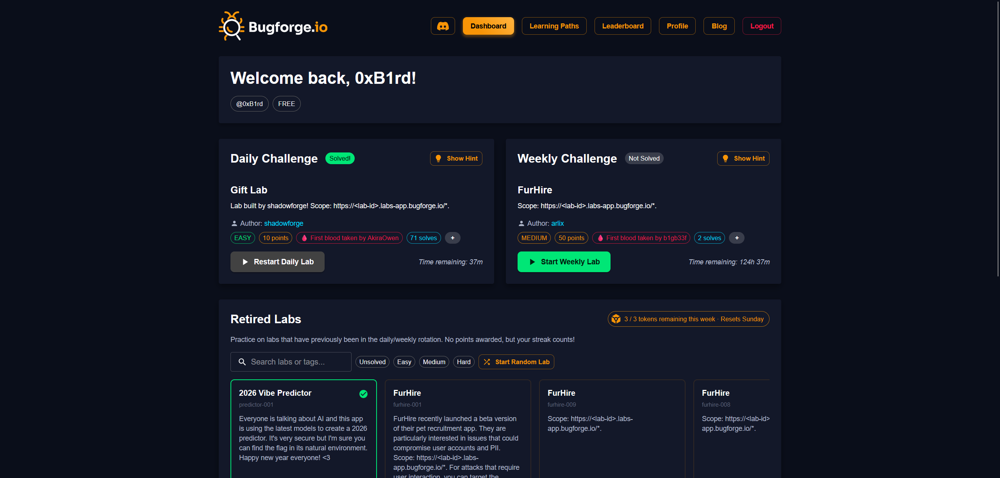

There are plenty of web application pentesting lab platforms out there, but most of them gate the good content behind a subscription or limit what you can access on a free tier. [BugForge](https://app.bugforge.io/) is completely free, and the labs have a realistic feel and scale well with difficulty.

I first came across [Alex Wren](https://www.linkedin.com/in/alex-olsen-ase/) when I took the Practical Web Pentest Associate (PWPA) training and certification from [TCM Security](https://tcm-sec.com/), where he was the course instructor. When he launched BugForge, I gave it a shot and it stuck.

*The BugForge dashboard with daily and weekly web application pentesting labs*

## The Platform

BugForge puts out daily and weekly labs focused on web application vulnerabilities. The daily labs are quick, focused exercises covering vulnerability types like XSS, SQL injection, IDOR, SSRF, broken access control, JWT attacks, and business logic flaws. The weekly labs are longer and require proper enumeration and vulnerability chaining to solve. Each lab spins up its own web application that you test directly in the browser and includes hints if you need a push in the right direction. I've never run into a stability issue with any of the labs, which says a lot for a free platform.

What I appreciate about the platform is that the difficulty actually scales. The daily labs are approachable if you're still building your methodology, but the weekly labs will challenge you even with experience. The labs themselves feel like testing real applications rather than solving puzzles, which makes the practice more transferable to actual engagements and bug bounty. Once a lab rotates out of the active slot, it moves into a retired pool you can spin up whenever you want, so nothing disappears.

## The Community

The BugForge Discord is worth joining. People share their approaches, talk through methodology, and help each other out. Alex is in there regularly too, answering questions and taking feedback that shapes the platform. I've picked up a lot from the community side of things. Seeing how someone else works through the same lab from a completely different angle has pushed my own methodology in ways I wouldn't have gotten to on my own.

If you're looking for a free platform to practice web app pentesting, give BugForge a look.

Check it out at [app.bugforge.io](https://app.bugforge.io/).

— 0xB1rd
